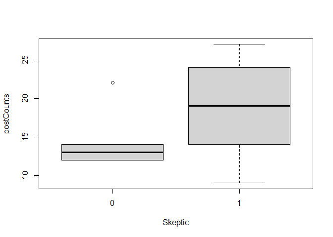

Lab11_LewisCheng
================
Lewis Cheng
2023-10-22

\#Q1

``` r
library("tidyverse") #library stuff
```

    ## ── Attaching core tidyverse packages ──────────────────────── tidyverse 2.0.0 ──
    ## ✔ dplyr     1.1.2     ✔ readr     2.1.4
    ## ✔ forcats   1.0.0     ✔ stringr   1.5.0
    ## ✔ ggplot2   3.4.2     ✔ tibble    3.2.1
    ## ✔ lubridate 1.9.2     ✔ tidyr     1.3.0
    ## ✔ purrr     1.0.1     
    ## ── Conflicts ────────────────────────────────────────── tidyverse_conflicts() ──
    ## ✖ dplyr::filter() masks stats::filter()
    ## ✖ dplyr::lag()    masks stats::lag()
    ## ℹ Use the conflicted package (<http://conflicted.r-lib.org/>) to force all conflicts to become errors

``` r
library("quanteda")
```

    ## Warning in .recacheSubclasses(def@className, def, env): undefined subclass
    ## "pcorMatrix" of class "replValueSp"; definition not updated

    ## Warning in .recacheSubclasses(def@className, def, env): undefined subclass
    ## "pcorMatrix" of class "xMatrix"; definition not updated

    ## Warning in .recacheSubclasses(def@className, def, env): undefined subclass
    ## "pcorMatrix" of class "mMatrix"; definition not updated

    ## Package version: 3.3.1
    ## Unicode version: 13.0
    ## ICU version: 69.1
    ## Parallel computing: 8 of 8 threads used.
    ## See https://quanteda.io for tutorials and examples.

``` r
library("quanteda.textplots")
tweetDF <- data.frame(read_csv(url("https://ist387.s3.us-east-2.amazonaws.com/lab/ClimatePosts.csv"))) #get data
```

    ## Warning: One or more parsing issues, call `problems()` on your data frame for details,
    ## e.g.:
    ##   dat <- vroom(...)
    ##   problems(dat)

    ## Rows: 18 Columns: 3
    ## ── Column specification ────────────────────────────────────────────────────────
    ## Delimiter: ","
    ## chr (2): ID, Tweet
    ## dbl (1): Skeptic
    ## 
    ## ℹ Use `spec()` to retrieve the full column specification for this data.
    ## ℹ Specify the column types or set `show_col_types = FALSE` to quiet this message.

``` r
str(tweetDF) #look at data
```

    ## 'data.frame':    18 obs. of  3 variables:
    ##  $ ID     : chr  "climatechange" "billmckibben" "megancollins" "neiltyson" ...
    ##  $ Skeptic: num  0 0 0 0 0 0 0 0 0 1 ...
    ##  $ Tweet  : chr  "BREAKING: Iran soars to record of 129 degrees - near hottest ever reliably measured on Earth" "I know you're Mr. America-is-all-that-matters, but climate is actually a global phenomenon. Here's today's glob"| __truncated__ "Could reporters stop asking if political leaders believe in climate change and start asking if they understand it instead" "If I were ever abducted by aliens, the first thing I’d ask is whether they came from a planet where people also deny science." ...

\#Q2

``` r
tweetCorpus <- corpus(tweetDF$Tweet, docnames=tweetDF$ID) #make a quanteda corpus object to use in quanteda
```

\#Q3

``` r
tweetDFM <- dfm(tweetCorpus, remove_punct=TRUE, 
                                  remove=stopwords("english"), ) #make a DFM
```

    ## Warning: 'dfm.corpus()' is deprecated. Use 'tokens()' first.

    ## Warning: '...' should not be used for tokens() arguments; use 'tokens()' first.

    ## Warning: 'remove' is deprecated; use dfm_remove() instead

\#Q4

``` r
#seems that it lists out topics and words that are relevant in them
```

\#Q5

``` r
textplot_wordcloud(tweetDFM, min_count = 1) #make a wordcloud!
```

<!-- -->
\#Q6

``` r
m <- as.matrix(tweetDFM)
postCounts <- rowSums(m)
tweetDF$postCounts <- postCounts 
boxplot(postCounts ~ Skeptic, data=tweetDF)  #creates a box plot of post counts of skeptics vs non skeptics
```

<!-- -->
\#Q7

``` r
URL <- "https://ist387.s3.us-east-2.amazonaws.com/data/positive-words.txt"
posWords <- scan(URL, character(0), sep = "\n") #read in the positive words

badURL <- "https://ist387.s3.us-east-2.amazonaws.com/data/negative-words.txt"
negWords <- scan(badURL, character(0), sep = "\n") # read in the negative owrds
```

\#Q8

``` r
wordCounts <- colSums(m) #count all them words
wordCounts <- sort(wordCounts, decreasing=TRUE) #sort all the word ocuts
```

\#Q9

``` r
str(wordCounts) #take a look
```

    ##  Named num [1:229] 13 6 6 4 4 3 3 3 3 3 ...
    ##  - attr(*, "names")= chr [1:229] "climate" "global" "change" "planet" ...

``` r
head(wordCounts)
```

    ## climate  global  change  planet  people    also 
    ##      13       6       6       4       4       3

\#Q10

``` r
matchedP <- match(names(wordCounts), posWords, nomatch = 0)  #match for positive owrds
```

\#Q11

``` r
matchedP
```

    ##   [1]    0    0    0    0    0    0    0    0    0    0    0    0    0    0    0
    ##  [16]    0    0    0    0    0    0    0    0    0    0 1122    0    0    0    0
    ##  [31]    0    0  594    0    0    0    0    0    0    0    0    0    0    0  964
    ##  [46] 1511    0    0    0    0    0    0    0    0    0    0  961    0    0    0
    ##  [61]    0    0    0    0    0    0    0    0    0    0    0    0    0    0    0
    ##  [76]    0    0    0    0    0   82    0    0    0    0    0    0    0    0    0
    ##  [91]    0    0    0    0    0    0    0    0    0    0    0    0  891    0    0
    ## [106]    0 2031 1567    0    0    0    0    0    0    0    0    0    0    0    0
    ## [121]    0    0    0    0    0    0    0    0    0    0    0    0    0    0 1935
    ## [136]    0    0    0    0    0    0    0    0    0    0    0    0    0    0    0
    ## [151]    0    0    0    0    0    0    0    0    0    0    0    0    0    0    0
    ## [166]    0    0    0    0    0    0    0    0    0    0    0    0    0    0    0
    ## [181]    0    0    0    0    0    0    0    0    0    0 1963    0    0    0    0
    ## [196]    0    0    0    0    0    0    0    0    0    0    0    0    0    0    0
    ## [211]    0    0    0    0    0    0    0    0    0    0  394    0    0    0    0
    ## [226]    0    0    0    0

``` r
sum(matchedP != 0) #number of matched positive words
```

    ## [1] 12

\#Q12

``` r
matchedN <- match(names(wordCounts), negWords, nomatch = 0) 
sum(matchedN != 0)
```

    ## [1] 17

``` r
matchedN #number of matched negative words + matches
```

    ##   [1]    0    0    0    0    0    0  797    0    0    0    0    0    0    0    0
    ##  [16]    0    0    0    0    0    0    0    0    0    0    0 1608    0    0    0
    ##  [31]    0    0    0    0    0  993    0    0    0  465    0    0    0    0    0
    ##  [46]    0    0    0    0    0    0    0    0    0    0    0    0    0    0    0
    ##  [61]    0    0    0    0    0    0    0    0    0    0    0    0    0    0    0
    ##  [76]    0  992    0  411    0    0    0    0    0    0    0    0    0 3351    0
    ##  [91]    0    0    0  731    0    0    0    0    0    0    0  633    0    0    0
    ## [106]    0    0    0    0    0    0    0    0    0    0    0    0    0  425    0
    ## [121]    0    0    0    0    0    0    0    0 2663    0    0 2057    0    0    0
    ## [136]    0    0    0    0    0    0    0 4135    0    0    0 1668    0    0    0
    ## [151]    0    0 2865    0    0    0    0    0    0    0    0    0    0    0    0
    ## [166]    0    0    0    0    0    0    0    0 2142    0    0    0    0    0    0
    ## [181]    0    0    0    0    0    0    0    0    0    0    0    0    0    0    0
    ## [196]    0    0    0    0    0    0    0    0    0    0    0    0    0 4341    0
    ## [211]    0    0    0    0    0    0    0    0    0    0    0    0    0    0    0
    ## [226]    0    0    0    0
