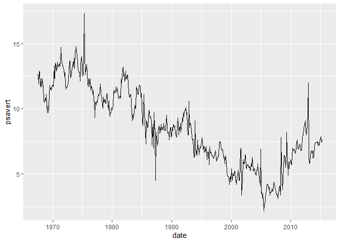
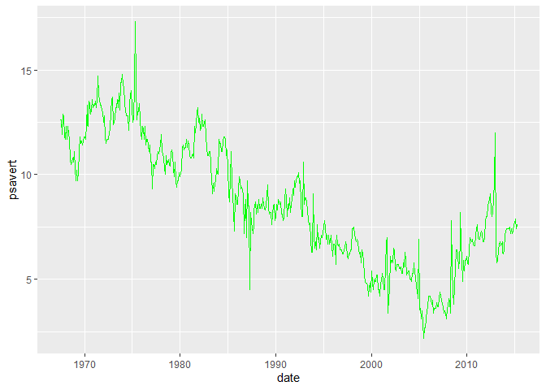
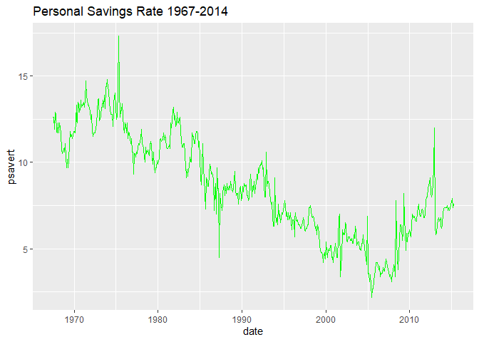
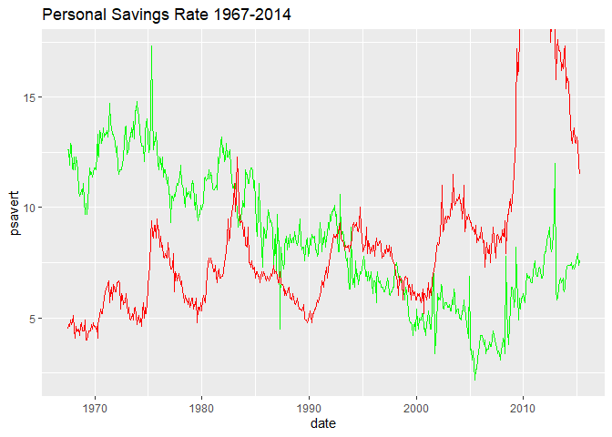
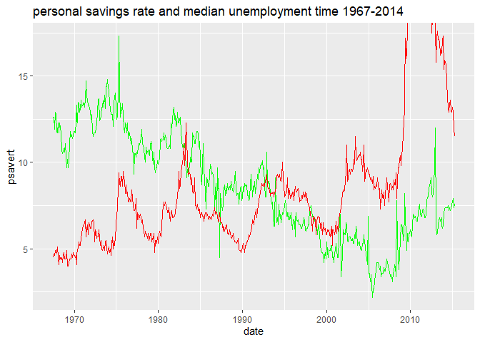
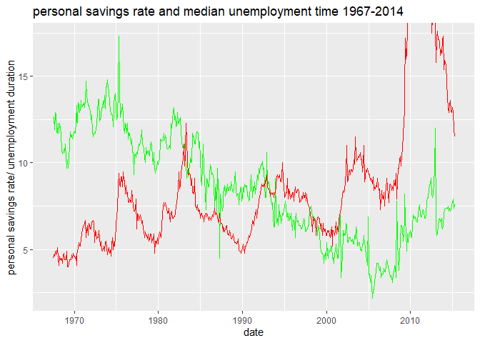
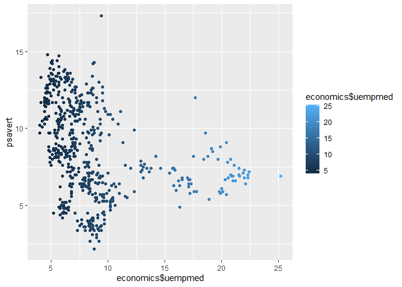

Lab6_LewisCheng
================
Lewis Cheng
2023-10-22

\#Q1

``` r
library("ggplot2")
myPlot <- ggplot(economics, aes(x=date))   #create ggplot object
myPlot <- myPlot + geom_line(aes(y=psavert)) #addd the line
myPlot
```

<!-- -->

``` r
#the code creates a plot list of data. you have to "print" it into the console to get it to show
```

\#Q2

``` r
help("economics") #wondering what economics is
```

    ## starting httpd help server ... done

\#Q3

``` r
#personal savings rate reached its max value in 1975. it reached min value in about 2006
```

\#Q4

``` r
economics[which.max(economics$psavert),] #print row with max savings rate
```

    ## # A tibble: 1 × 6
    ##   date         pce    pop psavert uempmed unemploy
    ##   <date>     <dbl>  <dbl>   <dbl>   <dbl>    <dbl>
    ## 1 1975-05-01 1019. 215523    17.3     9.4     8433

``` r
economics[which.min(economics$psavert),] #do above but minimum
```

    ## # A tibble: 1 × 6
    ##   date         pce    pop psavert uempmed unemploy
    ##   <date>     <dbl>  <dbl>   <dbl>   <dbl>    <dbl>
    ## 1 2005-07-01 8830. 296186     2.2     8.8     7406

\#Q5

``` r
myPlot<- myPlot +geom_line(aes(y=psavert),color="green") #make the line green
myPlot
```

<!-- -->

\#Q6

``` r
myPlot <- myPlot + ggtitle("Personal Savings Rate 1967-2014") #add a title!
myPlot
```

<!-- -->

\#Q7

``` r
myPlot <- myPlot +geom_line(y=economics$uempmed,color="red") #add another line for uempmed and make it red
myPlot
```

<!-- -->

\#Q8

``` r
myPlot <- myPlot +ggtitle("personal savings rate and median unemployment time 1967-2014 ")
myPlot #update title
```

<!-- -->

\#Q8

``` r
myPlot <- myPlot + ylab("personal savings rate/ unemployment duration") #update y axis label
myPlot
```

<!-- -->

\#Q8

``` r
ploot <- ggplot(economics,aes(x= economics$uempmed)) + geom_point(aes(y=psavert,color =economics$uempmed)) #make scatter plot, color it based on uempmed
ploot
```

    ## Warning: Use of `economics$uempmed` is discouraged.
    ## ℹ Use `uempmed` instead.
    ## Use of `economics$uempmed` is discouraged.
    ## ℹ Use `uempmed` instead.

<!-- -->

\#Q11

``` r
# as unemployment duration goes up, personal savings rates go down
```
