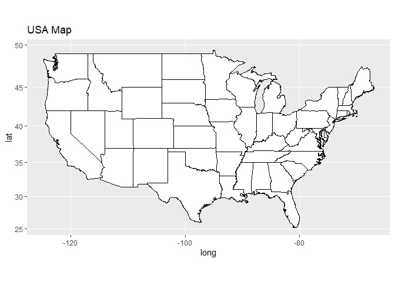

Lab7_LewisCheng
================
Lewis Cheng
2023-10-22

\#Q1

``` r
library(ggplot2); library(maps); library(ggmap); library(mapproj)
```

    ## The legacy packages maptools, rgdal, and rgeos, underpinning the sp package,
    ## which was just loaded, will retire in October 2023.
    ## Please refer to R-spatial evolution reports for details, especially
    ## https://r-spatial.org/r/2023/05/15/evolution4.html.
    ## It may be desirable to make the sf package available;
    ## package maintainers should consider adding sf to Suggests:.
    ## The sp package is now running under evolution status 2
    ##      (status 2 uses the sf package in place of rgdal)

    ## ℹ Google's Terms of Service: <https://mapsplatform.google.com>
    ## ℹ Please cite ggmap if you use it! Use `citation("ggmap")` for details.

``` r
us <- map_data("state") # adds state mapdata to us
us$state_name <- tolower(us$region) #stores state names as lowercase regions

map <- ggplot(us, aes(map_id= state_name)) # make a ggplot
map <- map + aes(x=long, y=lat, group=group) +  #add them states
             geom_polygon() 
map <- map + expand_limits(x=us$long, y=us$lat) # make it fit
map <- map + coord_map() + ggtitle("USA Map") #add a title + coordinates
map
```

<!-- -->

\#Q2

``` r
map <- map +geom_polygon(fill="white",color="black")
map
```

<!-- -->

\#Q3

``` r
map <- map +geom_polygon(fill="black",color="white")
map
```

<!-- -->

\#Q4

``` r
ny_counties <- map_data("county","new york")

ggplot(ny_counties) + aes(long,lat, group=group) + geom_polygon(fill = "black", color = "white")
```

<!-- -->

``` r
head(ny_counties)
```

    ##        long      lat group order   region subregion
    ## 1 -73.78550 42.46763     1     1 new york    albany
    ## 2 -74.25533 42.41034     1     2 new york    albany
    ## 3 -74.25533 42.41034     1     3 new york    albany
    ## 4 -74.27252 42.41607     1     4 new york    albany
    ## 5 -74.24960 42.46763     1     5 new york    albany
    ## 6 -74.22668 42.50774     1     6 new york    albany

\#Q5

``` r
ny_counties <- map_data("county","new york")

ggplot(ny_counties) + aes(long,lat, group=group) + geom_polygon(fill = "black", color = "white") +coord_map(projection = "mercator")
```

<!-- -->

``` r
#mercator projections make the map more vertically stretched
```

\#Q6

``` r
library(tidyverse)
```

    ## ── Attaching core tidyverse packages ──────────────────────── tidyverse 2.0.0 ──
    ## ✔ dplyr     1.1.2     ✔ readr     2.1.4
    ## ✔ forcats   1.0.0     ✔ stringr   1.5.0
    ## ✔ lubridate 1.9.2     ✔ tibble    3.2.1
    ## ✔ purrr     1.0.1     ✔ tidyr     1.3.0
    ## ── Conflicts ────────────────────────────────────────── tidyverse_conflicts() ──
    ## ✖ dplyr::filter() masks stats::filter()
    ## ✖ dplyr::lag()    masks stats::lag()
    ## ✖ purrr::map()    masks maps::map()
    ## ℹ Use the conflicted package (<http://conflicted.r-lib.org/>) to force all conflicts to become errors

``` r
 nyData<- read_csv(url("https://ist387.s3.us-east-2.amazonaws.com/lab/nyData.csv"))
```

    ## Rows: 62 Columns: 5
    ## ── Column specification ────────────────────────────────────────────────────────
    ## Delimiter: ","
    ## chr (1): county
    ## num (4): pop2010, pop2000, sqMiles, popDen
    ## 
    ## ℹ Use `spec()` to retrieve the full column specification for this data.
    ## ℹ Specify the column types or set `show_col_types = FALSE` to quiet this message.

\#Q7

``` r
mergeNY <- merge(ny_counties,nyData,
                 all.x=TRUE,by.x="subregion",by.y="county")
```

\#Q8

``` r
head(mergeNY)
```

    ##   subregion      long      lat group order   region pop2010 pop2000 sqMiles
    ## 1    albany -73.78550 42.46763     1     1 new york  304204  294565   522.8
    ## 2    albany -74.25533 42.41034     1     2 new york  304204  294565   522.8
    ## 3    albany -74.25533 42.41034     1     3 new york  304204  294565   522.8
    ## 4    albany -74.27252 42.41607     1     4 new york  304204  294565   522.8
    ## 5    albany -74.24960 42.46763     1     5 new york  304204  294565   522.8
    ## 6    albany -74.22668 42.50774     1     6 new york  304204  294565   522.8
    ##   popDen
    ## 1 581.87
    ## 2 581.87
    ## 3 581.87
    ## 4 581.87
    ## 5 581.87
    ## 6 581.87

\#Q9

``` r
ny_counties <- map_data("county","new york")

ggplot(mergeNY) + aes(long,lat, group=group) + geom_polygon(aes(fill=mergeNY$pop2000), color = "white")
```

    ## Warning: Use of `mergeNY$pop2000` is discouraged.
    ## ℹ Use `pop2000` instead.

<!-- -->
