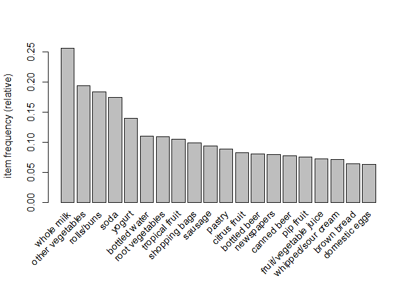
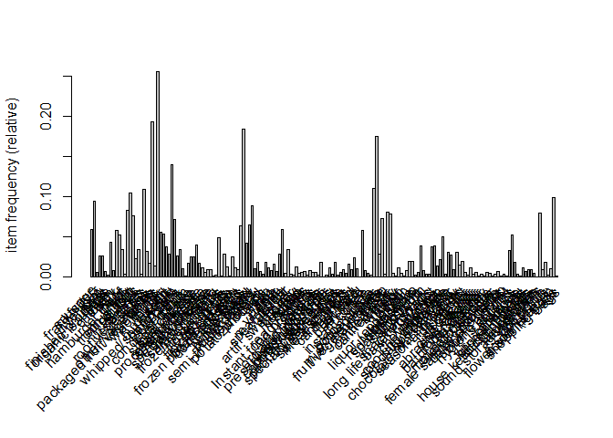

Lab9_LewisCheng
================
Lewis Cheng
2023-10-22

\#Q1

``` r
#install.packages(c("arules","arulesViz")) #install packages
library("arules") 
```

    ## Loading required package: Matrix

    ## 
    ## Attaching package: 'arules'

    ## The following objects are masked from 'package:base':
    ## 
    ##     abbreviate, write

``` r
library("arulesViz")
data (Groceries) # Load data into memory
myGroc <- Groceries # Make a copy for safety
summary(myGroc) # What is the structure? sparse data, most people buy whole milk/veggies,
```

    ## transactions as itemMatrix in sparse format with
    ##  9835 rows (elements/itemsets/transactions) and
    ##  169 columns (items) and a density of 0.02609146 
    ## 
    ## most frequent items:
    ##       whole milk other vegetables       rolls/buns             soda 
    ##             2513             1903             1809             1715 
    ##           yogurt          (Other) 
    ##             1372            34055 
    ## 
    ## element (itemset/transaction) length distribution:
    ## sizes
    ##    1    2    3    4    5    6    7    8    9   10   11   12   13   14   15   16 
    ## 2159 1643 1299 1005  855  645  545  438  350  246  182  117   78   77   55   46 
    ##   17   18   19   20   21   22   23   24   26   27   28   29   32 
    ##   29   14   14    9   11    4    6    1    1    1    1    3    1 
    ## 
    ##    Min. 1st Qu.  Median    Mean 3rd Qu.    Max. 
    ##   1.000   2.000   3.000   4.409   6.000  32.000 
    ## 
    ## includes extended item information - examples:
    ##        labels  level2           level1
    ## 1 frankfurter sausage meat and sausage
    ## 2     sausage sausage meat and sausage
    ## 3  liver loaf sausage meat and sausage

``` r
#most people only buy a few items (median 3, mean 4.4)
```

\#Q2

``` r
items <- itemFrequency(myGroc)
str(items) #lsit of named numbers: items + frequency
```

    ##  Named num [1:169] 0.05897 0.09395 0.00508 0.02603 0.02583 ...
    ##  - attr(*, "names")= chr [1:169] "frankfurter" "sausage" "liver loaf" "ham" ...

``` r
items <- sort(items)

head(items) #lowest freq: baby food at 0.0001
```

    ##             baby food  sound storage medium preservation products 
    ##          0.0001016777          0.0001016777          0.0002033554 
    ##       kitchen utensil                  bags        frozen chicken 
    ##          0.0004067107          0.0004067107          0.0006100661

``` r
tail(items) #highest item freq: whole milk at 0.255
```

    ##    bottled water           yogurt             soda       rolls/buns 
    ##        0.1105236        0.1395018        0.1743772        0.1839349 
    ## other vegetables       whole milk 
    ##        0.1934926        0.2555160

\#Q3

``` r
itemFrequencyPlot(myGroc, topN=20) #it is the relative frequency of that item relative to other itmes
```

<!-- -->

``` r
itemFrequencyPlot(myGroc)
```

<!-- -->

\#Q4

``` r
ct <- crossTable(myGroc, sort=TRUE)
ct[1:3, 1:3] #diagonal considers all instances of item
```

    ##                  whole milk other vegetables rolls/buns
    ## whole milk             2513              736        557
    ## other vegetables        736             1903        419
    ## rolls/buns              557              419       1809

``` r
#value considers number of observations with both items
```

\#Q5-6

``` r
rules1 <- apriori(myGroc, 
             parameter=list(supp=0.0008, conf=0.55), 
             control=list(verbose=F),
             appearance=list(default="lhs",rhs=("whole milk")))
head(inspect(rules1))
```

    ##        lhs                             rhs               support confidence     coverage     lift count
    ## [1]    {honey}                      => {whole milk} 0.0011184545  0.7333333 0.0015251652 2.870009    11
    ## [2]    {cocoa drinks}               => {whole milk} 0.0013218099  0.5909091 0.0022369090 2.312611    13
    ## [3]    {pudding powder}             => {whole milk} 0.0013218099  0.5652174 0.0023385867 2.212062    13
    ## [4]    {cereals}                    => {whole milk} 0.0036603965  0.6428571 0.0056939502 2.515917    36
    ## [5]    {rice}                       => {whole milk} 0.0046771734  0.6133333 0.0076258261 2.400371    46
    ## [6]    {citrus fruit,                                                                                  
    ##         canned fruit}               => {whole milk} 0.0008134215  0.7272727 0.0011184545 2.846290     8
    ## [7]    {rolls/buns,                                                                                    
    ##         skin care}                  => {whole milk} 0.0009150991  0.6428571 0.0014234875 2.515917     9
    ## [8]    {other vegetables,                                                                              
    ##         skin care}                  => {whole milk} 0.0008134215  0.6666667 0.0012201322 2.609099     8
    ## [9]    {root vegetables,                                                                               
    ##         abrasive cleaner}           => {whole milk} 0.0008134215  0.6153846 0.0013218099 2.408399     8
    ## [10]   {yogurt,                                                                                        
    ##         photo/film}                 => {whole milk} 0.0008134215  0.7272727 0.0011184545 2.846290     8
    ## [11]   {liver loaf,                                                                                    
    ##         yogurt}                     => {whole milk} 0.0010167768  0.6666667 0.0015251652 2.609099    10
    ## [12]   {yogurt,                                                                                        
    ##         curd cheese}                => {whole milk} 0.0009150991  0.6923077 0.0013218099 2.709449     9
    ## [13]   {curd cheese,                                                                                   
    ##         rolls/buns}                 => {whole milk} 0.0010167768  0.6250000 0.0016268429 2.446031    10
    ## [14]   {other vegetables,                                                                              
    ##         curd cheese}                => {whole milk} 0.0012201322  0.5714286 0.0021352313 2.236371    12
    ## [15]   {other vegetables,                                                                              
    ##         cleaner}                    => {whole milk} 0.0010167768  0.6250000 0.0016268429 2.446031    10
    ## [16]   {sausage,                                                                                       
    ##         softener}                   => {whole milk} 0.0008134215  0.8000000 0.0010167768 3.130919     8
    ## [17]   {other vegetables,                                                                              
    ##         female sanitary products}   => {whole milk} 0.0009150991  0.6428571 0.0014234875 2.515917     9
    ## [18]   {curd,                                                                                          
    ##         cereals}                    => {whole milk} 0.0010167768  0.9090909 0.0011184545 3.557863    10
    ## [19]   {butter,                                                                                        
    ##         cereals}                    => {whole milk} 0.0008134215  1.0000000 0.0008134215 3.913649     8
    ## [20]   {tropical fruit,                                                                                
    ##         cereals}                    => {whole milk} 0.0009150991  0.9000000 0.0010167768 3.522284     9
    ## [21]   {root vegetables,                                                                               
    ##         cereals}                    => {whole milk} 0.0010167768  0.7692308 0.0013218099 3.010499    10
    ## [22]   {yogurt,                                                                                        
    ##         cereals}                    => {whole milk} 0.0017285206  0.8095238 0.0021352313 3.168192    17
    ## [23]   {other vegetables,                                                                              
    ##         cereals}                    => {whole milk} 0.0013218099  0.6500000 0.0020335536 2.543872    13
    ## [24]   {beef,                                                                                          
    ##         jam}                        => {whole milk} 0.0008134215  0.6666667 0.0012201322 2.609099     8
    ## [25]   {butter,                                                                                        
    ##         jam}                        => {whole milk} 0.0010167768  0.8333333 0.0012201322 3.261374    10
    ## [26]   {jam,                                                                                           
    ##         bottled water}              => {whole milk} 0.0009150991  0.7500000 0.0012201322 2.935237     9
    ## [27]   {root vegetables,                                                                               
    ##         jam}                        => {whole milk} 0.0013218099  0.6842105 0.0019318760 2.677760    13
    ## [28]   {jam,                                                                                           
    ##         soda}                       => {whole milk} 0.0008134215  0.6153846 0.0013218099 2.408399     8
    ## [29]   {rolls/buns,                                                                                    
    ##         jam}                        => {whole milk} 0.0009150991  0.6923077 0.0013218099 2.709449     9
    ## [30]   {other vegetables,                                                                              
    ##         jam}                        => {whole milk} 0.0013218099  0.7222222 0.0018301983 2.826524    13
    ## [31]   {tropical fruit,                                                                                
    ##         kitchen towels}             => {whole milk} 0.0008134215  0.6153846 0.0013218099 2.408399     8
    ## [32]   {yogurt,                                                                                        
    ##         kitchen towels}             => {whole milk} 0.0009150991  0.7500000 0.0012201322 2.935237     9
    ## [33]   {rolls/buns,                                                                                    
    ##         vinegar}                    => {whole milk} 0.0009150991  0.5625000 0.0016268429 2.201428     9
    ## [34]   {popcorn,                                                                                       
    ##         shopping bags}              => {whole milk} 0.0008134215  0.5714286 0.0014234875 2.236371     8
    ## [35]   {yogurt,                                                                                        
    ##         popcorn}                    => {whole milk} 0.0008134215  0.6153846 0.0013218099 2.408399     8
    ## [36]   {cat food,                                                                                      
    ##         pet care}                   => {whole milk} 0.0008134215  0.6153846 0.0013218099 2.408399     8
    ## [37]   {butter,                                                                                        
    ##         candles}                    => {whole milk} 0.0008134215  0.7272727 0.0011184545 2.846290     8
    ## [38]   {tropical fruit,                                                                                
    ##         candles}                    => {whole milk} 0.0010167768  0.6666667 0.0015251652 2.609099    10
    ## [39]   {rolls/buns,                                                                                    
    ##         candles}                    => {whole milk} 0.0009150991  0.6923077 0.0013218099 2.709449     9
    ## [40]   {soups,                                                                                         
    ##         bottled beer}               => {whole milk} 0.0011184545  0.9166667 0.0012201322 3.587512    11
    ## [41]   {whipped/sour cream,                                                                            
    ##         soups}                      => {whole milk} 0.0009150991  0.6000000 0.0015251652 2.348189     9
    ## [42]   {root vegetables,                                                                               
    ##         soups}                      => {whole milk} 0.0011184545  0.6470588 0.0017285206 2.532361    11
    ## [43]   {rolls/buns,                                                                                    
    ##         soups}                      => {whole milk} 0.0008134215  0.6153846 0.0013218099 2.408399     8
    ## [44]   {other vegetables,                                                                              
    ##         soups}                      => {whole milk} 0.0018301983  0.5806452 0.0031520081 2.272441    18
    ## [45]   {frozen vegetables,                                                                             
    ##         dog food}                   => {whole milk} 0.0008134215  0.8000000 0.0010167768 3.130919     8
    ## [46]   {brown bread,                                                                                   
    ##         dog food}                   => {whole milk} 0.0008134215  0.8000000 0.0010167768 3.130919     8
    ## [47]   {citrus fruit,                                                                                  
    ##         dog food}                   => {whole milk} 0.0008134215  0.5714286 0.0014234875 2.236371     8
    ## [48]   {tropical fruit,                                                                                
    ##         dog food}                   => {whole milk} 0.0010167768  0.6250000 0.0016268429 2.446031    10
    ## [49]   {root vegetables,                                                                               
    ##         dog food}                   => {whole milk} 0.0010167768  0.7142857 0.0014234875 2.795464    10
    ## [50]   {yogurt,                                                                                        
    ##         dog food}                   => {whole milk} 0.0012201322  0.6315789 0.0019318760 2.471778    12
    ## [51]   {pastry,                                                                                        
    ##         Instant food products}      => {whole milk} 0.0008134215  0.5714286 0.0014234875 2.236371     8
    ## [52]   {yogurt,                                                                                        
    ##         Instant food products}      => {whole milk} 0.0011184545  0.7857143 0.0014234875 3.075010    11
    ## [53]   {other vegetables,                                                                              
    ##         Instant food products}      => {whole milk} 0.0015251652  0.5555556 0.0027452974 2.174249    15
    ## [54]   {condensed milk,                                                                                
    ##         white bread}                => {whole milk} 0.0008134215  0.8000000 0.0010167768 3.130919     8
    ## [55]   {butter,                                                                                        
    ##         specialty cheese}           => {whole milk} 0.0008134215  0.7272727 0.0011184545 2.846290     8
    ## [56]   {whipped/sour cream,                                                                            
    ##         specialty cheese}           => {whole milk} 0.0009150991  0.6428571 0.0014234875 2.515917     9
    ## [57]   {citrus fruit,                                                                                  
    ##         specialty cheese}           => {whole milk} 0.0010167768  0.7142857 0.0014234875 2.795464    10
    ## [58]   {root vegetables,                                                                               
    ##         specialty cheese}           => {whole milk} 0.0013218099  0.6190476 0.0021352313 2.422735    13
    ## [59]   {yogurt,                                                                                        
    ##         specialty cheese}           => {whole milk} 0.0020335536  0.7142857 0.0028469751 2.795464    20
    ## [60]   {waffles,                                                                                       
    ##         chocolate marshmallow}      => {whole milk} 0.0009150991  0.6428571 0.0014234875 2.515917     9
    ## [61]   {pork,                                                                                          
    ##         chocolate marshmallow}      => {whole milk} 0.0008134215  0.5714286 0.0014234875 2.236371     8
    ## [62]   {root vegetables,                                                                               
    ##         chocolate marshmallow}      => {whole milk} 0.0009150991  0.7500000 0.0012201322 2.935237     9
    ## [63]   {margarine,                                                                                     
    ##         flower (seeds)}             => {whole milk} 0.0008134215  0.5714286 0.0014234875 2.236371     8
    ## [64]   {butter,                                                                                        
    ##         flower (seeds)}             => {whole milk} 0.0010167768  0.6250000 0.0016268429 2.446031    10
    ## [65]   {frozen potato products,                                                                        
    ##         chocolate}                  => {whole milk} 0.0008134215  0.7272727 0.0011184545 2.846290     8
    ## [66]   {frozen potato products,                                                                        
    ##         fruit/vegetable juice}      => {whole milk} 0.0011184545  0.6875000 0.0016268429 2.690634    11
    ## [67]   {pip fruit,                                                                                     
    ##         frozen potato products}     => {whole milk} 0.0009150991  0.6923077 0.0013218099 2.709449     9
    ## [68]   {tropical fruit,                                                                                
    ##         frozen potato products}     => {whole milk} 0.0008134215  0.7272727 0.0011184545 2.846290     8
    ## [69]   {root vegetables,                                                                               
    ##         frozen potato products}     => {whole milk} 0.0009150991  0.6000000 0.0015251652 2.348189     9
    ## [70]   {yogurt,                                                                                        
    ##         frozen potato products}     => {whole milk} 0.0015251652  0.6818182 0.0022369090 2.668397    15
    ## [71]   {frozen potato products,                                                                        
    ##         rolls/buns}                 => {whole milk} 0.0011184545  0.5500000 0.0020335536 2.152507    11
    ## [72]   {other vegetables,                                                                              
    ##         frozen potato products}     => {whole milk} 0.0018301983  0.6923077 0.0026436197 2.709449    18
    ## [73]   {chocolate,                                                                                     
    ##         house keeping products}     => {whole milk} 0.0008134215  0.6153846 0.0013218099 2.408399     8
    ## [74]   {frozen vegetables,                                                                             
    ##         house keeping products}     => {whole milk} 0.0008134215  0.8000000 0.0010167768 3.130919     8
    ## [75]   {napkins,                                                                                       
    ##         house keeping products}     => {whole milk} 0.0013218099  0.8125000 0.0016268429 3.179840    13
    ## [76]   {whipped/sour cream,                                                                            
    ##         house keeping products}     => {whole milk} 0.0012201322  0.9230769 0.0013218099 3.612599    12
    ## [77]   {sausage,                                                                                       
    ##         house keeping products}     => {whole milk} 0.0011184545  0.6875000 0.0016268429 2.690634    11
    ## [78]   {tropical fruit,                                                                                
    ##         house keeping products}     => {whole milk} 0.0011184545  0.6875000 0.0016268429 2.690634    11
    ## [79]   {root vegetables,                                                                               
    ##         house keeping products}     => {whole milk} 0.0013218099  0.7647059 0.0017285206 2.992790    13
    ## [80]   {yogurt,                                                                                        
    ##         house keeping products}     => {whole milk} 0.0010167768  0.5555556 0.0018301983 2.174249    10
    ## [81]   {rolls/buns,                                                                                    
    ##         house keeping products}     => {whole milk} 0.0011184545  0.6470588 0.0017285206 2.532361    11
    ## [82]   {other vegetables,                                                                              
    ##         house keeping products}     => {whole milk} 0.0017285206  0.6296296 0.0027452974 2.464149    17
    ## [83]   {white bread,                                                                                   
    ##         sweet spreads}              => {whole milk} 0.0010167768  0.6666667 0.0015251652 2.609099    10
    ## [84]   {domestic eggs,                                                                                 
    ##         sweet spreads}              => {whole milk} 0.0009150991  0.7500000 0.0012201322 2.935237     9
    ## [85]   {pastry,                                                                                        
    ##         sweet spreads}              => {whole milk} 0.0010167768  0.9090909 0.0011184545 3.557863    10
    ## [86]   {root vegetables,                                                                               
    ##         sweet spreads}              => {whole milk} 0.0012201322  0.6000000 0.0020335536 2.348189    12
    ## [87]   {sweet spreads,                                                                                 
    ##         soda}                       => {whole milk} 0.0014234875  0.5600000 0.0025419420 2.191643    14
    ## [88]   {turkey,                                                                                        
    ##         curd}                       => {whole milk} 0.0010167768  0.6666667 0.0015251652 2.609099    10
    ## [89]   {turkey,                                                                                        
    ##         butter}                     => {whole milk} 0.0010167768  0.6666667 0.0015251652 2.609099    10
    ## [90]   {turkey,                                                                                        
    ##         pastry}                     => {whole milk} 0.0011184545  0.5789474 0.0019318760 2.265797    11
    ## [91]   {turkey,                                                                                        
    ##         bottled water}              => {whole milk} 0.0012201322  0.7500000 0.0016268429 2.935237    12
    ## [92]   {turkey,                                                                                        
    ##         root vegetables}            => {whole milk} 0.0015251652  0.6000000 0.0025419420 2.348189    15
    ## [93]   {turkey,                                                                                        
    ##         yogurt}                     => {whole milk} 0.0015251652  0.6521739 0.0023385867 2.552380    15
    ## [94]   {hard cheese,                                                                                   
    ##         rice}                       => {whole milk} 0.0009150991  0.9000000 0.0010167768 3.522284     9
    ## [95]   {rice,                                                                                          
    ##         oil}                        => {whole milk} 0.0008134215  0.8888889 0.0009150991 3.478799     8
    ## [96]   {rice,                                                                                          
    ##         sugar}                      => {whole milk} 0.0012201322  1.0000000 0.0012201322 3.913649    12
    ## [97]   {chicken,                                                                                       
    ##         rice}                       => {whole milk} 0.0008134215  0.6153846 0.0013218099 2.408399     8
    ## [98]   {frozen vegetables,                                                                             
    ##         rice}                       => {whole milk} 0.0010167768  0.7142857 0.0014234875 2.795464    10
    ## [99]   {beef,                                                                                          
    ##         rice}                       => {whole milk} 0.0008134215  0.6666667 0.0012201322 2.609099     8
    ## [100]  {rice,                                                                                          
    ##         napkins}                    => {whole milk} 0.0009150991  0.8181818 0.0011184545 3.202076     9
    ## [101]  {rice,                                                                                          
    ##         margarine}                  => {whole milk} 0.0008134215  0.7272727 0.0011184545 2.846290     8
    ## [102]  {butter,                                                                                        
    ##         rice}                       => {whole milk} 0.0015251652  0.8333333 0.0018301983 3.261374    15
    ## [103]  {domestic eggs,                                                                                 
    ##         rice}                       => {whole milk} 0.0011184545  0.8461538 0.0013218099 3.311549    11
    ## [104]  {rice,                                                                                          
    ##         fruit/vegetable juice}      => {whole milk} 0.0013218099  0.6842105 0.0019318760 2.677760    13
    ## [105]  {pip fruit,                                                                                     
    ##         rice}                       => {whole milk} 0.0011184545  0.7857143 0.0014234875 3.075010    11
    ## [106]  {citrus fruit,                                                                                  
    ##         rice}                       => {whole milk} 0.0010167768  0.5555556 0.0018301983 2.174249    10
    ## [107]  {rice,                                                                                          
    ##         bottled water}              => {whole milk} 0.0012201322  0.9230769 0.0013218099 3.612599    12
    ## [108]  {tropical fruit,                                                                                
    ##         rice}                       => {whole milk} 0.0015251652  0.7894737 0.0019318760 3.089723    15
    ## [109]  {root vegetables,                                                                               
    ##         rice}                       => {whole milk} 0.0024402644  0.7741935 0.0031520081 3.029922    24
    ## [110]  {yogurt,                                                                                        
    ##         rice}                       => {whole milk} 0.0018301983  0.7826087 0.0023385867 3.062856    18
    ## [111]  {rolls/buns,                                                                                    
    ##         rice}                       => {whole milk} 0.0009150991  0.6000000 0.0015251652 2.348189     9
    ## [112]  {other vegetables,                                                                              
    ##         rice}                       => {whole milk} 0.0026436197  0.6666667 0.0039654296 2.609099    26
    ## [113]  {pip fruit,                                                                                     
    ##         spread cheese}              => {whole milk} 0.0008134215  0.6153846 0.0013218099 2.408399     8
    ## [114]  {beef,                                                                                          
    ##         dish cleaner}               => {whole milk} 0.0008134215  0.7272727 0.0011184545 2.846290     8
    ## [115]  {brown bread,                                                                                   
    ##         dish cleaner}               => {whole milk} 0.0008134215  0.7272727 0.0011184545 2.846290     8
    ## [116]  {root vegetables,                                                                               
    ##         dish cleaner}               => {whole milk} 0.0011184545  0.6875000 0.0016268429 2.690634    11
    ## [117]  {root vegetables,                                                                               
    ##         cling film/bags}            => {whole milk} 0.0009150991  0.5625000 0.0016268429 2.201428     9
    ## [118]  {salt,                                                                                          
    ##         sugar}                      => {whole milk} 0.0010167768  0.5555556 0.0018301983 2.174249    10
    ## [119]  {butter,                                                                                        
    ##         salt}                       => {whole milk} 0.0009150991  0.6428571 0.0014234875 2.515917     9
    ## [120]  {domestic eggs,                                                                                 
    ##         salt}                       => {whole milk} 0.0013218099  0.6842105 0.0019318760 2.677760    13
    ## [121]  {pip fruit,                                                                                     
    ##         salt}                       => {whole milk} 0.0011184545  0.7333333 0.0015251652 2.870009    11
    ## [122]  {citrus fruit,                                                                                  
    ##         salt}                       => {whole milk} 0.0011184545  0.7333333 0.0015251652 2.870009    11
    ## [123]  {whipped/sour cream,                                                                            
    ##         mayonnaise}                 => {whole milk} 0.0010167768  0.6666667 0.0015251652 2.609099    10
    ## [124]  {mayonnaise,                                                                                    
    ##         pastry}                     => {whole milk} 0.0008134215  0.6666667 0.0012201322 2.609099     8
    ## [125]  {tropical fruit,                                                                                
    ##         mayonnaise}                 => {whole milk} 0.0009150991  0.5625000 0.0016268429 2.201428     9
    ## [126]  {curd,                                                                                          
    ##         frozen dessert}             => {whole milk} 0.0010167768  0.7142857 0.0014234875 2.795464    10
    ## [127]  {pork,                                                                                          
    ##         frozen dessert}             => {whole milk} 0.0009150991  0.6923077 0.0013218099 2.709449     9
    ## [128]  {whipped/sour cream,                                                                            
    ##         frozen dessert}             => {whole milk} 0.0008134215  0.5714286 0.0014234875 2.236371     8
    ## [129]  {yogurt,                                                                                        
    ##         frozen dessert}             => {whole milk} 0.0011184545  0.5789474 0.0019318760 2.265797    11
    ## [130]  {other vegetables,                                                                              
    ##         frozen dessert}             => {whole milk} 0.0020335536  0.5555556 0.0036603965 2.174249    20
    ## [131]  {packaged fruit/vegetables,                                                                     
    ##         pastry}                     => {whole milk} 0.0010167768  0.5882353 0.0017285206 2.302146    10
    ## [132]  {packaged fruit/vegetables,                                                                     
    ##         soda}                       => {whole milk} 0.0012201322  0.5714286 0.0021352313 2.236371    12
    ## [133]  {onions,                                                                                        
    ##         canned vegetables}          => {whole milk} 0.0008134215  0.7272727 0.0011184545 2.846290     8
    ## [134]  {frozen vegetables,                                                                             
    ##         canned vegetables}          => {whole milk} 0.0008134215  0.6153846 0.0013218099 2.408399     8
    ## [135]  {domestic eggs,                                                                                 
    ##         canned vegetables}          => {whole milk} 0.0009150991  0.5625000 0.0016268429 2.201428     9
    ## [136]  {whipped/sour cream,                                                                            
    ##         canned vegetables}          => {whole milk} 0.0010167768  0.6250000 0.0016268429 2.446031    10
    ## [137]  {roll products ,                                                                                
    ##         sugar}                      => {whole milk} 0.0010167768  0.7692308 0.0013218099 3.010499    10
    ## [138]  {frozen vegetables,                                                                             
    ##         roll products }             => {whole milk} 0.0008134215  0.7272727 0.0011184545 2.846290     8
    ## [139]  {beef,                                                                                          
    ##         roll products }             => {whole milk} 0.0009150991  0.6923077 0.0013218099 2.709449     9
    ## [140]  {pork,                                                                                          
    ##         roll products }             => {whole milk} 0.0009150991  0.5625000 0.0016268429 2.201428     9
    ## [141]  {frankfurter,                                                                                   
    ##         roll products }             => {whole milk} 0.0008134215  0.8000000 0.0010167768 3.130919     8
    ## [142]  {roll products ,                                                                                
    ##         bottled beer}               => {whole milk} 0.0011184545  0.6111111 0.0018301983 2.391674    11
    ## [143]  {butter,                                                                                        
    ##         roll products }             => {whole milk} 0.0011184545  0.7857143 0.0014234875 3.075010    11
    ## [144]  {domestic eggs,                                                                                 
    ##         roll products }             => {whole milk} 0.0009150991  0.6000000 0.0015251652 2.348189     9
    ## [145]  {tropical fruit,                                                                                
    ##         roll products }             => {whole milk} 0.0011184545  0.5500000 0.0020335536 2.152507    11
    ## [146]  {yogurt,                                                                                        
    ##         roll products }             => {whole milk} 0.0014234875  0.6363636 0.0022369090 2.490504    14
    ## [147]  {rolls/buns,                                                                                    
    ##         roll products }             => {whole milk} 0.0015251652  0.7142857 0.0021352313 2.795464    15
    ## [148]  {onions,                                                                                        
    ##         frozen fish}                => {whole milk} 0.0008134215  0.8000000 0.0010167768 3.130919     8
    ## [149]  {frozen vegetables,                                                                             
    ##         frozen fish}                => {whole milk} 0.0010167768  0.5555556 0.0018301983 2.174249    10
    ## [150]  {curd,                                                                                          
    ##         frozen fish}                => {whole milk} 0.0009150991  1.0000000 0.0009150991 3.913649     9
    ## [151]  {pork,                                                                                          
    ##         frozen fish}                => {whole milk} 0.0012201322  0.6000000 0.0020335536 2.348189    12
    ## [152]  {frankfurter,                                                                                   
    ##         frozen fish}                => {whole milk} 0.0011184545  0.6470588 0.0017285206 2.532361    11
    ## [153]  {butter,                                                                                        
    ##         frozen fish}                => {whole milk} 0.0008134215  0.7272727 0.0011184545 2.846290     8
    ## [154]  {frozen fish,                                                                                   
    ##         domestic eggs}              => {whole milk} 0.0010167768  0.7142857 0.0014234875 2.795464    10
    ## [155]  {pip fruit,                                                                                     
    ##         frozen fish}                => {whole milk} 0.0013218099  0.6190476 0.0021352313 2.422735    13
    ## [156]  {tropical fruit,                                                                                
    ##         frozen fish}                => {whole milk} 0.0015251652  0.6000000 0.0025419420 2.348189    15
    ## [157]  {root vegetables,                                                                               
    ##         frozen fish}                => {whole milk} 0.0018301983  0.6923077 0.0026436197 2.709449    18
    ## [158]  {yogurt,                                                                                        
    ##         frozen fish}                => {whole milk} 0.0022369090  0.6875000 0.0032536858 2.690634    22
    ## [159]  {other vegetables,                                                                              
    ##         frozen fish}                => {whole milk} 0.0027452974  0.5869565 0.0046771734 2.297142    27
    ## [160]  {cake bar,                                                                                      
    ##         chocolate}                  => {whole milk} 0.0009150991  0.6428571 0.0014234875 2.515917     9
    ## [161]  {frankfurter,                                                                                   
    ##         cake bar}                   => {whole milk} 0.0008134215  0.8000000 0.0010167768 3.130919     8
    ## [162]  {pastry,                                                                                        
    ##         cake bar}                   => {whole milk} 0.0012201322  0.6000000 0.0020335536 2.348189    12
    ## [163]  {tropical fruit,                                                                                
    ##         cake bar}                   => {whole milk} 0.0014234875  0.7368421 0.0019318760 2.883741    14
    ## [164]  {butter,                                                                                        
    ##         dishes}                     => {whole milk} 0.0011184545  0.7333333 0.0015251652 2.870009    11
    ## [165]  {oil,                                                                                           
    ##         mustard}                    => {whole milk} 0.0012201322  0.8571429 0.0014234875 3.354556    12
    ## [166]  {beef,                                                                                          
    ##         mustard}                    => {whole milk} 0.0008134215  0.6666667 0.0012201322 2.609099     8
    ## [167]  {butter,                                                                                        
    ##         mustard}                    => {whole milk} 0.0008134215  0.8888889 0.0009150991 3.478799     8
    ## [168]  {mustard,                                                                                       
    ##         newspapers}                 => {whole milk} 0.0011184545  0.6470588 0.0017285206 2.532361    11
    ## [169]  {whipped/sour cream,                                                                            
    ##         mustard}                    => {whole milk} 0.0008134215  0.8000000 0.0010167768 3.130919     8
    ## [170]  {mustard,                                                                                       
    ##         bottled water}              => {whole milk} 0.0015251652  0.7500000 0.0020335536 2.935237    15
    ## [171]  {yogurt,                                                                                        
    ##         mustard}                    => {whole milk} 0.0014234875  0.6086957 0.0023385867 2.382221    14
    ## [172]  {frozen vegetables,                                                                             
    ##         red/blush wine}             => {whole milk} 0.0008134215  0.8000000 0.0010167768 3.130919     8
    ## [173]  {brown bread,                                                                                   
    ##         red/blush wine}             => {whole milk} 0.0008134215  0.5714286 0.0014234875 2.236371     8
    ## [174]  {domestic eggs,                                                                                 
    ##         red/blush wine}             => {whole milk} 0.0009150991  0.6428571 0.0014234875 2.515917     9
    ## [175]  {pip fruit,                                                                                     
    ##         red/blush wine}             => {whole milk} 0.0009150991  0.6000000 0.0015251652 2.348189     9
    ## [176]  {grapes,                                                                                        
    ##         pot plants}                 => {whole milk} 0.0008134215  0.6153846 0.0013218099 2.408399     8
    ## [177]  {berries,                                                                                       
    ##         pot plants}                 => {whole milk} 0.0008134215  0.6666667 0.0012201322 2.609099     8
    ## [178]  {cream cheese ,                                                                                 
    ##         pot plants}                 => {whole milk} 0.0008134215  0.6153846 0.0013218099 2.408399     8
    ## [179]  {curd,                                                                                          
    ##         pot plants}                 => {whole milk} 0.0008134215  0.6666667 0.0012201322 2.609099     8
    ## [180]  {bottled beer,                                                                                  
    ##         pot plants}                 => {whole milk} 0.0010167768  0.6250000 0.0016268429 2.446031    10
    ## [181]  {brown bread,                                                                                   
    ##         pot plants}                 => {whole milk} 0.0010167768  0.6250000 0.0016268429 2.446031    10
    ## [182]  {margarine,                                                                                     
    ##         pot plants}                 => {whole milk} 0.0009150991  0.5625000 0.0016268429 2.201428     9
    ## [183]  {butter,                                                                                        
    ##         pot plants}                 => {whole milk} 0.0010167768  0.7142857 0.0014234875 2.795464    10
    ## [184]  {whipped/sour cream,                                                                            
    ##         pot plants}                 => {whole milk} 0.0011184545  0.5789474 0.0019318760 2.265797    11
    ## [185]  {bottled water,                                                                                 
    ##         pot plants}                 => {whole milk} 0.0015251652  0.6000000 0.0025419420 2.348189    15
    ## [186]  {tropical fruit,                                                                                
    ##         pot plants}                 => {whole milk} 0.0019318760  0.6333333 0.0030503305 2.478644    19
    ## [187]  {soda,                                                                                          
    ##         pot plants}                 => {whole milk} 0.0015251652  0.5555556 0.0027452974 2.174249    15
    ## [188]  {rolls/buns,                                                                                    
    ##         pot plants}                 => {whole milk} 0.0017285206  0.6071429 0.0028469751 2.376144    17
    ## [189]  {other vegetables,                                                                              
    ##         pot plants}                 => {whole milk} 0.0024402644  0.5581395 0.0043721403 2.184362    24
    ## [190]  {white bread,                                                                                   
    ##         chewing gum}                => {whole milk} 0.0008134215  0.7272727 0.0011184545 2.846290     8
    ## [191]  {whipped/sour cream,                                                                            
    ##         chewing gum}                => {whole milk} 0.0010167768  0.5882353 0.0017285206 2.302146    10
    ## [192]  {canned fish,                                                                                   
    ##         hygiene articles}           => {whole milk} 0.0011184545  1.0000000 0.0011184545 3.913649    11
    ## [193]  {canned fish,                                                                                   
    ##         chocolate}                  => {whole milk} 0.0008134215  0.5714286 0.0014234875 2.236371     8
    ## [194]  {canned fish,                                                                                   
    ##         bottled beer}               => {whole milk} 0.0011184545  0.6111111 0.0018301983 2.391674    11
    ## [195]  {pip fruit,                                                                                     
    ##         canned fish}                => {whole milk} 0.0009150991  0.6000000 0.0015251652 2.348189     9
    ## [196]  {pasta,                                                                                         
    ##         hygiene articles}           => {whole milk} 0.0008134215  0.6666667 0.0012201322 2.609099     8
    ## [197]  {dessert,                                                                                       
    ##         pasta}                      => {whole milk} 0.0008134215  0.5714286 0.0014234875 2.236371     8
    ## [198]  {chicken,                                                                                       
    ##         pasta}                      => {whole milk} 0.0009150991  0.5625000 0.0016268429 2.201428     9
    ## [199]  {curd,                                                                                          
    ##         pasta}                      => {whole milk} 0.0008134215  0.5714286 0.0014234875 2.236371     8
    ## [200]  {pork,                                                                                          
    ##         pasta}                      => {whole milk} 0.0009150991  0.6428571 0.0014234875 2.515917     9
    ## [201]  {domestic eggs,                                                                                 
    ##         pasta}                      => {whole milk} 0.0010167768  0.6250000 0.0016268429 2.446031    10
    ## [202]  {pip fruit,                                                                                     
    ##         pasta}                      => {whole milk} 0.0013218099  0.5652174 0.0023385867 2.212062    13
    ## [203]  {sausage,                                                                                       
    ##         pasta}                      => {whole milk} 0.0010167768  0.5555556 0.0018301983 2.174249    10
    ## [204]  {root vegetables,                                                                               
    ##         pasta}                      => {whole milk} 0.0023385867  0.6052632 0.0038637519 2.368788    23
    ## [205]  {yogurt,                                                                                        
    ##         pasta}                      => {whole milk} 0.0018301983  0.5806452 0.0031520081 2.272441    18
    ## [206]  {rolls/buns,                                                                                    
    ##         pasta}                      => {whole milk} 0.0014234875  0.5833333 0.0024402644 2.282962    14
    ## [207]  {onions,                                                                                        
    ##         herbs}                      => {whole milk} 0.0008134215  0.5714286 0.0014234875 2.236371     8
    ## [208]  {herbs,                                                                                         
    ##         hygiene articles}           => {whole milk} 0.0009150991  0.6923077 0.0013218099 2.709449     9
    ## [209]  {herbs,                                                                                         
    ##         frozen vegetables}          => {whole milk} 0.0014234875  0.5600000 0.0025419420 2.191643    14
    ## [210]  {beef,                                                                                          
    ##         herbs}                      => {whole milk} 0.0016268429  0.5714286 0.0028469751 2.236371    16
    ## [211]  {herbs,                                                                                         
    ##         curd}                       => {whole milk} 0.0018301983  0.7500000 0.0024402644 2.935237    18
    ## [212]  {pork,                                                                                          
    ##         herbs}                      => {whole milk} 0.0012201322  0.5714286 0.0021352313 2.236371    12
    ## [213]  {herbs,                                                                                         
    ##         brown bread}                => {whole milk} 0.0009150991  0.6000000 0.0015251652 2.348189     9
    ## [214]  {herbs,                                                                                         
    ##         margarine}                  => {whole milk} 0.0010167768  0.5882353 0.0017285206 2.302146    10
    ## [215]  {herbs,                                                                                         
    ##         butter}                     => {whole milk} 0.0016268429  0.5925926 0.0027452974 2.319199    16
    ## [216]  {herbs,                                                                                         
    ##         domestic eggs}              => {whole milk} 0.0015251652  0.7142857 0.0021352313 2.795464    15
    ## [217]  {herbs,                                                                                         
    ##         fruit/vegetable juice}      => {whole milk} 0.0011184545  0.7333333 0.0015251652 2.870009    11
    ## [218]  {herbs,                                                                                         
    ##         whipped/sour cream}         => {whole milk} 0.0019318760  0.6129032 0.0031520081 2.398688    19
    ## [219]  {pip fruit,                                                                                     
    ##         herbs}                      => {whole milk} 0.0015251652  0.6250000 0.0024402644 2.446031    15
    ## [220]  {citrus fruit,                                                                                  
    ##         herbs}                      => {whole milk} 0.0019318760  0.6551724 0.0029486528 2.564115    19
    ## [221]  {sausage,                                                                                       
    ##         herbs}                      => {whole milk} 0.0009150991  0.6000000 0.0015251652 2.348189     9
    ## [222]  {herbs,                                                                                         
    ##         bottled water}              => {whole milk} 0.0017285206  0.5666667 0.0030503305 2.217734    17
    ## [223]  {tropical fruit,                                                                                
    ##         herbs}                      => {whole milk} 0.0023385867  0.8214286 0.0028469751 3.214783    23
    ## [224]  {root vegetables,                                                                               
    ##         herbs}                      => {whole milk} 0.0041687850  0.5942029 0.0070157600 2.325502    41
    ## [225]  {herbs,                                                                                         
    ##         yogurt}                     => {whole milk} 0.0021352313  0.6000000 0.0035587189 2.348189    21
    ## [226]  {herbs,                                                                                         
    ##         rolls/buns}                 => {whole milk} 0.0024402644  0.8000000 0.0030503305 3.130919    24
    ## [227]  {processed cheese,                                                                              
    ##         hygiene articles}           => {whole milk} 0.0008134215  0.8000000 0.0010167768 3.130919     8
    ## [228]  {processed cheese,                                                                              
    ##         sugar}                      => {whole milk} 0.0008134215  0.7272727 0.0011184545 2.846290     8
    ## [229]  {processed cheese,                                                                              
    ##         waffles}                    => {whole milk} 0.0009150991  0.6428571 0.0014234875 2.515917     9
    ## [230]  {processed cheese,                                                                              
    ##         long life bakery product}   => {whole milk} 0.0010167768  0.5882353 0.0017285206 2.302146    10
    ## [231]  {chicken,                                                                                       
    ##         processed cheese}           => {whole milk} 0.0009150991  0.8181818 0.0011184545 3.202076     9
    ## [232]  {processed cheese,                                                                              
    ##         chocolate}                  => {whole milk} 0.0010167768  0.7692308 0.0013218099 3.010499    10
    ## [233]  {processed cheese,                                                                              
    ##         coffee}                     => {whole milk} 0.0008134215  0.6666667 0.0012201322 2.609099     8
    ## [234]  {processed cheese,                                                                              
    ##         frozen vegetables}          => {whole milk} 0.0014234875  0.7777778 0.0018301983 3.043949    14
    ## [235]  {processed cheese,                                                                              
    ##         napkins}                    => {whole milk} 0.0012201322  0.7500000 0.0016268429 2.935237    12
    ## [236]  {processed cheese,                                                                              
    ##         margarine}                  => {whole milk} 0.0013218099  0.6500000 0.0020335536 2.543872    13
    ## [237]  {butter,                                                                                        
    ##         processed cheese}           => {whole milk} 0.0014234875  0.5833333 0.0024402644 2.282962    14
    ## [238]  {processed cheese,                                                                              
    ##         domestic eggs}              => {whole milk} 0.0013218099  0.6190476 0.0021352313 2.422735    13
    ## [239]  {processed cheese,                                                                              
    ##         fruit/vegetable juice}      => {whole milk} 0.0019318760  0.6551724 0.0029486528 2.564115    19
    ## [240]  {processed cheese,                                                                              
    ##         pastry}                     => {whole milk} 0.0018301983  0.6206897 0.0029486528 2.429161    18
    ## [241]  {processed cheese,                                                                              
    ##         shopping bags}              => {whole milk} 0.0012201322  0.6000000 0.0020335536 2.348189    12
    ## [242]  {root vegetables,                                                                               
    ##         processed cheese}           => {whole milk} 0.0020335536  0.6451613 0.0031520081 2.524935    20
    ## [243]  {chicken,                                                                                       
    ##         semi-finished bread}        => {whole milk} 0.0008134215  0.7272727 0.0011184545 2.846290     8
    ## [244]  {semi-finished bread,                                                                           
    ##         chocolate}                  => {whole milk} 0.0008134215  0.5714286 0.0014234875 2.236371     8
    ## [245]  {beef,                                                                                          
    ##         semi-finished bread}        => {whole milk} 0.0009150991  0.6000000 0.0015251652 2.348189     9
    ## [246]  {semi-finished bread,                                                                           
    ##         napkins}                    => {whole milk} 0.0008134215  0.5714286 0.0014234875 2.236371     8
    ## [247]  {pork,                                                                                          
    ##         semi-finished bread}        => {whole milk} 0.0010167768  0.5555556 0.0018301983 2.174249    10
    ## [248]  {brown bread,                                                                                   
    ##         semi-finished bread}        => {whole milk} 0.0010167768  0.5882353 0.0017285206 2.302146    10
    ## [249]  {semi-finished bread,                                                                           
    ##         fruit/vegetable juice}      => {whole milk} 0.0015251652  0.6250000 0.0024402644 2.446031    15
    ## [250]  {pastry,                                                                                        
    ##         semi-finished bread}        => {whole milk} 0.0018301983  0.5625000 0.0032536858 2.201428    18
    ## [251]  {root vegetables,                                                                               
    ##         semi-finished bread}        => {whole milk} 0.0014234875  0.6086957 0.0023385867 2.382221    14
    ## [252]  {semi-finished bread,                                                                           
    ##         soda}                       => {whole milk} 0.0022369090  0.5500000 0.0040671073 2.152507    22
    ## [253]  {yogurt,                                                                                        
    ##         semi-finished bread}        => {whole milk} 0.0020335536  0.5714286 0.0035587189 2.236371    20
    ## [254]  {beverages,                                                                                     
    ##         newspapers}                 => {whole milk} 0.0014234875  0.5833333 0.0024402644 2.282962    14
    ## [255]  {beef,                                                                                          
    ##         ice cream}                  => {whole milk} 0.0008134215  0.5714286 0.0014234875 2.236371     8
    ## [256]  {curd,                                                                                          
    ##         ice cream}                  => {whole milk} 0.0008134215  0.6666667 0.0012201322 2.609099     8
    ## [257]  {meat,                                                                                          
    ##         detergent}                  => {whole milk} 0.0009150991  0.8181818 0.0011184545 3.202076     9
    ## [258]  {oil,                                                                                           
    ##         detergent}                  => {whole milk} 0.0010167768  0.5555556 0.0018301983 2.174249    10
    ## [259]  {white bread,                                                                                   
    ##         detergent}                  => {whole milk} 0.0011184545  0.6470588 0.0017285206 2.532361    11
    ## [260]  {frozen vegetables,                                                                             
    ##         detergent}                  => {whole milk} 0.0017285206  0.6296296 0.0027452974 2.464149    17
    ## [261]  {beef,                                                                                          
    ##         detergent}                  => {whole milk} 0.0011184545  0.5789474 0.0019318760 2.265797    11
    ## [262]  {curd,                                                                                          
    ##         detergent}                  => {whole milk} 0.0010167768  0.5882353 0.0017285206 2.302146    10
    ## [263]  {detergent,                                                                                     
    ##         napkins}                    => {whole milk} 0.0011184545  0.5789474 0.0019318760 2.265797    11
    ## [264]  {pork,                                                                                          
    ##         detergent}                  => {whole milk} 0.0011184545  0.6470588 0.0017285206 2.532361    11
    ## [265]  {frankfurter,                                                                                   
    ##         detergent}                  => {whole milk} 0.0012201322  0.6000000 0.0020335536 2.348189    12
    ## [266]  {bottled beer,                                                                                  
    ##         detergent}                  => {whole milk} 0.0009150991  0.6923077 0.0013218099 2.709449     9
    ## [267]  {butter,                                                                                        
    ##         detergent}                  => {whole milk} 0.0015251652  0.6818182 0.0022369090 2.668397    15
    ## [268]  {domestic eggs,                                                                                 
    ##         detergent}                  => {whole milk} 0.0009150991  0.6000000 0.0015251652 2.348189     9
    ## [269]  {fruit/vegetable juice,                                                                         
    ##         detergent}                  => {whole milk} 0.0008134215  0.6153846 0.0013218099 2.408399     8
    ## [270]  {whipped/sour cream,                                                                            
    ##         detergent}                  => {whole milk} 0.0015251652  0.7894737 0.0019318760 3.089723    15
    ## [271]  {pip fruit,                                                                                     
    ##         detergent}                  => {whole milk} 0.0015251652  0.6000000 0.0025419420 2.348189    15
    ## [272]  {pastry,                                                                                        
    ##         detergent}                  => {whole milk} 0.0013218099  0.5652174 0.0023385867 2.212062    13
    ## [273]  {citrus fruit,                                                                                  
    ##         detergent}                  => {whole milk} 0.0014234875  0.6086957 0.0023385867 2.382221    14
    ## [274]  {detergent,                                                                                     
    ##         shopping bags}              => {whole milk} 0.0014234875  0.5600000 0.0025419420 2.191643    14
    ## [275]  {sausage,                                                                                       
    ##         detergent}                  => {whole milk} 0.0014234875  0.5600000 0.0025419420 2.191643    14
    ## [276]  {bottled water,                                                                                 
    ##         detergent}                  => {whole milk} 0.0013218099  0.5652174 0.0023385867 2.212062    13
    ## [277]  {tropical fruit,                                                                                
    ##         detergent}                  => {whole milk} 0.0020335536  0.6060606 0.0033553635 2.371909    20
    ## [278]  {root vegetables,                                                                               
    ##         detergent}                  => {whole milk} 0.0027452974  0.6279070 0.0043721403 2.457408    27
    ## [279]  {rolls/buns,                                                                                    
    ##         detergent}                  => {whole milk} 0.0020335536  0.6666667 0.0030503305 2.609099    20
    ## [280]  {other vegetables,                                                                              
    ##         detergent}                  => {whole milk} 0.0035587189  0.5555556 0.0064056940 2.174249    35
    ## [281]  {pickled vegetables,                                                                            
    ##         long life bakery product}   => {whole milk} 0.0012201322  0.7500000 0.0016268429 2.935237    12
    ## [282]  {white bread,                                                                                   
    ##         pickled vegetables}         => {whole milk} 0.0008134215  0.5714286 0.0014234875 2.236371     8
    ## [283]  {pickled vegetables,                                                                            
    ##         chocolate}                  => {whole milk} 0.0012201322  0.8571429 0.0014234875 3.354556    12
    ## [284]  {beef,                                                                                          
    ##         pickled vegetables}         => {whole milk} 0.0014234875  0.6086957 0.0023385867 2.382221    14
    ## [285]  {curd,                                                                                          
    ##         pickled vegetables}         => {whole milk} 0.0008134215  0.6666667 0.0012201322 2.609099     8
    ## [286]  {pickled vegetables,                                                                            
    ##         napkins}                    => {whole milk} 0.0009150991  0.6000000 0.0015251652 2.348189     9
    ## [287]  {pickled vegetables,                                                                            
    ##         bottled beer}               => {whole milk} 0.0011184545  0.5789474 0.0019318760 2.265797    11
    ## [288]  {butter,                                                                                        
    ##         pickled vegetables}         => {whole milk} 0.0010167768  0.6250000 0.0016268429 2.446031    10
    ## [289]  {hard cheese,                                                                                   
    ##         baking powder}              => {whole milk} 0.0010167768  0.7692308 0.0013218099 3.010499    10
    ## [290]  {oil,                                                                                           
    ##         baking powder}              => {whole milk} 0.0009150991  0.5625000 0.0016268429 2.201428     9
    ## [291]  {baking powder,                                                                                 
    ##         waffles}                    => {whole milk} 0.0008134215  0.6153846 0.0013218099 2.408399     8
    ## [292]  {white bread,                                                                                   
    ##         baking powder}              => {whole milk} 0.0009150991  0.6000000 0.0015251652 2.348189     9
    ## [293]  {baking powder,                                                                                 
    ##         chocolate}                  => {whole milk} 0.0013218099  0.6842105 0.0019318760 2.677760    13
    ## [294]  {frozen vegetables,                                                                             
    ##         baking powder}              => {whole milk} 0.0015251652  0.6250000 0.0024402644 2.446031    15
    ## [295]  {curd,                                                                                          
    ##         baking powder}              => {whole milk} 0.0012201322  0.6666667 0.0018301983 2.609099    12
    ## [296]  {baking powder,                                                                                 
    ##         napkins}                    => {whole milk} 0.0011184545  0.6111111 0.0018301983 2.391674    11
    ## [297]  {pork,                                                                                          
    ##         baking powder}              => {whole milk} 0.0013218099  0.7647059 0.0017285206 2.992790    13
    ## [298]  {margarine,                                                                                     
    ##         baking powder}              => {whole milk} 0.0018301983  0.6000000 0.0030503305 2.348189    18
    ## [299]  {butter,                                                                                        
    ##         baking powder}              => {whole milk} 0.0016268429  0.5714286 0.0028469751 2.236371    16
    ## [300]  {baking powder,                                                                                 
    ##         newspapers}                 => {whole milk} 0.0010167768  0.5555556 0.0018301983 2.174249    10
    ## [301]  {domestic eggs,                                                                                 
    ##         baking powder}              => {whole milk} 0.0019318760  0.6129032 0.0031520081 2.398688    19
    ## [302]  {baking powder,                                                                                 
    ##         fruit/vegetable juice}      => {whole milk} 0.0014234875  0.6363636 0.0022369090 2.490504    14
    ## [303]  {whipped/sour cream,                                                                            
    ##         baking powder}              => {whole milk} 0.0026436197  0.5777778 0.0045754957 2.261219    26
    ## [304]  {pip fruit,                                                                                     
    ##         baking powder}              => {whole milk} 0.0016268429  0.6400000 0.0025419420 2.504735    16
    ## [305]  {pastry,                                                                                        
    ##         baking powder}              => {whole milk} 0.0010167768  0.6250000 0.0016268429 2.446031    10
    ## [306]  {baking powder,                                                                                 
    ##         bottled water}              => {whole milk} 0.0019318760  0.6785714 0.0028469751 2.655690    19
    ## [307]  {root vegetables,                                                                               
    ##         baking powder}              => {whole milk} 0.0023385867  0.6571429 0.0035587189 2.571827    23
    ## [308]  {baking powder,                                                                                 
    ##         soda}                       => {whole milk} 0.0013218099  0.5652174 0.0023385867 2.212062    13
    ## [309]  {yogurt,                                                                                        
    ##         baking powder}              => {whole milk} 0.0032536858  0.7111111 0.0045754957 2.783039    32
    ## [310]  {rolls/buns,                                                                                    
    ##         baking powder}              => {whole milk} 0.0022369090  0.6285714 0.0035587189 2.460008    22
    ## [311]  {other vegetables,                                                                              
    ##         baking powder}              => {whole milk} 0.0043721403  0.5972222 0.0073207931 2.337318    43
    ## [312]  {flour,                                                                                         
    ##         oil}                        => {whole milk} 0.0013218099  0.7222222 0.0018301983 2.826524    13
    ## [313]  {flour,                                                                                         
    ##         hygiene articles}           => {whole milk} 0.0010167768  0.6250000 0.0016268429 2.446031    10
    ## [314]  {flour,                                                                                         
    ##         sugar}                      => {whole milk} 0.0028469751  0.5714286 0.0049822064 2.236371    28
    ## [315]  {chicken,                                                                                       
    ##         flour}                      => {whole milk} 0.0010167768  0.5555556 0.0018301983 2.174249    10
    ## [316]  {flour,                                                                                         
    ##         coffee}                     => {whole milk} 0.0010167768  0.5555556 0.0018301983 2.174249    10
    ## [317]  {flour,                                                                                         
    ##         napkins}                    => {whole milk} 0.0009150991  0.5625000 0.0016268429 2.201428     9
    ## [318]  {whipped/sour cream,                                                                            
    ##         flour}                      => {whole milk} 0.0025419420  0.6250000 0.0040671073 2.446031    25
    ## [319]  {flour,                                                                                         
    ##         shopping bags}              => {whole milk} 0.0011184545  0.6111111 0.0018301983 2.391674    11
    ## [320]  {root vegetables,                                                                               
    ##         flour}                      => {whole milk} 0.0029486528  0.6304348 0.0046771734 2.467300    29
    ## [321]  {other vegetables,                                                                              
    ##         flour}                      => {whole milk} 0.0037620742  0.5967742 0.0063040163 2.335565    37
    ## [322]  {ham,                                                                                           
    ##         soft cheese}                => {whole milk} 0.0010167768  0.5882353 0.0017285206 2.302146    10
    ## [323]  {soft cheese,                                                                                   
    ##         sliced cheese}              => {whole milk} 0.0013218099  0.7222222 0.0018301983 2.826524    13
    ## [324]  {hamburger meat,                                                                                
    ##         soft cheese}                => {whole milk} 0.0008134215  0.7272727 0.0011184545 2.846290     8
    ## [325]  {soft cheese,                                                                                   
    ##         sugar}                      => {whole milk} 0.0008134215  0.7272727 0.0011184545 2.846290     8
    ## [326]  {soft cheese,                                                                                   
    ##         waffles}                    => {whole milk} 0.0009150991  0.8181818 0.0011184545 3.202076     9
    ## [327]  {soft cheese,                                                                                   
    ##         long life bakery product}   => {whole milk} 0.0010167768  0.5555556 0.0018301983 2.174249    10
    ## [328]  {soft cheese,                                                                                   
    ##         cream cheese }              => {whole milk} 0.0014234875  0.7000000 0.0020335536 2.739554    14
    ## [329]  {soft cheese,                                                                                   
    ##         chocolate}                  => {whole milk} 0.0013218099  0.6500000 0.0020335536 2.543872    13
    ## [330]  {soft cheese,                                                                                   
    ##         frozen vegetables}          => {whole milk} 0.0015251652  0.6818182 0.0022369090 2.668397    15
    ## [331]  {curd,                                                                                          
    ##         soft cheese}                => {whole milk} 0.0014234875  0.6363636 0.0022369090 2.490504    14
    ## [332]  {soft cheese,                                                                                   
    ##         napkins}                    => {whole milk} 0.0009150991  0.6923077 0.0013218099 2.709449     9
    ## [333]  {soft cheese,                                                                                   
    ##         margarine}                  => {whole milk} 0.0014234875  0.6363636 0.0022369090 2.490504    14
    ## [334]  {butter,                                                                                        
    ##         soft cheese}                => {whole milk} 0.0020335536  0.7407407 0.0027452974 2.898999    20
    ## [335]  {soft cheese,                                                                                   
    ##         domestic eggs}              => {whole milk} 0.0021352313  0.6774194 0.0031520081 2.651182    21
    ## [336]  {soft cheese,                                                                                   
    ##         fruit/vegetable juice}      => {whole milk} 0.0017285206  0.6296296 0.0027452974 2.464149    17
    ## [337]  {whipped/sour cream,                                                                            
    ##         soft cheese}                => {whole milk} 0.0020335536  0.6666667 0.0030503305 2.609099    20
    ## [338]  {citrus fruit,                                                                                  
    ##         soft cheese}                => {whole milk} 0.0015251652  0.5769231 0.0026436197 2.257874    15
    ## [339]  {tropical fruit,                                                                                
    ##         soft cheese}                => {whole milk} 0.0021352313  0.6562500 0.0032536858 2.568332    21
    ## [340]  {root vegetables,                                                                               
    ##         soft cheese}                => {whole milk} 0.0023385867  0.6969697 0.0033553635 2.727695    23
    ## [341]  {yogurt,                                                                                        
    ##         soft cheese}                => {whole milk} 0.0034570412  0.5762712 0.0059989832 2.255323    34
    ## [342]  {coffee,                                                                                        
    ##         specialty bar}              => {whole milk} 0.0009150991  0.5625000 0.0016268429 2.201428     9
    ## [343]  {misc. beverages,                                                                               
    ##         hygiene articles}           => {whole milk} 0.0010167768  0.6250000 0.0016268429 2.446031    10
    ## [344]  {cream cheese ,                                                                                 
    ##         misc. beverages}            => {whole milk} 0.0011184545  0.6111111 0.0018301983 2.391674    11
    ## [345]  {curd,                                                                                          
    ##         misc. beverages}            => {whole milk} 0.0014234875  0.7368421 0.0019318760 2.883741    14
    ## [346]  {butter,                                                                                        
    ##         misc. beverages}            => {whole milk} 0.0014234875  0.5600000 0.0025419420 2.191643    14
    ## [347]  {domestic eggs,                                                                                 
    ##         misc. beverages}            => {whole milk} 0.0016268429  0.5517241 0.0029486528 2.159255    16
    ## [348]  {grapes,                                                                                        
    ##         frozen meals}               => {whole milk} 0.0008134215  0.6153846 0.0013218099 2.408399     8
    ## [349]  {hamburger meat,                                                                                
    ##         grapes}                     => {whole milk} 0.0009150991  0.6428571 0.0014234875 2.515917     9
    ## [350]  {chicken,                                                                                       
    ##         grapes}                     => {whole milk} 0.0012201322  0.7058824 0.0017285206 2.762576    12
    ## [351]  {grapes,                                                                                        
    ##         frozen vegetables}          => {whole milk} 0.0011184545  0.5789474 0.0019318760 2.265797    11
    ## [352]  {grapes,                                                                                        
    ##         butter}                     => {whole milk} 0.0015251652  0.6250000 0.0024402644 2.446031    15
    ## [353]  {hard cheese,                                                                                   
    ##         cat food}                   => {whole milk} 0.0009150991  0.8181818 0.0011184545 3.202076     9
    ## [354]  {cat food,                                                                                      
    ##         hygiene articles}           => {whole milk} 0.0012201322  0.6000000 0.0020335536 2.348189    12
    ## [355]  {cream cheese ,                                                                                 
    ##         cat food}                   => {whole milk} 0.0009150991  0.5625000 0.0016268429 2.201428     9
    ## [356]  {curd,                                                                                          
    ##         cat food}                   => {whole milk} 0.0017285206  0.7391304 0.0023385867 2.892697    17
    ## [357]  {butter,                                                                                        
    ##         cat food}                   => {whole milk} 0.0017285206  0.7083333 0.0024402644 2.772168    17
    ## [358]  {cat food,                                                                                      
    ##         fruit/vegetable juice}      => {whole milk} 0.0013218099  0.5652174 0.0023385867 2.212062    13
    ## [359]  {tropical fruit,                                                                                
    ##         cat food}                   => {whole milk} 0.0026436197  0.5531915 0.0047788510 2.164997    26
    ## [360]  {ham,                                                                                           
    ##         specialty chocolate}        => {whole milk} 0.0009150991  0.6428571 0.0014234875 2.515917     9
    ## [361]  {oil,                                                                                           
    ##         specialty chocolate}        => {whole milk} 0.0009150991  0.8181818 0.0011184545 3.202076     9
    ## [362]  {specialty chocolate,                                                                           
    ##         hygiene articles}           => {whole milk} 0.0009150991  0.6000000 0.0015251652 2.348189     9
    ## [363]  {frozen vegetables,                                                                             
    ##         specialty chocolate}        => {whole milk} 0.0009150991  0.5625000 0.0016268429 2.201428     9
    ## [364]  {pork,                                                                                          
    ##         specialty chocolate}        => {whole milk} 0.0009150991  0.5625000 0.0016268429 2.201428     9
    ## [365]  {brown bread,                                                                                   
    ##         specialty chocolate}        => {whole milk} 0.0015251652  0.6250000 0.0024402644 2.446031    15
    ## [366]  {butter,                                                                                        
    ##         specialty chocolate}        => {whole milk} 0.0010167768  0.5882353 0.0017285206 2.302146    10
    ## [367]  {whipped/sour cream,                                                                            
    ##         specialty chocolate}        => {whole milk} 0.0017285206  0.6296296 0.0027452974 2.464149    17
    ## [368]  {citrus fruit,                                                                                  
    ##         specialty chocolate}        => {whole milk} 0.0015251652  0.6521739 0.0023385867 2.552380    15
    ## [369]  {meat,                                                                                          
    ##         sliced cheese}              => {whole milk} 0.0009150991  0.6000000 0.0015251652 2.348189     9
    ## [370]  {meat,                                                                                          
    ##         hamburger meat}             => {whole milk} 0.0010167768  0.5882353 0.0017285206 2.302146    10
    ## [371]  {meat,                                                                                          
    ##         chicken}                    => {whole milk} 0.0014234875  0.6086957 0.0023385867 2.382221    14
    ## [372]  {meat,                                                                                          
    ##         chocolate}                  => {whole milk} 0.0008134215  0.6666667 0.0012201322 2.609099     8
    ## [373]  {meat,                                                                                          
    ##         frozen vegetables}          => {whole milk} 0.0012201322  0.5714286 0.0021352313 2.236371    12
    ## [374]  {meat,                                                                                          
    ##         butter}                     => {whole milk} 0.0018301983  0.6000000 0.0030503305 2.348189    18
    ## [375]  {meat,                                                                                          
    ##         pastry}                     => {whole milk} 0.0015251652  0.5769231 0.0026436197 2.257874    15
    ## [376]  {meat,                                                                                          
    ##         root vegetables}            => {whole milk} 0.0031520081  0.6200000 0.0050838841 2.426462    31
    ## [377]  {sliced cheese,                                                                                 
    ##         frozen meals}               => {whole milk} 0.0012201322  0.6315789 0.0019318760 2.471778    12
    ## [378]  {cream cheese ,                                                                                 
    ##         frozen meals}               => {whole milk} 0.0010167768  0.7142857 0.0014234875 2.795464    10
    ## [379]  {frozen meals,                                                                                  
    ##         white bread}                => {whole milk} 0.0015251652  0.6000000 0.0025419420 2.348189    15
    ## [380]  {curd,                                                                                          
    ##         frozen meals}               => {whole milk} 0.0016268429  0.6956522 0.0023385867 2.722538    16
    ## [381]  {pork,                                                                                          
    ##         frozen meals}               => {whole milk} 0.0013218099  0.5909091 0.0022369090 2.312611    13
    ## [382]  {frankfurter,                                                                                   
    ##         frozen meals}               => {whole milk} 0.0018301983  0.6206897 0.0029486528 2.429161    18
    ## [383]  {frozen meals,                                                                                  
    ##         bottled beer}               => {whole milk} 0.0015251652  0.5769231 0.0026436197 2.257874    15
    ## [384]  {butter,                                                                                        
    ##         frozen meals}               => {whole milk} 0.0016268429  0.5925926 0.0027452974 2.319199    16
    ## [385]  {whipped/sour cream,                                                                            
    ##         frozen meals}               => {whole milk} 0.0016268429  0.5714286 0.0028469751 2.236371    16
    ## [386]  {tropical fruit,                                                                                
    ##         frozen meals}               => {whole milk} 0.0035587189  0.6481481 0.0054905948 2.536624    35
    ## [387]  {root vegetables,                                                                               
    ##         frozen meals}               => {whole milk} 0.0026436197  0.6842105 0.0038637519 2.677760    26
    ## [388]  {butter milk,                                                                                   
    ##         hard cheese}                => {whole milk} 0.0009150991  0.6428571 0.0014234875 2.515917     9
    ## [389]  {sliced cheese,                                                                                 
    ##         hard cheese}                => {whole milk} 0.0012201322  0.6000000 0.0020335536 2.348189    12
    ## [390]  {hard cheese,                                                                                   
    ##         oil}                        => {whole milk} 0.0008134215  0.6666667 0.0012201322 2.609099     8
    ## [391]  {hard cheese,                                                                                   
    ##         sugar}                      => {whole milk} 0.0012201322  0.7058824 0.0017285206 2.762576    12
    ## [392]  {chicken,                                                                                       
    ##         hard cheese}                => {whole milk} 0.0008134215  0.7272727 0.0011184545 2.846290     8
    ## [393]  {hard cheese,                                                                                   
    ##         coffee}                     => {whole milk} 0.0012201322  0.6666667 0.0018301983 2.609099    12
    ## [394]  {beef,                                                                                          
    ##         hard cheese}                => {whole milk} 0.0009150991  0.7500000 0.0012201322 2.935237     9
    ## [395]  {curd,                                                                                          
    ##         hard cheese}                => {whole milk} 0.0012201322  0.5714286 0.0021352313 2.236371    12
    ## [396]  {hard cheese,                                                                                   
    ##         margarine}                  => {whole milk} 0.0015251652  0.7142857 0.0021352313 2.795464    15
    ## [397]  {hard cheese,                                                                                   
    ##         newspapers}                 => {whole milk} 0.0015251652  0.6000000 0.0025419420 2.348189    15
    ## [398]  {hard cheese,                                                                                   
    ##         domestic eggs}              => {whole milk} 0.0021352313  0.5526316 0.0038637519 2.162806    21
    ## [399]  {whipped/sour cream,                                                                            
    ##         hard cheese}                => {whole milk} 0.0026436197  0.5909091 0.0044738180 2.312611    26
    ## [400]  {tropical fruit,                                                                                
    ##         hard cheese}                => {whole milk} 0.0023385867  0.5750000 0.0040671073 2.250348    23
    ## [401]  {root vegetables,                                                                               
    ##         hard cheese}                => {whole milk} 0.0032536858  0.5818182 0.0055922725 2.277032    32
    ## [402]  {yogurt,                                                                                        
    ##         hard cheese}                => {whole milk} 0.0041687850  0.6507937 0.0064056940 2.546978    41
    ## [403]  {butter milk,                                                                                   
    ##         candy}                      => {whole milk} 0.0008134215  0.8000000 0.0010167768 3.130919     8
    ## [404]  {ham,                                                                                           
    ##         butter milk}                => {whole milk} 0.0011184545  0.6875000 0.0016268429 2.690634    11
    ## [405]  {onions,                                                                                        
    ##         butter milk}                => {whole milk} 0.0011184545  0.6875000 0.0016268429 2.690634    11
    ## [406]  {hamburger meat,                                                                                
    ##         butter milk}                => {whole milk} 0.0010167768  0.7142857 0.0014234875 2.795464    10
    ## [407]  {butter milk,                                                                                   
    ##         waffles}                    => {whole milk} 0.0009150991  0.5625000 0.0016268429 2.201428     9
    ## [408]  {butter milk,                                                                                   
    ##         long life bakery product}   => {whole milk} 0.0015251652  0.7142857 0.0021352313 2.795464    15
    ## [409]  {dessert,                                                                                       
    ##         butter milk}                => {whole milk} 0.0020335536  0.7142857 0.0028469751 2.795464    20
    ## [410]  {butter milk,                                                                                   
    ##         cream cheese }              => {whole milk} 0.0018301983  0.5625000 0.0032536858 2.201428    18
    ## [411]  {chicken,                                                                                       
    ##         butter milk}                => {whole milk} 0.0010167768  0.5882353 0.0017285206 2.302146    10
    ## [412]  {butter milk,                                                                                   
    ##         white bread}                => {whole milk} 0.0012201322  0.6000000 0.0020335536 2.348189    12
    ## [413]  {butter milk,                                                                                   
    ##         chocolate}                  => {whole milk} 0.0014234875  0.6666667 0.0021352313 2.609099    14
    ## [414]  {beef,                                                                                          
    ##         butter milk}                => {whole milk} 0.0011184545  0.6111111 0.0018301983 2.391674    11
    ## [415]  {curd,                                                                                          
    ##         butter milk}                => {whole milk} 0.0018301983  0.5625000 0.0032536858 2.201428    18
    ## [416]  {butter milk,                                                                                   
    ##         domestic eggs}              => {whole milk} 0.0015251652  0.6818182 0.0022369090 2.668397    15
    ## [417]  {butter milk,                                                                                   
    ##         whipped/sour cream}         => {whole milk} 0.0029486528  0.7631579 0.0038637519 2.986732    29
    ## [418]  {butter milk,                                                                                   
    ##         pastry}                     => {whole milk} 0.0019318760  0.5757576 0.0033553635 2.253313    19
    ## [419]  {root vegetables,                                                                               
    ##         butter milk}                => {whole milk} 0.0031520081  0.6200000 0.0050838841 2.426462    31
    ## [420]  {beef,                                                                                          
    ##         candy}                      => {whole milk} 0.0008134215  0.6666667 0.0012201322 2.609099     8
    ## [421]  {root vegetables,                                                                               
    ##         candy}                      => {whole milk} 0.0024402644  0.5714286 0.0042704626 2.236371    24
    ## [422]  {ham,                                                                                           
    ##         oil}                        => {whole milk} 0.0008134215  0.5714286 0.0014234875 2.236371     8
    ## [423]  {ham,                                                                                           
    ##         hamburger meat}             => {whole milk} 0.0008134215  0.6666667 0.0012201322 2.609099     8
    ## [424]  {ham,                                                                                           
    ##         hygiene articles}           => {whole milk} 0.0010167768  0.7142857 0.0014234875 2.795464    10
    ## [425]  {ham,                                                                                           
    ##         salty snack}                => {whole milk} 0.0008134215  0.5714286 0.0014234875 2.236371     8
    ## [426]  {ham,                                                                                           
    ##         sugar}                      => {whole milk} 0.0013218099  0.7222222 0.0018301983 2.826524    13
    ## [427]  {ham,                                                                                           
    ##         dessert}                    => {whole milk} 0.0017285206  0.6296296 0.0027452974 2.464149    17
    ## [428]  {ham,                                                                                           
    ##         chicken}                    => {whole milk} 0.0010167768  0.5882353 0.0017285206 2.302146    10
    ## [429]  {ham,                                                                                           
    ##         chocolate}                  => {whole milk} 0.0015251652  0.5555556 0.0027452974 2.174249    15
    ## [430]  {ham,                                                                                           
    ##         frozen vegetables}          => {whole milk} 0.0012201322  0.5714286 0.0021352313 2.236371    12
    ## [431]  {ham,                                                                                           
    ##         curd}                       => {whole milk} 0.0018301983  0.7500000 0.0024402644 2.935237    18
    ## [432]  {ham,                                                                                           
    ##         napkins}                    => {whole milk} 0.0014234875  0.5600000 0.0025419420 2.191643    14
    ## [433]  {ham,                                                                                           
    ##         bottled beer}               => {whole milk} 0.0014234875  0.6363636 0.0022369090 2.490504    14
    ## [434]  {ham,                                                                                           
    ##         brown bread}                => {whole milk} 0.0018301983  0.6923077 0.0026436197 2.709449    18
    ## [435]  {ham,                                                                                           
    ##         margarine}                  => {whole milk} 0.0015251652  0.5769231 0.0026436197 2.257874    15
    ## [436]  {ham,                                                                                           
    ##         butter}                     => {whole milk} 0.0018301983  0.5806452 0.0031520081 2.272441    18
    ## [437]  {ham,                                                                                           
    ##         fruit/vegetable juice}      => {whole milk} 0.0022369090  0.5789474 0.0038637519 2.265797    22
    ## [438]  {ham,                                                                                           
    ##         whipped/sour cream}         => {whole milk} 0.0026436197  0.6341463 0.0041687850 2.481826    26
    ## [439]  {ham,                                                                                           
    ##         pastry}                     => {whole milk} 0.0023385867  0.5609756 0.0041687850 2.195462    23
    ## [440]  {ham,                                                                                           
    ##         root vegetables}            => {whole milk} 0.0021352313  0.5833333 0.0036603965 2.282962    21
    ## [441]  {ham,                                                                                           
    ##         yogurt}                     => {whole milk} 0.0039654296  0.5909091 0.0067107270 2.312611    39
    ## [442]  {sliced cheese,                                                                                 
    ##         oil}                        => {whole milk} 0.0008134215  0.5714286 0.0014234875 2.236371     8
    ## [443]  {onions,                                                                                        
    ##         sliced cheese}              => {whole milk} 0.0011184545  0.5789474 0.0019318760 2.265797    11
    ## [444]  {sliced cheese,                                                                                 
    ##         sugar}                      => {whole milk} 0.0010167768  0.7142857 0.0014234875 2.795464    10
    ## [445]  {sliced cheese,                                                                                 
    ##         long life bakery product}   => {whole milk} 0.0010167768  0.6666667 0.0015251652 2.609099    10
    ## [446]  {sliced cheese,                                                                                 
    ##         cream cheese }              => {whole milk} 0.0014234875  0.5833333 0.0024402644 2.282962    14
    ## [447]  {sliced cheese,                                                                                 
    ##         chocolate}                  => {whole milk} 0.0010167768  0.5882353 0.0017285206 2.302146    10
    ## [448]  {sliced cheese,                                                                                 
    ##         coffee}                     => {whole milk} 0.0015251652  0.6000000 0.0025419420 2.348189    15
    ## [449]  {frankfurter,                                                                                   
    ##         sliced cheese}              => {whole milk} 0.0016268429  0.6956522 0.0023385867 2.722538    16
    ## [450]  {sliced cheese,                                                                                 
    ##         bottled beer}               => {whole milk} 0.0011184545  0.6470588 0.0017285206 2.532361    11
    ## [451]  {whipped/sour cream,                                                                            
    ##         sliced cheese}              => {whole milk} 0.0027452974  0.7105263 0.0038637519 2.780751    27
    ## [452]  {citrus fruit,                                                                                  
    ##         sliced cheese}              => {whole milk} 0.0020335536  0.5882353 0.0034570412 2.302146    20
    ## [453]  {root vegetables,                                                                               
    ##         sliced cheese}              => {whole milk} 0.0031520081  0.5636364 0.0055922725 2.205875    31
    ## [454]  {yogurt,                                                                                        
    ##         sliced cheese}              => {whole milk} 0.0045754957  0.5696203 0.0080325369 2.229294    45
    ## [455]  {onions,                                                                                        
    ##         oil}                        => {whole milk} 0.0010167768  0.5555556 0.0018301983 2.174249    10
    ## [456]  {hamburger meat,                                                                                
    ##         oil}                        => {whole milk} 0.0012201322  0.6666667 0.0018301983 2.609099    12
    ## [457]  {oil,                                                                                           
    ##         sugar}                      => {whole milk} 0.0016268429  0.7272727 0.0022369090 2.846290    16
    ## [458]  {oil,                                                                                           
    ##         long life bakery product}   => {whole milk} 0.0010167768  0.7692308 0.0013218099 3.010499    10
    ## [459]  {cream cheese ,                                                                                 
    ##         oil}                        => {whole milk} 0.0011184545  0.6111111 0.0018301983 2.391674    11
    ## [460]  {white bread,                                                                                   
    ##         oil}                        => {whole milk} 0.0011184545  0.5789474 0.0019318760 2.265797    11
    ## [461]  {oil,                                                                                           
    ##         chocolate}                  => {whole milk} 0.0015251652  0.5555556 0.0027452974 2.174249    15
    ## [462]  {beef,                                                                                          
    ##         oil}                        => {whole milk} 0.0020335536  0.6451613 0.0031520081 2.524935    20
    ## [463]  {curd,                                                                                          
    ##         oil}                        => {whole milk} 0.0017285206  0.6538462 0.0026436197 2.558924    17
    ## [464]  {frankfurter,                                                                                   
    ##         oil}                        => {whole milk} 0.0014234875  0.5600000 0.0025419420 2.191643    14
    ## [465]  {pip fruit,                                                                                     
    ##         oil}                        => {whole milk} 0.0017285206  0.5862069 0.0029486528 2.294208    17
    ## [466]  {pastry,                                                                                        
    ##         oil}                        => {whole milk} 0.0018301983  0.6000000 0.0030503305 2.348189    18
    ## [467]  {root vegetables,                                                                               
    ##         oil}                        => {whole milk} 0.0044738180  0.6376812 0.0070157600 2.495660    44
    ## [468]  {yogurt,                                                                                        
    ##         oil}                        => {whole milk} 0.0031520081  0.5961538 0.0052872395 2.333137    31
    ## [469]  {rolls/buns,                                                                                    
    ##         oil}                        => {whole milk} 0.0030503305  0.6000000 0.0050838841 2.348189    30
    ## [470]  {onions,                                                                                        
    ##         hygiene articles}           => {whole milk} 0.0013218099  0.6500000 0.0020335536 2.543872    13
    ## [471]  {onions,                                                                                        
    ##         long life bakery product}   => {whole milk} 0.0010167768  0.7142857 0.0014234875 2.795464    10
    ## [472]  {onions,                                                                                        
    ##         curd}                       => {whole milk} 0.0018301983  0.7200000 0.0025419420 2.817827    18
    ## [473]  {onions,                                                                                        
    ##         margarine}                  => {whole milk} 0.0014234875  0.5833333 0.0024402644 2.282962    14
    ## [474]  {onions,                                                                                        
    ##         butter}                     => {whole milk} 0.0030503305  0.7500000 0.0040671073 2.935237    30
    ## [475]  {onions,                                                                                        
    ##         domestic eggs}              => {whole milk} 0.0027452974  0.5625000 0.0048805287 2.201428    27
    ## [476]  {pip fruit,                                                                                     
    ##         onions}                     => {whole milk} 0.0022369090  0.6470588 0.0034570412 2.532361    22
    ## [477]  {berries,                                                                                       
    ##         sugar}                      => {whole milk} 0.0013218099  0.5909091 0.0022369090 2.312611    13
    ## [478]  {berries,                                                                                       
    ##         white bread}                => {whole milk} 0.0011184545  0.5500000 0.0020335536 2.152507    11
    ## [479]  {berries,                                                                                       
    ##         chocolate}                  => {whole milk} 0.0014234875  0.5833333 0.0024402644 2.282962    14
    ## [480]  {berries,                                                                                       
    ##         napkins}                    => {whole milk} 0.0017285206  0.6071429 0.0028469751 2.376144    17
    ## [481]  {frankfurter,                                                                                   
    ##         berries}                    => {whole milk} 0.0016268429  0.7272727 0.0022369090 2.846290    16
    ## [482]  {berries,                                                                                       
    ##         margarine}                  => {whole milk} 0.0018301983  0.6923077 0.0026436197 2.709449    18
    ## [483]  {berries,                                                                                       
    ##         butter}                     => {whole milk} 0.0024402644  0.6486486 0.0037620742 2.538583    24
    ## [484]  {berries,                                                                                       
    ##         fruit/vegetable juice}      => {whole milk} 0.0020335536  0.5555556 0.0036603965 2.174249    20
    ## [485]  {berries,                                                                                       
    ##         root vegetables}            => {whole milk} 0.0036603965  0.5538462 0.0066090493 2.167559    36
    ## [486]  {hamburger meat,                                                                                
    ##         hygiene articles}           => {whole milk} 0.0014234875  0.5600000 0.0025419420 2.191643    14
    ## [487]  {hamburger meat,                                                                                
    ##         sugar}                      => {whole milk} 0.0013218099  0.6842105 0.0019318760 2.677760    13
    ## [488]  {hamburger meat,                                                                                
    ##         waffles}                    => {whole milk} 0.0010167768  0.5882353 0.0017285206 2.302146    10
    ## [489]  {hamburger meat,                                                                                
    ##         long life bakery product}   => {whole milk} 0.0010167768  0.7142857 0.0014234875 2.795464    10
    ## [490]  {hamburger meat,                                                                                
    ##         white bread}                => {whole milk} 0.0016268429  0.5714286 0.0028469751 2.236371    16
    ## [491]  {hamburger meat,                                                                                
    ##         chocolate}                  => {whole milk} 0.0016268429  0.6666667 0.0024402644 2.609099    16
    ## [492]  {beef,                                                                                          
    ##         hamburger meat}             => {whole milk} 0.0022369090  0.5945946 0.0037620742 2.327035    22
    ## [493]  {hamburger meat,                                                                                
    ##         curd}                       => {whole milk} 0.0025419420  0.8064516 0.0031520081 3.156169    25
    ## [494]  {pork,                                                                                          
    ##         hamburger meat}             => {whole milk} 0.0021352313  0.6562500 0.0032536858 2.568332    21
    ## [495]  {frankfurter,                                                                                   
    ##         hamburger meat}             => {whole milk} 0.0022369090  0.6666667 0.0033553635 2.609099    22
    ## [496]  {hamburger meat,                                                                                
    ##         bottled beer}               => {whole milk} 0.0017285206  0.8095238 0.0021352313 3.168192    17
    ## [497]  {hamburger meat,                                                                                
    ##         margarine}                  => {whole milk} 0.0018301983  0.6000000 0.0030503305 2.348189    18
    ## [498]  {hamburger meat,                                                                                
    ##         butter}                     => {whole milk} 0.0030503305  0.6976744 0.0043721403 2.730453    30
    ## [499]  {hamburger meat,                                                                                
    ##         domestic eggs}              => {whole milk} 0.0025419420  0.6250000 0.0040671073 2.446031    25
    ## [500]  {hamburger meat,                                                                                
    ##         fruit/vegetable juice}      => {whole milk} 0.0020335536  0.5714286 0.0035587189 2.236371    20
    ## [501]  {hamburger meat,                                                                                
    ##         whipped/sour cream}         => {whole milk} 0.0026436197  0.6190476 0.0042704626 2.422735    26
    ## [502]  {hamburger meat,                                                                                
    ##         pip fruit}                  => {whole milk} 0.0025419420  0.5681818 0.0044738180 2.223664    25
    ## [503]  {hamburger meat,                                                                                
    ##         pastry}                     => {whole milk} 0.0025419420  0.5555556 0.0045754957 2.174249    25
    ## [504]  {hamburger meat,                                                                                
    ##         citrus fruit}               => {whole milk} 0.0022369090  0.5641026 0.0039654296 2.207699    22
    ## [505]  {hamburger meat,                                                                                
    ##         bottled water}              => {whole milk} 0.0018301983  0.6206897 0.0029486528 2.429161    18
    ## [506]  {hamburger meat,                                                                                
    ##         root vegetables}            => {whole milk} 0.0039654296  0.6393443 0.0062023386 2.502169    39
    ## [507]  {hamburger meat,                                                                                
    ##         yogurt}                     => {whole milk} 0.0039654296  0.6093750 0.0065073716 2.384880    39
    ## [508]  {sugar,                                                                                         
    ##         hygiene articles}           => {whole milk} 0.0015251652  0.5769231 0.0026436197 2.257874    15
    ## [509]  {white bread,                                                                                   
    ##         hygiene articles}           => {whole milk} 0.0014234875  0.5833333 0.0024402644 2.282962    14
    ## [510]  {pork,                                                                                          
    ##         hygiene articles}           => {whole milk} 0.0020335536  0.5882353 0.0034570412 2.302146    20
    ## [511]  {margarine,                                                                                     
    ##         hygiene articles}           => {whole milk} 0.0022369090  0.5789474 0.0038637519 2.265797    22
    ## [512]  {butter,                                                                                        
    ##         hygiene articles}           => {whole milk} 0.0030503305  0.6976744 0.0043721403 2.730453    30
    ## [513]  {domestic eggs,                                                                                 
    ##         hygiene articles}           => {whole milk} 0.0027452974  0.5744681 0.0047788510 2.248266    27
    ## [514]  {whipped/sour cream,                                                                            
    ##         hygiene articles}           => {whole milk} 0.0024402644  0.5714286 0.0042704626 2.236371    24
    ## [515]  {pip fruit,                                                                                     
    ##         hygiene articles}           => {whole milk} 0.0030503305  0.6382979 0.0047788510 2.498074    30
    ## [516]  {pastry,                                                                                        
    ##         hygiene articles}           => {whole milk} 0.0025419420  0.5555556 0.0045754957 2.174249    25
    ## [517]  {sausage,                                                                                       
    ##         hygiene articles}           => {whole milk} 0.0024402644  0.5581395 0.0043721403 2.184362    24
    ## [518]  {tropical fruit,                                                                                
    ##         hygiene articles}           => {whole milk} 0.0040671073  0.6060606 0.0067107270 2.371909    40
    ## [519]  {root vegetables,                                                                               
    ##         hygiene articles}           => {whole milk} 0.0035587189  0.6603774 0.0053889171 2.584485    35
    ## [520]  {sugar,                                                                                         
    ##         salty snack}                => {whole milk} 0.0014234875  0.5833333 0.0024402644 2.282962    14
    ## [521]  {salty snack,                                                                                   
    ##         long life bakery product}   => {whole milk} 0.0020335536  0.6060606 0.0033553635 2.371909    20
    ## [522]  {chicken,                                                                                       
    ##         salty snack}                => {whole milk} 0.0012201322  0.5714286 0.0021352313 2.236371    12
    ## [523]  {sugar,                                                                                         
    ##         waffles}                    => {whole milk} 0.0010167768  0.5882353 0.0017285206 2.302146    10
    ## [524]  {sugar,                                                                                         
    ##         long life bakery product}   => {whole milk} 0.0011184545  0.5500000 0.0020335536 2.152507    11
    ## [525]  {cream cheese ,                                                                                 
    ##         sugar}                      => {whole milk} 0.0020335536  0.7407407 0.0027452974 2.898999    20
    ## [526]  {chicken,                                                                                       
    ##         sugar}                      => {whole milk} 0.0018301983  0.7200000 0.0025419420 2.817827    18
    ## [527]  {white bread,                                                                                   
    ##         sugar}                      => {whole milk} 0.0017285206  0.6071429 0.0028469751 2.376144    17
    ## [528]  {sugar,                                                                                         
    ##         chocolate}                  => {whole milk} 0.0015251652  0.6250000 0.0024402644 2.446031    15
    ## [529]  {frozen vegetables,                                                                             
    ##         sugar}                      => {whole milk} 0.0018301983  0.5806452 0.0031520081 2.272441    18
    ## [530]  {curd,                                                                                          
    ##         sugar}                      => {whole milk} 0.0023385867  0.6764706 0.0034570412 2.647468    23
    ## [531]  {sugar,                                                                                         
    ##         napkins}                    => {whole milk} 0.0020335536  0.6060606 0.0033553635 2.371909    20
    ## [532]  {pork,                                                                                          
    ##         sugar}                      => {whole milk} 0.0026436197  0.5909091 0.0044738180 2.312611    26
    ## [533]  {frankfurter,                                                                                   
    ##         sugar}                      => {whole milk} 0.0021352313  0.5675676 0.0037620742 2.221260    21
    ## [534]  {butter,                                                                                        
    ##         sugar}                      => {whole milk} 0.0021352313  0.6774194 0.0031520081 2.651182    21
    ## [535]  {domestic eggs,                                                                                 
    ##         sugar}                      => {whole milk} 0.0035587189  0.7142857 0.0049822064 2.795464    35
    ## [536]  {whipped/sour cream,                                                                            
    ##         sugar}                      => {whole milk} 0.0031520081  0.6458333 0.0048805287 2.527565    31
    ## [537]  {citrus fruit,                                                                                  
    ##         sugar}                      => {whole milk} 0.0027452974  0.5744681 0.0047788510 2.248266    27
    ## [538]  {sausage,                                                                                       
    ##         sugar}                      => {whole milk} 0.0021352313  0.5833333 0.0036603965 2.282962    21
    ## [539]  {sugar,                                                                                         
    ##         bottled water}              => {whole milk} 0.0026436197  0.5531915 0.0047788510 2.164997    26
    ## [540]  {tropical fruit,                                                                                
    ##         sugar}                      => {whole milk} 0.0028469751  0.5957447 0.0047788510 2.331536    28
    ## [541]  {other vegetables,                                                                              
    ##         sugar}                      => {whole milk} 0.0063040163  0.5849057 0.0107778343 2.289115    62
    ## [542]  {chicken,                                                                                       
    ##         waffles}                    => {whole milk} 0.0012201322  0.5714286 0.0021352313 2.236371    12
    ## [543]  {beef,                                                                                          
    ##         waffles}                    => {whole milk} 0.0019318760  0.6333333 0.0030503305 2.478644    19
    ## [544]  {domestic eggs,                                                                                 
    ##         waffles}                    => {whole milk} 0.0018301983  0.5625000 0.0032536858 2.201428    18
    ## [545]  {whipped/sour cream,                                                                            
    ##         waffles}                    => {whole milk} 0.0031520081  0.6200000 0.0050838841 2.426462    31
    ## [546]  {root vegetables,                                                                               
    ##         waffles}                    => {whole milk} 0.0038637519  0.5846154 0.0066090493 2.287979    38
    ## [547]  {dessert,                                                                                       
    ##         long life bakery product}   => {whole milk} 0.0018301983  0.6206897 0.0029486528 2.429161    18
    ## [548]  {white bread,                                                                                   
    ##         long life bakery product}   => {whole milk} 0.0024402644  0.5581395 0.0043721403 2.184362    24
    ## [549]  {long life bakery product,                                                                      
    ##         chocolate}                  => {whole milk} 0.0030503305  0.5769231 0.0052872395 2.257874    30
    ## [550]  {long life bakery product,                                                                      
    ##         napkins}                    => {whole milk} 0.0026436197  0.5531915 0.0047788510 2.164997    26
    ## [551]  {pork,                                                                                          
    ##         long life bakery product}   => {whole milk} 0.0010167768  0.6250000 0.0016268429 2.446031    10
    ## [552]  {butter,                                                                                        
    ##         long life bakery product}   => {whole milk} 0.0025419420  0.5813953 0.0043721403 2.275377    25
    ## [553]  {whipped/sour cream,                                                                            
    ##         long life bakery product}   => {whole milk} 0.0032536858  0.5614035 0.0057956279 2.197136    32
    ## [554]  {root vegetables,                                                                               
    ##         long life bakery product}   => {whole milk} 0.0029486528  0.5576923 0.0052872395 2.182612    29
    ## [555]  {dessert,                                                                                       
    ##         coffee}                     => {whole milk} 0.0014234875  0.6086957 0.0023385867 2.382221    14
    ## [556]  {dessert,                                                                                       
    ##         bottled beer}               => {whole milk} 0.0012201322  0.6315789 0.0019318760 2.471778    12
    ## [557]  {butter,                                                                                        
    ##         dessert}                    => {whole milk} 0.0017285206  0.6296296 0.0027452974 2.464149    17
    ## [558]  {pip fruit,                                                                                     
    ##         dessert}                    => {whole milk} 0.0028469751  0.5714286 0.0049822064 2.236371    28
    ## [559]  {chicken,                                                                                       
    ##         cream cheese }              => {whole milk} 0.0016268429  0.5925926 0.0027452974 2.319199    16
    ## [560]  {beef,                                                                                          
    ##         cream cheese }              => {whole milk} 0.0021352313  0.5675676 0.0037620742 2.221260    21
    ## [561]  {curd,                                                                                          
    ##         cream cheese }              => {whole milk} 0.0028469751  0.5600000 0.0050838841 2.191643    28
    ## [562]  {cream cheese ,                                                                                 
    ##         napkins}                    => {whole milk} 0.0023385867  0.5750000 0.0040671073 2.250348    23
    ## [563]  {pork,                                                                                          
    ##         cream cheese }              => {whole milk} 0.0018301983  0.6206897 0.0029486528 2.429161    18
    ## [564]  {frankfurter,                                                                                   
    ##         cream cheese }              => {whole milk} 0.0021352313  0.6363636 0.0033553635 2.490504    21
    ## [565]  {butter,                                                                                        
    ##         cream cheese }              => {whole milk} 0.0027452974  0.6750000 0.0040671073 2.641713    27
    ## [566]  {cream cheese ,                                                                                 
    ##         domestic eggs}              => {whole milk} 0.0034570412  0.6800000 0.0050838841 2.661281    34
    ## [567]  {whipped/sour cream,                                                                            
    ##         cream cheese }              => {whole milk} 0.0039654296  0.6190476 0.0064056940 2.422735    39
    ## [568]  {pip fruit,                                                                                     
    ##         cream cheese }              => {whole milk} 0.0039654296  0.6500000 0.0061006609 2.543872    39
    ## [569]  {chicken,                                                                                       
    ##         white bread}                => {whole milk} 0.0016268429  0.6400000 0.0025419420 2.504735    16
    ## [570]  {chicken,                                                                                       
    ##         beef}                       => {whole milk} 0.0027452974  0.5744681 0.0047788510 2.248266    27
    ## [571]  {chicken,                                                                                       
    ##         curd}                       => {whole milk} 0.0022369090  0.6470588 0.0034570412 2.532361    22
    ## [572]  {chicken,                                                                                       
    ##         napkins}                    => {whole milk} 0.0022369090  0.5789474 0.0038637519 2.265797    22
    ## [573]  {chicken,                                                                                       
    ##         brown bread}                => {whole milk} 0.0020335536  0.5555556 0.0036603965 2.174249    20
    ## [574]  {chicken,                                                                                       
    ##         butter}                     => {whole milk} 0.0032536858  0.5614035 0.0057956279 2.197136    32
    ## [575]  {chicken,                                                                                       
    ##         domestic eggs}              => {whole milk} 0.0039654296  0.6393443 0.0062023386 2.502169    39
    ## [576]  {chicken,                                                                                       
    ##         fruit/vegetable juice}      => {whole milk} 0.0020335536  0.5555556 0.0036603965 2.174249    20
    ## [577]  {chicken,                                                                                       
    ##         whipped/sour cream}         => {whole milk} 0.0041687850  0.5774648 0.0072191154 2.259995    41
    ## [578]  {chicken,                                                                                       
    ##         pastry}                     => {whole milk} 0.0027452974  0.5744681 0.0047788510 2.248266    27
    ## [579]  {sausage,                                                                                       
    ##         chicken}                    => {whole milk} 0.0030503305  0.5769231 0.0052872395 2.257874    30
    ## [580]  {chicken,                                                                                       
    ##         root vegetables}            => {whole milk} 0.0059989832  0.5514019 0.0108795119 2.157993    59
    ## [581]  {curd,                                                                                          
    ##         white bread}                => {whole milk} 0.0021352313  0.6176471 0.0034570412 2.417254    21
    ## [582]  {white bread,                                                                                   
    ##         napkins}                    => {whole milk} 0.0023385867  0.6764706 0.0034570412 2.647468    23
    ## [583]  {white bread,                                                                                   
    ##         margarine}                  => {whole milk} 0.0025419420  0.6756757 0.0037620742 2.644357    25
    ## [584]  {domestic eggs,                                                                                 
    ##         white bread}                => {whole milk} 0.0032536858  0.5614035 0.0057956279 2.197136    32
    ## [585]  {whipped/sour cream,                                                                            
    ##         white bread}                => {whole milk} 0.0030503305  0.5555556 0.0054905948 2.174249    30
    ## [586]  {frozen vegetables,                                                                             
    ##         chocolate}                  => {whole milk} 0.0017285206  0.6800000 0.0025419420 2.661281    17
    ## [587]  {chocolate,                                                                                     
    ##         napkins}                    => {whole milk} 0.0028469751  0.5833333 0.0048805287 2.282962    28
    ## [588]  {pork,                                                                                          
    ##         chocolate}                  => {whole milk} 0.0024402644  0.5714286 0.0042704626 2.236371    24
    ## [589]  {brown bread,                                                                                   
    ##         chocolate}                  => {whole milk} 0.0021352313  0.5526316 0.0038637519 2.162806    21
    ## [590]  {chocolate,                                                                                     
    ##         newspapers}                 => {whole milk} 0.0031520081  0.5740741 0.0054905948 2.246724    31
    ## [591]  {domestic eggs,                                                                                 
    ##         chocolate}                  => {whole milk} 0.0020335536  0.5555556 0.0036603965 2.174249    20
    ## [592]  {root vegetables,                                                                               
    ##         chocolate}                  => {whole milk} 0.0035587189  0.5555556 0.0064056940 2.174249    35
    ## [593]  {beef,                                                                                          
    ##         coffee}                     => {whole milk} 0.0023385867  0.6216216 0.0037620742 2.432809    23
    ## [594]  {coffee,                                                                                        
    ##         napkins}                    => {whole milk} 0.0024402644  0.6000000 0.0040671073 2.348189    24
    ## [595]  {pork,                                                                                          
    ##         coffee}                     => {whole milk} 0.0020335536  0.5714286 0.0035587189 2.236371    20
    ## [596]  {butter,                                                                                        
    ##         coffee}                     => {whole milk} 0.0033553635  0.7021277 0.0047788510 2.747881    33
    ## [597]  {domestic eggs,                                                                                 
    ##         coffee}                     => {whole milk} 0.0027452974  0.5510204 0.0049822064 2.156500    27
    ## [598]  {whipped/sour cream,                                                                            
    ##         coffee}                     => {whole milk} 0.0034570412  0.5666667 0.0061006609 2.217734    34
    ## [599]  {curd,                                                                                          
    ##         frozen vegetables}          => {whole milk} 0.0028469751  0.6363636 0.0044738180 2.490504    28
    ## [600]  {frozen vegetables,                                                                             
    ##         napkins}                    => {whole milk} 0.0026436197  0.5652174 0.0046771734 2.212062    26
    ## [601]  {frozen vegetables,                                                                             
    ##         brown bread}                => {whole milk} 0.0022369090  0.5789474 0.0038637519 2.265797    22
    ## [602]  {tropical fruit,                                                                                
    ##         frozen vegetables}          => {whole milk} 0.0049822064  0.5697674 0.0087442806 2.229870    49
    ## [603]  {beef,                                                                                          
    ##         curd}                       => {whole milk} 0.0026436197  0.5652174 0.0046771734 2.212062    26
    ## [604]  {frankfurter,                                                                                   
    ##         beef}                       => {whole milk} 0.0029486528  0.6170213 0.0047788510 2.414805    29
    ## [605]  {beef,                                                                                          
    ##         brown bread}                => {whole milk} 0.0026436197  0.5909091 0.0044738180 2.312611    26
    ## [606]  {beef,                                                                                          
    ##         butter}                     => {whole milk} 0.0036603965  0.6315789 0.0057956279 2.471778    36
    ## [607]  {beef,                                                                                          
    ##         domestic eggs}              => {whole milk} 0.0037620742  0.6271186 0.0059989832 2.454322    37
    ## [608]  {beef,                                                                                          
    ##         pip fruit}                  => {whole milk} 0.0029486528  0.6041667 0.0048805287 2.364496    29
    ## [609]  {beef,                                                                                          
    ##         pastry}                     => {whole milk} 0.0037620742  0.5967742 0.0063040163 2.335565    37
    ## [610]  {beef,                                                                                          
    ##         tropical fruit}             => {whole milk} 0.0045754957  0.6000000 0.0076258261 2.348189    45
    ## [611]  {curd,                                                                                          
    ##         napkins}                    => {whole milk} 0.0026436197  0.5531915 0.0047788510 2.164997    26
    ## [612]  {pork,                                                                                          
    ##         curd}                       => {whole milk} 0.0025419420  0.5952381 0.0042704626 2.329553    25
    ## [613]  {butter,                                                                                        
    ##         curd}                       => {whole milk} 0.0048805287  0.7164179 0.0068124047 2.803808    48
    ## [614]  {curd,                                                                                          
    ##         domestic eggs}              => {whole milk} 0.0047788510  0.7343750 0.0065073716 2.874086    47
    ## [615]  {curd,                                                                                          
    ##         whipped/sour cream}         => {whole milk} 0.0058973055  0.5631068 0.0104728012 2.203802    58
    ## [616]  {pip fruit,                                                                                     
    ##         curd}                       => {whole milk} 0.0048805287  0.6233766 0.0078291815 2.439677    48
    ## [617]  {curd,                                                                                          
    ##         pastry}                     => {whole milk} 0.0044738180  0.5945946 0.0075241484 2.327035    44
    ## [618]  {tropical fruit,                                                                                
    ##         curd}                       => {whole milk} 0.0065073716  0.6336634 0.0102694459 2.479936    64
    ## [619]  {root vegetables,                                                                               
    ##         curd}                       => {whole milk} 0.0062023386  0.5700935 0.0108795119 2.231146    61
    ## [620]  {curd,                                                                                          
    ##         yogurt}                     => {whole milk} 0.0100660905  0.5823529 0.0172852059 2.279125    99
    ## [621]  {curd,                                                                                          
    ##         rolls/buns}                 => {whole milk} 0.0058973055  0.5858586 0.0100660905 2.292845    58
    ## [622]  {other vegetables,                                                                              
    ##         curd}                       => {whole milk} 0.0098627351  0.5739645 0.0171835282 2.246296    97
    ## [623]  {butter,                                                                                        
    ##         napkins}                    => {whole milk} 0.0031520081  0.6326531 0.0049822064 2.475982    31
    ## [624]  {domestic eggs,                                                                                 
    ##         napkins}                    => {whole milk} 0.0033553635  0.5593220 0.0059989832 2.188990    33
    ## [625]  {pork,                                                                                          
    ##         butter}                     => {whole milk} 0.0038637519  0.7037037 0.0054905948 2.754049    38
    ## [626]  {pork,                                                                                          
    ##         domestic eggs}              => {whole milk} 0.0034570412  0.6181818 0.0055922725 2.419347    34
    ## [627]  {pork,                                                                                          
    ##         whipped/sour cream}         => {whole milk} 0.0045754957  0.5555556 0.0082358922 2.174249    45
    ## [628]  {frankfurter,                                                                                   
    ##         butter}                     => {whole milk} 0.0027452974  0.5625000 0.0048805287 2.201428    27
    ## [629]  {frankfurter,                                                                                   
    ##         yogurt}                     => {whole milk} 0.0062023386  0.5545455 0.0111845450 2.170296    61
    ## [630]  {butter,                                                                                        
    ##         bottled beer}               => {whole milk} 0.0032536858  0.5614035 0.0057956279 2.197136    32
    ## [631]  {domestic eggs,                                                                                 
    ##         bottled beer}               => {whole milk} 0.0029486528  0.6304348 0.0046771734 2.467300    29
    ## [632]  {citrus fruit,                                                                                  
    ##         bottled beer}               => {whole milk} 0.0034570412  0.5666667 0.0061006609 2.217734    34
    ## [633]  {yogurt,                                                                                        
    ##         bottled beer}               => {whole milk} 0.0051855618  0.5604396 0.0092526690 2.193364    51
    ## [634]  {domestic eggs,                                                                                 
    ##         brown bread}                => {whole milk} 0.0040671073  0.5970149 0.0068124047 2.336507    40
    ## [635]  {root vegetables,                                                                               
    ##         brown bread}                => {whole milk} 0.0056939502  0.5600000 0.0101677682 2.191643    56
    ## [636]  {domestic eggs,                                                                                 
    ##         margarine}                  => {whole milk} 0.0051855618  0.6219512 0.0083375699 2.434099    51
    ## [637]  {whipped/sour cream,                                                                            
    ##         margarine}                  => {whole milk} 0.0040671073  0.5970149 0.0068124047 2.336507    40
    ## [638]  {butter,                                                                                        
    ##         domestic eggs}              => {whole milk} 0.0059989832  0.6210526 0.0096593798 2.430582    59
    ## [639]  {butter,                                                                                        
    ##         whipped/sour cream}         => {whole milk} 0.0067107270  0.6600000 0.0101677682 2.583008    66
    ## [640]  {pip fruit,                                                                                     
    ##         butter}                     => {whole milk} 0.0044738180  0.6111111 0.0073207931 2.391674    44
    ## [641]  {citrus fruit,                                                                                  
    ##         butter}                     => {whole milk} 0.0050838841  0.5555556 0.0091509914 2.174249    50
    ## [642]  {sausage,                                                                                       
    ##         butter}                     => {whole milk} 0.0047788510  0.5529412 0.0086426029 2.164018    47
    ## [643]  {butter,                                                                                        
    ##         bottled water}              => {whole milk} 0.0053889171  0.6022727 0.0089476360 2.357084    53
    ## [644]  {tropical fruit,                                                                                
    ##         butter}                     => {whole milk} 0.0062023386  0.6224490 0.0099644128 2.436047    61
    ## [645]  {root vegetables,                                                                               
    ##         butter}                     => {whole milk} 0.0082358922  0.6377953 0.0129130656 2.496107    81
    ## [646]  {butter,                                                                                        
    ##         yogurt}                     => {whole milk} 0.0093543467  0.6388889 0.0146415862 2.500387    92
    ## [647]  {other vegetables,                                                                              
    ##         butter}                     => {whole milk} 0.0114895780  0.5736041 0.0200305033 2.244885   113
    ## [648]  {domestic eggs,                                                                                 
    ##         fruit/vegetable juice}      => {whole milk} 0.0047788510  0.5949367 0.0080325369 2.328373    47
    ## [649]  {whipped/sour cream,                                                                            
    ##         domestic eggs}              => {whole milk} 0.0056939502  0.5714286 0.0099644128 2.236371    56
    ## [650]  {pip fruit,                                                                                     
    ##         domestic eggs}              => {whole milk} 0.0053889171  0.6235294 0.0086426029 2.440275    53
    ## [651]  {tropical fruit,                                                                                
    ##         domestic eggs}              => {whole milk} 0.0069140824  0.6071429 0.0113879004 2.376144    68
    ## [652]  {root vegetables,                                                                               
    ##         domestic eggs}              => {whole milk} 0.0085409253  0.5957447 0.0143365531 2.331536    84
    ## [653]  {other vegetables,                                                                              
    ##         domestic eggs}              => {whole milk} 0.0123029995  0.5525114 0.0222674123 2.162336   121
    ## [654]  {pip fruit,                                                                                     
    ##         whipped/sour cream}         => {whole milk} 0.0059989832  0.6483516 0.0092526690 2.537421    59
    ## [655]  {whipped/sour cream,                                                                            
    ##         pastry}                     => {whole milk} 0.0041687850  0.5540541 0.0075241484 2.168373    41
    ## [656]  {citrus fruit,                                                                                  
    ##         whipped/sour cream}         => {whole milk} 0.0063040163  0.5794393 0.0108795119 2.267722    62
    ## [657]  {sausage,                                                                                       
    ##         whipped/sour cream}         => {whole milk} 0.0050838841  0.5617978 0.0090493137 2.198679    50
    ## [658]  {tropical fruit,                                                                                
    ##         whipped/sour cream}         => {whole milk} 0.0079308592  0.5735294 0.0138281647 2.244593    78
    ## [659]  {root vegetables,                                                                               
    ##         whipped/sour cream}         => {whole milk} 0.0094560244  0.5535714 0.0170818505 2.166484    93
    ## [660]  {pip fruit,                                                                                     
    ##         root vegetables}            => {whole milk} 0.0089476360  0.5751634 0.0155566853 2.250988    88
    ## [661]  {tropical fruit,                                                                                
    ##         root vegetables}            => {whole milk} 0.0119979664  0.5700483 0.0210472801 2.230969   118
    ## [662]  {root vegetables,                                                                               
    ##         yogurt}                     => {whole milk} 0.0145399085  0.5629921 0.0258261312 2.203354   143
    ## [663]  {curd,                                                                                          
    ##         yogurt,                                                                                        
    ##         cereals}                    => {whole milk} 0.0008134215  1.0000000 0.0008134215 3.913649     8
    ## [664]  {other vegetables,                                                                              
    ##         whipped/sour cream,                                                                            
    ##         soups}                      => {whole milk} 0.0008134215  0.8000000 0.0010167768 3.130919     8
    ## [665]  {root vegetables,                                                                               
    ##         other vegetables,                                                                              
    ##         soups}                      => {whole milk} 0.0009150991  0.7500000 0.0012201322 2.935237     9
    ## [666]  {tropical fruit,                                                                                
    ##         yogurt,                                                                                        
    ##         dog food}                   => {whole milk} 0.0008134215  0.8000000 0.0010167768 3.130919     8
    ## [667]  {root vegetables,                                                                               
    ##         yogurt,                                                                                        
    ##         specialty cheese}           => {whole milk} 0.0008134215  0.7272727 0.0011184545 2.846290     8
    ## [668]  {root vegetables,                                                                               
    ##         other vegetables,                                                                              
    ##         specialty cheese}           => {whole milk} 0.0010167768  0.7142857 0.0014234875 2.795464    10
    ## [669]  {other vegetables,                                                                              
    ##         yogurt,                                                                                        
    ##         specialty cheese}           => {whole milk} 0.0013218099  0.8125000 0.0016268429 3.179840    13
    ## [670]  {yogurt,                                                                                        
    ##         sweet spreads,                                                                                 
    ##         soda}                       => {whole milk} 0.0008134215  0.6666667 0.0012201322 2.609099     8
    ## [671]  {turkey,                                                                                        
    ##         other vegetables,                                                                              
    ##         curd}                       => {whole milk} 0.0008134215  0.6666667 0.0012201322 2.609099     8
    ## [672]  {turkey,                                                                                        
    ##         tropical fruit,                                                                                
    ##         root vegetables}            => {whole milk} 0.0009150991  0.6000000 0.0015251652 2.348189     9
    ## [673]  {turkey,                                                                                        
    ##         tropical fruit,                                                                                
    ##         yogurt}                     => {whole milk} 0.0009150991  0.7500000 0.0012201322 2.935237     9
    ## [674]  {turkey,                                                                                        
    ##         tropical fruit,                                                                                
    ##         other vegetables}           => {whole milk} 0.0009150991  0.5625000 0.0016268429 2.201428     9
    ## [675]  {turkey,                                                                                        
    ##         root vegetables,                                                                               
    ##         other vegetables}           => {whole milk} 0.0012201322  0.6315789 0.0019318760 2.471778    12
    ## [676]  {turkey,                                                                                        
    ##         other vegetables,                                                                              
    ##         yogurt}                     => {whole milk} 0.0011184545  0.7857143 0.0014234875 3.075010    11
    ## [677]  {other vegetables,                                                                              
    ##         frozen vegetables,                                                                             
    ##         rice}                       => {whole milk} 0.0008134215  0.7272727 0.0011184545 2.846290     8
    ## [678]  {root vegetables,                                                                               
    ##         butter,                                                                                        
    ##         rice}                       => {whole milk} 0.0010167768  1.0000000 0.0010167768 3.913649    10
    ## [679]  {butter,                                                                                        
    ##         yogurt,                                                                                        
    ##         rice}                       => {whole milk} 0.0009150991  0.9000000 0.0010167768 3.522284     9
    ## [680]  {other vegetables,                                                                              
    ##         butter,                                                                                        
    ##         rice}                       => {whole milk} 0.0009150991  0.7500000 0.0012201322 2.935237     9
    ## [681]  {root vegetables,                                                                               
    ##         domestic eggs,                                                                                 
    ##         rice}                       => {whole milk} 0.0008134215  0.8888889 0.0009150991 3.478799     8
    ## [682]  {root vegetables,                                                                               
    ##         rice,                                                                                          
    ##         fruit/vegetable juice}      => {whole milk} 0.0009150991  0.8181818 0.0011184545 3.202076     9
    ## [683]  {other vegetables,                                                                              
    ##         rice,                                                                                          
    ##         fruit/vegetable juice}      => {whole milk} 0.0009150991  0.6923077 0.0013218099 2.709449     9
    ## [684]  {root vegetables,                                                                               
    ##         rice,                                                                                          
    ##         bottled water}              => {whole milk} 0.0008134215  1.0000000 0.0008134215 3.913649     8
    ## [685]  {other vegetables,                                                                              
    ##         rice,                                                                                          
    ##         bottled water}              => {whole milk} 0.0008134215  0.8888889 0.0009150991 3.478799     8
    ## [686]  {tropical fruit,                                                                                
    ##         root vegetables,                                                                               
    ##         rice}                       => {whole milk} 0.0009150991  0.9000000 0.0010167768 3.522284     9
    ## [687]  {tropical fruit,                                                                                
    ##         other vegetables,                                                                              
    ##         rice}                       => {whole milk} 0.0010167768  0.8333333 0.0012201322 3.261374    10
    ## [688]  {root vegetables,                                                                               
    ##         yogurt,                                                                                        
    ##         rice}                       => {whole milk} 0.0014234875  0.8750000 0.0016268429 3.424443    14
    ## [689]  {root vegetables,                                                                               
    ##         other vegetables,                                                                              
    ##         rice}                       => {whole milk} 0.0018301983  0.8181818 0.0022369090 3.202076    18
    ## [690]  {other vegetables,                                                                              
    ##         yogurt,                                                                                        
    ##         rice}                       => {whole milk} 0.0015251652  0.7894737 0.0019318760 3.089723    15
    ## [691]  {root vegetables,                                                                               
    ##         domestic eggs,                                                                                 
    ##         salt}                       => {whole milk} 0.0008134215  0.8888889 0.0009150991 3.478799     8
    ## [692]  {root vegetables,                                                                               
    ##         other vegetables,                                                                              
    ##         salt}                       => {whole milk} 0.0008134215  0.6153846 0.0013218099 2.408399     8
    ## [693]  {tropical fruit,                                                                                
    ##         yogurt,                                                                                        
    ##         frozen dessert}             => {whole milk} 0.0008134215  0.8888889 0.0009150991 3.478799     8
    ## [694]  {tropical fruit,                                                                                
    ##         other vegetables,                                                                              
    ##         frozen dessert}             => {whole milk} 0.0010167768  0.7142857 0.0014234875 2.795464    10
    ## [695]  {root vegetables,                                                                               
    ##         other vegetables,                                                                              
    ##         frozen dessert}             => {whole milk} 0.0010167768  0.6250000 0.0016268429 2.446031    10
    ## [696]  {root vegetables,                                                                               
    ##         other vegetables,                                                                              
    ##         canned vegetables}          => {whole milk} 0.0010167768  0.5555556 0.0018301983 2.174249    10
    ## [697]  {other vegetables,                                                                              
    ##         yogurt,                                                                                        
    ##         roll products }             => {whole milk} 0.0008134215  0.5714286 0.0014234875 2.236371     8
    ## [698]  {tropical fruit,                                                                                
    ##         pip fruit,                                                                                     
    ##         frozen fish}                => {whole milk} 0.0009150991  0.7500000 0.0012201322 2.935237     9
    ## [699]  {pip fruit,                                                                                     
    ##         yogurt,                                                                                        
    ##         frozen fish}                => {whole milk} 0.0009150991  0.9000000 0.0010167768 3.522284     9
    ## [700]  {pip fruit,                                                                                     
    ##         other vegetables,                                                                              
    ##         frozen fish}                => {whole milk} 0.0011184545  0.7857143 0.0014234875 3.075010    11
    ## [701]  {tropical fruit,                                                                                
    ##         yogurt,                                                                                        
    ##         frozen fish}                => {whole milk} 0.0008134215  0.7272727 0.0011184545 2.846290     8
    ## [702]  {tropical fruit,                                                                                
    ##         other vegetables,                                                                              
    ##         frozen fish}                => {whole milk} 0.0011184545  0.7333333 0.0015251652 2.870009    11
    ## [703]  {root vegetables,                                                                               
    ##         yogurt,                                                                                        
    ##         frozen fish}                => {whole milk} 0.0012201322  0.8571429 0.0014234875 3.354556    12
    ## [704]  {root vegetables,                                                                               
    ##         other vegetables,                                                                              
    ##         frozen fish}                => {whole milk} 0.0010167768  0.7142857 0.0014234875 2.795464    10
    ## [705]  {other vegetables,                                                                              
    ##         yogurt,                                                                                        
    ##         frozen fish}                => {whole milk} 0.0012201322  0.8571429 0.0014234875 3.354556    12
    ## [706]  {sausage,                                                                                       
    ##         rolls/buns,                                                                                    
    ##         cake bar}                   => {whole milk} 0.0008134215  0.8000000 0.0010167768 3.130919     8
    ## [707]  {other vegetables,                                                                              
    ##         rolls/buns,                                                                                    
    ##         cake bar}                   => {whole milk} 0.0009150991  0.6000000 0.0015251652 2.348189     9
    ## [708]  {other vegetables,                                                                              
    ##         soda,                                                                                          
    ##         dishes}                     => {whole milk} 0.0008134215  0.6153846 0.0013218099 2.408399     8
    ## [709]  {other vegetables,                                                                              
    ##         yogurt,                                                                                        
    ##         red/blush wine}             => {whole milk} 0.0008134215  0.8000000 0.0010167768 3.130919     8
    ## [710]  {tropical fruit,                                                                                
    ##         yogurt,                                                                                        
    ##         pot plants}                 => {whole milk} 0.0008134215  0.7272727 0.0011184545 2.846290     8
    ## [711]  {tropical fruit,                                                                                
    ##         other vegetables,                                                                              
    ##         pot plants}                 => {whole milk} 0.0010167768  0.5882353 0.0017285206 2.302146    10
    ## [712]  {other vegetables,                                                                              
    ##         yogurt,                                                                                        
    ##         pot plants}                 => {whole milk} 0.0008134215  0.6666667 0.0012201322 2.609099     8
    ## [713]  {other vegetables,                                                                              
    ##         yogurt,                                                                                        
    ##         canned fish}                => {whole milk} 0.0008134215  0.6666667 0.0012201322 2.609099     8
    ## [714]  {pork,                                                                                          
    ##         root vegetables,                                                                               
    ##         pasta}                      => {whole milk} 0.0008134215  0.8888889 0.0009150991 3.478799     8
    ## [715]  {root vegetables,                                                                               
    ##         whipped/sour cream,                                                                            
    ##         pasta}                      => {whole milk} 0.0008134215  0.8000000 0.0010167768 3.130919     8
    ## [716]  {root vegetables,                                                                               
    ##         other vegetables,                                                                              
    ##         pasta}                      => {whole milk} 0.0012201322  0.6666667 0.0018301983 2.609099    12
    ## [717]  {other vegetables,                                                                              
    ##         yogurt,                                                                                        
    ##         pasta}                      => {whole milk} 0.0008134215  0.7272727 0.0011184545 2.846290     8
    ## [718]  {root vegetables,                                                                               
    ##         herbs,                                                                                         
    ##         frozen vegetables}          => {whole milk} 0.0009150991  0.6428571 0.0014234875 2.515917     9
    ## [719]  {beef,                                                                                          
    ##         herbs,                                                                                         
    ##         other vegetables}           => {whole milk} 0.0009150991  0.7500000 0.0012201322 2.935237     9
    ## [720]  {root vegetables,                                                                               
    ##         herbs,                                                                                         
    ##         curd}                       => {whole milk} 0.0012201322  0.8571429 0.0014234875 3.354556    12
    ## [721]  {herbs,                                                                                         
    ##         other vegetables,                                                                              
    ##         curd}                       => {whole milk} 0.0010167768  0.7692308 0.0013218099 3.010499    10
    ## [722]  {herbs,                                                                                         
    ##         other vegetables,                                                                              
    ##         brown bread}                => {whole milk} 0.0009150991  0.8181818 0.0011184545 3.202076     9
    ## [723]  {herbs,                                                                                         
    ##         other vegetables,                                                                              
    ##         margarine}                  => {whole milk} 0.0008134215  0.7272727 0.0011184545 2.846290     8
    ## [724]  {root vegetables,                                                                               
    ##         herbs,                                                                                         
    ##         butter}                     => {whole milk} 0.0010167768  0.7692308 0.0013218099 3.010499    10
    ## [725]  {herbs,                                                                                         
    ##         butter,                                                                                        
    ##         rolls/buns}                 => {whole milk} 0.0008134215  0.8000000 0.0010167768 3.130919     8
    ## [726]  {herbs,                                                                                         
    ##         other vegetables,                                                                              
    ##         butter}                     => {whole milk} 0.0009150991  0.6000000 0.0015251652 2.348189     9
    ## [727]  {root vegetables,                                                                               
    ##         herbs,                                                                                         
    ##         domestic eggs}              => {whole milk} 0.0009150991  0.8181818 0.0011184545 3.202076     9
    ## [728]  {herbs,                                                                                         
    ##         other vegetables,                                                                              
    ##         domestic eggs}              => {whole milk} 0.0010167768  0.8333333 0.0012201322 3.261374    10
    ## [729]  {herbs,                                                                                         
    ##         other vegetables,                                                                              
    ##         fruit/vegetable juice}      => {whole milk} 0.0010167768  0.8333333 0.0012201322 3.261374    10
    ## [730]  {tropical fruit,                                                                                
    ##         herbs,                                                                                         
    ##         whipped/sour cream}         => {whole milk} 0.0009150991  0.9000000 0.0010167768 3.522284     9
    ## [731]  {root vegetables,                                                                               
    ##         herbs,                                                                                         
    ##         whipped/sour cream}         => {whole milk} 0.0008134215  0.6153846 0.0013218099 2.408399     8
    ## [732]  {herbs,                                                                                         
    ##         yogurt,                                                                                        
    ##         whipped/sour cream}         => {whole milk} 0.0009150991  0.7500000 0.0012201322 2.935237     9
    ## [733]  {herbs,                                                                                         
    ##         other vegetables,                                                                              
    ##         whipped/sour cream}         => {whole milk} 0.0013218099  0.6500000 0.0020335536 2.543872    13
    ## [734]  {pip fruit,                                                                                     
    ##         root vegetables,                                                                               
    ##         herbs}                      => {whole milk} 0.0010167768  0.7142857 0.0014234875 2.795464    10
    ## [735]  {pip fruit,                                                                                     
    ##         herbs,                                                                                         
    ##         other vegetables}           => {whole milk} 0.0011184545  0.6470588 0.0017285206 2.532361    11
    ## [736]  {citrus fruit,                                                                                  
    ##         herbs,                                                                                         
    ##         bottled water}              => {whole milk} 0.0010167768  0.7692308 0.0013218099 3.010499    10
    ## [737]  {citrus fruit,                                                                                  
    ##         tropical fruit,                                                                                
    ##         herbs}                      => {whole milk} 0.0011184545  0.9166667 0.0012201322 3.587512    11
    ## [738]  {citrus fruit,                                                                                  
    ##         root vegetables,                                                                               
    ##         herbs}                      => {whole milk} 0.0013218099  0.8125000 0.0016268429 3.179840    13
    ## [739]  {citrus fruit,                                                                                  
    ##         herbs,                                                                                         
    ##         other vegetables}           => {whole milk} 0.0014234875  0.6666667 0.0021352313 2.609099    14
    ## [740]  {tropical fruit,                                                                                
    ##         herbs,                                                                                         
    ##         bottled water}              => {whole milk} 0.0009150991  1.0000000 0.0009150991 3.913649     9
    ## [741]  {root vegetables,                                                                               
    ##         herbs,                                                                                         
    ##         bottled water}              => {whole milk} 0.0010167768  0.6250000 0.0016268429 2.446031    10
    ## [742]  {herbs,                                                                                         
    ##         other vegetables,                                                                              
    ##         bottled water}              => {whole milk} 0.0010167768  0.7142857 0.0014234875 2.795464    10
    ## [743]  {tropical fruit,                                                                                
    ##         root vegetables,                                                                               
    ##         herbs}                      => {whole milk} 0.0015251652  0.8823529 0.0017285206 3.453220    15
    ## [744]  {tropical fruit,                                                                                
    ##         herbs,                                                                                         
    ##         yogurt}                     => {whole milk} 0.0010167768  0.8333333 0.0012201322 3.261374    10
    ## [745]  {tropical fruit,                                                                                
    ##         herbs,                                                                                         
    ##         other vegetables}           => {whole milk} 0.0013218099  0.8125000 0.0016268429 3.179840    13
    ## [746]  {root vegetables,                                                                               
    ##         herbs,                                                                                         
    ##         yogurt}                     => {whole milk} 0.0012201322  0.6000000 0.0020335536 2.348189    12
    ## [747]  {root vegetables,                                                                               
    ##         herbs,                                                                                         
    ##         rolls/buns}                 => {whole milk} 0.0015251652  0.8333333 0.0018301983 3.261374    15
    ## [748]  {root vegetables,                                                                               
    ##         herbs,                                                                                         
    ##         other vegetables}           => {whole milk} 0.0024402644  0.6315789 0.0038637519 2.471778    24
    ## [749]  {herbs,                                                                                         
    ##         other vegetables,                                                                              
    ##         yogurt}                     => {whole milk} 0.0013218099  0.6500000 0.0020335536 2.543872    13
    ## [750]  {herbs,                                                                                         
    ##         other vegetables,                                                                              
    ##         rolls/buns}                 => {whole milk} 0.0013218099  0.7222222 0.0018301983 2.826524    13
    ## [751]  {ham,                                                                                           
    ##         processed cheese,                                                                              
    ##         fruit/vegetable juice}      => {whole milk} 0.0009150991  0.8181818 0.0011184545 3.202076     9
    ## [752]  {processed cheese,                                                                              
    ##         white bread,                                                                                   
    ##         fruit/vegetable juice}      => {whole milk} 0.0008134215  0.6666667 0.0012201322 2.609099     8
    ## [753]  {processed cheese,                                                                              
    ##         white bread,                                                                                   
    ##         soda}                       => {whole milk} 0.0010167768  0.5882353 0.0017285206 2.302146    10
    ## [754]  {processed cheese,                                                                              
    ##         soda,                                                                                          
    ##         fruit/vegetable juice}      => {whole milk} 0.0008134215  0.6666667 0.0012201322 2.609099     8
    ## [755]  {processed cheese,                                                                              
    ##         soda,                                                                                          
    ##         shopping bags}              => {whole milk} 0.0008134215  0.8000000 0.0010167768 3.130919     8
    ## [756]  {tropical fruit,                                                                                
    ##         other vegetables,                                                                              
    ##         processed cheese}           => {whole milk} 0.0010167768  0.5882353 0.0017285206 2.302146    10
    ## [757]  {root vegetables,                                                                               
    ##         other vegetables,                                                                              
    ##         processed cheese}           => {whole milk} 0.0015251652  0.7142857 0.0021352313 2.795464    15
    ## [758]  {other vegetables,                                                                              
    ##         processed cheese,                                                                              
    ##         soda}                       => {whole milk} 0.0008134215  0.5714286 0.0014234875 2.236371     8
    ## [759]  {other vegetables,                                                                              
    ##         frozen vegetables,                                                                             
    ##         semi-finished bread}        => {whole milk} 0.0008134215  0.7272727 0.0011184545 2.846290     8
    ## [760]  {pork,                                                                                          
    ##         other vegetables,                                                                              
    ##         semi-finished bread}        => {whole milk} 0.0009150991  0.6428571 0.0014234875 2.515917     9
    ## [761]  {tropical fruit,                                                                                
    ##         semi-finished bread,                                                                           
    ##         soda}                       => {whole milk} 0.0009150991  0.6000000 0.0015251652 2.348189     9
    ## [762]  {tropical fruit,                                                                                
    ##         yogurt,                                                                                        
    ##         semi-finished bread}        => {whole milk} 0.0010167768  0.6250000 0.0016268429 2.446031    10
    ## [763]  {tropical fruit,                                                                                
    ##         rolls/buns,                                                                                    
    ##         semi-finished bread}        => {whole milk} 0.0008134215  0.6666667 0.0012201322 2.609099     8
    ## [764]  {root vegetables,                                                                               
    ##         other vegetables,                                                                              
    ##         semi-finished bread}        => {whole milk} 0.0008134215  0.7272727 0.0011184545 2.846290     8
    ## [765]  {yogurt,                                                                                        
    ##         rolls/buns,                                                                                    
    ##         semi-finished bread}        => {whole milk} 0.0008134215  0.8000000 0.0010167768 3.130919     8
    ## [766]  {other vegetables,                                                                              
    ##         yogurt,                                                                                        
    ##         semi-finished bread}        => {whole milk} 0.0013218099  0.5909091 0.0022369090 2.312611    13
    ## [767]  {yogurt,                                                                                        
    ##         beverages,                                                                                     
    ##         fruit/vegetable juice}      => {whole milk} 0.0008134215  0.5714286 0.0014234875 2.236371     8
    ## [768]  {other vegetables,                                                                              
    ##         butter,                                                                                        
    ##         ice cream}                  => {whole milk} 0.0008134215  0.8000000 0.0010167768 3.130919     8
    ## [769]  {other vegetables,                                                                              
    ##         whipped/sour cream,                                                                            
    ##         ice cream}                  => {whole milk} 0.0009150991  0.5625000 0.0016268429 2.201428     9
    ## [770]  {other vegetables,                                                                              
    ##         ice cream,                                                                                     
    ##         pastry}                     => {whole milk} 0.0008134215  0.8000000 0.0010167768 3.130919     8
    ## [771]  {tropical fruit,                                                                                
    ##         other vegetables,                                                                              
    ##         ice cream}                  => {whole milk} 0.0009150991  0.6000000 0.0015251652 2.348189     9
    ## [772]  {other vegetables,                                                                              
    ##         frozen vegetables,                                                                             
    ##         detergent}                  => {whole milk} 0.0010167768  0.7142857 0.0014234875 2.795464    10
    ## [773]  {other vegetables,                                                                              
    ##         butter,                                                                                        
    ##         detergent}                  => {whole milk} 0.0009150991  0.7500000 0.0012201322 2.935237     9
    ## [774]  {other vegetables,                                                                              
    ##         whipped/sour cream,                                                                            
    ##         detergent}                  => {whole milk} 0.0010167768  0.8333333 0.0012201322 3.261374    10
    ## [775]  {tropical fruit,                                                                                
    ##         pip fruit,                                                                                     
    ##         detergent}                  => {whole milk} 0.0008134215  0.7272727 0.0011184545 2.846290     8
    ## [776]  {sausage,                                                                                       
    ##         tropical fruit,                                                                                
    ##         detergent}                  => {whole milk} 0.0008134215  0.8888889 0.0009150991 3.478799     8
    ## [777]  {sausage,                                                                                       
    ##         other vegetables,                                                                              
    ##         detergent}                  => {whole milk} 0.0008134215  0.6666667 0.0012201322 2.609099     8
    ## [778]  {tropical fruit,                                                                                
    ##         other vegetables,                                                                              
    ##         detergent}                  => {whole milk} 0.0011184545  0.6470588 0.0017285206 2.532361    11
    ## [779]  {root vegetables,                                                                               
    ##         yogurt,                                                                                        
    ##         detergent}                  => {whole milk} 0.0008134215  0.8000000 0.0010167768 3.130919     8
    ## [780]  {root vegetables,                                                                               
    ##         other vegetables,                                                                              
    ##         detergent}                  => {whole milk} 0.0013218099  0.6500000 0.0020335536 2.543872    13
    ## [781]  {other vegetables,                                                                              
    ##         yogurt,                                                                                        
    ##         detergent}                  => {whole milk} 0.0011184545  0.6111111 0.0018301983 2.391674    11
    ## [782]  {beef,                                                                                          
    ##         other vegetables,                                                                              
    ##         pickled vegetables}         => {whole milk} 0.0008134215  0.5714286 0.0014234875 2.236371     8
    ## [783]  {tropical fruit,                                                                                
    ##         root vegetables,                                                                               
    ##         pickled vegetables}         => {whole milk} 0.0008134215  0.6666667 0.0012201322 2.609099     8
    ## [784]  {whipped/sour cream,                                                                            
    ##         sugar,                                                                                         
    ##         baking powder}              => {whole milk} 0.0008134215  0.6153846 0.0013218099 2.408399     8
    ## [785]  {other vegetables,                                                                              
    ##         sugar,                                                                                         
    ##         baking powder}              => {whole milk} 0.0010167768  0.6666667 0.0015251652 2.609099    10
    ## [786]  {other vegetables,                                                                              
    ##         baking powder,                                                                                 
    ##         long life bakery product}   => {whole milk} 0.0009150991  0.7500000 0.0012201322 2.935237     9
    ## [787]  {root vegetables,                                                                               
    ##         frozen vegetables,                                                                             
    ##         baking powder}              => {whole milk} 0.0008134215  0.7272727 0.0011184545 2.846290     8
    ## [788]  {other vegetables,                                                                              
    ##         frozen vegetables,                                                                             
    ##         baking powder}              => {whole milk} 0.0009150991  0.6923077 0.0013218099 2.709449     9
    ## [789]  {pork,                                                                                          
    ##         other vegetables,                                                                              
    ##         baking powder}              => {whole milk} 0.0008134215  0.7272727 0.0011184545 2.846290     8
    ## [790]  {other vegetables,                                                                              
    ##         margarine,                                                                                     
    ##         baking powder}              => {whole milk} 0.0011184545  0.6470588 0.0017285206 2.532361    11
    ## [791]  {root vegetables,                                                                               
    ##         butter,                                                                                        
    ##         baking powder}              => {whole milk} 0.0008134215  0.7272727 0.0011184545 2.846290     8
    ## [792]  {other vegetables,                                                                              
    ##         butter,                                                                                        
    ##         baking powder}              => {whole milk} 0.0009150991  0.6428571 0.0014234875 2.515917     9
    ## [793]  {yogurt,                                                                                        
    ##         baking powder,                                                                                 
    ##         fruit/vegetable juice}      => {whole milk} 0.0008134215  0.7272727 0.0011184545 2.846290     8
    ## [794]  {root vegetables,                                                                               
    ##         whipped/sour cream,                                                                            
    ##         baking powder}              => {whole milk} 0.0008134215  0.7272727 0.0011184545 2.846290     8
    ## [795]  {yogurt,                                                                                        
    ##         whipped/sour cream,                                                                            
    ##         baking powder}              => {whole milk} 0.0009150991  0.6428571 0.0014234875 2.515917     9
    ## [796]  {other vegetables,                                                                              
    ##         whipped/sour cream,                                                                            
    ##         baking powder}              => {whole milk} 0.0016268429  0.6666667 0.0024402644 2.609099    16
    ## [797]  {pip fruit,                                                                                     
    ##         other vegetables,                                                                              
    ##         baking powder}              => {whole milk} 0.0010167768  0.7692308 0.0013218099 3.010499    10
    ## [798]  {other vegetables,                                                                              
    ##         pastry,                                                                                        
    ##         baking powder}              => {whole milk} 0.0008134215  0.7272727 0.0011184545 2.846290     8
    ## [799]  {citrus fruit,                                                                                  
    ##         root vegetables,                                                                               
    ##         baking powder}              => {whole milk} 0.0008134215  1.0000000 0.0008134215 3.913649     8
    ## [800]  {citrus fruit,                                                                                  
    ##         other vegetables,                                                                              
    ##         baking powder}              => {whole milk} 0.0011184545  0.6875000 0.0016268429 2.690634    11
    ## [801]  {sausage,                                                                                       
    ##         other vegetables,                                                                              
    ##         baking powder}              => {whole milk} 0.0009150991  0.6000000 0.0015251652 2.348189     9
    ## [802]  {other vegetables,                                                                              
    ##         baking powder,                                                                                 
    ##         bottled water}              => {whole milk} 0.0008134215  0.7272727 0.0011184545 2.846290     8
    ## [803]  {tropical fruit,                                                                                
    ##         root vegetables,                                                                               
    ##         baking powder}              => {whole milk} 0.0009150991  0.6923077 0.0013218099 2.709449     9
    ## [804]  {tropical fruit,                                                                                
    ##         yogurt,                                                                                        
    ##         baking powder}              => {whole milk} 0.0011184545  0.8461538 0.0013218099 3.311549    11
    ## [805]  {tropical fruit,                                                                                
    ##         other vegetables,                                                                              
    ##         baking powder}              => {whole milk} 0.0012201322  0.6666667 0.0018301983 2.609099    12
    ## [806]  {root vegetables,                                                                               
    ##         yogurt,                                                                                        
    ##         baking powder}              => {whole milk} 0.0008134215  0.6666667 0.0012201322 2.609099     8
    ## [807]  {root vegetables,                                                                               
    ##         other vegetables,                                                                              
    ##         baking powder}              => {whole milk} 0.0016268429  0.6400000 0.0025419420 2.504735    16
    ## [808]  {other vegetables,                                                                              
    ##         yogurt,                                                                                        
    ##         baking powder}              => {whole milk} 0.0017285206  0.7391304 0.0023385867 2.892697    17
    ## [809]  {other vegetables,                                                                              
    ##         rolls/buns,                                                                                    
    ##         baking powder}              => {whole milk} 0.0013218099  0.6190476 0.0021352313 2.422735    13
    ## [810]  {curd,                                                                                          
    ##         flour,                                                                                         
    ##         sugar}                      => {whole milk} 0.0009150991  0.8181818 0.0011184545 3.202076     9
    ## [811]  {root vegetables,                                                                               
    ##         flour,                                                                                         
    ##         sugar}                      => {whole milk} 0.0010167768  0.7142857 0.0014234875 2.795464    10
    ## [812]  {other vegetables,                                                                              
    ##         flour,                                                                                         
    ##         sugar}                      => {whole milk} 0.0012201322  0.8571429 0.0014234875 3.354556    12
    ## [813]  {tropical fruit,                                                                                
    ##         flour,                                                                                         
    ##         margarine}                  => {whole milk} 0.0008134215  0.5714286 0.0014234875 2.236371     8
    ## [814]  {yogurt,                                                                                        
    ##         flour,                                                                                         
    ##         margarine}                  => {whole milk} 0.0010167768  0.5882353 0.0017285206 2.302146    10
    ## [815]  {other vegetables,                                                                              
    ##         flour,                                                                                         
    ##         margarine}                  => {whole milk} 0.0011184545  0.7857143 0.0014234875 3.075010    11
    ## [816]  {citrus fruit,                                                                                  
    ##         whipped/sour cream,                                                                            
    ##         flour}                      => {whole milk} 0.0008134215  0.8000000 0.0010167768 3.130919     8
    ## [817]  {root vegetables,                                                                               
    ##         whipped/sour cream,                                                                            
    ##         flour}                      => {whole milk} 0.0017285206  1.0000000 0.0017285206 3.913649    17
    ## [818]  {yogurt,                                                                                        
    ##         whipped/sour cream,                                                                            
    ##         flour}                      => {whole milk} 0.0011184545  0.6875000 0.0016268429 2.690634    11
    ## [819]  {other vegetables,                                                                              
    ##         whipped/sour cream,                                                                            
    ##         flour}                      => {whole milk} 0.0013218099  0.7222222 0.0018301983 2.826524    13
    ## [820]  {citrus fruit,                                                                                  
    ##         root vegetables,                                                                               
    ##         flour}                      => {whole milk} 0.0008134215  0.8000000 0.0010167768 3.130919     8
    ## [821]  {citrus fruit,                                                                                  
    ##         other vegetables,                                                                              
    ##         flour}                      => {whole milk} 0.0012201322  0.7058824 0.0017285206 2.762576    12
    ## [822]  {root vegetables,                                                                               
    ##         yogurt,                                                                                        
    ##         flour}                      => {whole milk} 0.0010167768  0.5882353 0.0017285206 2.302146    10
    ## [823]  {root vegetables,                                                                               
    ##         other vegetables,                                                                              
    ##         flour}                      => {whole milk} 0.0015251652  0.6521739 0.0023385867 2.552380    15
    ## [824]  {other vegetables,                                                                              
    ##         yogurt,                                                                                        
    ##         flour}                      => {whole milk} 0.0016268429  0.5925926 0.0027452974 2.319199    16
    ## [825]  {other vegetables,                                                                              
    ##         rolls/buns,                                                                                    
    ##         flour}                      => {whole milk} 0.0011184545  0.5789474 0.0019318760 2.265797    11
    ## [826]  {ham,                                                                                           
    ##         other vegetables,                                                                              
    ##         soft cheese}                => {whole milk} 0.0008134215  0.7272727 0.0011184545 2.846290     8
    ## [827]  {root vegetables,                                                                               
    ##         soft cheese,                                                                                   
    ##         cream cheese }              => {whole milk} 0.0009150991  0.8181818 0.0011184545 3.202076     9
    ## [828]  {yogurt,                                                                                        
    ##         soft cheese,                                                                                   
    ##         cream cheese }              => {whole milk} 0.0009150991  0.9000000 0.0010167768 3.522284     9
    ## [829]  {other vegetables,                                                                              
    ##         soft cheese,                                                                                   
    ##         frozen vegetables}          => {whole milk} 0.0010167768  0.6250000 0.0016268429 2.446031    10
    ## [830]  {curd,                                                                                          
    ##         yogurt,                                                                                        
    ##         soft cheese}                => {whole milk} 0.0011184545  0.7333333 0.0015251652 2.870009    11
    ## [831]  {frankfurter,                                                                                   
    ##         other vegetables,                                                                              
    ##         soft cheese}                => {whole milk} 0.0008134215  0.5714286 0.0014234875 2.236371     8
    ## [832]  {yogurt,                                                                                        
    ##         soft cheese,                                                                                   
    ##         margarine}                  => {whole milk} 0.0008134215  0.7272727 0.0011184545 2.846290     8
    ## [833]  {other vegetables,                                                                              
    ##         soft cheese,                                                                                   
    ##         margarine}                  => {whole milk} 0.0010167768  0.6666667 0.0015251652 2.609099    10
    ## [834]  {butter,                                                                                        
    ##         soft cheese,                                                                                   
    ##         domestic eggs}              => {whole milk} 0.0010167768  1.0000000 0.0010167768 3.913649    10
    ## [835]  {butter,                                                                                        
    ##         whipped/sour cream,                                                                            
    ##         soft cheese}                => {whole milk} 0.0008134215  0.8000000 0.0010167768 3.130919     8
    ## [836]  {root vegetables,                                                                               
    ##         butter,                                                                                        
    ##         soft cheese}                => {whole milk} 0.0009150991  1.0000000 0.0009150991 3.913649     9
    ## [837]  {butter,                                                                                        
    ##         yogurt,                                                                                        
    ##         soft cheese}                => {whole milk} 0.0012201322  0.8000000 0.0015251652 3.130919    12
    ## [838]  {other vegetables,                                                                              
    ##         butter,                                                                                        
    ##         soft cheese}                => {whole milk} 0.0012201322  0.7500000 0.0016268429 2.935237    12
    ## [839]  {tropical fruit,                                                                                
    ##         soft cheese,                                                                                   
    ##         domestic eggs}              => {whole milk} 0.0008134215  0.8000000 0.0010167768 3.130919     8
    ## [840]  {root vegetables,                                                                               
    ##         soft cheese,                                                                                   
    ##         domestic eggs}              => {whole milk} 0.0010167768  0.8333333 0.0012201322 3.261374    10
    ## [841]  {yogurt,                                                                                        
    ##         soft cheese,                                                                                   
    ##         domestic eggs}              => {whole milk} 0.0012201322  0.7058824 0.0017285206 2.762576    12
    ## [842]  {soft cheese,                                                                                   
    ##         domestic eggs,                                                                                 
    ##         rolls/buns}                 => {whole milk} 0.0008134215  0.5714286 0.0014234875 2.236371     8
    ## [843]  {other vegetables,                                                                              
    ##         soft cheese,                                                                                   
    ##         domestic eggs}              => {whole milk} 0.0013218099  0.6500000 0.0020335536 2.543872    13
    ## [844]  {yogurt,                                                                                        
    ##         soft cheese,                                                                                   
    ##         fruit/vegetable juice}      => {whole milk} 0.0012201322  0.6666667 0.0018301983 2.609099    12
    ## [845]  {other vegetables,                                                                              
    ##         soft cheese,                                                                                   
    ##         fruit/vegetable juice}      => {whole milk} 0.0009150991  0.5625000 0.0016268429 2.201428     9
    ## [846]  {tropical fruit,                                                                                
    ##         whipped/sour cream,                                                                            
    ##         soft cheese}                => {whole milk} 0.0008134215  0.6153846 0.0013218099 2.408399     8
    ## [847]  {root vegetables,                                                                               
    ##         whipped/sour cream,                                                                            
    ##         soft cheese}                => {whole milk} 0.0012201322  0.9230769 0.0013218099 3.612599    12
    ## [848]  {yogurt,                                                                                        
    ##         whipped/sour cream,                                                                            
    ##         soft cheese}                => {whole milk} 0.0011184545  0.7333333 0.0015251652 2.870009    11
    ## [849]  {other vegetables,                                                                              
    ##         whipped/sour cream,                                                                            
    ##         soft cheese}                => {whole milk} 0.0013218099  0.5909091 0.0022369090 2.312611    13
    ## [850]  {citrus fruit,                                                                                  
    ##         yogurt,                                                                                        
    ##         soft cheese}                => {whole milk} 0.0008134215  0.7272727 0.0011184545 2.846290     8
    ## [851]  {tropical fruit,                                                                                
    ##         root vegetables,                                                                               
    ##         soft cheese}                => {whole milk} 0.0008134215  0.8888889 0.0009150991 3.478799     8
    ## [852]  {tropical fruit,                                                                                
    ##         yogurt,                                                                                        
    ##         soft cheese}                => {whole milk} 0.0015251652  0.7894737 0.0019318760 3.089723    15
    ## [853]  {tropical fruit,                                                                                
    ##         other vegetables,                                                                              
    ##         soft cheese}                => {whole milk} 0.0014234875  0.6666667 0.0021352313 2.609099    14
    ## [854]  {root vegetables,                                                                               
    ##         yogurt,                                                                                        
    ##         soft cheese}                => {whole milk} 0.0011184545  0.6875000 0.0016268429 2.690634    11
    ## [855]  {root vegetables,                                                                               
    ##         other vegetables,                                                                              
    ##         soft cheese}                => {whole milk} 0.0018301983  0.7500000 0.0024402644 2.935237    18
    ## [856]  {other vegetables,                                                                              
    ##         yogurt,                                                                                        
    ##         soft cheese}                => {whole milk} 0.0016268429  0.5714286 0.0028469751 2.236371    16
    ## [857]  {other vegetables,                                                                              
    ##         soda,                                                                                          
    ##         specialty bar}              => {whole milk} 0.0010167768  0.6250000 0.0016268429 2.446031    10
    ## [858]  {tropical fruit,                                                                                
    ##         misc. beverages,                                                                               
    ##         fruit/vegetable juice}      => {whole milk} 0.0008134215  0.5714286 0.0014234875 2.236371     8
    ## [859]  {other vegetables,                                                                              
    ##         bottled water,                                                                                 
    ##         misc. beverages}            => {whole milk} 0.0008134215  0.5714286 0.0014234875 2.236371     8
    ## [860]  {tropical fruit,                                                                                
    ##         other vegetables,                                                                              
    ##         misc. beverages}            => {whole milk} 0.0010167768  0.5882353 0.0017285206 2.302146    10
    ## [861]  {root vegetables,                                                                               
    ##         other vegetables,                                                                              
    ##         misc. beverages}            => {whole milk} 0.0009150991  0.6428571 0.0014234875 2.515917     9
    ## [862]  {other vegetables,                                                                              
    ##         yogurt,                                                                                        
    ##         misc. beverages}            => {whole milk} 0.0009150991  0.6000000 0.0015251652 2.348189     9
    ## [863]  {grapes,                                                                                        
    ##         other vegetables,                                                                              
    ##         frozen meals}               => {whole milk} 0.0008134215  0.8000000 0.0010167768 3.130919     8
    ## [864]  {grapes,                                                                                        
    ##         other vegetables,                                                                              
    ##         frozen vegetables}          => {whole milk} 0.0009150991  0.6923077 0.0013218099 2.709449     9
    ## [865]  {pork,                                                                                          
    ##         grapes,                                                                                        
    ##         other vegetables}           => {whole milk} 0.0010167768  0.6250000 0.0016268429 2.446031    10
    ## [866]  {frankfurter,                                                                                   
    ##         grapes,                                                                                        
    ##         other vegetables}           => {whole milk} 0.0009150991  0.6923077 0.0013218099 2.709449     9
    ## [867]  {grapes,                                                                                        
    ##         butter,                                                                                        
    ##         bottled water}              => {whole milk} 0.0009150991  0.9000000 0.0010167768 3.522284     9
    ## [868]  {grapes,                                                                                        
    ##         other vegetables,                                                                              
    ##         butter}                     => {whole milk} 0.0009150991  0.6923077 0.0013218099 2.709449     9
    ## [869]  {grapes,                                                                                        
    ##         bottled water,                                                                                 
    ##         fruit/vegetable juice}      => {whole milk} 0.0009150991  0.6000000 0.0015251652 2.348189     9
    ## [870]  {grapes,                                                                                        
    ##         other vegetables,                                                                              
    ##         fruit/vegetable juice}      => {whole milk} 0.0010167768  0.7142857 0.0014234875 2.795464    10
    ## [871]  {pip fruit,                                                                                     
    ##         grapes,                                                                                        
    ##         yogurt}                     => {whole milk} 0.0009150991  0.6923077 0.0013218099 2.709449     9
    ## [872]  {pip fruit,                                                                                     
    ##         grapes,                                                                                        
    ##         other vegetables}           => {whole milk} 0.0012201322  0.6315789 0.0019318760 2.471778    12
    ## [873]  {grapes,                                                                                        
    ##         other vegetables,                                                                              
    ##         bottled water}              => {whole milk} 0.0010167768  0.5555556 0.0018301983 2.174249    10
    ## [874]  {tropical fruit,                                                                                
    ##         grapes,                                                                                        
    ##         yogurt}                     => {whole milk} 0.0010167768  0.5882353 0.0017285206 2.302146    10
    ## [875]  {tropical fruit,                                                                                
    ##         grapes,                                                                                        
    ##         other vegetables}           => {whole milk} 0.0020335536  0.5555556 0.0036603965 2.174249    20
    ## [876]  {grapes,                                                                                        
    ##         other vegetables,                                                                              
    ##         yogurt}                     => {whole milk} 0.0017285206  0.6071429 0.0028469751 2.376144    17
    ## [877]  {other vegetables,                                                                              
    ##         whipped/sour cream,                                                                            
    ##         cat food}                   => {whole milk} 0.0011184545  0.5789474 0.0019318760 2.265797    11
    ## [878]  {citrus fruit,                                                                                  
    ##         yogurt,                                                                                        
    ##         cat food}                   => {whole milk} 0.0010167768  0.5882353 0.0017285206 2.302146    10
    ## [879]  {tropical fruit,                                                                                
    ##         cat food,                                                                                      
    ##         bottled water}              => {whole milk} 0.0008134215  0.5714286 0.0014234875 2.236371     8
    ## [880]  {tropical fruit,                                                                                
    ##         rolls/buns,                                                                                    
    ##         cat food}                   => {whole milk} 0.0008134215  0.6666667 0.0012201322 2.609099     8
    ## [881]  {tropical fruit,                                                                                
    ##         other vegetables,                                                                              
    ##         cat food}                   => {whole milk} 0.0010167768  0.5555556 0.0018301983 2.174249    10
    ## [882]  {root vegetables,                                                                               
    ##         yogurt,                                                                                        
    ##         cat food}                   => {whole milk} 0.0008134215  0.5714286 0.0014234875 2.236371     8
    ## [883]  {yogurt,                                                                                        
    ##         cat food,                                                                                      
    ##         soda}                       => {whole milk} 0.0008134215  0.5714286 0.0014234875 2.236371     8
    ## [884]  {yogurt,                                                                                        
    ##         bottled water,                                                                                 
    ##         specialty chocolate}        => {whole milk} 0.0008134215  0.5714286 0.0014234875 2.236371     8
    ## [885]  {root vegetables,                                                                               
    ##         yogurt,                                                                                        
    ##         specialty chocolate}        => {whole milk} 0.0008134215  0.8888889 0.0009150991 3.478799     8
    ## [886]  {yogurt,                                                                                        
    ##         rolls/buns,                                                                                    
    ##         specialty chocolate}        => {whole milk} 0.0008134215  0.6153846 0.0013218099 2.408399     8
    ## [887]  {meat,                                                                                          
    ##         butter,                                                                                        
    ##         rolls/buns}                 => {whole milk} 0.0008134215  0.7272727 0.0011184545 2.846290     8
    ## [888]  {meat,                                                                                          
    ##         other vegetables,                                                                              
    ##         butter}                     => {whole milk} 0.0008134215  0.6666667 0.0012201322 2.609099     8
    ## [889]  {meat,                                                                                          
    ##         citrus fruit,                                                                                  
    ##         root vegetables}            => {whole milk} 0.0009150991  0.8181818 0.0011184545 3.202076     9
    ## [890]  {meat,                                                                                          
    ##         tropical fruit,                                                                                
    ##         other vegetables}           => {whole milk} 0.0010167768  0.5555556 0.0018301983 2.174249    10
    ## [891]  {meat,                                                                                          
    ##         root vegetables,                                                                               
    ##         yogurt}                     => {whole milk} 0.0010167768  0.7142857 0.0014234875 2.795464    10
    ## [892]  {meat,                                                                                          
    ##         root vegetables,                                                                               
    ##         other vegetables}           => {whole milk} 0.0016268429  0.5925926 0.0027452974 2.319199    16
    ## [893]  {yogurt,                                                                                        
    ##         sliced cheese,                                                                                 
    ##         frozen meals}               => {whole milk} 0.0008134215  0.7272727 0.0011184545 2.846290     8
    ## [894]  {tropical fruit,                                                                                
    ##         curd,                                                                                          
    ##         frozen meals}               => {whole milk} 0.0008134215  0.8000000 0.0010167768 3.130919     8
    ## [895]  {root vegetables,                                                                               
    ##         curd,                                                                                          
    ##         frozen meals}               => {whole milk} 0.0009150991  0.8181818 0.0011184545 3.202076     9
    ## [896]  {curd,                                                                                          
    ##         yogurt,                                                                                        
    ##         frozen meals}               => {whole milk} 0.0011184545  0.8461538 0.0013218099 3.311549    11
    ## [897]  {frankfurter,                                                                                   
    ##         pip fruit,                                                                                     
    ##         frozen meals}               => {whole milk} 0.0009150991  0.7500000 0.0012201322 2.935237     9
    ## [898]  {frankfurter,                                                                                   
    ##         tropical fruit,                                                                                
    ##         frozen meals}               => {whole milk} 0.0010167768  0.9090909 0.0011184545 3.557863    10
    ## [899]  {frankfurter,                                                                                   
    ##         root vegetables,                                                                               
    ##         frozen meals}               => {whole milk} 0.0009150991  0.9000000 0.0010167768 3.522284     9
    ## [900]  {frankfurter,                                                                                   
    ##         yogurt,                                                                                        
    ##         frozen meals}               => {whole milk} 0.0009150991  1.0000000 0.0009150991 3.913649     9
    ## [901]  {frankfurter,                                                                                   
    ##         other vegetables,                                                                              
    ##         frozen meals}               => {whole milk} 0.0012201322  0.8000000 0.0015251652 3.130919    12
    ## [902]  {tropical fruit,                                                                                
    ##         butter,                                                                                        
    ##         frozen meals}               => {whole milk} 0.0010167768  0.9090909 0.0011184545 3.557863    10
    ## [903]  {butter,                                                                                        
    ##         yogurt,                                                                                        
    ##         frozen meals}               => {whole milk} 0.0011184545  0.7333333 0.0015251652 2.870009    11
    ## [904]  {other vegetables,                                                                              
    ##         butter,                                                                                        
    ##         frozen meals}               => {whole milk} 0.0009150991  0.7500000 0.0012201322 2.935237     9
    ## [905]  {tropical fruit,                                                                                
    ##         frozen meals,                                                                                  
    ##         domestic eggs}              => {whole milk} 0.0009150991  0.8181818 0.0011184545 3.202076     9
    ## [906]  {yogurt,                                                                                        
    ##         frozen meals,                                                                                  
    ##         fruit/vegetable juice}      => {whole milk} 0.0010167768  0.7142857 0.0014234875 2.795464    10
    ## [907]  {tropical fruit,                                                                                
    ##         whipped/sour cream,                                                                            
    ##         frozen meals}               => {whole milk} 0.0008134215  0.8000000 0.0010167768 3.130919     8
    ## [908]  {root vegetables,                                                                               
    ##         whipped/sour cream,                                                                            
    ##         frozen meals}               => {whole milk} 0.0009150991  0.6923077 0.0013218099 2.709449     9
    ## [909]  {other vegetables,                                                                              
    ##         whipped/sour cream,                                                                            
    ##         frozen meals}               => {whole milk} 0.0012201322  0.6315789 0.0019318760 2.471778    12
    ## [910]  {sausage,                                                                                       
    ##         pip fruit,                                                                                     
    ##         frozen meals}               => {whole milk} 0.0008134215  0.8000000 0.0010167768 3.130919     8
    ## [911]  {tropical fruit,                                                                                
    ##         pip fruit,                                                                                     
    ##         frozen meals}               => {whole milk} 0.0015251652  0.7142857 0.0021352313 2.795464    15
    ## [912]  {pip fruit,                                                                                     
    ##         yogurt,                                                                                        
    ##         frozen meals}               => {whole milk} 0.0014234875  0.7000000 0.0020335536 2.739554    14
    ## [913]  {pip fruit,                                                                                     
    ##         other vegetables,                                                                              
    ##         frozen meals}               => {whole milk} 0.0012201322  0.6315789 0.0019318760 2.471778    12
    ## [914]  {tropical fruit,                                                                                
    ##         root vegetables,                                                                               
    ##         frozen meals}               => {whole milk} 0.0011184545  0.8461538 0.0013218099 3.311549    11
    ## [915]  {tropical fruit,                                                                                
    ##         frozen meals,                                                                                  
    ##         soda}                       => {whole milk} 0.0011184545  0.7333333 0.0015251652 2.870009    11
    ## [916]  {tropical fruit,                                                                                
    ##         yogurt,                                                                                        
    ##         frozen meals}               => {whole milk} 0.0016268429  0.8000000 0.0020335536 3.130919    16
    ## [917]  {tropical fruit,                                                                                
    ##         frozen meals,                                                                                  
    ##         rolls/buns}                 => {whole milk} 0.0008134215  0.6153846 0.0013218099 2.408399     8
    ## [918]  {tropical fruit,                                                                                
    ##         other vegetables,                                                                              
    ##         frozen meals}               => {whole milk} 0.0017285206  0.7391304 0.0023385867 2.892697    17
    ## [919]  {root vegetables,                                                                               
    ##         yogurt,                                                                                        
    ##         frozen meals}               => {whole milk} 0.0011184545  0.6111111 0.0018301983 2.391674    11
    ## [920]  {root vegetables,                                                                               
    ##         other vegetables,                                                                              
    ##         frozen meals}               => {whole milk} 0.0018301983  0.7200000 0.0025419420 2.817827    18
    ## [921]  {other vegetables,                                                                              
    ##         yogurt,                                                                                        
    ##         frozen meals}               => {whole milk} 0.0011184545  0.5500000 0.0020335536 2.152507    11
    ## [922]  {yogurt,                                                                                        
    ##         sliced cheese,                                                                                 
    ##         hard cheese}                => {whole milk} 0.0009150991  0.9000000 0.0010167768 3.522284     9
    ## [923]  {curd,                                                                                          
    ##         yogurt,                                                                                        
    ##         hard cheese}                => {whole milk} 0.0009150991  0.9000000 0.0010167768 3.522284     9
    ## [924]  {yogurt,                                                                                        
    ##         hard cheese,                                                                                   
    ##         napkins}                    => {whole milk} 0.0009150991  0.6923077 0.0013218099 2.709449     9
    ## [925]  {yogurt,                                                                                        
    ##         hard cheese,                                                                                   
    ##         margarine}                  => {whole milk} 0.0009150991  1.0000000 0.0009150991 3.913649     9
    ## [926]  {other vegetables,                                                                              
    ##         hard cheese,                                                                                   
    ##         margarine}                  => {whole milk} 0.0008134215  0.7272727 0.0011184545 2.846290     8
    ## [927]  {butter,                                                                                        
    ##         whipped/sour cream,                                                                            
    ##         hard cheese}                => {whole milk} 0.0014234875  0.7000000 0.0020335536 2.739554    14
    ## [928]  {tropical fruit,                                                                                
    ##         butter,                                                                                        
    ##         hard cheese}                => {whole milk} 0.0010167768  0.7692308 0.0013218099 3.010499    10
    ## [929]  {root vegetables,                                                                               
    ##         butter,                                                                                        
    ##         hard cheese}                => {whole milk} 0.0010167768  0.6666667 0.0015251652 2.609099    10
    ## [930]  {butter,                                                                                        
    ##         yogurt,                                                                                        
    ##         hard cheese}                => {whole milk} 0.0013218099  0.8125000 0.0016268429 3.179840    13
    ## [931]  {other vegetables,                                                                              
    ##         butter,                                                                                        
    ##         hard cheese}                => {whole milk} 0.0011184545  0.5500000 0.0020335536 2.152507    11
    ## [932]  {whipped/sour cream,                                                                            
    ##         hard cheese,                                                                                   
    ##         domestic eggs}              => {whole milk} 0.0008134215  0.8888889 0.0009150991 3.478799     8
    ## [933]  {tropical fruit,                                                                                
    ##         hard cheese,                                                                                   
    ##         domestic eggs}              => {whole milk} 0.0008134215  0.5714286 0.0014234875 2.236371     8
    ## [934]  {root vegetables,                                                                               
    ##         hard cheese,                                                                                   
    ##         domestic eggs}              => {whole milk} 0.0012201322  0.7500000 0.0016268429 2.935237    12
    ## [935]  {yogurt,                                                                                        
    ##         hard cheese,                                                                                   
    ##         domestic eggs}              => {whole milk} 0.0012201322  0.7058824 0.0017285206 2.762576    12
    ## [936]  {tropical fruit,                                                                                
    ##         hard cheese,                                                                                   
    ##         fruit/vegetable juice}      => {whole milk} 0.0010167768  0.7692308 0.0013218099 3.010499    10
    ## [937]  {yogurt,                                                                                        
    ##         hard cheese,                                                                                   
    ##         fruit/vegetable juice}      => {whole milk} 0.0011184545  0.5789474 0.0019318760 2.265797    11
    ## [938]  {other vegetables,                                                                              
    ##         hard cheese,                                                                                   
    ##         fruit/vegetable juice}      => {whole milk} 0.0012201322  0.6000000 0.0020335536 2.348189    12
    ## [939]  {tropical fruit,                                                                                
    ##         whipped/sour cream,                                                                            
    ##         hard cheese}                => {whole milk} 0.0008134215  0.7272727 0.0011184545 2.846290     8
    ## [940]  {root vegetables,                                                                               
    ##         whipped/sour cream,                                                                            
    ##         hard cheese}                => {whole milk} 0.0012201322  0.7500000 0.0016268429 2.935237    12
    ## [941]  {yogurt,                                                                                        
    ##         whipped/sour cream,                                                                            
    ##         hard cheese}                => {whole milk} 0.0012201322  0.7058824 0.0017285206 2.762576    12
    ## [942]  {other vegetables,                                                                              
    ##         whipped/sour cream,                                                                            
    ##         hard cheese}                => {whole milk} 0.0018301983  0.6666667 0.0027452974 2.609099    18
    ## [943]  {pip fruit,                                                                                     
    ##         other vegetables,                                                                              
    ##         hard cheese}                => {whole milk} 0.0008134215  0.5714286 0.0014234875 2.236371     8
    ## [944]  {citrus fruit,                                                                                  
    ##         yogurt,                                                                                        
    ##         hard cheese}                => {whole milk} 0.0008134215  0.5714286 0.0014234875 2.236371     8
    ## [945]  {citrus fruit,                                                                                  
    ##         other vegetables,                                                                              
    ##         hard cheese}                => {whole milk} 0.0010167768  0.5882353 0.0017285206 2.302146    10
    ## [946]  {sausage,                                                                                       
    ##         yogurt,                                                                                        
    ##         hard cheese}                => {whole milk} 0.0009150991  0.6000000 0.0015251652 2.348189     9
    ## [947]  {tropical fruit,                                                                                
    ##         hard cheese,                                                                                   
    ##         bottled water}              => {whole milk} 0.0008134215  0.8888889 0.0009150991 3.478799     8
    ## [948]  {yogurt,                                                                                        
    ##         hard cheese,                                                                                   
    ##         bottled water}              => {whole milk} 0.0008134215  0.6153846 0.0013218099 2.408399     8
    ## [949]  {tropical fruit,                                                                                
    ##         root vegetables,                                                                               
    ##         hard cheese}                => {whole milk} 0.0011184545  0.7857143 0.0014234875 3.075010    11
    ## [950]  {tropical fruit,                                                                                
    ##         yogurt,                                                                                        
    ##         hard cheese}                => {whole milk} 0.0014234875  0.8235294 0.0017285206 3.223005    14
    ## [951]  {tropical fruit,                                                                                
    ##         other vegetables,                                                                              
    ##         hard cheese}                => {whole milk} 0.0012201322  0.6000000 0.0020335536 2.348189    12
    ## [952]  {root vegetables,                                                                               
    ##         yogurt,                                                                                        
    ##         hard cheese}                => {whole milk} 0.0017285206  0.7727273 0.0022369090 3.024183    17
    ## [953]  {root vegetables,                                                                               
    ##         other vegetables,                                                                              
    ##         hard cheese}                => {whole milk} 0.0021352313  0.6176471 0.0034570412 2.417254    21
    ## [954]  {yogurt,                                                                                        
    ##         hard cheese,                                                                                   
    ##         rolls/buns}                 => {whole milk} 0.0010167768  0.6666667 0.0015251652 2.609099    10
    ## [955]  {other vegetables,                                                                              
    ##         yogurt,                                                                                        
    ##         hard cheese}                => {whole milk} 0.0020335536  0.7142857 0.0028469751 2.795464    20
    ## [956]  {onions,                                                                                        
    ##         other vegetables,                                                                              
    ##         butter milk}                => {whole milk} 0.0009150991  0.6923077 0.0013218099 2.709449     9
    ## [957]  {butter milk,                                                                                   
    ##         yogurt,                                                                                        
    ##         long life bakery product}   => {whole milk} 0.0009150991  1.0000000 0.0009150991 3.913649     9
    ## [958]  {pip fruit,                                                                                     
    ##         dessert,                                                                                       
    ##         butter milk}                => {whole milk} 0.0009150991  0.6428571 0.0014234875 2.515917     9
    ## [959]  {dessert,                                                                                       
    ##         butter milk,                                                                                   
    ##         yogurt}                     => {whole milk} 0.0013218099  0.8125000 0.0016268429 3.179840    13
    ## [960]  {other vegetables,                                                                              
    ##         dessert,                                                                                       
    ##         butter milk}                => {whole milk} 0.0009150991  0.6923077 0.0013218099 2.709449     9
    ## [961]  {pip fruit,                                                                                     
    ##         butter milk,                                                                                   
    ##         cream cheese }              => {whole milk} 0.0008134215  0.8000000 0.0010167768 3.130919     8
    ## [962]  {butter milk,                                                                                   
    ##         yogurt,                                                                                        
    ##         cream cheese }              => {whole milk} 0.0011184545  0.7333333 0.0015251652 2.870009    11
    ## [963]  {other vegetables,                                                                              
    ##         butter milk,                                                                                   
    ##         cream cheese }              => {whole milk} 0.0010167768  0.6250000 0.0016268429 2.446031    10
    ## [964]  {butter milk,                                                                                   
    ##         yogurt,                                                                                        
    ##         white bread}                => {whole milk} 0.0009150991  0.8181818 0.0011184545 3.202076     9
    ## [965]  {beef,                                                                                          
    ##         other vegetables,                                                                              
    ##         butter milk}                => {whole milk} 0.0008134215  0.6666667 0.0012201322 2.609099     8
    ## [966]  {curd,                                                                                          
    ##         butter milk,                                                                                   
    ##         yogurt}                     => {whole milk} 0.0009150991  0.6000000 0.0015251652 2.348189     9
    ## [967]  {pork,                                                                                          
    ##         other vegetables,                                                                              
    ##         butter milk}                => {whole milk} 0.0010167768  0.5555556 0.0018301983 2.174249    10
    ## [968]  {frankfurter,                                                                                   
    ##         other vegetables,                                                                              
    ##         butter milk}                => {whole milk} 0.0008134215  0.5714286 0.0014234875 2.236371     8
    ## [969]  {butter milk,                                                                                   
    ##         domestic eggs,                                                                                 
    ##         rolls/buns}                 => {whole milk} 0.0008134215  0.8000000 0.0010167768 3.130919     8
    ## [970]  {other vegetables,                                                                              
    ##         butter milk,                                                                                   
    ##         domestic eggs}              => {whole milk} 0.0009150991  0.9000000 0.0010167768 3.522284     9
    ## [971]  {butter milk,                                                                                   
    ##         yogurt,                                                                                        
    ##         fruit/vegetable juice}      => {whole milk} 0.0013218099  0.7222222 0.0018301983 2.826524    13
    ## [972]  {sausage,                                                                                       
    ##         butter milk,                                                                                   
    ##         whipped/sour cream}         => {whole milk} 0.0008134215  0.8000000 0.0010167768 3.130919     8
    ## [973]  {butter milk,                                                                                   
    ##         yogurt,                                                                                        
    ##         whipped/sour cream}         => {whole milk} 0.0010167768  0.5882353 0.0017285206 2.302146    10
    ## [974]  {butter milk,                                                                                   
    ##         whipped/sour cream,                                                                            
    ##         rolls/buns}                 => {whole milk} 0.0010167768  0.7142857 0.0014234875 2.795464    10
    ## [975]  {other vegetables,                                                                              
    ##         butter milk,                                                                                   
    ##         whipped/sour cream}         => {whole milk} 0.0017285206  0.7391304 0.0023385867 2.892697    17
    ## [976]  {pip fruit,                                                                                     
    ##         root vegetables,                                                                               
    ##         butter milk}                => {whole milk} 0.0008134215  0.5714286 0.0014234875 2.236371     8
    ## [977]  {pip fruit,                                                                                     
    ##         butter milk,                                                                                   
    ##         yogurt}                     => {whole milk} 0.0013218099  0.6500000 0.0020335536 2.543872    13
    ## [978]  {butter milk,                                                                                   
    ##         yogurt,                                                                                        
    ##         pastry}                     => {whole milk} 0.0014234875  0.7368421 0.0019318760 2.883741    14
    ## [979]  {other vegetables,                                                                              
    ##         butter milk,                                                                                   
    ##         pastry}                     => {whole milk} 0.0009150991  0.6000000 0.0015251652 2.348189     9
    ## [980]  {butter milk,                                                                                   
    ##         yogurt,                                                                                        
    ##         shopping bags}              => {whole milk} 0.0009150991  0.6923077 0.0013218099 2.709449     9
    ## [981]  {sausage,                                                                                       
    ##         butter milk,                                                                                   
    ##         yogurt}                     => {whole milk} 0.0011184545  0.8461538 0.0013218099 3.311549    11
    ## [982]  {sausage,                                                                                       
    ##         other vegetables,                                                                              
    ##         butter milk}                => {whole milk} 0.0009150991  0.5625000 0.0016268429 2.201428     9
    ## [983]  {tropical fruit,                                                                                
    ##         root vegetables,                                                                               
    ##         butter milk}                => {whole milk} 0.0008134215  0.7272727 0.0011184545 2.846290     8
    ## [984]  {tropical fruit,                                                                                
    ##         butter milk,                                                                                   
    ##         yogurt}                     => {whole milk} 0.0011184545  0.5500000 0.0020335536 2.152507    11
    ## [985]  {root vegetables,                                                                               
    ##         butter milk,                                                                                   
    ##         yogurt}                     => {whole milk} 0.0015251652  0.8823529 0.0017285206 3.453220    15
    ## [986]  {root vegetables,                                                                               
    ##         butter milk,                                                                                   
    ##         rolls/buns}                 => {whole milk} 0.0009150991  0.6923077 0.0013218099 2.709449     9
    ## [987]  {root vegetables,                                                                               
    ##         other vegetables,                                                                              
    ##         butter milk}                => {whole milk} 0.0019318760  0.6785714 0.0028469751 2.655690    19
    ## [988]  {butter milk,                                                                                   
    ##         yogurt,                                                                                        
    ##         soda}                       => {whole milk} 0.0010167768  0.5555556 0.0018301983 2.174249    10
    ## [989]  {butter milk,                                                                                   
    ##         yogurt,                                                                                        
    ##         rolls/buns}                 => {whole milk} 0.0016268429  0.5925926 0.0027452974 2.319199    16
    ## [990]  {soda,                                                                                          
    ##         waffles,                                                                                       
    ##         candy}                      => {whole milk} 0.0009150991  0.6000000 0.0015251652 2.348189     9
    ## [991]  {root vegetables,                                                                               
    ##         pastry,                                                                                        
    ##         candy}                      => {whole milk} 0.0009150991  0.9000000 0.0010167768 3.522284     9
    ## [992]  {pastry,                                                                                        
    ##         soda,                                                                                          
    ##         candy}                      => {whole milk} 0.0008134215  0.5714286 0.0014234875 2.236371     8
    ## [993]  {yogurt,                                                                                        
    ##         pastry,                                                                                        
    ##         candy}                      => {whole milk} 0.0008134215  0.6666667 0.0012201322 2.609099     8
    ## [994]  {root vegetables,                                                                               
    ##         soda,                                                                                          
    ##         candy}                      => {whole milk} 0.0009150991  0.6428571 0.0014234875 2.515917     9
    ## [995]  {root vegetables,                                                                               
    ##         yogurt,                                                                                        
    ##         candy}                      => {whole milk} 0.0013218099  0.7222222 0.0018301983 2.826524    13
    ## [996]  {root vegetables,                                                                               
    ##         rolls/buns,                                                                                    
    ##         candy}                      => {whole milk} 0.0008134215  0.6666667 0.0012201322 2.609099     8
    ## [997]  {yogurt,                                                                                        
    ##         rolls/buns,                                                                                    
    ##         candy}                      => {whole milk} 0.0010167768  0.5882353 0.0017285206 2.302146    10
    ## [998]  {other vegetables,                                                                              
    ##         yogurt,                                                                                        
    ##         candy}                      => {whole milk} 0.0014234875  0.6363636 0.0022369090 2.490504    14
    ## [999]  {ham,                                                                                           
    ##         whipped/sour cream,                                                                            
    ##         sliced cheese}              => {whole milk} 0.0008134215  0.8000000 0.0010167768 3.130919     8
    ## [1000] {ham,                                                                                           
    ##         other vegetables,                                                                              
    ##         sugar}                      => {whole milk} 0.0008134215  0.8888889 0.0009150991 3.478799     8
    ## [1001] {ham,                                                                                           
    ##         whipped/sour cream,                                                                            
    ##         cream cheese }              => {whole milk} 0.0008134215  1.0000000 0.0008134215 3.913649     8
    ## [1002] {ham,                                                                                           
    ##         white bread,                                                                                   
    ##         fruit/vegetable juice}      => {whole milk} 0.0009150991  0.5625000 0.0016268429 2.201428     9
    ## [1003] {ham,                                                                                           
    ##         yogurt,                                                                                        
    ##         white bread}                => {whole milk} 0.0010167768  0.6250000 0.0016268429 2.446031    10
    ## [1004] {ham,                                                                                           
    ##         other vegetables,                                                                              
    ##         frozen vegetables}          => {whole milk} 0.0010167768  0.6666667 0.0015251652 2.609099    10
    ## [1005] {ham,                                                                                           
    ##         curd,                                                                                          
    ##         yogurt}                     => {whole milk} 0.0011184545  0.7857143 0.0014234875 3.075010    11
    ## [1006] {ham,                                                                                           
    ##         other vegetables,                                                                              
    ##         curd}                       => {whole milk} 0.0009150991  0.6923077 0.0013218099 2.709449     9
    ## [1007] {frankfurter,                                                                                   
    ##         ham,                                                                                           
    ##         yogurt}                     => {whole milk} 0.0008134215  0.8000000 0.0010167768 3.130919     8
    ## [1008] {ham,                                                                                           
    ##         other vegetables,                                                                              
    ##         brown bread}                => {whole milk} 0.0010167768  0.7142857 0.0014234875 2.795464    10
    ## [1009] {ham,                                                                                           
    ##         yogurt,                                                                                        
    ##         margarine}                  => {whole milk} 0.0008134215  0.7272727 0.0011184545 2.846290     8
    ## [1010] {ham,                                                                                           
    ##         rolls/buns,                                                                                    
    ##         margarine}                  => {whole milk} 0.0008134215  0.6666667 0.0012201322 2.609099     8
    ## [1011] {ham,                                                                                           
    ##         tropical fruit,                                                                                
    ##         butter}                     => {whole milk} 0.0008134215  0.8000000 0.0010167768 3.130919     8
    ## [1012] {ham,                                                                                           
    ##         butter,                                                                                        
    ##         yogurt}                     => {whole milk} 0.0010167768  0.7142857 0.0014234875 2.795464    10
    ## [1013] {ham,                                                                                           
    ##         other vegetables,                                                                              
    ##         butter}                     => {whole milk} 0.0010167768  0.7142857 0.0014234875 2.795464    10
    ## [1014] {ham,                                                                                           
    ##         root vegetables,                                                                               
    ##         domestic eggs}              => {whole milk} 0.0008134215  0.8888889 0.0009150991 3.478799     8
    ## [1015] {ham,                                                                                           
    ##         yogurt,                                                                                        
    ##         domestic eggs}              => {whole milk} 0.0008134215  0.6153846 0.0013218099 2.408399     8
    ## [1016] {ham,                                                                                           
    ##         other vegetables,                                                                              
    ##         domestic eggs}              => {whole milk} 0.0013218099  0.6500000 0.0020335536 2.543872    13
    ## [1017] {ham,                                                                                           
    ##         tropical fruit,                                                                                
    ##         fruit/vegetable juice}      => {whole milk} 0.0009150991  0.6000000 0.0015251652 2.348189     9
    ## [1018] {ham,                                                                                           
    ##         soda,                                                                                          
    ##         fruit/vegetable juice}      => {whole milk} 0.0008134215  0.8000000 0.0010167768 3.130919     8
    ## [1019] {ham,                                                                                           
    ##         other vegetables,                                                                              
    ##         fruit/vegetable juice}      => {whole milk} 0.0010167768  0.7142857 0.0014234875 2.795464    10
    ## [1020] {ham,                                                                                           
    ##         pip fruit,                                                                                     
    ##         whipped/sour cream}         => {whole milk} 0.0008134215  1.0000000 0.0008134215 3.913649     8
    ## [1021] {ham,                                                                                           
    ##         citrus fruit,                                                                                  
    ##         whipped/sour cream}         => {whole milk} 0.0008134215  0.8000000 0.0010167768 3.130919     8
    ## [1022] {ham,                                                                                           
    ##         tropical fruit,                                                                                
    ##         whipped/sour cream}         => {whole milk} 0.0009150991  0.8181818 0.0011184545 3.202076     9
    ## [1023] {ham,                                                                                           
    ##         root vegetables,                                                                               
    ##         whipped/sour cream}         => {whole milk} 0.0009150991  0.7500000 0.0012201322 2.935237     9
    ## [1024] {ham,                                                                                           
    ##         yogurt,                                                                                        
    ##         whipped/sour cream}         => {whole milk} 0.0010167768  0.7142857 0.0014234875 2.795464    10
    ## [1025] {ham,                                                                                           
    ##         other vegetables,                                                                              
    ##         whipped/sour cream}         => {whole milk} 0.0015251652  0.7142857 0.0021352313 2.795464    15
    ## [1026] {ham,                                                                                           
    ##         tropical fruit,                                                                                
    ##         pip fruit}                  => {whole milk} 0.0011184545  0.6111111 0.0018301983 2.391674    11
    ## [1027] {ham,                                                                                           
    ##         pip fruit,                                                                                     
    ##         yogurt}                     => {whole milk} 0.0010167768  0.5882353 0.0017285206 2.302146    10
    ## [1028] {ham,                                                                                           
    ##         pip fruit,                                                                                     
    ##         other vegetables}           => {whole milk} 0.0015251652  0.5769231 0.0026436197 2.257874    15
    ## [1029] {ham,                                                                                           
    ##         pastry,                                                                                        
    ##         soda}                       => {whole milk} 0.0008134215  0.7272727 0.0011184545 2.846290     8
    ## [1030] {ham,                                                                                           
    ##         yogurt,                                                                                        
    ##         pastry}                     => {whole milk} 0.0009150991  0.6428571 0.0014234875 2.515917     9
    ## [1031] {ham,                                                                                           
    ##         rolls/buns,                                                                                    
    ##         pastry}                     => {whole milk} 0.0009150991  0.6923077 0.0013218099 2.709449     9
    ## [1032] {ham,                                                                                           
    ##         citrus fruit,                                                                                  
    ##         tropical fruit}             => {whole milk} 0.0008134215  0.6666667 0.0012201322 2.609099     8
    ## [1033] {ham,                                                                                           
    ##         citrus fruit,                                                                                  
    ##         yogurt}                     => {whole milk} 0.0008134215  0.6666667 0.0012201322 2.609099     8
    ## [1034] {ham,                                                                                           
    ##         citrus fruit,                                                                                  
    ##         other vegetables}           => {whole milk} 0.0009150991  0.6428571 0.0014234875 2.515917     9
    ## [1035] {ham,                                                                                           
    ##         tropical fruit,                                                                                
    ##         yogurt}                     => {whole milk} 0.0016268429  0.6666667 0.0024402644 2.609099    16
    ## [1036] {ham,                                                                                           
    ##         tropical fruit,                                                                                
    ##         rolls/buns}                 => {whole milk} 0.0009150991  0.8181818 0.0011184545 3.202076     9
    ## [1037] {ham,                                                                                           
    ##         tropical fruit,                                                                                
    ##         other vegetables}           => {whole milk} 0.0019318760  0.7307692 0.0026436197 2.859974    19
    ## [1038] {ham,                                                                                           
    ##         root vegetables,                                                                               
    ##         yogurt}                     => {whole milk} 0.0011184545  0.7857143 0.0014234875 3.075010    11
    ## [1039] {ham,                                                                                           
    ##         root vegetables,                                                                               
    ##         rolls/buns}                 => {whole milk} 0.0010167768  0.7692308 0.0013218099 3.010499    10
    ## [1040] {ham,                                                                                           
    ##         root vegetables,                                                                               
    ##         other vegetables}           => {whole milk} 0.0014234875  0.6666667 0.0021352313 2.609099    14
    ## [1041] {ham,                                                                                           
    ##         yogurt,                                                                                        
    ##         soda}                       => {whole milk} 0.0008134215  0.5714286 0.0014234875 2.236371     8
    ## [1042] {ham,                                                                                           
    ##         yogurt,                                                                                        
    ##         rolls/buns}                 => {whole milk} 0.0015251652  0.7142857 0.0021352313 2.795464    15
    ## [1043] {ham,                                                                                           
    ##         other vegetables,                                                                              
    ##         yogurt}                     => {whole milk} 0.0020335536  0.6666667 0.0030503305 2.609099    20
    ## [1044] {dessert,                                                                                       
    ##         sliced cheese,                                                                                 
    ##         soda}                       => {whole milk} 0.0008134215  0.8888889 0.0009150991 3.478799     8
    ## [1045] {yogurt,                                                                                        
    ##         sliced cheese,                                                                                 
    ##         coffee}                     => {whole milk} 0.0008134215  0.6666667 0.0012201322 2.609099     8
    ## [1046] {root vegetables,                                                                               
    ##         sliced cheese,                                                                                 
    ##         frozen vegetables}          => {whole milk} 0.0008134215  0.6153846 0.0013218099 2.408399     8
    ## [1047] {pip fruit,                                                                                     
    ##         curd,                                                                                          
    ##         sliced cheese}              => {whole milk} 0.0008134215  0.8888889 0.0009150991 3.478799     8
    ## [1048] {curd,                                                                                          
    ##         yogurt,                                                                                        
    ##         sliced cheese}              => {whole milk} 0.0010167768  0.6250000 0.0016268429 2.446031    10
    ## [1049] {frankfurter,                                                                                   
    ##         root vegetables,                                                                               
    ##         sliced cheese}              => {whole milk} 0.0010167768  0.9090909 0.0011184545 3.557863    10
    ## [1050] {frankfurter,                                                                                   
    ##         yogurt,                                                                                        
    ##         sliced cheese}              => {whole milk} 0.0010167768  0.8333333 0.0012201322 3.261374    10
    ## [1051] {frankfurter,                                                                                   
    ##         other vegetables,                                                                              
    ##         sliced cheese}              => {whole milk} 0.0008134215  0.8000000 0.0010167768 3.130919     8
    ## [1052] {yogurt,                                                                                        
    ##         sliced cheese,                                                                                 
    ##         margarine}                  => {whole milk} 0.0009150991  0.8181818 0.0011184545 3.202076     9
    ## [1053] {other vegetables,                                                                              
    ##         sliced cheese,                                                                                 
    ##         margarine}                  => {whole milk} 0.0009150991  0.5625000 0.0016268429 2.201428     9
    ## [1054] {butter,                                                                                        
    ##         whipped/sour cream,                                                                            
    ##         sliced cheese}              => {whole milk} 0.0012201322  0.9230769 0.0013218099 3.612599    12
    ## [1055] {tropical fruit,                                                                                
    ##         butter,                                                                                        
    ##         sliced cheese}              => {whole milk} 0.0011184545  0.7857143 0.0014234875 3.075010    11
    ## [1056] {root vegetables,                                                                               
    ##         butter,                                                                                        
    ##         sliced cheese}              => {whole milk} 0.0011184545  0.7857143 0.0014234875 3.075010    11
    ## [1057] {butter,                                                                                        
    ##         yogurt,                                                                                        
    ##         sliced cheese}              => {whole milk} 0.0014234875  0.7777778 0.0018301983 3.043949    14
    ## [1058] {other vegetables,                                                                              
    ##         butter,                                                                                        
    ##         sliced cheese}              => {whole milk} 0.0014234875  0.7777778 0.0018301983 3.043949    14
    ## [1059] {whipped/sour cream,                                                                            
    ##         sliced cheese,                                                                                 
    ##         domestic eggs}              => {whole milk} 0.0009150991  0.8181818 0.0011184545 3.202076     9
    ## [1060] {other vegetables,                                                                              
    ##         sliced cheese,                                                                                 
    ##         domestic eggs}              => {whole milk} 0.0008134215  0.5714286 0.0014234875 2.236371     8
    ## [1061] {yogurt,                                                                                        
    ##         sliced cheese,                                                                                 
    ##         fruit/vegetable juice}      => {whole milk} 0.0011184545  0.6470588 0.0017285206 2.532361    11
    ## [1062] {sausage,                                                                                       
    ##         whipped/sour cream,                                                                            
    ##         sliced cheese}              => {whole milk} 0.0009150991  0.7500000 0.0012201322 2.935237     9
    ## [1063] {tropical fruit,                                                                                
    ##         whipped/sour cream,                                                                            
    ##         sliced cheese}              => {whole milk} 0.0011184545  0.7857143 0.0014234875 3.075010    11
    ## [1064] {root vegetables,                                                                               
    ##         whipped/sour cream,                                                                            
    ##         sliced cheese}              => {whole milk} 0.0013218099  0.7222222 0.0018301983 2.826524    13
    ## [1065] {yogurt,                                                                                        
    ##         whipped/sour cream,                                                                            
    ##         sliced cheese}              => {whole milk} 0.0012201322  0.6315789 0.0019318760 2.471778    12
    ## [1066] {whipped/sour cream,                                                                            
    ##         sliced cheese,                                                                                 
    ##         rolls/buns}                 => {whole milk} 0.0008134215  0.8000000 0.0010167768 3.130919     8
    ## [1067] {other vegetables,                                                                              
    ##         whipped/sour cream,                                                                            
    ##         sliced cheese}              => {whole milk} 0.0015251652  0.7142857 0.0021352313 2.795464    15
    ## [1068] {sausage,                                                                                       
    ##         pip fruit,                                                                                     
    ##         sliced cheese}              => {whole milk} 0.0010167768  0.7142857 0.0014234875 2.795464    10
    ## [1069] {tropical fruit,                                                                                
    ##         pip fruit,                                                                                     
    ##         sliced cheese}              => {whole milk} 0.0009150991  0.6000000 0.0015251652 2.348189     9
    ## [1070] {pip fruit,                                                                                     
    ##         root vegetables,                                                                               
    ##         sliced cheese}              => {whole milk} 0.0008134215  0.7272727 0.0011184545 2.846290     8
    ## [1071] {pip fruit,                                                                                     
    ##         yogurt,                                                                                        
    ##         sliced cheese}              => {whole milk} 0.0014234875  0.7000000 0.0020335536 2.739554    14
    ## [1072] {citrus fruit,                                                                                  
    ##         tropical fruit,                                                                                
    ##         sliced cheese}              => {whole milk} 0.0009150991  0.8181818 0.0011184545 3.202076     9
    ## [1073] {citrus fruit,                                                                                  
    ##         yogurt,                                                                                        
    ##         sliced cheese}              => {whole milk} 0.0011184545  0.6470588 0.0017285206 2.532361    11
    ## [1074] {citrus fruit,                                                                                  
    ##         other vegetables,                                                                              
    ##         sliced cheese}              => {whole milk} 0.0010167768  0.7142857 0.0014234875 2.795464    10
    ## [1075] {sausage,                                                                                       
    ##         tropical fruit,                                                                                
    ##         sliced cheese}              => {whole milk} 0.0008134215  0.5714286 0.0014234875 2.236371     8
    ## [1076] {sausage,                                                                                       
    ##         root vegetables,                                                                               
    ##         sliced cheese}              => {whole milk} 0.0010167768  0.5555556 0.0018301983 2.174249    10
    ## [1077] {sausage,                                                                                       
    ##         yogurt,                                                                                        
    ##         sliced cheese}              => {whole milk} 0.0015251652  0.6250000 0.0024402644 2.446031    15
    ## [1078] {tropical fruit,                                                                                
    ##         root vegetables,                                                                               
    ##         sliced cheese}              => {whole milk} 0.0014234875  0.7000000 0.0020335536 2.739554    14
    ## [1079] {tropical fruit,                                                                                
    ##         sliced cheese,                                                                                 
    ##         soda}                       => {whole milk} 0.0009150991  0.6000000 0.0015251652 2.348189     9
    ## [1080] {tropical fruit,                                                                                
    ##         yogurt,                                                                                        
    ##         sliced cheese}              => {whole milk} 0.0018301983  0.6666667 0.0027452974 2.609099    18
    ## [1081] {root vegetables,                                                                               
    ##         yogurt,                                                                                        
    ##         sliced cheese}              => {whole milk} 0.0015251652  0.6818182 0.0022369090 2.668397    15
    ## [1082] {root vegetables,                                                                               
    ##         sliced cheese,                                                                                 
    ##         rolls/buns}                 => {whole milk} 0.0009150991  0.6923077 0.0013218099 2.709449     9
    ## [1083] {root vegetables,                                                                               
    ##         other vegetables,                                                                              
    ##         sliced cheese}              => {whole milk} 0.0024402644  0.6486486 0.0037620742 2.538583    24
    ## [1084] {other vegetables,                                                                              
    ##         sliced cheese,                                                                                 
    ##         soda}                       => {whole milk} 0.0009150991  0.6000000 0.0015251652 2.348189     9
    ## [1085] {other vegetables,                                                                              
    ##         yogurt,                                                                                        
    ##         sliced cheese}              => {whole milk} 0.0019318760  0.6333333 0.0030503305 2.478644    19
    ## [1086] {root vegetables,                                                                               
    ##         onions,                                                                                        
    ##         oil}                        => {whole milk} 0.0009150991  1.0000000 0.0009150991 3.913649     9
    ## [1087] {chicken,                                                                                       
    ##         root vegetables,                                                                               
    ##         oil}                        => {whole milk} 0.0008134215  0.8000000 0.0010167768 3.130919     8
    ## [1088] {chicken,                                                                                       
    ##         other vegetables,                                                                              
    ##         oil}                        => {whole milk} 0.0009150991  0.6000000 0.0015251652 2.348189     9
    ## [1089] {yogurt,                                                                                        
    ##         oil,                                                                                           
    ##         coffee}                     => {whole milk} 0.0008134215  0.7272727 0.0011184545 2.846290     8
    ## [1090] {other vegetables,                                                                              
    ##         oil,                                                                                           
    ##         coffee}                     => {whole milk} 0.0012201322  0.6000000 0.0020335536 2.348189    12
    ## [1091] {other vegetables,                                                                              
    ##         frozen vegetables,                                                                             
    ##         oil}                        => {whole milk} 0.0008134215  0.6153846 0.0013218099 2.408399     8
    ## [1092] {beef,                                                                                          
    ##         root vegetables,                                                                               
    ##         oil}                        => {whole milk} 0.0009150991  0.6000000 0.0015251652 2.348189     9
    ## [1093] {beef,                                                                                          
    ##         rolls/buns,                                                                                    
    ##         oil}                        => {whole milk} 0.0009150991  0.7500000 0.0012201322 2.935237     9
    ## [1094] {beef,                                                                                          
    ##         other vegetables,                                                                              
    ##         oil}                        => {whole milk} 0.0011184545  0.7333333 0.0015251652 2.870009    11
    ## [1095] {root vegetables,                                                                               
    ##         curd,                                                                                          
    ##         oil}                        => {whole milk} 0.0009150991  0.7500000 0.0012201322 2.935237     9
    ## [1096] {other vegetables,                                                                              
    ##         curd,                                                                                          
    ##         oil}                        => {whole milk} 0.0009150991  0.7500000 0.0012201322 2.935237     9
    ## [1097] {pork,                                                                                          
    ##         other vegetables,                                                                              
    ##         oil}                        => {whole milk} 0.0008134215  0.6666667 0.0012201322 2.609099     8
    ## [1098] {other vegetables,                                                                              
    ##         brown bread,                                                                                   
    ##         oil}                        => {whole milk} 0.0008134215  0.6666667 0.0012201322 2.609099     8
    ## [1099] {root vegetables,                                                                               
    ##         butter,                                                                                        
    ##         oil}                        => {whole milk} 0.0012201322  0.6666667 0.0018301983 2.609099    12
    ## [1100] {other vegetables,                                                                              
    ##         butter,                                                                                        
    ##         oil}                        => {whole milk} 0.0012201322  0.6666667 0.0018301983 2.609099    12
    ## [1101] {other vegetables,                                                                              
    ##         oil,                                                                                           
    ##         newspapers}                 => {whole milk} 0.0009150991  0.7500000 0.0012201322 2.935237     9
    ## [1102] {root vegetables,                                                                               
    ##         domestic eggs,                                                                                 
    ##         oil}                        => {whole milk} 0.0010167768  0.7142857 0.0014234875 2.795464    10
    ## [1103] {other vegetables,                                                                              
    ##         domestic eggs,                                                                                 
    ##         oil}                        => {whole milk} 0.0010167768  0.6250000 0.0016268429 2.446031    10
    ## [1104] {tropical fruit,                                                                                
    ##         oil,                                                                                           
    ##         fruit/vegetable juice}      => {whole milk} 0.0008134215  0.5714286 0.0014234875 2.236371     8
    ## [1105] {root vegetables,                                                                               
    ##         oil,                                                                                           
    ##         fruit/vegetable juice}      => {whole milk} 0.0012201322  0.6666667 0.0018301983 2.609099    12
    ## [1106] {other vegetables,                                                                              
    ##         oil,                                                                                           
    ##         fruit/vegetable juice}      => {whole milk} 0.0012201322  0.5714286 0.0021352313 2.236371    12
    ## [1107] {yogurt,                                                                                        
    ##         whipped/sour cream,                                                                            
    ##         oil}                        => {whole milk} 0.0009150991  0.7500000 0.0012201322 2.935237     9
    ## [1108] {sausage,                                                                                       
    ##         pip fruit,                                                                                     
    ##         oil}                        => {whole milk} 0.0008134215  0.7272727 0.0011184545 2.846290     8
    ## [1109] {pip fruit,                                                                                     
    ##         root vegetables,                                                                               
    ##         oil}                        => {whole milk} 0.0009150991  0.9000000 0.0010167768 3.522284     9
    ## [1110] {pip fruit,                                                                                     
    ##         other vegetables,                                                                              
    ##         oil}                        => {whole milk} 0.0009150991  0.5625000 0.0016268429 2.201428     9
    ## [1111] {citrus fruit,                                                                                  
    ##         root vegetables,                                                                               
    ##         oil}                        => {whole milk} 0.0013218099  0.6190476 0.0021352313 2.422735    13
    ## [1112] {citrus fruit,                                                                                  
    ##         other vegetables,                                                                              
    ##         oil}                        => {whole milk} 0.0016268429  0.6400000 0.0025419420 2.504735    16
    ## [1113] {root vegetables,                                                                               
    ##         oil,                                                                                           
    ##         shopping bags}              => {whole milk} 0.0010167768  0.8333333 0.0012201322 3.261374    10
    ## [1114] {sausage,                                                                                       
    ##         tropical fruit,                                                                                
    ##         oil}                        => {whole milk} 0.0008134215  0.8000000 0.0010167768 3.130919     8
    ## [1115] {root vegetables,                                                                               
    ##         oil,                                                                                           
    ##         bottled water}              => {whole milk} 0.0008134215  0.8000000 0.0010167768 3.130919     8
    ## [1116] {other vegetables,                                                                              
    ##         oil,                                                                                           
    ##         bottled water}              => {whole milk} 0.0009150991  0.5625000 0.0016268429 2.201428     9
    ## [1117] {tropical fruit,                                                                                
    ##         root vegetables,                                                                               
    ##         oil}                        => {whole milk} 0.0015251652  0.7500000 0.0020335536 2.935237    15
    ## [1118] {tropical fruit,                                                                                
    ##         yogurt,                                                                                        
    ##         oil}                        => {whole milk} 0.0014234875  0.7368421 0.0019318760 2.883741    14
    ## [1119] {tropical fruit,                                                                                
    ##         rolls/buns,                                                                                    
    ##         oil}                        => {whole milk} 0.0009150991  0.8181818 0.0011184545 3.202076     9
    ## [1120] {tropical fruit,                                                                                
    ##         other vegetables,                                                                              
    ##         oil}                        => {whole milk} 0.0015251652  0.6000000 0.0025419420 2.348189    15
    ## [1121] {root vegetables,                                                                               
    ##         yogurt,                                                                                        
    ##         oil}                        => {whole milk} 0.0015251652  0.7894737 0.0019318760 3.089723    15
    ## [1122] {root vegetables,                                                                               
    ##         rolls/buns,                                                                                    
    ##         oil}                        => {whole milk} 0.0014234875  0.7368421 0.0019318760 2.883741    14
    ## [1123] {root vegetables,                                                                               
    ##         other vegetables,                                                                              
    ##         oil}                        => {whole milk} 0.0026436197  0.6842105 0.0038637519 2.677760    26
    ## [1124] {yogurt,                                                                                        
    ##         rolls/buns,                                                                                    
    ##         oil}                        => {whole milk} 0.0010167768  0.7142857 0.0014234875 2.795464    10
    ## [1125] {other vegetables,                                                                              
    ##         yogurt,                                                                                        
    ##         oil}                        => {whole milk} 0.0022369090  0.6875000 0.0032536858 2.690634    22
    ## [1126] {other vegetables,                                                                              
    ##         rolls/buns,                                                                                    
    ##         oil}                        => {whole milk} 0.0013218099  0.6500000 0.0020335536 2.543872    13
    ## [1127] {hamburger meat,                                                                                
    ##         onions,                                                                                        
    ##         other vegetables}           => {whole milk} 0.0009150991  0.6000000 0.0015251652 2.348189     9
    ## [1128] {onions,                                                                                        
    ##         butter,                                                                                        
    ##         long life bakery product}   => {whole milk} 0.0008134215  1.0000000 0.0008134215 3.913649     8
    ## [1129] {beef,                                                                                          
    ##         onions,                                                                                        
    ##         butter}                     => {whole milk} 0.0008134215  1.0000000 0.0008134215 3.913649     8
    ## [1130] {beef,                                                                                          
    ##         tropical fruit,                                                                                
    ##         onions}                     => {whole milk} 0.0009150991  0.6923077 0.0013218099 2.709449     9
    ## [1131] {beef,                                                                                          
    ##         onions,                                                                                        
    ##         yogurt}                     => {whole milk} 0.0008134215  0.7272727 0.0011184545 2.846290     8
    ## [1132] {beef,                                                                                          
    ##         onions,                                                                                        
    ##         other vegetables}           => {whole milk} 0.0010167768  0.5882353 0.0017285206 2.302146    10
    ## [1133] {onions,                                                                                        
    ##         curd,                                                                                          
    ##         yogurt}                     => {whole milk} 0.0011184545  0.8461538 0.0013218099 3.311549    11
    ## [1134] {onions,                                                                                        
    ##         other vegetables,                                                                              
    ##         curd}                       => {whole milk} 0.0010167768  0.7142857 0.0014234875 2.795464    10
    ## [1135] {onions,                                                                                        
    ##         other vegetables,                                                                              
    ##         napkins}                    => {whole milk} 0.0012201322  0.6666667 0.0018301983 2.609099    12
    ## [1136] {onions,                                                                                        
    ##         other vegetables,                                                                              
    ##         bottled beer}               => {whole milk} 0.0010167768  0.6666667 0.0015251652 2.609099    10
    ## [1137] {onions,                                                                                        
    ##         other vegetables,                                                                              
    ##         brown bread}                => {whole milk} 0.0010167768  0.6666667 0.0015251652 2.609099    10
    ## [1138] {onions,                                                                                        
    ##         yogurt,                                                                                        
    ##         margarine}                  => {whole milk} 0.0009150991  0.6923077 0.0013218099 2.709449     9
    ## [1139] {onions,                                                                                        
    ##         butter,                                                                                        
    ##         domestic eggs}              => {whole milk} 0.0011184545  0.8461538 0.0013218099 3.311549    11
    ## [1140] {pip fruit,                                                                                     
    ##         onions,                                                                                        
    ##         butter}                     => {whole milk} 0.0009150991  1.0000000 0.0009150991 3.913649     9
    ## [1141] {onions,                                                                                        
    ##         butter,                                                                                        
    ##         bottled water}              => {whole milk} 0.0010167768  0.8333333 0.0012201322 3.261374    10
    ## [1142] {tropical fruit,                                                                                
    ##         onions,                                                                                        
    ##         butter}                     => {whole milk} 0.0012201322  0.8571429 0.0014234875 3.354556    12
    ## [1143] {root vegetables,                                                                               
    ##         onions,                                                                                        
    ##         butter}                     => {whole milk} 0.0017285206  0.8500000 0.0020335536 3.326602    17
    ## [1144] {onions,                                                                                        
    ##         butter,                                                                                        
    ##         yogurt}                     => {whole milk} 0.0013218099  0.8125000 0.0016268429 3.179840    13
    ## [1145] {onions,                                                                                        
    ##         butter,                                                                                        
    ##         rolls/buns}                 => {whole milk} 0.0009150991  0.7500000 0.0012201322 2.935237     9
    ## [1146] {onions,                                                                                        
    ##         other vegetables,                                                                              
    ##         butter}                     => {whole milk} 0.0018301983  0.7826087 0.0023385867 3.062856    18
    ## [1147] {onions,                                                                                        
    ##         other vegetables,                                                                              
    ##         newspapers}                 => {whole milk} 0.0010167768  0.6250000 0.0016268429 2.446031    10
    ## [1148] {root vegetables,                                                                               
    ##         onions,                                                                                        
    ##         domestic eggs}              => {whole milk} 0.0011184545  0.6875000 0.0016268429 2.690634    11
    ## [1149] {onions,                                                                                        
    ##         other vegetables,                                                                              
    ##         domestic eggs}              => {whole milk} 0.0014234875  0.5600000 0.0025419420 2.191643    14
    ## [1150] {onions,                                                                                        
    ##         other vegetables,                                                                              
    ##         fruit/vegetable juice}      => {whole milk} 0.0010167768  0.5555556 0.0018301983 2.174249    10
    ## [1151] {tropical fruit,                                                                                
    ##         onions,                                                                                        
    ##         whipped/sour cream}         => {whole milk} 0.0011184545  0.7333333 0.0015251652 2.870009    11
    ## [1152] {root vegetables,                                                                               
    ##         onions,                                                                                        
    ##         whipped/sour cream}         => {whole milk} 0.0014234875  0.6086957 0.0023385867 2.382221    14
    ## [1153] {onions,                                                                                        
    ##         yogurt,                                                                                        
    ##         whipped/sour cream}         => {whole milk} 0.0012201322  0.6666667 0.0018301983 2.609099    12
    ## [1154] {onions,                                                                                        
    ##         whipped/sour cream,                                                                            
    ##         rolls/buns}                 => {whole milk} 0.0009150991  0.9000000 0.0010167768 3.522284     9
    ## [1155] {onions,                                                                                        
    ##         other vegetables,                                                                              
    ##         whipped/sour cream}         => {whole milk} 0.0021352313  0.6774194 0.0031520081 2.651182    21
    ## [1156] {pip fruit,                                                                                     
    ##         root vegetables,                                                                               
    ##         onions}                     => {whole milk} 0.0010167768  0.7692308 0.0013218099 3.010499    10
    ## [1157] {pip fruit,                                                                                     
    ##         onions,                                                                                        
    ##         yogurt}                     => {whole milk} 0.0009150991  0.8181818 0.0011184545 3.202076     9
    ## [1158] {pip fruit,                                                                                     
    ##         onions,                                                                                        
    ##         other vegetables}           => {whole milk} 0.0015251652  0.7142857 0.0021352313 2.795464    15
    ## [1159] {citrus fruit,                                                                                  
    ##         root vegetables,                                                                               
    ##         onions}                     => {whole milk} 0.0010167768  0.5882353 0.0017285206 2.302146    10
    ## [1160] {tropical fruit,                                                                                
    ##         root vegetables,                                                                               
    ##         onions}                     => {whole milk} 0.0012201322  0.6666667 0.0018301983 2.609099    12
    ## [1161] {tropical fruit,                                                                                
    ##         onions,                                                                                        
    ##         yogurt}                     => {whole milk} 0.0015251652  0.7142857 0.0021352313 2.795464    15
    ## [1162] {root vegetables,                                                                               
    ##         onions,                                                                                        
    ##         yogurt}                     => {whole milk} 0.0014234875  0.6086957 0.0023385867 2.382221    14
    ## [1163] {root vegetables,                                                                               
    ##         onions,                                                                                        
    ##         rolls/buns}                 => {whole milk} 0.0015251652  0.6000000 0.0025419420 2.348189    15
    ## [1164] {root vegetables,                                                                               
    ##         onions,                                                                                        
    ##         other vegetables}           => {whole milk} 0.0032536858  0.5714286 0.0056939502 2.236371    32
    ## [1165] {onions,                                                                                        
    ##         yogurt,                                                                                        
    ##         rolls/buns}                 => {whole milk} 0.0013218099  0.5652174 0.0023385867 2.212062    13
    ## [1166] {onions,                                                                                        
    ##         other vegetables,                                                                              
    ##         yogurt}                     => {whole milk} 0.0024402644  0.6315789 0.0038637519 2.471778    24
    ## [1167] {beef,                                                                                          
    ##         berries,                                                                                       
    ##         root vegetables}            => {whole milk} 0.0010167768  0.6666667 0.0015251652 2.609099    10
    ## [1168] {beef,                                                                                          
    ##         berries,                                                                                       
    ##         other vegetables}           => {whole milk} 0.0012201322  0.6666667 0.0018301983 2.609099    12
    ## [1169] {tropical fruit,                                                                                
    ##         berries,                                                                                       
    ##         napkins}                    => {whole milk} 0.0008134215  0.7272727 0.0011184545 2.846290     8
    ## [1170] {berries,                                                                                       
    ##         root vegetables,                                                                               
    ##         napkins}                    => {whole milk} 0.0009150991  0.7500000 0.0012201322 2.935237     9
    ## [1171] {frankfurter,                                                                                   
    ##         berries,                                                                                       
    ##         other vegetables}           => {whole milk} 0.0009150991  1.0000000 0.0009150991 3.913649     9
    ## [1172] {berries,                                                                                       
    ##         other vegetables,                                                                              
    ##         brown bread}                => {whole milk} 0.0008134215  0.6153846 0.0013218099 2.408399     8
    ## [1173] {berries,                                                                                       
    ##         other vegetables,                                                                              
    ##         margarine}                  => {whole milk} 0.0010167768  0.6666667 0.0015251652 2.609099    10
    ## [1174] {berries,                                                                                       
    ##         butter,                                                                                        
    ##         whipped/sour cream}         => {whole milk} 0.0010167768  0.8333333 0.0012201322 3.261374    10
    ## [1175] {sausage,                                                                                       
    ##         berries,                                                                                       
    ##         butter}                     => {whole milk} 0.0010167768  0.9090909 0.0011184545 3.557863    10
    ## [1176] {tropical fruit,                                                                                
    ##         berries,                                                                                       
    ##         butter}                     => {whole milk} 0.0010167768  0.7142857 0.0014234875 2.795464    10
    ## [1177] {berries,                                                                                       
    ##         root vegetables,                                                                               
    ##         butter}                     => {whole milk} 0.0010167768  0.6666667 0.0015251652 2.609099    10
    ## [1178] {berries,                                                                                       
    ##         other vegetables,                                                                              
    ##         butter}                     => {whole milk} 0.0009150991  0.6923077 0.0013218099 2.709449     9
    ## [1179] {berries,                                                                                       
    ##         other vegetables,                                                                              
    ##         domestic eggs}              => {whole milk} 0.0009150991  0.6428571 0.0014234875 2.515917     9
    ## [1180] {berries,                                                                                       
    ##         whipped/sour cream,                                                                            
    ##         fruit/vegetable juice}      => {whole milk} 0.0009150991  0.7500000 0.0012201322 2.935237     9
    ## [1181] {sausage,                                                                                       
    ##         berries,                                                                                       
    ##         fruit/vegetable juice}      => {whole milk} 0.0008134215  0.6153846 0.0013218099 2.408399     8
    ## [1182] {pip fruit,                                                                                     
    ##         berries,                                                                                       
    ##         whipped/sour cream}         => {whole milk} 0.0008134215  0.8000000 0.0010167768 3.130919     8
    ## [1183] {berries,                                                                                       
    ##         whipped/sour cream,                                                                            
    ##         pastry}                     => {whole milk} 0.0009150991  0.8181818 0.0011184545 3.202076     9
    ## [1184] {tropical fruit,                                                                                
    ##         berries,                                                                                       
    ##         whipped/sour cream}         => {whole milk} 0.0011184545  0.6470588 0.0017285206 2.532361    11
    ## [1185] {berries,                                                                                       
    ##         root vegetables,                                                                               
    ##         whipped/sour cream}         => {whole milk} 0.0011184545  0.6470588 0.0017285206 2.532361    11
    ## [1186] {berries,                                                                                       
    ##         other vegetables,                                                                              
    ##         whipped/sour cream}         => {whole milk} 0.0015251652  0.6818182 0.0022369090 2.668397    15
    ## [1187] {pip fruit,                                                                                     
    ##         berries,                                                                                       
    ##         other vegetables}           => {whole milk} 0.0012201322  0.6315789 0.0019318760 2.471778    12
    ## [1188] {berries,                                                                                       
    ##         yogurt,                                                                                        
    ##         pastry}                     => {whole milk} 0.0011184545  0.6875000 0.0016268429 2.690634    11
    ## [1189] {berries,                                                                                       
    ##         other vegetables,                                                                              
    ##         pastry}                     => {whole milk} 0.0011184545  0.5789474 0.0019318760 2.265797    11
    ## [1190] {citrus fruit,                                                                                  
    ##         tropical fruit,                                                                                
    ##         berries}                    => {whole milk} 0.0009150991  0.6000000 0.0015251652 2.348189     9
    ## [1191] {citrus fruit,                                                                                  
    ##         berries,                                                                                       
    ##         root vegetables}            => {whole milk} 0.0009150991  0.6000000 0.0015251652 2.348189     9
    ## [1192] {citrus fruit,                                                                                  
    ##         berries,                                                                                       
    ##         other vegetables}           => {whole milk} 0.0011184545  0.6470588 0.0017285206 2.532361    11
    ## [1193] {berries,                                                                                       
    ##         root vegetables,                                                                               
    ##         shopping bags}              => {whole milk} 0.0008134215  0.6666667 0.0012201322 2.609099     8
    ## [1194] {sausage,                                                                                       
    ##         tropical fruit,                                                                                
    ##         berries}                    => {whole milk} 0.0009150991  0.6000000 0.0015251652 2.348189     9
    ## [1195] {sausage,                                                                                       
    ##         berries,                                                                                       
    ##         root vegetables}            => {whole milk} 0.0008134215  0.6666667 0.0012201322 2.609099     8
    ## [1196] {sausage,                                                                                       
    ##         berries,                                                                                       
    ##         other vegetables}           => {whole milk} 0.0011184545  0.5789474 0.0019318760 2.265797    11
    ## [1197] {tropical fruit,                                                                                
    ##         berries,                                                                                       
    ##         root vegetables}            => {whole milk} 0.0012201322  0.6315789 0.0019318760 2.471778    12
    ## [1198] {tropical fruit,                                                                                
    ##         berries,                                                                                       
    ##         other vegetables}           => {whole milk} 0.0016268429  0.5714286 0.0028469751 2.236371    16
    ## [1199] {berries,                                                                                       
    ##         root vegetables,                                                                               
    ##         rolls/buns}                 => {whole milk} 0.0011184545  0.6470588 0.0017285206 2.532361    11
    ## [1200] {pork,                                                                                          
    ##         beef,                                                                                          
    ##         hamburger meat}             => {whole milk} 0.0009150991  0.7500000 0.0012201322 2.935237     9
    ## [1201] {beef,                                                                                          
    ##         hamburger meat,                                                                                
    ##         butter}                     => {whole milk} 0.0009150991  0.7500000 0.0012201322 2.935237     9
    ## [1202] {beef,                                                                                          
    ##         hamburger meat,                                                                                
    ##         whipped/sour cream}         => {whole milk} 0.0008134215  0.8888889 0.0009150991 3.478799     8
    ## [1203] {beef,                                                                                          
    ##         hamburger meat,                                                                                
    ##         root vegetables}            => {whole milk} 0.0011184545  0.7333333 0.0015251652 2.870009    11
    ## [1204] {beef,                                                                                          
    ##         hamburger meat,                                                                                
    ##         yogurt}                     => {whole milk} 0.0008134215  0.5714286 0.0014234875 2.236371     8
    ## [1205] {hamburger meat,                                                                                
    ##         curd,                                                                                          
    ##         yogurt}                     => {whole milk} 0.0008134215  0.7272727 0.0011184545 2.846290     8
    ## [1206] {hamburger meat,                                                                                
    ##         other vegetables,                                                                              
    ##         curd}                       => {whole milk} 0.0016268429  0.8000000 0.0020335536 3.130919    16
    ## [1207] {pork,                                                                                          
    ##         hamburger meat,                                                                                
    ##         rolls/buns}                 => {whole milk} 0.0008134215  0.7272727 0.0011184545 2.846290     8
    ## [1208] {pork,                                                                                          
    ##         hamburger meat,                                                                                
    ##         other vegetables}           => {whole milk} 0.0015251652  0.7500000 0.0020335536 2.935237    15
    ## [1209] {frankfurter,                                                                                   
    ##         hamburger meat,                                                                                
    ##         rolls/buns}                 => {whole milk} 0.0008134215  0.8888889 0.0009150991 3.478799     8
    ## [1210] {frankfurter,                                                                                   
    ##         hamburger meat,                                                                                
    ##         other vegetables}           => {whole milk} 0.0010167768  0.6250000 0.0016268429 2.446031    10
    ## [1211] {hamburger meat,                                                                                
    ##         butter,                                                                                        
    ##         bottled beer}               => {whole milk} 0.0008134215  1.0000000 0.0008134215 3.913649     8
    ## [1212] {hamburger meat,                                                                                
    ##         other vegetables,                                                                              
    ##         bottled beer}               => {whole milk} 0.0009150991  0.7500000 0.0012201322 2.935237     9
    ## [1213] {hamburger meat,                                                                                
    ##         rolls/buns,                                                                                    
    ##         margarine}                  => {whole milk} 0.0009150991  0.8181818 0.0011184545 3.202076     9
    ## [1214] {hamburger meat,                                                                                
    ##         other vegetables,                                                                              
    ##         margarine}                  => {whole milk} 0.0010167768  0.5882353 0.0017285206 2.302146    10
    ## [1215] {hamburger meat,                                                                                
    ##         butter,                                                                                        
    ##         whipped/sour cream}         => {whole milk} 0.0012201322  0.8000000 0.0015251652 3.130919    12
    ## [1216] {hamburger meat,                                                                                
    ##         citrus fruit,                                                                                  
    ##         butter}                     => {whole milk} 0.0008134215  0.6666667 0.0012201322 2.609099     8
    ## [1217] {hamburger meat,                                                                                
    ##         root vegetables,                                                                               
    ##         butter}                     => {whole milk} 0.0009150991  0.8181818 0.0011184545 3.202076     9
    ## [1218] {hamburger meat,                                                                                
    ##         butter,                                                                                        
    ##         yogurt}                     => {whole milk} 0.0012201322  0.6666667 0.0018301983 2.609099    12
    ## [1219] {hamburger meat,                                                                                
    ##         butter,                                                                                        
    ##         rolls/buns}                 => {whole milk} 0.0009150991  0.7500000 0.0012201322 2.935237     9
    ## [1220] {hamburger meat,                                                                                
    ##         other vegetables,                                                                              
    ##         butter}                     => {whole milk} 0.0016268429  0.6666667 0.0024402644 2.609099    16
    ## [1221] {hamburger meat,                                                                                
    ##         other vegetables,                                                                              
    ##         domestic eggs}              => {whole milk} 0.0017285206  0.7391304 0.0023385867 2.892697    17
    ## [1222] {hamburger meat,                                                                                
    ##         yogurt,                                                                                        
    ##         fruit/vegetable juice}      => {whole milk} 0.0009150991  0.6000000 0.0015251652 2.348189     9
    ## [1223] {hamburger meat,                                                                                
    ##         pip fruit,                                                                                     
    ##         whipped/sour cream}         => {whole milk} 0.0008134215  0.8000000 0.0010167768 3.130919     8
    ## [1224] {hamburger meat,                                                                                
    ##         root vegetables,                                                                               
    ##         whipped/sour cream}         => {whole milk} 0.0010167768  0.8333333 0.0012201322 3.261374    10
    ## [1225] {hamburger meat,                                                                                
    ##         yogurt,                                                                                        
    ##         whipped/sour cream}         => {whole milk} 0.0012201322  0.7500000 0.0016268429 2.935237    12
    ## [1226] {hamburger meat,                                                                                
    ##         other vegetables,                                                                              
    ##         whipped/sour cream}         => {whole milk} 0.0017285206  0.7083333 0.0024402644 2.772168    17
    ## [1227] {hamburger meat,                                                                                
    ##         pip fruit,                                                                                     
    ##         root vegetables}            => {whole milk} 0.0009150991  0.6923077 0.0013218099 2.709449     9
    ## [1228] {hamburger meat,                                                                                
    ##         pip fruit,                                                                                     
    ##         yogurt}                     => {whole milk} 0.0009150991  0.6428571 0.0014234875 2.515917     9
    ## [1229] {hamburger meat,                                                                                
    ##         pip fruit,                                                                                     
    ##         other vegetables}           => {whole milk} 0.0016268429  0.5517241 0.0029486528 2.159255    16
    ## [1230] {hamburger meat,                                                                                
    ##         yogurt,                                                                                        
    ##         pastry}                     => {whole milk} 0.0008134215  0.6666667 0.0012201322 2.609099     8
    ## [1231] {hamburger meat,                                                                                
    ##         citrus fruit,                                                                                  
    ##         yogurt}                     => {whole milk} 0.0011184545  0.7333333 0.0015251652 2.870009    11
    ## [1232] {sausage,                                                                                       
    ##         hamburger meat,                                                                                
    ##         rolls/buns}                 => {whole milk} 0.0009150991  0.5625000 0.0016268429 2.201428     9
    ## [1233] {hamburger meat,                                                                                
    ##         tropical fruit,                                                                                
    ##         yogurt}                     => {whole milk} 0.0010167768  0.6250000 0.0016268429 2.446031    10
    ## [1234] {hamburger meat,                                                                                
    ##         tropical fruit,                                                                                
    ##         rolls/buns}                 => {whole milk} 0.0009150991  0.6000000 0.0015251652 2.348189     9
    ## [1235] {hamburger meat,                                                                                
    ##         root vegetables,                                                                               
    ##         yogurt}                     => {whole milk} 0.0012201322  0.7058824 0.0017285206 2.762576    12
    ## [1236] {hamburger meat,                                                                                
    ##         root vegetables,                                                                               
    ##         other vegetables}           => {whole milk} 0.0020335536  0.5555556 0.0036603965 2.174249    20
    ## [1237] {whipped/sour cream,                                                                            
    ##         sugar,                                                                                         
    ##         hygiene articles}           => {whole milk} 0.0008134215  0.8000000 0.0010167768 3.130919     8
    ## [1238] {tropical fruit,                                                                                
    ##         frozen vegetables,                                                                             
    ##         hygiene articles}           => {whole milk} 0.0008134215  1.0000000 0.0008134215 3.913649     8
    ## [1239] {root vegetables,                                                                               
    ##         frozen vegetables,                                                                             
    ##         hygiene articles}           => {whole milk} 0.0009150991  0.8181818 0.0011184545 3.202076     9
    ## [1240] {yogurt,                                                                                        
    ##         frozen vegetables,                                                                             
    ##         hygiene articles}           => {whole milk} 0.0009150991  0.9000000 0.0010167768 3.522284     9
    ## [1241] {other vegetables,                                                                              
    ##         frozen vegetables,                                                                             
    ##         hygiene articles}           => {whole milk} 0.0008134215  0.6153846 0.0013218099 2.408399     8
    ## [1242] {beef,                                                                                          
    ##         whipped/sour cream,                                                                            
    ##         hygiene articles}           => {whole milk} 0.0008134215  1.0000000 0.0008134215 3.913649     8
    ## [1243] {beef,                                                                                          
    ##         yogurt,                                                                                        
    ##         hygiene articles}           => {whole milk} 0.0008134215  0.6153846 0.0013218099 2.408399     8
    ## [1244] {beef,                                                                                          
    ##         other vegetables,                                                                              
    ##         hygiene articles}           => {whole milk} 0.0010167768  0.7142857 0.0014234875 2.795464    10
    ## [1245] {curd,                                                                                          
    ##         hygiene articles,                                                                              
    ##         napkins}                    => {whole milk} 0.0008134215  0.6153846 0.0013218099 2.408399     8
    ## [1246] {butter,                                                                                        
    ##         curd,                                                                                          
    ##         hygiene articles}           => {whole milk} 0.0008134215  0.8000000 0.0010167768 3.130919     8
    ## [1247] {curd,                                                                                          
    ##         yogurt,                                                                                        
    ##         hygiene articles}           => {whole milk} 0.0012201322  0.6666667 0.0018301983 2.609099    12
    ## [1248] {butter,                                                                                        
    ##         hygiene articles,                                                                              
    ##         napkins}                    => {whole milk} 0.0010167768  0.9090909 0.0011184545 3.557863    10
    ## [1249] {pip fruit,                                                                                     
    ##         hygiene articles,                                                                              
    ##         napkins}                    => {whole milk} 0.0009150991  0.7500000 0.0012201322 2.935237     9
    ## [1250] {citrus fruit,                                                                                  
    ##         hygiene articles,                                                                              
    ##         napkins}                    => {whole milk} 0.0008134215  0.6666667 0.0012201322 2.609099     8
    ## [1251] {bottled water,                                                                                 
    ##         hygiene articles,                                                                              
    ##         napkins}                    => {whole milk} 0.0011184545  0.7857143 0.0014234875 3.075010    11
    ## [1252] {tropical fruit,                                                                                
    ##         hygiene articles,                                                                              
    ##         napkins}                    => {whole milk} 0.0012201322  0.8000000 0.0015251652 3.130919    12
    ## [1253] {yogurt,                                                                                        
    ##         hygiene articles,                                                                              
    ##         napkins}                    => {whole milk} 0.0009150991  0.6000000 0.0015251652 2.348189     9
    ## [1254] {other vegetables,                                                                              
    ##         hygiene articles,                                                                              
    ##         napkins}                    => {whole milk} 0.0012201322  0.6000000 0.0020335536 2.348189    12
    ## [1255] {pork,                                                                                          
    ##         butter,                                                                                        
    ##         hygiene articles}           => {whole milk} 0.0008134215  0.6666667 0.0012201322 2.609099     8
    ## [1256] {pork,                                                                                          
    ##         root vegetables,                                                                               
    ##         hygiene articles}           => {whole milk} 0.0009150991  0.6923077 0.0013218099 2.709449     9
    ## [1257] {pork,                                                                                          
    ##         other vegetables,                                                                              
    ##         hygiene articles}           => {whole milk} 0.0009150991  0.6923077 0.0013218099 2.709449     9
    ## [1258] {frankfurter,                                                                                   
    ##         other vegetables,                                                                              
    ##         hygiene articles}           => {whole milk} 0.0008134215  0.6153846 0.0013218099 2.408399     8
    ## [1259] {domestic eggs,                                                                                 
    ##         margarine,                                                                                     
    ##         hygiene articles}           => {whole milk} 0.0008134215  0.8888889 0.0009150991 3.478799     8
    ## [1260] {tropical fruit,                                                                                
    ##         margarine,                                                                                     
    ##         hygiene articles}           => {whole milk} 0.0010167768  0.7692308 0.0013218099 3.010499    10
    ## [1261] {root vegetables,                                                                               
    ##         margarine,                                                                                     
    ##         hygiene articles}           => {whole milk} 0.0009150991  0.9000000 0.0010167768 3.522284     9
    ## [1262] {yogurt,                                                                                        
    ##         margarine,                                                                                     
    ##         hygiene articles}           => {whole milk} 0.0009150991  0.5625000 0.0016268429 2.201428     9
    ## [1263] {rolls/buns,                                                                                    
    ##         margarine,                                                                                     
    ##         hygiene articles}           => {whole milk} 0.0010167768  0.8333333 0.0012201322 3.261374    10
    ## [1264] {other vegetables,                                                                              
    ##         margarine,                                                                                     
    ##         hygiene articles}           => {whole milk} 0.0012201322  0.7058824 0.0017285206 2.762576    12
    ## [1265] {butter,                                                                                        
    ##         domestic eggs,                                                                                 
    ##         hygiene articles}           => {whole milk} 0.0009150991  0.8181818 0.0011184545 3.202076     9
    ## [1266] {butter,                                                                                        
    ##         whipped/sour cream,                                                                            
    ##         hygiene articles}           => {whole milk} 0.0009150991  0.8181818 0.0011184545 3.202076     9
    ## [1267] {pip fruit,                                                                                     
    ##         butter,                                                                                        
    ##         hygiene articles}           => {whole milk} 0.0010167768  1.0000000 0.0010167768 3.913649    10
    ## [1268] {butter,                                                                                        
    ##         pastry,                                                                                        
    ##         hygiene articles}           => {whole milk} 0.0008134215  0.6666667 0.0012201322 2.609099     8
    ## [1269] {citrus fruit,                                                                                  
    ##         butter,                                                                                        
    ##         hygiene articles}           => {whole milk} 0.0010167768  0.8333333 0.0012201322 3.261374    10
    ## [1270] {sausage,                                                                                       
    ##         butter,                                                                                        
    ##         hygiene articles}           => {whole milk} 0.0009150991  0.9000000 0.0010167768 3.522284     9
    ## [1271] {butter,                                                                                        
    ##         bottled water,                                                                                 
    ##         hygiene articles}           => {whole milk} 0.0012201322  0.8571429 0.0014234875 3.354556    12
    ## [1272] {tropical fruit,                                                                                
    ##         butter,                                                                                        
    ##         hygiene articles}           => {whole milk} 0.0012201322  0.9230769 0.0013218099 3.612599    12
    ## [1273] {root vegetables,                                                                               
    ##         butter,                                                                                        
    ##         hygiene articles}           => {whole milk} 0.0014234875  0.8235294 0.0017285206 3.223005    14
    ## [1274] {butter,                                                                                        
    ##         yogurt,                                                                                        
    ##         hygiene articles}           => {whole milk} 0.0009150991  0.6428571 0.0014234875 2.515917     9
    ## [1275] {butter,                                                                                        
    ##         rolls/buns,                                                                                    
    ##         hygiene articles}           => {whole milk} 0.0008134215  0.6666667 0.0012201322 2.609099     8
    ## [1276] {other vegetables,                                                                              
    ##         butter,                                                                                        
    ##         hygiene articles}           => {whole milk} 0.0018301983  0.7826087 0.0023385867 3.062856    18
    ## [1277] {domestic eggs,                                                                                 
    ##         bottled water,                                                                                 
    ##         hygiene articles}           => {whole milk} 0.0009150991  0.8181818 0.0011184545 3.202076     9
    ## [1278] {tropical fruit,                                                                                
    ##         domestic eggs,                                                                                 
    ##         hygiene articles}           => {whole milk} 0.0012201322  0.9230769 0.0013218099 3.612599    12
    ## [1279] {root vegetables,                                                                               
    ##         domestic eggs,                                                                                 
    ##         hygiene articles}           => {whole milk} 0.0008134215  0.8000000 0.0010167768 3.130919     8
    ## [1280] {other vegetables,                                                                              
    ##         domestic eggs,                                                                                 
    ##         hygiene articles}           => {whole milk} 0.0011184545  0.7333333 0.0015251652 2.870009    11
    ## [1281] {citrus fruit,                                                                                  
    ##         whipped/sour cream,                                                                            
    ##         hygiene articles}           => {whole milk} 0.0008134215  0.5714286 0.0014234875 2.236371     8
    ## [1282] {tropical fruit,                                                                                
    ##         whipped/sour cream,                                                                            
    ##         hygiene articles}           => {whole milk} 0.0010167768  0.8333333 0.0012201322 3.261374    10
    ## [1283] {root vegetables,                                                                               
    ##         whipped/sour cream,                                                                            
    ##         hygiene articles}           => {whole milk} 0.0010167768  1.0000000 0.0010167768 3.913649    10
    ## [1284] {yogurt,                                                                                        
    ##         whipped/sour cream,                                                                            
    ##         hygiene articles}           => {whole milk} 0.0012201322  0.7058824 0.0017285206 2.762576    12
    ## [1285] {whipped/sour cream,                                                                            
    ##         rolls/buns,                                                                                    
    ##         hygiene articles}           => {whole milk} 0.0008134215  0.7272727 0.0011184545 2.846290     8
    ## [1286] {other vegetables,                                                                              
    ##         whipped/sour cream,                                                                            
    ##         hygiene articles}           => {whole milk} 0.0015251652  0.6521739 0.0023385867 2.552380    15
    ## [1287] {sausage,                                                                                       
    ##         pip fruit,                                                                                     
    ##         hygiene articles}           => {whole milk} 0.0013218099  0.8125000 0.0016268429 3.179840    13
    ## [1288] {pip fruit,                                                                                     
    ##         bottled water,                                                                                 
    ##         hygiene articles}           => {whole milk} 0.0008134215  1.0000000 0.0008134215 3.913649     8
    ## [1289] {tropical fruit,                                                                                
    ##         pip fruit,                                                                                     
    ##         hygiene articles}           => {whole milk} 0.0016268429  0.7272727 0.0022369090 2.846290    16
    ## [1290] {pip fruit,                                                                                     
    ##         root vegetables,                                                                               
    ##         hygiene articles}           => {whole milk} 0.0010167768  1.0000000 0.0010167768 3.913649    10
    ## [1291] {pip fruit,                                                                                     
    ##         yogurt,                                                                                        
    ##         hygiene articles}           => {whole milk} 0.0014234875  0.7368421 0.0019318760 2.883741    14
    ## [1292] {pip fruit,                                                                                     
    ##         other vegetables,                                                                              
    ##         hygiene articles}           => {whole milk} 0.0014234875  0.7368421 0.0019318760 2.883741    14
    ## [1293] {tropical fruit,                                                                                
    ##         pastry,                                                                                        
    ##         hygiene articles}           => {whole milk} 0.0010167768  0.6666667 0.0015251652 2.609099    10
    ## [1294] {yogurt,                                                                                        
    ##         pastry,                                                                                        
    ##         hygiene articles}           => {whole milk} 0.0008134215  0.7272727 0.0011184545 2.846290     8
    ## [1295] {other vegetables,                                                                              
    ##         pastry,                                                                                        
    ##         hygiene articles}           => {whole milk} 0.0008134215  0.5714286 0.0014234875 2.236371     8
    ## [1296] {citrus fruit,                                                                                  
    ##         bottled water,                                                                                 
    ##         hygiene articles}           => {whole milk} 0.0008134215  0.7272727 0.0011184545 2.846290     8
    ## [1297] {citrus fruit,                                                                                  
    ##         root vegetables,                                                                               
    ##         hygiene articles}           => {whole milk} 0.0012201322  0.8571429 0.0014234875 3.354556    12
    ## [1298] {citrus fruit,                                                                                  
    ##         yogurt,                                                                                        
    ##         hygiene articles}           => {whole milk} 0.0010167768  0.5555556 0.0018301983 2.174249    10
    ## [1299] {sausage,                                                                                       
    ##         tropical fruit,                                                                                
    ##         hygiene articles}           => {whole milk} 0.0010167768  0.7142857 0.0014234875 2.795464    10
    ## [1300] {sausage,                                                                                       
    ##         root vegetables,                                                                               
    ##         hygiene articles}           => {whole milk} 0.0009150991  0.9000000 0.0010167768 3.522284     9
    ## [1301] {sausage,                                                                                       
    ##         yogurt,                                                                                        
    ##         hygiene articles}           => {whole milk} 0.0010167768  0.6250000 0.0016268429 2.446031    10
    ## [1302] {tropical fruit,                                                                                
    ##         bottled water,                                                                                 
    ##         hygiene articles}           => {whole milk} 0.0015251652  0.7142857 0.0021352313 2.795464    15
    ## [1303] {root vegetables,                                                                               
    ##         bottled water,                                                                                 
    ##         hygiene articles}           => {whole milk} 0.0010167768  0.7142857 0.0014234875 2.795464    10
    ## [1304] {yogurt,                                                                                        
    ##         bottled water,                                                                                 
    ##         hygiene articles}           => {whole milk} 0.0011184545  0.7333333 0.0015251652 2.870009    11
    ## [1305] {other vegetables,                                                                              
    ##         bottled water,                                                                                 
    ##         hygiene articles}           => {whole milk} 0.0013218099  0.7222222 0.0018301983 2.826524    13
    ## [1306] {tropical fruit,                                                                                
    ##         root vegetables,                                                                               
    ##         hygiene articles}           => {whole milk} 0.0012201322  0.7500000 0.0016268429 2.935237    12
    ## [1307] {tropical fruit,                                                                                
    ##         yogurt,                                                                                        
    ##         hygiene articles}           => {whole milk} 0.0018301983  0.7200000 0.0025419420 2.817827    18
    ## [1308] {tropical fruit,                                                                                
    ##         rolls/buns,                                                                                    
    ##         hygiene articles}           => {whole milk} 0.0012201322  0.6666667 0.0018301983 2.609099    12
    ## [1309] {tropical fruit,                                                                                
    ##         other vegetables,                                                                              
    ##         hygiene articles}           => {whole milk} 0.0016268429  0.6153846 0.0026436197 2.408399    16
    ## [1310] {root vegetables,                                                                               
    ##         soda,                                                                                          
    ##         hygiene articles}           => {whole milk} 0.0009150991  0.7500000 0.0012201322 2.935237     9
    ## [1311] {root vegetables,                                                                               
    ##         yogurt,                                                                                        
    ##         hygiene articles}           => {whole milk} 0.0012201322  0.8571429 0.0014234875 3.354556    12
    ## [1312] {root vegetables,                                                                               
    ##         other vegetables,                                                                              
    ##         hygiene articles}           => {whole milk} 0.0017285206  0.6800000 0.0025419420 2.661281    17
    ## [1313] {yogurt,                                                                                        
    ##         rolls/buns,                                                                                    
    ##         hygiene articles}           => {whole milk} 0.0012201322  0.6666667 0.0018301983 2.609099    12
    ## [1314] {other vegetables,                                                                              
    ##         yogurt,                                                                                        
    ##         hygiene articles}           => {whole milk} 0.0021352313  0.7500000 0.0028469751 2.935237    21
    ## [1315] {sausage,                                                                                       
    ##         salty snack,                                                                                   
    ##         long life bakery product}   => {whole milk} 0.0008134215  0.7272727 0.0011184545 2.846290     8
    ## [1316] {soda,                                                                                          
    ##         salty snack,                                                                                   
    ##         long life bakery product}   => {whole milk} 0.0008134215  0.6153846 0.0013218099 2.408399     8
    ## [1317] {other vegetables,                                                                              
    ##         salty snack,                                                                                   
    ##         long life bakery product}   => {whole milk} 0.0010167768  0.8333333 0.0012201322 3.261374    10
    ## [1318] {other vegetables,                                                                              
    ##         frozen vegetables,                                                                             
    ##         salty snack}                => {whole milk} 0.0011184545  0.7857143 0.0014234875 3.075010    11
    ## [1319] {other vegetables,                                                                              
    ##         curd,                                                                                          
    ##         salty snack}                => {whole milk} 0.0011184545  0.6470588 0.0017285206 2.532361    11
    ## [1320] {yogurt,                                                                                        
    ##         bottled beer,                                                                                  
    ##         salty snack}                => {whole milk} 0.0008134215  0.5714286 0.0014234875 2.236371     8
    ## [1321] {pip fruit,                                                                                     
    ##         fruit/vegetable juice,                                                                         
    ##         salty snack}                => {whole milk} 0.0009150991  0.6428571 0.0014234875 2.515917     9
    ## [1322] {pip fruit,                                                                                     
    ##         whipped/sour cream,                                                                            
    ##         salty snack}                => {whole milk} 0.0009150991  0.6923077 0.0013218099 2.709449     9
    ## [1323] {other vegetables,                                                                              
    ##         whipped/sour cream,                                                                            
    ##         salty snack}                => {whole milk} 0.0018301983  0.6666667 0.0027452974 2.609099    18
    ## [1324] {tropical fruit,                                                                                
    ##         pip fruit,                                                                                     
    ##         salty snack}                => {whole milk} 0.0009150991  0.6000000 0.0015251652 2.348189     9
    ## [1325] {pip fruit,                                                                                     
    ##         yogurt,                                                                                        
    ##         salty snack}                => {whole milk} 0.0011184545  0.8461538 0.0013218099 3.311549    11
    ## [1326] {pip fruit,                                                                                     
    ##         other vegetables,                                                                              
    ##         salty snack}                => {whole milk} 0.0012201322  0.6315789 0.0019318760 2.471778    12
    ## [1327] {other vegetables,                                                                              
    ##         salty snack,                                                                                   
    ##         shopping bags}              => {whole milk} 0.0011184545  0.5500000 0.0020335536 2.152507    11
    ## [1328] {sausage,                                                                                       
    ##         other vegetables,                                                                              
    ##         salty snack}                => {whole milk} 0.0010167768  0.5882353 0.0017285206 2.302146    10
    ## [1329] {tropical fruit,                                                                                
    ##         bottled water,                                                                                 
    ##         salty snack}                => {whole milk} 0.0008134215  0.5714286 0.0014234875 2.236371     8
    ## [1330] {yogurt,                                                                                        
    ##         bottled water,                                                                                 
    ##         salty snack}                => {whole milk} 0.0009150991  0.6923077 0.0013218099 2.709449     9
    ## [1331] {other vegetables,                                                                              
    ##         bottled water,                                                                                 
    ##         salty snack}                => {whole milk} 0.0009150991  0.5625000 0.0016268429 2.201428     9
    ## [1332] {tropical fruit,                                                                                
    ##         root vegetables,                                                                               
    ##         salty snack}                => {whole milk} 0.0009150991  0.6000000 0.0015251652 2.348189     9
    ## [1333] {cream cheese ,                                                                                 
    ##         domestic eggs,                                                                                 
    ##         sugar}                      => {whole milk} 0.0011184545  1.0000000 0.0011184545 3.913649    11
    ## [1334] {whipped/sour cream,                                                                            
    ##         cream cheese ,                                                                                 
    ##         sugar}                      => {whole milk} 0.0009150991  1.0000000 0.0009150991 3.913649     9
    ## [1335] {yogurt,                                                                                        
    ##         cream cheese ,                                                                                 
    ##         sugar}                      => {whole milk} 0.0009150991  0.8181818 0.0011184545 3.202076     9
    ## [1336] {other vegetables,                                                                              
    ##         cream cheese ,                                                                                 
    ##         sugar}                      => {whole milk} 0.0015251652  0.9375000 0.0016268429 3.669046    15
    ## [1337] {chicken,                                                                                       
    ##         other vegetables,                                                                              
    ##         sugar}                      => {whole milk} 0.0009150991  0.7500000 0.0012201322 2.935237     9
    ## [1338] {other vegetables,                                                                              
    ##         sugar,                                                                                         
    ##         coffee}                     => {whole milk} 0.0011184545  0.6875000 0.0016268429 2.690634    11
    ## [1339] {other vegetables,                                                                              
    ##         frozen vegetables,                                                                             
    ##         sugar}                      => {whole milk} 0.0013218099  0.6500000 0.0020335536 2.543872    13
    ## [1340] {curd,                                                                                          
    ##         domestic eggs,                                                                                 
    ##         sugar}                      => {whole milk} 0.0010167768  1.0000000 0.0010167768 3.913649    10
    ## [1341] {curd,                                                                                          
    ##         whipped/sour cream,                                                                            
    ##         sugar}                      => {whole milk} 0.0011184545  0.7857143 0.0014234875 3.075010    11
    ## [1342] {curd,                                                                                          
    ##         yogurt,                                                                                        
    ##         sugar}                      => {whole milk} 0.0011184545  0.6875000 0.0016268429 2.690634    11
    ## [1343] {other vegetables,                                                                              
    ##         curd,                                                                                          
    ##         sugar}                      => {whole milk} 0.0011184545  0.7333333 0.0015251652 2.870009    11
    ## [1344] {sugar,                                                                                         
    ##         soda,                                                                                          
    ##         napkins}                    => {whole milk} 0.0009150991  0.8181818 0.0011184545 3.202076     9
    ## [1345] {yogurt,                                                                                        
    ##         sugar,                                                                                         
    ##         napkins}                    => {whole milk} 0.0008134215  0.6153846 0.0013218099 2.408399     8
    ## [1346] {other vegetables,                                                                              
    ##         sugar,                                                                                         
    ##         napkins}                    => {whole milk} 0.0010167768  0.7142857 0.0014234875 2.795464    10
    ## [1347] {pork,                                                                                          
    ##         whipped/sour cream,                                                                            
    ##         sugar}                      => {whole milk} 0.0011184545  0.7857143 0.0014234875 3.075010    11
    ## [1348] {pork,                                                                                          
    ##         yogurt,                                                                                        
    ##         sugar}                      => {whole milk} 0.0008134215  0.7272727 0.0011184545 2.846290     8
    ## [1349] {pork,                                                                                          
    ##         rolls/buns,                                                                                    
    ##         sugar}                      => {whole milk} 0.0008134215  0.6666667 0.0012201322 2.609099     8
    ## [1350] {pork,                                                                                          
    ##         other vegetables,                                                                              
    ##         sugar}                      => {whole milk} 0.0016268429  0.7272727 0.0022369090 2.846290    16
    ## [1351] {frankfurter,                                                                                   
    ##         tropical fruit,                                                                                
    ##         sugar}                      => {whole milk} 0.0008134215  0.7272727 0.0011184545 2.846290     8
    ## [1352] {frankfurter,                                                                                   
    ##         rolls/buns,                                                                                    
    ##         sugar}                      => {whole milk} 0.0008134215  0.6666667 0.0012201322 2.609099     8
    ## [1353] {frankfurter,                                                                                   
    ##         other vegetables,                                                                              
    ##         sugar}                      => {whole milk} 0.0010167768  0.7142857 0.0014234875 2.795464    10
    ## [1354] {sugar,                                                                                         
    ##         bottled water,                                                                                 
    ##         bottled beer}               => {whole milk} 0.0008134215  0.6666667 0.0012201322 2.609099     8
    ## [1355] {other vegetables,                                                                              
    ##         sugar,                                                                                         
    ##         bottled beer}               => {whole milk} 0.0010167768  0.6666667 0.0015251652 2.609099    10
    ## [1356] {margarine,                                                                                     
    ##         sugar,                                                                                         
    ##         bottled water}              => {whole milk} 0.0009150991  0.6428571 0.0014234875 2.515917     9
    ## [1357] {tropical fruit,                                                                                
    ##         margarine,                                                                                     
    ##         sugar}                      => {whole milk} 0.0009150991  0.6428571 0.0014234875 2.515917     9
    ## [1358] {butter,                                                                                        
    ##         domestic eggs,                                                                                 
    ##         sugar}                      => {whole milk} 0.0008134215  0.8888889 0.0009150991 3.478799     8
    ## [1359] {butter,                                                                                        
    ##         whipped/sour cream,                                                                            
    ##         sugar}                      => {whole milk} 0.0010167768  0.8333333 0.0012201322 3.261374    10
    ## [1360] {other vegetables,                                                                              
    ##         butter,                                                                                        
    ##         sugar}                      => {whole milk} 0.0011184545  0.7857143 0.0014234875 3.075010    11
    ## [1361] {whipped/sour cream,                                                                            
    ##         domestic eggs,                                                                                 
    ##         sugar}                      => {whole milk} 0.0010167768  0.7692308 0.0013218099 3.010499    10
    ## [1362] {pip fruit,                                                                                     
    ##         domestic eggs,                                                                                 
    ##         sugar}                      => {whole milk} 0.0008134215  0.8888889 0.0009150991 3.478799     8
    ## [1363] {citrus fruit,                                                                                  
    ##         domestic eggs,                                                                                 
    ##         sugar}                      => {whole milk} 0.0014234875  0.9333333 0.0015251652 3.652739    14
    ## [1364] {sausage,                                                                                       
    ##         domestic eggs,                                                                                 
    ##         sugar}                      => {whole milk} 0.0008134215  0.8000000 0.0010167768 3.130919     8
    ## [1365] {tropical fruit,                                                                                
    ##         domestic eggs,                                                                                 
    ##         sugar}                      => {whole milk} 0.0011184545  0.9166667 0.0012201322 3.587512    11
    ## [1366] {root vegetables,                                                                               
    ##         domestic eggs,                                                                                 
    ##         sugar}                      => {whole milk} 0.0009150991  0.9000000 0.0010167768 3.522284     9
    ## [1367] {yogurt,                                                                                        
    ##         domestic eggs,                                                                                 
    ##         sugar}                      => {whole milk} 0.0014234875  0.9333333 0.0015251652 3.652739    14
    ## [1368] {other vegetables,                                                                              
    ##         domestic eggs,                                                                                 
    ##         sugar}                      => {whole milk} 0.0018301983  0.7826087 0.0023385867 3.062856    18
    ## [1369] {root vegetables,                                                                               
    ##         sugar,                                                                                         
    ##         fruit/vegetable juice}      => {whole milk} 0.0010167768  0.7142857 0.0014234875 2.795464    10
    ## [1370] {yogurt,                                                                                        
    ##         sugar,                                                                                         
    ##         fruit/vegetable juice}      => {whole milk} 0.0010167768  0.5882353 0.0017285206 2.302146    10
    ## [1371] {other vegetables,                                                                              
    ##         sugar,                                                                                         
    ##         fruit/vegetable juice}      => {whole milk} 0.0013218099  0.6500000 0.0020335536 2.543872    13
    ## [1372] {citrus fruit,                                                                                  
    ##         whipped/sour cream,                                                                            
    ##         sugar}                      => {whole milk} 0.0011184545  0.8461538 0.0013218099 3.311549    11
    ## [1373] {tropical fruit,                                                                                
    ##         whipped/sour cream,                                                                            
    ##         sugar}                      => {whole milk} 0.0009150991  0.6923077 0.0013218099 2.709449     9
    ## [1374] {root vegetables,                                                                               
    ##         whipped/sour cream,                                                                            
    ##         sugar}                      => {whole milk} 0.0012201322  0.9230769 0.0013218099 3.612599    12
    ## [1375] {yogurt,                                                                                        
    ##         whipped/sour cream,                                                                            
    ##         sugar}                      => {whole milk} 0.0015251652  0.7142857 0.0021352313 2.795464    15
    ## [1376] {whipped/sour cream,                                                                            
    ##         rolls/buns,                                                                                    
    ##         sugar}                      => {whole milk} 0.0010167768  0.7142857 0.0014234875 2.795464    10
    ## [1377] {other vegetables,                                                                              
    ##         whipped/sour cream,                                                                            
    ##         sugar}                      => {whole milk} 0.0017285206  0.6538462 0.0026436197 2.558924    17
    ## [1378] {tropical fruit,                                                                                
    ##         pip fruit,                                                                                     
    ##         sugar}                      => {whole milk} 0.0009150991  0.5625000 0.0016268429 2.201428     9
    ## [1379] {pip fruit,                                                                                     
    ##         yogurt,                                                                                        
    ##         sugar}                      => {whole milk} 0.0010167768  0.5882353 0.0017285206 2.302146    10
    ## [1380] {pip fruit,                                                                                     
    ##         other vegetables,                                                                              
    ##         sugar}                      => {whole milk} 0.0016268429  0.6666667 0.0024402644 2.609099    16
    ## [1381] {pastry,                                                                                        
    ##         sugar,                                                                                         
    ##         soda}                       => {whole milk} 0.0011184545  0.6875000 0.0016268429 2.690634    11
    ## [1382] {citrus fruit,                                                                                  
    ##         tropical fruit,                                                                                
    ##         sugar}                      => {whole milk} 0.0008134215  0.8000000 0.0010167768 3.130919     8
    ## [1383] {citrus fruit,                                                                                  
    ##         yogurt,                                                                                        
    ##         sugar}                      => {whole milk} 0.0008134215  0.6153846 0.0013218099 2.408399     8
    ## [1384] {citrus fruit,                                                                                  
    ##         rolls/buns,                                                                                    
    ##         sugar}                      => {whole milk} 0.0008134215  0.7272727 0.0011184545 2.846290     8
    ## [1385] {citrus fruit,                                                                                  
    ##         other vegetables,                                                                              
    ##         sugar}                      => {whole milk} 0.0016268429  0.6666667 0.0024402644 2.609099    16
    ## [1386] {sausage,                                                                                       
    ##         tropical fruit,                                                                                
    ##         sugar}                      => {whole milk} 0.0008134215  0.8000000 0.0010167768 3.130919     8
    ## [1387] {sausage,                                                                                       
    ##         rolls/buns,                                                                                    
    ##         sugar}                      => {whole milk} 0.0009150991  0.6923077 0.0013218099 2.709449     9
    ## [1388] {sausage,                                                                                       
    ##         other vegetables,                                                                              
    ##         sugar}                      => {whole milk} 0.0008134215  0.6666667 0.0012201322 2.609099     8
    ## [1389] {yogurt,                                                                                        
    ##         sugar,                                                                                         
    ##         bottled water}              => {whole milk} 0.0009150991  0.5625000 0.0016268429 2.201428     9
    ## [1390] {other vegetables,                                                                              
    ##         sugar,                                                                                         
    ##         bottled water}              => {whole milk} 0.0013218099  0.8125000 0.0016268429 3.179840    13
    ## [1391] {tropical fruit,                                                                                
    ##         root vegetables,                                                                               
    ##         sugar}                      => {whole milk} 0.0009150991  0.6923077 0.0013218099 2.709449     9
    ## [1392] {tropical fruit,                                                                                
    ##         yogurt,                                                                                        
    ##         sugar}                      => {whole milk} 0.0010167768  0.5882353 0.0017285206 2.302146    10
    ## [1393] {tropical fruit,                                                                                
    ##         other vegetables,                                                                              
    ##         sugar}                      => {whole milk} 0.0013218099  0.7222222 0.0018301983 2.826524    13
    ## [1394] {root vegetables,                                                                               
    ##         sugar,                                                                                         
    ##         soda}                       => {whole milk} 0.0011184545  0.6111111 0.0018301983 2.391674    11
    ## [1395] {root vegetables,                                                                               
    ##         yogurt,                                                                                        
    ##         sugar}                      => {whole milk} 0.0014234875  0.6666667 0.0021352313 2.609099    14
    ## [1396] {root vegetables,                                                                               
    ##         other vegetables,                                                                              
    ##         sugar}                      => {whole milk} 0.0020335536  0.5882353 0.0034570412 2.302146    20
    ## [1397] {yogurt,                                                                                        
    ##         sugar,                                                                                         
    ##         soda}                       => {whole milk} 0.0010167768  0.5882353 0.0017285206 2.302146    10
    ## [1398] {rolls/buns,                                                                                    
    ##         sugar,                                                                                         
    ##         soda}                       => {whole milk} 0.0010167768  0.5882353 0.0017285206 2.302146    10
    ## [1399] {other vegetables,                                                                              
    ##         sugar,                                                                                         
    ##         soda}                       => {whole milk} 0.0018301983  0.6428571 0.0028469751 2.515917    18
    ## [1400] {yogurt,                                                                                        
    ##         rolls/buns,                                                                                    
    ##         sugar}                      => {whole milk} 0.0009150991  0.6428571 0.0014234875 2.515917     9
    ## [1401] {other vegetables,                                                                              
    ##         yogurt,                                                                                        
    ##         sugar}                      => {whole milk} 0.0017285206  0.6071429 0.0028469751 2.376144    17
    ## [1402] {other vegetables,                                                                              
    ##         rolls/buns,                                                                                    
    ##         sugar}                      => {whole milk} 0.0017285206  0.6071429 0.0028469751 2.376144    17
    ## [1403] {pip fruit,                                                                                     
    ##         cream cheese ,                                                                                 
    ##         waffles}                    => {whole milk} 0.0008134215  0.8888889 0.0009150991 3.478799     8
    ## [1404] {root vegetables,                                                                               
    ##         cream cheese ,                                                                                 
    ##         waffles}                    => {whole milk} 0.0009150991  0.7500000 0.0012201322 2.935237     9
    ## [1405] {yogurt,                                                                                        
    ##         cream cheese ,                                                                                 
    ##         waffles}                    => {whole milk} 0.0008134215  0.7272727 0.0011184545 2.846290     8
    ## [1406] {chicken,                                                                                       
    ##         soda,                                                                                          
    ##         waffles}                    => {whole milk} 0.0009150991  0.7500000 0.0012201322 2.935237     9
    ## [1407] {domestic eggs,                                                                                 
    ##         white bread,                                                                                   
    ##         waffles}                    => {whole milk} 0.0008134215  0.8888889 0.0009150991 3.478799     8
    ## [1408] {beef,                                                                                          
    ##         butter,                                                                                        
    ##         waffles}                    => {whole milk} 0.0008134215  0.8000000 0.0010167768 3.130919     8
    ## [1409] {beef,                                                                                          
    ##         root vegetables,                                                                               
    ##         waffles}                    => {whole milk} 0.0010167768  0.6250000 0.0016268429 2.446031    10
    ## [1410] {beef,                                                                                          
    ##         rolls/buns,                                                                                    
    ##         waffles}                    => {whole milk} 0.0009150991  0.8181818 0.0011184545 3.202076     9
    ## [1411] {beef,                                                                                          
    ##         other vegetables,                                                                              
    ##         waffles}                    => {whole milk} 0.0009150991  0.6000000 0.0015251652 2.348189     9
    ## [1412] {other vegetables,                                                                              
    ##         curd,                                                                                          
    ##         waffles}                    => {whole milk} 0.0008134215  0.5714286 0.0014234875 2.236371     8
    ## [1413] {pork,                                                                                          
    ##         rolls/buns,                                                                                    
    ##         waffles}                    => {whole milk} 0.0010167768  0.9090909 0.0011184545 3.557863    10
    ## [1414] {pork,                                                                                          
    ##         other vegetables,                                                                              
    ##         waffles}                    => {whole milk} 0.0013218099  0.6190476 0.0021352313 2.422735    13
    ## [1415] {other vegetables,                                                                              
    ##         brown bread,                                                                                   
    ##         waffles}                    => {whole milk} 0.0008134215  0.8000000 0.0010167768 3.130919     8
    ## [1416] {yogurt,                                                                                        
    ##         margarine,                                                                                     
    ##         waffles}                    => {whole milk} 0.0008134215  0.6153846 0.0013218099 2.408399     8
    ## [1417] {other vegetables,                                                                              
    ##         margarine,                                                                                     
    ##         waffles}                    => {whole milk} 0.0011184545  0.6470588 0.0017285206 2.532361    11
    ## [1418] {root vegetables,                                                                               
    ##         butter,                                                                                        
    ##         waffles}                    => {whole milk} 0.0008134215  0.7272727 0.0011184545 2.846290     8
    ## [1419] {other vegetables,                                                                              
    ##         butter,                                                                                        
    ##         waffles}                    => {whole milk} 0.0014234875  0.7000000 0.0020335536 2.739554    14
    ## [1420] {rolls/buns,                                                                                    
    ##         waffles,                                                                                       
    ##         newspapers}                 => {whole milk} 0.0011184545  0.6470588 0.0017285206 2.532361    11
    ## [1421] {yogurt,                                                                                        
    ##         domestic eggs,                                                                                 
    ##         waffles}                    => {whole milk} 0.0008134215  0.6153846 0.0013218099 2.408399     8
    ## [1422] {pip fruit,                                                                                     
    ##         whipped/sour cream,                                                                            
    ##         waffles}                    => {whole milk} 0.0008134215  0.7272727 0.0011184545 2.846290     8
    ## [1423] {root vegetables,                                                                               
    ##         whipped/sour cream,                                                                            
    ##         waffles}                    => {whole milk} 0.0010167768  0.6666667 0.0015251652 2.609099    10
    ## [1424] {whipped/sour cream,                                                                            
    ##         soda,                                                                                          
    ##         waffles}                    => {whole milk} 0.0008134215  0.6666667 0.0012201322 2.609099     8
    ## [1425] {yogurt,                                                                                        
    ##         whipped/sour cream,                                                                            
    ##         waffles}                    => {whole milk} 0.0013218099  0.6500000 0.0020335536 2.543872    13
    ## [1426] {whipped/sour cream,                                                                            
    ##         rolls/buns,                                                                                    
    ##         waffles}                    => {whole milk} 0.0017285206  0.8095238 0.0021352313 3.168192    17
    ## [1427] {other vegetables,                                                                              
    ##         whipped/sour cream,                                                                            
    ##         waffles}                    => {whole milk} 0.0014234875  0.6086957 0.0023385867 2.382221    14
    ## [1428] {tropical fruit,                                                                                
    ##         pip fruit,                                                                                     
    ##         waffles}                    => {whole milk} 0.0008134215  0.5714286 0.0014234875 2.236371     8
    ## [1429] {pip fruit,                                                                                     
    ##         root vegetables,                                                                               
    ##         waffles}                    => {whole milk} 0.0008134215  0.7272727 0.0011184545 2.846290     8
    ## [1430] {pip fruit,                                                                                     
    ##         rolls/buns,                                                                                    
    ##         waffles}                    => {whole milk} 0.0009150991  0.6428571 0.0014234875 2.515917     9
    ## [1431] {pip fruit,                                                                                     
    ##         other vegetables,                                                                              
    ##         waffles}                    => {whole milk} 0.0011184545  0.5500000 0.0020335536 2.152507    11
    ## [1432] {citrus fruit,                                                                                  
    ##         root vegetables,                                                                               
    ##         waffles}                    => {whole milk} 0.0008134215  0.6153846 0.0013218099 2.408399     8
    ## [1433] {tropical fruit,                                                                                
    ##         root vegetables,                                                                               
    ##         waffles}                    => {whole milk} 0.0012201322  0.6666667 0.0018301983 2.609099    12
    ## [1434] {root vegetables,                                                                               
    ##         yogurt,                                                                                        
    ##         waffles}                    => {whole milk} 0.0015251652  0.7500000 0.0020335536 2.935237    15
    ## [1435] {root vegetables,                                                                               
    ##         rolls/buns,                                                                                    
    ##         waffles}                    => {whole milk} 0.0016268429  0.8421053 0.0019318760 3.295704    16
    ## [1436] {root vegetables,                                                                               
    ##         other vegetables,                                                                              
    ##         waffles}                    => {whole milk} 0.0020335536  0.6250000 0.0032536858 2.446031    20
    ## [1437] {yogurt,                                                                                        
    ##         rolls/buns,                                                                                    
    ##         waffles}                    => {whole milk} 0.0015251652  0.5555556 0.0027452974 2.174249    15
    ## [1438] {other vegetables,                                                                              
    ##         rolls/buns,                                                                                    
    ##         waffles}                    => {whole milk} 0.0017285206  0.5862069 0.0029486528 2.294208    17
    ## [1439] {dessert,                                                                                       
    ##         long life bakery product,                                                                      
    ##         chocolate}                  => {whole milk} 0.0008134215  0.8000000 0.0010167768 3.130919     8
    ## [1440] {dessert,                                                                                       
    ##         whipped/sour cream,                                                                            
    ##         long life bakery product}   => {whole milk} 0.0008134215  1.0000000 0.0008134215 3.913649     8
    ## [1441] {sausage,                                                                                       
    ##         dessert,                                                                                       
    ##         long life bakery product}   => {whole milk} 0.0008134215  0.8888889 0.0009150991 3.478799     8
    ## [1442] {dessert,                                                                                       
    ##         soda,                                                                                          
    ##         long life bakery product}   => {whole milk} 0.0008134215  0.5714286 0.0014234875 2.236371     8
    ## [1443] {dessert,                                                                                       
    ##         yogurt,                                                                                        
    ##         long life bakery product}   => {whole milk} 0.0010167768  0.6666667 0.0015251652 2.609099    10
    ## [1444] {other vegetables,                                                                              
    ##         dessert,                                                                                       
    ##         long life bakery product}   => {whole milk} 0.0008134215  0.8888889 0.0009150991 3.478799     8
    ## [1445] {white bread,                                                                                   
    ##         long life bakery product,                                                                      
    ##         napkins}                    => {whole milk} 0.0009150991  0.9000000 0.0010167768 3.522284     9
    ## [1446] {white bread,                                                                                   
    ##         fruit/vegetable juice,                                                                         
    ##         long life bakery product}   => {whole milk} 0.0009150991  0.7500000 0.0012201322 2.935237     9
    ## [1447] {whipped/sour cream,                                                                            
    ##         white bread,                                                                                   
    ##         long life bakery product}   => {whole milk} 0.0009150991  0.9000000 0.0010167768 3.522284     9
    ## [1448] {pip fruit,                                                                                     
    ##         white bread,                                                                                   
    ##         long life bakery product}   => {whole milk} 0.0009150991  0.6923077 0.0013218099 2.709449     9
    ## [1449] {sausage,                                                                                       
    ##         white bread,                                                                                   
    ##         long life bakery product}   => {whole milk} 0.0008134215  0.8000000 0.0010167768 3.130919     8
    ## [1450] {tropical fruit,                                                                                
    ##         white bread,                                                                                   
    ##         long life bakery product}   => {whole milk} 0.0010167768  0.7692308 0.0013218099 3.010499    10
    ## [1451] {yogurt,                                                                                        
    ##         white bread,                                                                                   
    ##         long life bakery product}   => {whole milk} 0.0010167768  0.6250000 0.0016268429 2.446031    10
    ## [1452] {other vegetables,                                                                              
    ##         white bread,                                                                                   
    ##         long life bakery product}   => {whole milk} 0.0009150991  0.6428571 0.0014234875 2.515917     9
    ## [1453] {long life bakery product,                                                                      
    ##         chocolate,                                                                                     
    ##         napkins}                    => {whole milk} 0.0008134215  0.7272727 0.0011184545 2.846290     8
    ## [1454] {butter,                                                                                        
    ##         long life bakery product,                                                                      
    ##         chocolate}                  => {whole milk} 0.0009150991  0.9000000 0.0010167768 3.522284     9
    ## [1455] {pip fruit,                                                                                     
    ##         long life bakery product,                                                                      
    ##         chocolate}                  => {whole milk} 0.0010167768  0.7692308 0.0013218099 3.010499    10
    ## [1456] {tropical fruit,                                                                                
    ##         long life bakery product,                                                                      
    ##         chocolate}                  => {whole milk} 0.0012201322  0.6666667 0.0018301983 2.609099    12
    ## [1457] {soda,                                                                                          
    ##         long life bakery product,                                                                      
    ##         chocolate}                  => {whole milk} 0.0009150991  0.6428571 0.0014234875 2.515917     9
    ## [1458] {yogurt,                                                                                        
    ##         long life bakery product,                                                                      
    ##         chocolate}                  => {whole milk} 0.0011184545  0.6470588 0.0017285206 2.532361    11
    ## [1459] {other vegetables,                                                                              
    ##         long life bakery product,                                                                      
    ##         chocolate}                  => {whole milk} 0.0016268429  0.6956522 0.0023385867 2.722538    16
    ## [1460] {yogurt,                                                                                        
    ##         coffee,                                                                                        
    ##         long life bakery product}   => {whole milk} 0.0009150991  0.8181818 0.0011184545 3.202076     9
    ## [1461] {frozen vegetables,                                                                             
    ##         fruit/vegetable juice,                                                                         
    ##         long life bakery product}   => {whole milk} 0.0008134215  0.7272727 0.0011184545 2.846290     8
    ## [1462] {whipped/sour cream,                                                                            
    ##         frozen vegetables,                                                                             
    ##         long life bakery product}   => {whole milk} 0.0008134215  0.5714286 0.0014234875 2.236371     8
    ## [1463] {yogurt,                                                                                        
    ##         frozen vegetables,                                                                             
    ##         long life bakery product}   => {whole milk} 0.0008134215  0.6153846 0.0013218099 2.408399     8
    ## [1464] {other vegetables,                                                                              
    ##         frozen vegetables,                                                                             
    ##         long life bakery product}   => {whole milk} 0.0012201322  0.6000000 0.0020335536 2.348189    12
    ## [1465] {curd,                                                                                          
    ##         yogurt,                                                                                        
    ##         long life bakery product}   => {whole milk} 0.0008134215  0.7272727 0.0011184545 2.846290     8
    ## [1466] {other vegetables,                                                                              
    ##         curd,                                                                                          
    ##         long life bakery product}   => {whole milk} 0.0009150991  0.8181818 0.0011184545 3.202076     9
    ## [1467] {whipped/sour cream,                                                                            
    ##         long life bakery product,                                                                      
    ##         napkins}                    => {whole milk} 0.0010167768  0.9090909 0.0011184545 3.557863    10
    ## [1468] {pip fruit,                                                                                     
    ##         long life bakery product,                                                                      
    ##         napkins}                    => {whole milk} 0.0008134215  0.6666667 0.0012201322 2.609099     8
    ## [1469] {citrus fruit,                                                                                  
    ##         long life bakery product,                                                                      
    ##         napkins}                    => {whole milk} 0.0008134215  0.6666667 0.0012201322 2.609099     8
    ## [1470] {tropical fruit,                                                                                
    ##         long life bakery product,                                                                      
    ##         napkins}                    => {whole milk} 0.0012201322  0.9230769 0.0013218099 3.612599    12
    ## [1471] {root vegetables,                                                                               
    ##         long life bakery product,                                                                      
    ##         napkins}                    => {whole milk} 0.0008134215  1.0000000 0.0008134215 3.913649     8
    ## [1472] {yogurt,                                                                                        
    ##         long life bakery product,                                                                      
    ##         napkins}                    => {whole milk} 0.0010167768  0.6250000 0.0016268429 2.446031    10
    ## [1473] {other vegetables,                                                                              
    ##         long life bakery product,                                                                      
    ##         napkins}                    => {whole milk} 0.0012201322  0.8571429 0.0014234875 3.354556    12
    ## [1474] {brown bread,                                                                                   
    ##         soda,                                                                                          
    ##         long life bakery product}   => {whole milk} 0.0008134215  0.5714286 0.0014234875 2.236371     8
    ## [1475] {butter,                                                                                        
    ##         fruit/vegetable juice,                                                                         
    ##         long life bakery product}   => {whole milk} 0.0009150991  0.8181818 0.0011184545 3.202076     9
    ## [1476] {butter,                                                                                        
    ##         whipped/sour cream,                                                                            
    ##         long life bakery product}   => {whole milk} 0.0010167768  0.6666667 0.0015251652 2.609099    10
    ## [1477] {pip fruit,                                                                                     
    ##         butter,                                                                                        
    ##         long life bakery product}   => {whole milk} 0.0008134215  0.6153846 0.0013218099 2.408399     8
    ## [1478] {sausage,                                                                                       
    ##         butter,                                                                                        
    ##         long life bakery product}   => {whole milk} 0.0010167768  0.9090909 0.0011184545 3.557863    10
    ## [1479] {butter,                                                                                        
    ##         bottled water,                                                                                 
    ##         long life bakery product}   => {whole milk} 0.0008134215  0.8000000 0.0010167768 3.130919     8
    ## [1480] {tropical fruit,                                                                                
    ##         butter,                                                                                        
    ##         long life bakery product}   => {whole milk} 0.0009150991  0.6428571 0.0014234875 2.515917     9
    ## [1481] {root vegetables,                                                                               
    ##         butter,                                                                                        
    ##         long life bakery product}   => {whole milk} 0.0012201322  0.6666667 0.0018301983 2.609099    12
    ## [1482] {butter,                                                                                        
    ##         yogurt,                                                                                        
    ##         long life bakery product}   => {whole milk} 0.0009150991  0.7500000 0.0012201322 2.935237     9
    ## [1483] {other vegetables,                                                                              
    ##         butter,                                                                                        
    ##         long life bakery product}   => {whole milk} 0.0016268429  0.6666667 0.0024402644 2.609099    16
    ## [1484] {tropical fruit,                                                                                
    ##         long life bakery product,                                                                      
    ##         newspapers}                 => {whole milk} 0.0010167768  0.7692308 0.0013218099 3.010499    10
    ## [1485] {yogurt,                                                                                        
    ##         long life bakery product,                                                                      
    ##         newspapers}                 => {whole milk} 0.0009150991  0.7500000 0.0012201322 2.935237     9
    ## [1486] {tropical fruit,                                                                                
    ##         domestic eggs,                                                                                 
    ##         long life bakery product}   => {whole milk} 0.0008134215  1.0000000 0.0008134215 3.913649     8
    ## [1487] {root vegetables,                                                                               
    ##         domestic eggs,                                                                                 
    ##         long life bakery product}   => {whole milk} 0.0009150991  0.7500000 0.0012201322 2.935237     9
    ## [1488] {yogurt,                                                                                        
    ##         domestic eggs,                                                                                 
    ##         long life bakery product}   => {whole milk} 0.0009150991  0.5625000 0.0016268429 2.201428     9
    ## [1489] {whipped/sour cream,                                                                            
    ##         fruit/vegetable juice,                                                                         
    ##         long life bakery product}   => {whole milk} 0.0008134215  0.8000000 0.0010167768 3.130919     8
    ## [1490] {pip fruit,                                                                                     
    ##         fruit/vegetable juice,                                                                         
    ##         long life bakery product}   => {whole milk} 0.0009150991  0.9000000 0.0010167768 3.522284     9
    ## [1491] {sausage,                                                                                       
    ##         fruit/vegetable juice,                                                                         
    ##         long life bakery product}   => {whole milk} 0.0010167768  0.7692308 0.0013218099 3.010499    10
    ## [1492] {bottled water,                                                                                 
    ##         fruit/vegetable juice,                                                                         
    ##         long life bakery product}   => {whole milk} 0.0010167768  0.7692308 0.0013218099 3.010499    10
    ## [1493] {tropical fruit,                                                                                
    ##         fruit/vegetable juice,                                                                         
    ##         long life bakery product}   => {whole milk} 0.0010167768  0.7692308 0.0013218099 3.010499    10
    ## [1494] {root vegetables,                                                                               
    ##         fruit/vegetable juice,                                                                         
    ##         long life bakery product}   => {whole milk} 0.0009150991  0.6923077 0.0013218099 2.709449     9
    ## [1495] {yogurt,                                                                                        
    ##         fruit/vegetable juice,                                                                         
    ##         long life bakery product}   => {whole milk} 0.0014234875  0.7777778 0.0018301983 3.043949    14
    ## [1496] {other vegetables,                                                                              
    ##         fruit/vegetable juice,                                                                         
    ##         long life bakery product}   => {whole milk} 0.0016268429  0.6400000 0.0025419420 2.504735    16
    ## [1497] {pip fruit,                                                                                     
    ##         whipped/sour cream,                                                                            
    ##         long life bakery product}   => {whole milk} 0.0009150991  1.0000000 0.0009150991 3.913649     9
    ## [1498] {sausage,                                                                                       
    ##         whipped/sour cream,                                                                            
    ##         long life bakery product}   => {whole milk} 0.0010167768  0.8333333 0.0012201322 3.261374    10
    ## [1499] {tropical fruit,                                                                                
    ##         whipped/sour cream,                                                                            
    ##         long life bakery product}   => {whole milk} 0.0010167768  0.6250000 0.0016268429 2.446031    10
    ## [1500] {root vegetables,                                                                               
    ##         whipped/sour cream,                                                                            
    ##         long life bakery product}   => {whole milk} 0.0009150991  0.6428571 0.0014234875 2.515917     9
    ## [1501] {whipped/sour cream,                                                                            
    ##         soda,                                                                                          
    ##         long life bakery product}   => {whole milk} 0.0009150991  0.6923077 0.0013218099 2.709449     9
    ## [1502] {yogurt,                                                                                        
    ##         whipped/sour cream,                                                                            
    ##         long life bakery product}   => {whole milk} 0.0017285206  0.8095238 0.0021352313 3.168192    17
    ## [1503] {whipped/sour cream,                                                                            
    ##         rolls/buns,                                                                                    
    ##         long life bakery product}   => {whole milk} 0.0010167768  0.6250000 0.0016268429 2.446031    10
    ## [1504] {other vegetables,                                                                              
    ##         whipped/sour cream,                                                                            
    ##         long life bakery product}   => {whole milk} 0.0017285206  0.6296296 0.0027452974 2.464149    17
    ## [1505] {sausage,                                                                                       
    ##         pip fruit,                                                                                     
    ##         long life bakery product}   => {whole milk} 0.0009150991  0.8181818 0.0011184545 3.202076     9
    ## [1506] {pip fruit,                                                                                     
    ##         yogurt,                                                                                        
    ##         long life bakery product}   => {whole milk} 0.0013218099  0.6842105 0.0019318760 2.677760    13
    ## [1507] {pip fruit,                                                                                     
    ##         other vegetables,                                                                              
    ##         long life bakery product}   => {whole milk} 0.0012201322  0.6666667 0.0018301983 2.609099    12
    ## [1508] {other vegetables,                                                                              
    ##         pastry,                                                                                        
    ##         long life bakery product}   => {whole milk} 0.0010167768  0.5555556 0.0018301983 2.174249    10
    ## [1509] {other vegetables,                                                                              
    ##         long life bakery product,                                                                      
    ##         shopping bags}              => {whole milk} 0.0009150991  0.5625000 0.0016268429 2.201428     9
    ## [1510] {sausage,                                                                                       
    ##         tropical fruit,                                                                                
    ##         long life bakery product}   => {whole milk} 0.0011184545  0.7333333 0.0015251652 2.870009    11
    ## [1511] {sausage,                                                                                       
    ##         soda,                                                                                          
    ##         long life bakery product}   => {whole milk} 0.0008134215  0.6153846 0.0013218099 2.408399     8
    ## [1512] {sausage,                                                                                       
    ##         yogurt,                                                                                        
    ##         long life bakery product}   => {whole milk} 0.0011184545  0.6111111 0.0018301983 2.391674    11
    ## [1513] {tropical fruit,                                                                                
    ##         bottled water,                                                                                 
    ##         long life bakery product}   => {whole milk} 0.0009150991  0.6923077 0.0013218099 2.709449     9
    ## [1514] {yogurt,                                                                                        
    ##         bottled water,                                                                                 
    ##         long life bakery product}   => {whole milk} 0.0010167768  0.6250000 0.0016268429 2.446031    10
    ## [1515] {other vegetables,                                                                              
    ##         bottled water,                                                                                 
    ##         long life bakery product}   => {whole milk} 0.0011184545  0.7333333 0.0015251652 2.870009    11
    ## [1516] {tropical fruit,                                                                                
    ##         soda,                                                                                          
    ##         long life bakery product}   => {whole milk} 0.0009150991  0.6923077 0.0013218099 2.709449     9
    ## [1517] {tropical fruit,                                                                                
    ##         yogurt,                                                                                        
    ##         long life bakery product}   => {whole milk} 0.0017285206  0.7083333 0.0024402644 2.772168    17
    ## [1518] {tropical fruit,                                                                                
    ##         rolls/buns,                                                                                    
    ##         long life bakery product}   => {whole milk} 0.0009150991  0.6000000 0.0015251652 2.348189     9
    ## [1519] {root vegetables,                                                                               
    ##         yogurt,                                                                                        
    ##         long life bakery product}   => {whole milk} 0.0012201322  0.6315789 0.0019318760 2.471778    12
    ## [1520] {root vegetables,                                                                               
    ##         rolls/buns,                                                                                    
    ##         long life bakery product}   => {whole milk} 0.0009150991  0.6428571 0.0014234875 2.515917     9
    ## [1521] {other vegetables,                                                                              
    ##         soda,                                                                                          
    ##         long life bakery product}   => {whole milk} 0.0011184545  0.6875000 0.0016268429 2.690634    11
    ## [1522] {yogurt,                                                                                        
    ##         rolls/buns,                                                                                    
    ##         long life bakery product}   => {whole milk} 0.0015251652  0.7500000 0.0020335536 2.935237    15
    ## [1523] {other vegetables,                                                                              
    ##         yogurt,                                                                                        
    ##         long life bakery product}   => {whole milk} 0.0026436197  0.7222222 0.0036603965 2.826524    26
    ## [1524] {pip fruit,                                                                                     
    ##         dessert,                                                                                       
    ##         cream cheese }              => {whole milk} 0.0008134215  0.8000000 0.0010167768 3.130919     8
    ## [1525] {dessert,                                                                                       
    ##         yogurt,                                                                                        
    ##         chocolate}                  => {whole milk} 0.0008134215  0.5714286 0.0014234875 2.236371     8
    ## [1526] {tropical fruit,                                                                                
    ##         curd,                                                                                          
    ##         dessert}                    => {whole milk} 0.0010167768  0.6250000 0.0016268429 2.446031    10
    ## [1527] {curd,                                                                                          
    ##         dessert,                                                                                       
    ##         yogurt}                     => {whole milk} 0.0012201322  0.6000000 0.0020335536 2.348189    12
    ## [1528] {other vegetables,                                                                              
    ##         curd,                                                                                          
    ##         dessert}                    => {whole milk} 0.0011184545  0.5500000 0.0020335536 2.152507    11
    ## [1529] {tropical fruit,                                                                                
    ##         dessert,                                                                                       
    ##         napkins}                    => {whole milk} 0.0008134215  0.7272727 0.0011184545 2.846290     8
    ## [1530] {pip fruit,                                                                                     
    ##         dessert,                                                                                       
    ##         domestic eggs}              => {whole milk} 0.0009150991  0.5625000 0.0016268429 2.201428     9
    ## [1531] {sausage,                                                                                       
    ##         dessert,                                                                                       
    ##         domestic eggs}              => {whole milk} 0.0008134215  0.7272727 0.0011184545 2.846290     8
    ## [1532] {dessert,                                                                                       
    ##         whipped/sour cream,                                                                            
    ##         fruit/vegetable juice}      => {whole milk} 0.0010167768  0.6250000 0.0016268429 2.446031    10
    ## [1533] {pip fruit,                                                                                     
    ##         dessert,                                                                                       
    ##         whipped/sour cream}         => {whole milk} 0.0012201322  0.7500000 0.0016268429 2.935237    12
    ## [1534] {dessert,                                                                                       
    ##         yogurt,                                                                                        
    ##         whipped/sour cream}         => {whole milk} 0.0015251652  0.7142857 0.0021352313 2.795464    15
    ## [1535] {sausage,                                                                                       
    ##         pip fruit,                                                                                     
    ##         dessert}                    => {whole milk} 0.0010167768  0.7692308 0.0013218099 3.010499    10
    ## [1536] {pip fruit,                                                                                     
    ##         root vegetables,                                                                               
    ##         dessert}                    => {whole milk} 0.0009150991  0.6000000 0.0015251652 2.348189     9
    ## [1537] {pip fruit,                                                                                     
    ##         other vegetables,                                                                              
    ##         dessert}                    => {whole milk} 0.0017285206  0.6296296 0.0027452974 2.464149    17
    ## [1538] {dessert,                                                                                       
    ##         yogurt,                                                                                        
    ##         pastry}                     => {whole milk} 0.0010167768  0.5882353 0.0017285206 2.302146    10
    ## [1539] {tropical fruit,                                                                                
    ##         root vegetables,                                                                               
    ##         dessert}                    => {whole milk} 0.0009150991  0.6428571 0.0014234875 2.515917     9
    ## [1540] {tropical fruit,                                                                                
    ##         other vegetables,                                                                              
    ##         dessert}                    => {whole milk} 0.0016268429  0.5714286 0.0028469751 2.236371    16
    ## [1541] {other vegetables,                                                                              
    ##         dessert,                                                                                       
    ##         yogurt}                     => {whole milk} 0.0025419420  0.5555556 0.0045754957 2.174249    25
    ## [1542] {chicken,                                                                                       
    ##         other vegetables,                                                                              
    ##         cream cheese }              => {whole milk} 0.0008134215  0.6153846 0.0013218099 2.408399     8
    ## [1543] {yogurt,                                                                                        
    ##         cream cheese ,                                                                                 
    ##         chocolate}                  => {whole milk} 0.0009150991  0.6923077 0.0013218099 2.709449     9
    ## [1544] {yogurt,                                                                                        
    ##         cream cheese ,                                                                                 
    ##         frozen vegetables}          => {whole milk} 0.0008134215  0.6153846 0.0013218099 2.408399     8
    ## [1545] {other vegetables,                                                                              
    ##         cream cheese ,                                                                                 
    ##         frozen vegetables}          => {whole milk} 0.0008134215  0.5714286 0.0014234875 2.236371     8
    ## [1546] {beef,                                                                                          
    ##         whipped/sour cream,                                                                            
    ##         cream cheese }              => {whole milk} 0.0010167768  0.7692308 0.0013218099 3.010499    10
    ## [1547] {beef,                                                                                          
    ##         root vegetables,                                                                               
    ##         cream cheese }              => {whole milk} 0.0012201322  0.7500000 0.0016268429 2.935237    12
    ## [1548] {beef,                                                                                          
    ##         yogurt,                                                                                        
    ##         cream cheese }              => {whole milk} 0.0012201322  0.6666667 0.0018301983 2.609099    12
    ## [1549] {beef,                                                                                          
    ##         other vegetables,                                                                              
    ##         cream cheese }              => {whole milk} 0.0009150991  0.6000000 0.0015251652 2.348189     9
    ## [1550] {curd,                                                                                          
    ##         cream cheese ,                                                                                 
    ##         domestic eggs}              => {whole milk} 0.0008134215  0.8000000 0.0010167768 3.130919     8
    ## [1551] {curd,                                                                                          
    ##         whipped/sour cream,                                                                            
    ##         cream cheese }              => {whole milk} 0.0013218099  0.7647059 0.0017285206 2.992790    13
    ## [1552] {root vegetables,                                                                               
    ##         curd,                                                                                          
    ##         cream cheese }              => {whole milk} 0.0012201322  0.6000000 0.0020335536 2.348189    12
    ## [1553] {curd,                                                                                          
    ##         yogurt,                                                                                        
    ##         cream cheese }              => {whole milk} 0.0017285206  0.7083333 0.0024402644 2.772168    17
    ## [1554] {other vegetables,                                                                              
    ##         curd,                                                                                          
    ##         cream cheese }              => {whole milk} 0.0017285206  0.6296296 0.0027452974 2.464149    17
    ## [1555] {cream cheese ,                                                                                 
    ##         domestic eggs,                                                                                 
    ##         napkins}                    => {whole milk} 0.0011184545  1.0000000 0.0011184545 3.913649    11
    ## [1556] {root vegetables,                                                                               
    ##         cream cheese ,                                                                                 
    ##         napkins}                    => {whole milk} 0.0009150991  0.6923077 0.0013218099 2.709449     9
    ## [1557] {other vegetables,                                                                              
    ##         cream cheese ,                                                                                 
    ##         napkins}                    => {whole milk} 0.0011184545  0.6470588 0.0017285206 2.532361    11
    ## [1558] {pork,                                                                                          
    ##         whipped/sour cream,                                                                            
    ##         cream cheese }              => {whole milk} 0.0008134215  0.8000000 0.0010167768 3.130919     8
    ## [1559] {pork,                                                                                          
    ##         yogurt,                                                                                        
    ##         cream cheese }              => {whole milk} 0.0010167768  0.8333333 0.0012201322 3.261374    10
    ## [1560] {pork,                                                                                          
    ##         other vegetables,                                                                              
    ##         cream cheese }              => {whole milk} 0.0012201322  0.7500000 0.0016268429 2.935237    12
    ## [1561] {frankfurter,                                                                                   
    ##         whipped/sour cream,                                                                            
    ##         cream cheese }              => {whole milk} 0.0008134215  0.7272727 0.0011184545 2.846290     8
    ## [1562] {frankfurter,                                                                                   
    ##         pip fruit,                                                                                     
    ##         cream cheese }              => {whole milk} 0.0009150991  0.9000000 0.0010167768 3.522284     9
    ## [1563] {frankfurter,                                                                                   
    ##         tropical fruit,                                                                                
    ##         cream cheese }              => {whole milk} 0.0008134215  0.7272727 0.0011184545 2.846290     8
    ## [1564] {frankfurter,                                                                                   
    ##         yogurt,                                                                                        
    ##         cream cheese }              => {whole milk} 0.0010167768  0.8333333 0.0012201322 3.261374    10
    ## [1565] {frankfurter,                                                                                   
    ##         cream cheese ,                                                                                 
    ##         rolls/buns}                 => {whole milk} 0.0010167768  0.7142857 0.0014234875 2.795464    10
    ## [1566] {frankfurter,                                                                                   
    ##         other vegetables,                                                                              
    ##         cream cheese }              => {whole milk} 0.0010167768  0.6666667 0.0015251652 2.609099    10
    ## [1567] {pip fruit,                                                                                     
    ##         cream cheese ,                                                                                 
    ##         brown bread}                => {whole milk} 0.0009150991  0.7500000 0.0012201322 2.935237     9
    ## [1568] {yogurt,                                                                                        
    ##         cream cheese ,                                                                                 
    ##         brown bread}                => {whole milk} 0.0011184545  0.5789474 0.0019318760 2.265797    11
    ## [1569] {other vegetables,                                                                              
    ##         cream cheese ,                                                                                 
    ##         brown bread}                => {whole milk} 0.0013218099  0.7647059 0.0017285206 2.992790    13
    ## [1570] {cream cheese ,                                                                                 
    ##         domestic eggs,                                                                                 
    ##         margarine}                  => {whole milk} 0.0008134215  0.7272727 0.0011184545 2.846290     8
    ## [1571] {root vegetables,                                                                               
    ##         cream cheese ,                                                                                 
    ##         margarine}                  => {whole milk} 0.0008134215  0.6153846 0.0013218099 2.408399     8
    ## [1572] {yogurt,                                                                                        
    ##         cream cheese ,                                                                                 
    ##         margarine}                  => {whole milk} 0.0014234875  0.7368421 0.0019318760 2.883741    14
    ## [1573] {butter,                                                                                        
    ##         cream cheese ,                                                                                 
    ##         domestic eggs}              => {whole milk} 0.0011184545  0.7333333 0.0015251652 2.870009    11
    ## [1574] {butter,                                                                                        
    ##         cream cheese ,                                                                                 
    ##         fruit/vegetable juice}      => {whole milk} 0.0008134215  0.7272727 0.0011184545 2.846290     8
    ## [1575] {butter,                                                                                        
    ##         whipped/sour cream,                                                                            
    ##         cream cheese }              => {whole milk} 0.0011184545  0.8461538 0.0013218099 3.311549    11
    ## [1576] {pip fruit,                                                                                     
    ##         butter,                                                                                        
    ##         cream cheese }              => {whole milk} 0.0008134215  0.8888889 0.0009150991 3.478799     8
    ## [1577] {sausage,                                                                                       
    ##         butter,                                                                                        
    ##         cream cheese }              => {whole milk} 0.0008134215  0.8888889 0.0009150991 3.478799     8
    ## [1578] {root vegetables,                                                                               
    ##         butter,                                                                                        
    ##         cream cheese }              => {whole milk} 0.0010167768  0.9090909 0.0011184545 3.557863    10
    ## [1579] {butter,                                                                                        
    ##         yogurt,                                                                                        
    ##         cream cheese }              => {whole milk} 0.0016268429  0.7619048 0.0021352313 2.981828    16
    ## [1580] {other vegetables,                                                                              
    ##         butter,                                                                                        
    ##         cream cheese }              => {whole milk} 0.0012201322  0.7058824 0.0017285206 2.762576    12
    ## [1581] {cream cheese ,                                                                                 
    ##         domestic eggs,                                                                                 
    ##         fruit/vegetable juice}      => {whole milk} 0.0010167768  0.7692308 0.0013218099 3.010499    10
    ## [1582] {whipped/sour cream,                                                                            
    ##         cream cheese ,                                                                                 
    ##         domestic eggs}              => {whole milk} 0.0012201322  0.8571429 0.0014234875 3.354556    12
    ## [1583] {pip fruit,                                                                                     
    ##         cream cheese ,                                                                                 
    ##         domestic eggs}              => {whole milk} 0.0011184545  0.8461538 0.0013218099 3.311549    11
    ## [1584] {citrus fruit,                                                                                  
    ##         cream cheese ,                                                                                 
    ##         domestic eggs}              => {whole milk} 0.0016268429  0.8888889 0.0018301983 3.478799    16
    ## [1585] {sausage,                                                                                       
    ##         cream cheese ,                                                                                 
    ##         domestic eggs}              => {whole milk} 0.0009150991  0.6000000 0.0015251652 2.348189     9
    ## [1586] {tropical fruit,                                                                                
    ##         cream cheese ,                                                                                 
    ##         domestic eggs}              => {whole milk} 0.0010167768  0.7692308 0.0013218099 3.010499    10
    ## [1587] {root vegetables,                                                                               
    ##         cream cheese ,                                                                                 
    ##         domestic eggs}              => {whole milk} 0.0012201322  0.7500000 0.0016268429 2.935237    12
    ## [1588] {yogurt,                                                                                        
    ##         cream cheese ,                                                                                 
    ##         domestic eggs}              => {whole milk} 0.0013218099  0.8125000 0.0016268429 3.179840    13
    ## [1589] {cream cheese ,                                                                                 
    ##         domestic eggs,                                                                                 
    ##         rolls/buns}                 => {whole milk} 0.0010167768  0.6666667 0.0015251652 2.609099    10
    ## [1590] {other vegetables,                                                                              
    ##         cream cheese ,                                                                                 
    ##         domestic eggs}              => {whole milk} 0.0018301983  0.6428571 0.0028469751 2.515917    18
    ## [1591] {pip fruit,                                                                                     
    ##         cream cheese ,                                                                                 
    ##         fruit/vegetable juice}      => {whole milk} 0.0014234875  0.7777778 0.0018301983 3.043949    14
    ## [1592] {yogurt,                                                                                        
    ##         cream cheese ,                                                                                 
    ##         fruit/vegetable juice}      => {whole milk} 0.0016268429  0.6666667 0.0024402644 2.609099    16
    ## [1593] {other vegetables,                                                                              
    ##         cream cheese ,                                                                                 
    ##         fruit/vegetable juice}      => {whole milk} 0.0011184545  0.6111111 0.0018301983 2.391674    11
    ## [1594] {pip fruit,                                                                                     
    ##         whipped/sour cream,                                                                            
    ##         cream cheese }              => {whole milk} 0.0013218099  0.9285714 0.0014234875 3.634103    13
    ## [1595] {whipped/sour cream,                                                                            
    ##         cream cheese ,                                                                                 
    ##         pastry}                     => {whole milk} 0.0008134215  0.8888889 0.0009150991 3.478799     8
    ## [1596] {citrus fruit,                                                                                  
    ##         whipped/sour cream,                                                                            
    ##         cream cheese }              => {whole milk} 0.0012201322  0.7500000 0.0016268429 2.935237    12
    ## [1597] {sausage,                                                                                       
    ##         whipped/sour cream,                                                                            
    ##         cream cheese }              => {whole milk} 0.0009150991  0.6923077 0.0013218099 2.709449     9
    ## [1598] {tropical fruit,                                                                                
    ##         whipped/sour cream,                                                                            
    ##         cream cheese }              => {whole milk} 0.0010167768  0.6250000 0.0016268429 2.446031    10
    ## [1599] {root vegetables,                                                                               
    ##         whipped/sour cream,                                                                            
    ##         cream cheese }              => {whole milk} 0.0014234875  0.6666667 0.0021352313 2.609099    14
    ## [1600] {yogurt,                                                                                        
    ##         whipped/sour cream,                                                                            
    ##         cream cheese }              => {whole milk} 0.0023385867  0.6969697 0.0033553635 2.727695    23
    ## [1601] {whipped/sour cream,                                                                            
    ##         cream cheese ,                                                                                 
    ##         rolls/buns}                 => {whole milk} 0.0009150991  0.6923077 0.0013218099 2.709449     9
    ## [1602] {other vegetables,                                                                              
    ##         whipped/sour cream,                                                                            
    ##         cream cheese }              => {whole milk} 0.0023385867  0.6969697 0.0033553635 2.727695    23
    ## [1603] {citrus fruit,                                                                                  
    ##         pip fruit,                                                                                     
    ##         cream cheese }              => {whole milk} 0.0009150991  0.6428571 0.0014234875 2.515917     9
    ## [1604] {sausage,                                                                                       
    ##         pip fruit,                                                                                     
    ##         cream cheese }              => {whole milk} 0.0010167768  0.9090909 0.0011184545 3.557863    10
    ## [1605] {pip fruit,                                                                                     
    ##         cream cheese ,                                                                                 
    ##         bottled water}              => {whole milk} 0.0008134215  0.7272727 0.0011184545 2.846290     8
    ## [1606] {tropical fruit,                                                                                
    ##         pip fruit,                                                                                     
    ##         cream cheese }              => {whole milk} 0.0010167768  0.5882353 0.0017285206 2.302146    10
    ## [1607] {pip fruit,                                                                                     
    ##         root vegetables,                                                                               
    ##         cream cheese }              => {whole milk} 0.0014234875  0.7777778 0.0018301983 3.043949    14
    ## [1608] {pip fruit,                                                                                     
    ##         yogurt,                                                                                        
    ##         cream cheese }              => {whole milk} 0.0019318760  0.7600000 0.0025419420 2.974373    19
    ## [1609] {pip fruit,                                                                                     
    ##         cream cheese ,                                                                                 
    ##         rolls/buns}                 => {whole milk} 0.0008134215  0.6153846 0.0013218099 2.408399     8
    ## [1610] {pip fruit,                                                                                     
    ##         other vegetables,                                                                              
    ##         cream cheese }              => {whole milk} 0.0017285206  0.7083333 0.0024402644 2.772168    17
    ## [1611] {sausage,                                                                                       
    ##         cream cheese ,                                                                                 
    ##         pastry}                     => {whole milk} 0.0008134215  0.5714286 0.0014234875 2.236371     8
    ## [1612] {yogurt,                                                                                        
    ##         cream cheese ,                                                                                 
    ##         pastry}                     => {whole milk} 0.0014234875  0.6666667 0.0021352313 2.609099    14
    ## [1613] {cream cheese ,                                                                                 
    ##         rolls/buns,                                                                                    
    ##         pastry}                     => {whole milk} 0.0008134215  0.5714286 0.0014234875 2.236371     8
    ## [1614] {other vegetables,                                                                              
    ##         cream cheese ,                                                                                 
    ##         pastry}                     => {whole milk} 0.0014234875  0.6086957 0.0023385867 2.382221    14
    ## [1615] {sausage,                                                                                       
    ##         citrus fruit,                                                                                  
    ##         cream cheese }              => {whole milk} 0.0009150991  0.8181818 0.0011184545 3.202076     9
    ## [1616] {citrus fruit,                                                                                  
    ##         root vegetables,                                                                               
    ##         cream cheese }              => {whole milk} 0.0009150991  0.6923077 0.0013218099 2.709449     9
    ## [1617] {citrus fruit,                                                                                  
    ##         yogurt,                                                                                        
    ##         cream cheese }              => {whole milk} 0.0010167768  0.5555556 0.0018301983 2.174249    10
    ## [1618] {citrus fruit,                                                                                  
    ##         other vegetables,                                                                              
    ##         cream cheese }              => {whole milk} 0.0019318760  0.6551724 0.0029486528 2.564115    19
    ## [1619] {other vegetables,                                                                              
    ##         cream cheese ,                                                                                 
    ##         shopping bags}              => {whole milk} 0.0009150991  0.5625000 0.0016268429 2.201428     9
    ## [1620] {sausage,                                                                                       
    ##         tropical fruit,                                                                                
    ##         cream cheese }              => {whole milk} 0.0008134215  0.5714286 0.0014234875 2.236371     8
    ## [1621] {sausage,                                                                                       
    ##         yogurt,                                                                                        
    ##         cream cheese }              => {whole milk} 0.0012201322  0.5714286 0.0021352313 2.236371    12
    ## [1622] {sausage,                                                                                       
    ##         cream cheese ,                                                                                 
    ##         rolls/buns}                 => {whole milk} 0.0008134215  0.5714286 0.0014234875 2.236371     8
    ## [1623] {tropical fruit,                                                                                
    ##         root vegetables,                                                                               
    ##         cream cheese }              => {whole milk} 0.0011184545  0.5500000 0.0020335536 2.152507    11
    ## [1624] {tropical fruit,                                                                                
    ##         cream cheese ,                                                                                 
    ##         rolls/buns}                 => {whole milk} 0.0013218099  0.6190476 0.0021352313 2.422735    13
    ## [1625] {tropical fruit,                                                                                
    ##         other vegetables,                                                                              
    ##         cream cheese }              => {whole milk} 0.0018301983  0.5806452 0.0031520081 2.272441    18
    ## [1626] {root vegetables,                                                                               
    ##         yogurt,                                                                                        
    ##         cream cheese }              => {whole milk} 0.0023385867  0.6216216 0.0037620742 2.432809    23
    ## [1627] {root vegetables,                                                                               
    ##         cream cheese ,                                                                                 
    ##         rolls/buns}                 => {whole milk} 0.0008134215  0.5714286 0.0014234875 2.236371     8
    ## [1628] {other vegetables,                                                                              
    ##         yogurt,                                                                                        
    ##         cream cheese }              => {whole milk} 0.0034570412  0.6538462 0.0052872395 2.558924    34
    ## [1629] {chicken,                                                                                       
    ##         root vegetables,                                                                               
    ##         frozen vegetables}          => {whole milk} 0.0009150991  0.6000000 0.0015251652 2.348189     9
    ## [1630] {chicken,                                                                                       
    ##         frozen vegetables,                                                                             
    ##         rolls/buns}                 => {whole milk} 0.0010167768  0.6666667 0.0015251652 2.609099    10
    ## [1631] {chicken,                                                                                       
    ##         pork,                                                                                          
    ##         beef}                       => {whole milk} 0.0008134215  0.6666667 0.0012201322 2.609099     8
    ## [1632] {chicken,                                                                                       
    ##         beef,                                                                                          
    ##         butter}                     => {whole milk} 0.0008134215  0.7272727 0.0011184545 2.846290     8
    ## [1633] {chicken,                                                                                       
    ##         beef,                                                                                          
    ##         domestic eggs}              => {whole milk} 0.0009150991  0.8181818 0.0011184545 3.202076     9
    ## [1634] {chicken,                                                                                       
    ##         beef,                                                                                          
    ##         whipped/sour cream}         => {whole milk} 0.0009150991  0.6923077 0.0013218099 2.709449     9
    ## [1635] {chicken,                                                                                       
    ##         beef,                                                                                          
    ##         pastry}                     => {whole milk} 0.0008134215  0.8000000 0.0010167768 3.130919     8
    ## [1636] {chicken,                                                                                       
    ##         beef,                                                                                          
    ##         citrus fruit}               => {whole milk} 0.0008134215  0.8888889 0.0009150991 3.478799     8
    ## [1637] {chicken,                                                                                       
    ##         beef,                                                                                          
    ##         root vegetables}            => {whole milk} 0.0011184545  0.6470588 0.0017285206 2.532361    11
    ## [1638] {chicken,                                                                                       
    ##         butter,                                                                                        
    ##         curd}                       => {whole milk} 0.0008134215  0.8888889 0.0009150991 3.478799     8
    ## [1639] {chicken,                                                                                       
    ##         curd,                                                                                          
    ##         rolls/buns}                 => {whole milk} 0.0008134215  0.8000000 0.0010167768 3.130919     8
    ## [1640] {chicken,                                                                                       
    ##         other vegetables,                                                                              
    ##         curd}                       => {whole milk} 0.0013218099  0.7647059 0.0017285206 2.992790    13
    ## [1641] {chicken,                                                                                       
    ##         root vegetables,                                                                               
    ##         napkins}                    => {whole milk} 0.0010167768  0.6666667 0.0015251652 2.609099    10
    ## [1642] {chicken,                                                                                       
    ##         pork,                                                                                          
    ##         root vegetables}            => {whole milk} 0.0010167768  0.6666667 0.0015251652 2.609099    10
    ## [1643] {chicken,                                                                                       
    ##         pork,                                                                                          
    ##         rolls/buns}                 => {whole milk} 0.0011184545  0.6111111 0.0018301983 2.391674    11
    ## [1644] {chicken,                                                                                       
    ##         pork,                                                                                          
    ##         other vegetables}           => {whole milk} 0.0016268429  0.5925926 0.0027452974 2.319199    16
    ## [1645] {frankfurter,                                                                                   
    ##         chicken,                                                                                       
    ##         root vegetables}            => {whole milk} 0.0010167768  0.5555556 0.0018301983 2.174249    10
    ## [1646] {chicken,                                                                                       
    ##         other vegetables,                                                                              
    ##         bottled beer}               => {whole milk} 0.0008134215  0.6666667 0.0012201322 2.609099     8
    ## [1647] {chicken,                                                                                       
    ##         rolls/buns,                                                                                    
    ##         margarine}                  => {whole milk} 0.0011184545  0.6470588 0.0017285206 2.532361    11
    ## [1648] {chicken,                                                                                       
    ##         other vegetables,                                                                              
    ##         margarine}                  => {whole milk} 0.0012201322  0.6000000 0.0020335536 2.348189    12
    ## [1649] {chicken,                                                                                       
    ##         butter,                                                                                        
    ##         domestic eggs}              => {whole milk} 0.0012201322  0.7500000 0.0016268429 2.935237    12
    ## [1650] {chicken,                                                                                       
    ##         butter,                                                                                        
    ##         whipped/sour cream}         => {whole milk} 0.0012201322  0.8000000 0.0015251652 3.130919    12
    ## [1651] {sausage,                                                                                       
    ##         chicken,                                                                                       
    ##         butter}                     => {whole milk} 0.0011184545  0.7857143 0.0014234875 3.075010    11
    ## [1652] {chicken,                                                                                       
    ##         root vegetables,                                                                               
    ##         butter}                     => {whole milk} 0.0015251652  0.7142857 0.0021352313 2.795464    15
    ## [1653] {chicken,                                                                                       
    ##         butter,                                                                                        
    ##         yogurt}                     => {whole milk} 0.0014234875  0.7368421 0.0019318760 2.883741    14
    ## [1654] {chicken,                                                                                       
    ##         other vegetables,                                                                              
    ##         butter}                     => {whole milk} 0.0017285206  0.5666667 0.0030503305 2.217734    17
    ## [1655] {chicken,                                                                                       
    ##         root vegetables,                                                                               
    ##         newspapers}                 => {whole milk} 0.0009150991  0.6000000 0.0015251652 2.348189     9
    ## [1656] {chicken,                                                                                       
    ##         whipped/sour cream,                                                                            
    ##         domestic eggs}              => {whole milk} 0.0009150991  0.7500000 0.0012201322 2.935237     9
    ## [1657] {chicken,                                                                                       
    ##         pip fruit,                                                                                     
    ##         domestic eggs}              => {whole milk} 0.0008134215  0.6666667 0.0012201322 2.609099     8
    ## [1658] {sausage,                                                                                       
    ##         chicken,                                                                                       
    ##         domestic eggs}              => {whole milk} 0.0012201322  0.8571429 0.0014234875 3.354556    12
    ## [1659] {chicken,                                                                                       
    ##         tropical fruit,                                                                                
    ##         domestic eggs}              => {whole milk} 0.0010167768  0.6250000 0.0016268429 2.446031    10
    ## [1660] {chicken,                                                                                       
    ##         root vegetables,                                                                               
    ##         domestic eggs}              => {whole milk} 0.0018301983  0.7500000 0.0024402644 2.935237    18
    ## [1661] {chicken,                                                                                       
    ##         domestic eggs,                                                                                 
    ##         soda}                       => {whole milk} 0.0009150991  0.6428571 0.0014234875 2.515917     9
    ## [1662] {chicken,                                                                                       
    ##         yogurt,                                                                                        
    ##         domestic eggs}              => {whole milk} 0.0012201322  0.6000000 0.0020335536 2.348189    12
    ## [1663] {chicken,                                                                                       
    ##         domestic eggs,                                                                                 
    ##         rolls/buns}                 => {whole milk} 0.0013218099  0.6500000 0.0020335536 2.543872    13
    ## [1664] {chicken,                                                                                       
    ##         other vegetables,                                                                              
    ##         domestic eggs}              => {whole milk} 0.0024402644  0.7272727 0.0033553635 2.846290    24
    ## [1665] {chicken,                                                                                       
    ##         whipped/sour cream,                                                                            
    ##         fruit/vegetable juice}      => {whole milk} 0.0009150991  0.7500000 0.0012201322 2.935237     9
    ## [1666] {chicken,                                                                                       
    ##         root vegetables,                                                                               
    ##         fruit/vegetable juice}      => {whole milk} 0.0008134215  0.6153846 0.0013218099 2.408399     8
    ## [1667] {chicken,                                                                                       
    ##         yogurt,                                                                                        
    ##         fruit/vegetable juice}      => {whole milk} 0.0009150991  0.6428571 0.0014234875 2.515917     9
    ## [1668] {chicken,                                                                                       
    ##         pip fruit,                                                                                     
    ##         whipped/sour cream}         => {whole milk} 0.0011184545  0.7333333 0.0015251652 2.870009    11
    ## [1669] {chicken,                                                                                       
    ##         citrus fruit,                                                                                  
    ##         whipped/sour cream}         => {whole milk} 0.0009150991  0.6000000 0.0015251652 2.348189     9
    ## [1670] {sausage,                                                                                       
    ##         chicken,                                                                                       
    ##         whipped/sour cream}         => {whole milk} 0.0012201322  0.7500000 0.0016268429 2.935237    12
    ## [1671] {chicken,                                                                                       
    ##         root vegetables,                                                                               
    ##         whipped/sour cream}         => {whole milk} 0.0014234875  0.6666667 0.0021352313 2.609099    14
    ## [1672] {chicken,                                                                                       
    ##         whipped/sour cream,                                                                            
    ##         soda}                       => {whole milk} 0.0011184545  0.5500000 0.0020335536 2.152507    11
    ## [1673] {chicken,                                                                                       
    ##         whipped/sour cream,                                                                            
    ##         rolls/buns}                 => {whole milk} 0.0016268429  0.7619048 0.0021352313 2.981828    16
    ## [1674] {chicken,                                                                                       
    ##         other vegetables,                                                                              
    ##         whipped/sour cream}         => {whole milk} 0.0023385867  0.6052632 0.0038637519 2.368788    23
    ## [1675] {chicken,                                                                                       
    ##         pip fruit,                                                                                     
    ##         root vegetables}            => {whole milk} 0.0011184545  0.6875000 0.0016268429 2.690634    11
    ## [1676] {chicken,                                                                                       
    ##         pip fruit,                                                                                     
    ##         soda}                       => {whole milk} 0.0008134215  0.5714286 0.0014234875 2.236371     8
    ## [1677] {chicken,                                                                                       
    ##         pip fruit,                                                                                     
    ##         rolls/buns}                 => {whole milk} 0.0009150991  0.6000000 0.0015251652 2.348189     9
    ## [1678] {chicken,                                                                                       
    ##         pip fruit,                                                                                     
    ##         other vegetables}           => {whole milk} 0.0016268429  0.5714286 0.0028469751 2.236371    16
    ## [1679] {chicken,                                                                                       
    ##         pastry,                                                                                        
    ##         bottled water}              => {whole milk} 0.0008134215  0.8000000 0.0010167768 3.130919     8
    ## [1680] {chicken,                                                                                       
    ##         tropical fruit,                                                                                
    ##         pastry}                     => {whole milk} 0.0009150991  0.6000000 0.0015251652 2.348189     9
    ## [1681] {chicken,                                                                                       
    ##         root vegetables,                                                                               
    ##         pastry}                     => {whole milk} 0.0009150991  0.7500000 0.0012201322 2.935237     9
    ## [1682] {chicken,                                                                                       
    ##         pastry,                                                                                        
    ##         soda}                       => {whole milk} 0.0009150991  0.6428571 0.0014234875 2.515917     9
    ## [1683] {chicken,                                                                                       
    ##         yogurt,                                                                                        
    ##         pastry}                     => {whole milk} 0.0009150991  0.6000000 0.0015251652 2.348189     9
    ## [1684] {chicken,                                                                                       
    ##         citrus fruit,                                                                                  
    ##         tropical fruit}             => {whole milk} 0.0012201322  0.7500000 0.0016268429 2.935237    12
    ## [1685] {chicken,                                                                                       
    ##         citrus fruit,                                                                                  
    ##         rolls/buns}                 => {whole milk} 0.0011184545  0.5500000 0.0020335536 2.152507    11
    ## [1686] {sausage,                                                                                       
    ##         chicken,                                                                                       
    ##         root vegetables}            => {whole milk} 0.0013218099  0.5909091 0.0022369090 2.312611    13
    ## [1687] {sausage,                                                                                       
    ##         chicken,                                                                                       
    ##         rolls/buns}                 => {whole milk} 0.0011184545  0.6875000 0.0016268429 2.690634    11
    ## [1688] {chicken,                                                                                       
    ##         tropical fruit,                                                                                
    ##         root vegetables}            => {whole milk} 0.0015251652  0.6521739 0.0023385867 2.552380    15
    ## [1689] {chicken,                                                                                       
    ##         tropical fruit,                                                                                
    ##         rolls/buns}                 => {whole milk} 0.0009150991  0.6000000 0.0015251652 2.348189     9
    ## [1690] {chicken,                                                                                       
    ##         root vegetables,                                                                               
    ##         yogurt}                     => {whole milk} 0.0018301983  0.6000000 0.0030503305 2.348189    18
    ## [1691] {chicken,                                                                                       
    ##         root vegetables,                                                                               
    ##         rolls/buns}                 => {whole milk} 0.0017285206  0.6800000 0.0025419420 2.661281    17
    ## [1692] {chicken,                                                                                       
    ##         rolls/buns,                                                                                    
    ##         soda}                       => {whole milk} 0.0015251652  0.6818182 0.0022369090 2.668397    15
    ## [1693] {chicken,                                                                                       
    ##         other vegetables,                                                                              
    ##         rolls/buns}                 => {whole milk} 0.0028469751  0.5714286 0.0049822064 2.236371    28
    ## [1694] {pip fruit,                                                                                     
    ##         white bread,                                                                                   
    ##         chocolate}                  => {whole milk} 0.0008134215  0.8888889 0.0009150991 3.478799     8
    ## [1695] {white bread,                                                                                   
    ##         pastry,                                                                                        
    ##         chocolate}                  => {whole milk} 0.0008134215  0.6153846 0.0013218099 2.408399     8
    ## [1696] {white bread,                                                                                   
    ##         soda,                                                                                          
    ##         chocolate}                  => {whole milk} 0.0008134215  0.6153846 0.0013218099 2.408399     8
    ## [1697] {other vegetables,                                                                              
    ##         white bread,                                                                                   
    ##         chocolate}                  => {whole milk} 0.0011184545  0.5500000 0.0020335536 2.152507    11
    ## [1698] {yogurt,                                                                                        
    ##         white bread,                                                                                   
    ##         coffee}                     => {whole milk} 0.0009150991  0.8181818 0.0011184545 3.202076     9
    ## [1699] {sausage,                                                                                       
    ##         frozen vegetables,                                                                             
    ##         white bread}                => {whole milk} 0.0008134215  0.6153846 0.0013218099 2.408399     8
    ## [1700] {tropical fruit,                                                                                
    ##         frozen vegetables,                                                                             
    ##         white bread}                => {whole milk} 0.0009150991  0.6428571 0.0014234875 2.515917     9
    ## [1701] {yogurt,                                                                                        
    ##         frozen vegetables,                                                                             
    ##         white bread}                => {whole milk} 0.0008134215  0.5714286 0.0014234875 2.236371     8
    ## [1702] {pip fruit,                                                                                     
    ##         curd,                                                                                          
    ##         white bread}                => {whole milk} 0.0009150991  0.7500000 0.0012201322 2.935237     9
    ## [1703] {root vegetables,                                                                               
    ##         curd,                                                                                          
    ##         white bread}                => {whole milk} 0.0008134215  0.7272727 0.0011184545 2.846290     8
    ## [1704] {curd,                                                                                          
    ##         yogurt,                                                                                        
    ##         white bread}                => {whole milk} 0.0011184545  0.6470588 0.0017285206 2.532361    11
    ## [1705] {other vegetables,                                                                              
    ##         curd,                                                                                          
    ##         white bread}                => {whole milk} 0.0009150991  0.6428571 0.0014234875 2.515917     9
    ## [1706] {white bread,                                                                                   
    ##         napkins,                                                                                       
    ##         shopping bags}              => {whole milk} 0.0008134215  0.7272727 0.0011184545 2.846290     8
    ## [1707] {tropical fruit,                                                                                
    ##         white bread,                                                                                   
    ##         napkins}                    => {whole milk} 0.0012201322  0.7500000 0.0016268429 2.935237    12
    ## [1708] {root vegetables,                                                                               
    ##         white bread,                                                                                   
    ##         napkins}                    => {whole milk} 0.0008134215  0.7272727 0.0011184545 2.846290     8
    ## [1709] {white bread,                                                                                   
    ##         soda,                                                                                          
    ##         napkins}                    => {whole milk} 0.0009150991  0.6428571 0.0014234875 2.515917     9
    ## [1710] {yogurt,                                                                                        
    ##         white bread,                                                                                   
    ##         napkins}                    => {whole milk} 0.0010167768  0.7142857 0.0014234875 2.795464    10
    ## [1711] {rolls/buns,                                                                                    
    ##         white bread,                                                                                   
    ##         napkins}                    => {whole milk} 0.0008134215  0.8000000 0.0010167768 3.130919     8
    ## [1712] {other vegetables,                                                                              
    ##         white bread,                                                                                   
    ##         napkins}                    => {whole milk} 0.0008134215  0.6666667 0.0012201322 2.609099     8
    ## [1713] {tropical fruit,                                                                                
    ##         white bread,                                                                                   
    ##         bottled beer}               => {whole milk} 0.0010167768  0.7692308 0.0013218099 3.010499    10
    ## [1714] {rolls/buns,                                                                                    
    ##         white bread,                                                                                   
    ##         brown bread}                => {whole milk} 0.0008134215  0.6153846 0.0013218099 2.408399     8
    ## [1715] {butter,                                                                                        
    ##         white bread,                                                                                   
    ##         margarine}                  => {whole milk} 0.0008134215  0.8000000 0.0010167768 3.130919     8
    ## [1716] {domestic eggs,                                                                                 
    ##         white bread,                                                                                   
    ##         margarine}                  => {whole milk} 0.0008134215  1.0000000 0.0008134215 3.913649     8
    ## [1717] {other vegetables,                                                                              
    ##         white bread,                                                                                   
    ##         margarine}                  => {whole milk} 0.0008134215  0.5714286 0.0014234875 2.236371     8
    ## [1718] {butter,                                                                                        
    ##         domestic eggs,                                                                                 
    ##         white bread}                => {whole milk} 0.0008134215  0.8000000 0.0010167768 3.130919     8
    ## [1719] {butter,                                                                                        
    ##         whipped/sour cream,                                                                            
    ##         white bread}                => {whole milk} 0.0009150991  0.6923077 0.0013218099 2.709449     9
    ## [1720] {tropical fruit,                                                                                
    ##         butter,                                                                                        
    ##         white bread}                => {whole milk} 0.0008134215  0.6153846 0.0013218099 2.408399     8
    ## [1721] {root vegetables,                                                                               
    ##         butter,                                                                                        
    ##         white bread}                => {whole milk} 0.0011184545  0.9166667 0.0012201322 3.587512    11
    ## [1722] {butter,                                                                                        
    ##         yogurt,                                                                                        
    ##         white bread}                => {whole milk} 0.0012201322  0.6315789 0.0019318760 2.471778    12
    ## [1723] {other vegetables,                                                                              
    ##         butter,                                                                                        
    ##         white bread}                => {whole milk} 0.0017285206  0.7391304 0.0023385867 2.892697    17
    ## [1724] {whipped/sour cream,                                                                            
    ##         domestic eggs,                                                                                 
    ##         white bread}                => {whole milk} 0.0009150991  0.6923077 0.0013218099 2.709449     9
    ## [1725] {pip fruit,                                                                                     
    ##         domestic eggs,                                                                                 
    ##         white bread}                => {whole milk} 0.0009150991  0.6923077 0.0013218099 2.709449     9
    ## [1726] {domestic eggs,                                                                                 
    ##         white bread,                                                                                   
    ##         shopping bags}              => {whole milk} 0.0008134215  0.6666667 0.0012201322 2.609099     8
    ## [1727] {tropical fruit,                                                                                
    ##         domestic eggs,                                                                                 
    ##         white bread}                => {whole milk} 0.0010167768  0.6250000 0.0016268429 2.446031    10
    ## [1728] {root vegetables,                                                                               
    ##         domestic eggs,                                                                                 
    ##         white bread}                => {whole milk} 0.0011184545  0.6111111 0.0018301983 2.391674    11
    ## [1729] {domestic eggs,                                                                                 
    ##         white bread,                                                                                   
    ##         soda}                       => {whole milk} 0.0008134215  0.5714286 0.0014234875 2.236371     8
    ## [1730] {yogurt,                                                                                        
    ##         domestic eggs,                                                                                 
    ##         white bread}                => {whole milk} 0.0013218099  0.6842105 0.0019318760 2.677760    13
    ## [1731] {domestic eggs,                                                                                 
    ##         rolls/buns,                                                                                    
    ##         white bread}                => {whole milk} 0.0008134215  0.7272727 0.0011184545 2.846290     8
    ## [1732] {pip fruit,                                                                                     
    ##         white bread,                                                                                   
    ##         fruit/vegetable juice}      => {whole milk} 0.0012201322  0.6666667 0.0018301983 2.609099    12
    ## [1733] {sausage,                                                                                       
    ##         white bread,                                                                                   
    ##         fruit/vegetable juice}      => {whole milk} 0.0009150991  0.6000000 0.0015251652 2.348189     9
    ## [1734] {white bread,                                                                                   
    ##         bottled water,                                                                                 
    ##         fruit/vegetable juice}      => {whole milk} 0.0009150991  0.5625000 0.0016268429 2.201428     9
    ## [1735] {pip fruit,                                                                                     
    ##         whipped/sour cream,                                                                            
    ##         white bread}                => {whole milk} 0.0008134215  0.6666667 0.0012201322 2.609099     8
    ## [1736] {sausage,                                                                                       
    ##         whipped/sour cream,                                                                            
    ##         white bread}                => {whole milk} 0.0009150991  0.6428571 0.0014234875 2.515917     9
    ## [1737] {root vegetables,                                                                               
    ##         whipped/sour cream,                                                                            
    ##         white bread}                => {whole milk} 0.0013218099  0.8125000 0.0016268429 3.179840    13
    ## [1738] {whipped/sour cream,                                                                            
    ##         white bread,                                                                                   
    ##         soda}                       => {whole milk} 0.0008134215  0.6666667 0.0012201322 2.609099     8
    ## [1739] {yogurt,                                                                                        
    ##         whipped/sour cream,                                                                            
    ##         white bread}                => {whole milk} 0.0013218099  0.6190476 0.0021352313 2.422735    13
    ## [1740] {whipped/sour cream,                                                                            
    ##         rolls/buns,                                                                                    
    ##         white bread}                => {whole milk} 0.0008134215  0.8000000 0.0010167768 3.130919     8
    ## [1741] {sausage,                                                                                       
    ##         pip fruit,                                                                                     
    ##         white bread}                => {whole milk} 0.0010167768  0.5882353 0.0017285206 2.302146    10
    ## [1742] {tropical fruit,                                                                                
    ##         pip fruit,                                                                                     
    ##         white bread}                => {whole milk} 0.0014234875  0.6086957 0.0023385867 2.382221    14
    ## [1743] {pip fruit,                                                                                     
    ##         root vegetables,                                                                               
    ##         white bread}                => {whole milk} 0.0013218099  0.7647059 0.0017285206 2.992790    13
    ## [1744] {pip fruit,                                                                                     
    ##         yogurt,                                                                                        
    ##         white bread}                => {whole milk} 0.0015251652  0.6000000 0.0025419420 2.348189    15
    ## [1745] {pip fruit,                                                                                     
    ##         other vegetables,                                                                              
    ##         white bread}                => {whole milk} 0.0015251652  0.5769231 0.0026436197 2.257874    15
    ## [1746] {citrus fruit,                                                                                  
    ##         yogurt,                                                                                        
    ##         white bread}                => {whole milk} 0.0008134215  0.6153846 0.0013218099 2.408399     8
    ## [1747] {tropical fruit,                                                                                
    ##         white bread,                                                                                   
    ##         shopping bags}              => {whole milk} 0.0012201322  0.7058824 0.0017285206 2.762576    12
    ## [1748] {sausage,                                                                                       
    ##         tropical fruit,                                                                                
    ##         white bread}                => {whole milk} 0.0014234875  0.6666667 0.0021352313 2.609099    14
    ## [1749] {tropical fruit,                                                                                
    ##         root vegetables,                                                                               
    ##         white bread}                => {whole milk} 0.0015251652  0.7500000 0.0020335536 2.935237    15
    ## [1750] {tropical fruit,                                                                                
    ##         yogurt,                                                                                        
    ##         white bread}                => {whole milk} 0.0020335536  0.7142857 0.0028469751 2.795464    20
    ## [1751] {root vegetables,                                                                               
    ##         yogurt,                                                                                        
    ##         white bread}                => {whole milk} 0.0018301983  0.6666667 0.0027452974 2.609099    18
    ## [1752] {root vegetables,                                                                               
    ##         rolls/buns,                                                                                    
    ##         white bread}                => {whole milk} 0.0010167768  0.5882353 0.0017285206 2.302146    10
    ## [1753] {root vegetables,                                                                               
    ##         other vegetables,                                                                              
    ##         white bread}                => {whole milk} 0.0023385867  0.5897436 0.0039654296 2.308049    23
    ## [1754] {rolls/buns,                                                                                    
    ##         white bread,                                                                                   
    ##         soda}                       => {whole milk} 0.0010167768  0.5882353 0.0017285206 2.302146    10
    ## [1755] {root vegetables,                                                                               
    ##         frozen vegetables,                                                                             
    ##         chocolate}                  => {whole milk} 0.0008134215  1.0000000 0.0008134215 3.913649     8
    ## [1756] {other vegetables,                                                                              
    ##         frozen vegetables,                                                                             
    ##         chocolate}                  => {whole milk} 0.0011184545  0.7333333 0.0015251652 2.870009    11
    ## [1757] {beef,                                                                                          
    ##         root vegetables,                                                                               
    ##         chocolate}                  => {whole milk} 0.0008134215  0.5714286 0.0014234875 2.236371     8
    ## [1758] {beef,                                                                                          
    ##         soda,                                                                                          
    ##         chocolate}                  => {whole milk} 0.0009150991  0.8181818 0.0011184545 3.202076     9
    ## [1759] {butter,                                                                                        
    ##         chocolate,                                                                                     
    ##         napkins}                    => {whole milk} 0.0009150991  0.9000000 0.0010167768 3.522284     9
    ## [1760] {chocolate,                                                                                     
    ##         napkins,                                                                                       
    ##         newspapers}                 => {whole milk} 0.0008134215  0.7272727 0.0011184545 2.846290     8
    ## [1761] {citrus fruit,                                                                                  
    ##         chocolate,                                                                                     
    ##         napkins}                    => {whole milk} 0.0009150991  0.6923077 0.0013218099 2.709449     9
    ## [1762] {sausage,                                                                                       
    ##         chocolate,                                                                                     
    ##         napkins}                    => {whole milk} 0.0009150991  0.8181818 0.0011184545 3.202076     9
    ## [1763] {tropical fruit,                                                                                
    ##         chocolate,                                                                                     
    ##         napkins}                    => {whole milk} 0.0008134215  0.6153846 0.0013218099 2.408399     8
    ## [1764] {root vegetables,                                                                               
    ##         chocolate,                                                                                     
    ##         napkins}                    => {whole milk} 0.0012201322  0.8000000 0.0015251652 3.130919    12
    ## [1765] {soda,                                                                                          
    ##         chocolate,                                                                                     
    ##         napkins}                    => {whole milk} 0.0014234875  0.6666667 0.0021352313 2.609099    14
    ## [1766] {rolls/buns,                                                                                    
    ##         chocolate,                                                                                     
    ##         napkins}                    => {whole milk} 0.0011184545  0.6470588 0.0017285206 2.532361    11
    ## [1767] {other vegetables,                                                                              
    ##         chocolate,                                                                                     
    ##         napkins}                    => {whole milk} 0.0011184545  0.6875000 0.0016268429 2.690634    11
    ## [1768] {pork,                                                                                          
    ##         root vegetables,                                                                               
    ##         chocolate}                  => {whole milk} 0.0009150991  0.6000000 0.0015251652 2.348189     9
    ## [1769] {pork,                                                                                          
    ##         soda,                                                                                          
    ##         chocolate}                  => {whole milk} 0.0010167768  0.6250000 0.0016268429 2.446031    10
    ## [1770] {rolls/buns,                                                                                    
    ##         bottled beer,                                                                                  
    ##         chocolate}                  => {whole milk} 0.0009150991  0.6923077 0.0013218099 2.709449     9
    ## [1771] {brown bread,                                                                                   
    ##         fruit/vegetable juice,                                                                         
    ##         chocolate}                  => {whole milk} 0.0008134215  0.6153846 0.0013218099 2.408399     8
    ## [1772] {yogurt,                                                                                        
    ##         brown bread,                                                                                   
    ##         chocolate}                  => {whole milk} 0.0010167768  0.6666667 0.0015251652 2.609099    10
    ## [1773] {other vegetables,                                                                              
    ##         margarine,                                                                                     
    ##         chocolate}                  => {whole milk} 0.0010167768  0.7692308 0.0013218099 3.010499    10
    ## [1774] {butter,                                                                                        
    ##         fruit/vegetable juice,                                                                         
    ##         chocolate}                  => {whole milk} 0.0012201322  0.6000000 0.0020335536 2.348189    12
    ## [1775] {butter,                                                                                        
    ##         whipped/sour cream,                                                                            
    ##         chocolate}                  => {whole milk} 0.0008134215  0.6666667 0.0012201322 2.609099     8
    ## [1776] {pip fruit,                                                                                     
    ##         butter,                                                                                        
    ##         chocolate}                  => {whole milk} 0.0009150991  0.6000000 0.0015251652 2.348189     9
    ## [1777] {sausage,                                                                                       
    ##         butter,                                                                                        
    ##         chocolate}                  => {whole milk} 0.0012201322  0.7058824 0.0017285206 2.762576    12
    ## [1778] {butter,                                                                                        
    ##         bottled water,                                                                                 
    ##         chocolate}                  => {whole milk} 0.0009150991  0.8181818 0.0011184545 3.202076     9
    ## [1779] {tropical fruit,                                                                                
    ##         butter,                                                                                        
    ##         chocolate}                  => {whole milk} 0.0009150991  0.6000000 0.0015251652 2.348189     9
    ## [1780] {root vegetables,                                                                               
    ##         butter,                                                                                        
    ##         chocolate}                  => {whole milk} 0.0015251652  0.7894737 0.0019318760 3.089723    15
    ## [1781] {butter,                                                                                        
    ##         yogurt,                                                                                        
    ##         chocolate}                  => {whole milk} 0.0011184545  0.6470588 0.0017285206 2.532361    11
    ## [1782] {other vegetables,                                                                              
    ##         butter,                                                                                        
    ##         chocolate}                  => {whole milk} 0.0013218099  0.5652174 0.0023385867 2.212062    13
    ## [1783] {tropical fruit,                                                                                
    ##         chocolate,                                                                                     
    ##         newspapers}                 => {whole milk} 0.0013218099  0.7647059 0.0017285206 2.992790    13
    ## [1784] {yogurt,                                                                                        
    ##         chocolate,                                                                                     
    ##         newspapers}                 => {whole milk} 0.0012201322  0.7058824 0.0017285206 2.762576    12
    ## [1785] {rolls/buns,                                                                                    
    ##         chocolate,                                                                                     
    ##         newspapers}                 => {whole milk} 0.0015251652  0.6521739 0.0023385867 2.552380    15
    ## [1786] {other vegetables,                                                                              
    ##         chocolate,                                                                                     
    ##         newspapers}                 => {whole milk} 0.0011184545  0.5500000 0.0020335536 2.152507    11
    ## [1787] {sausage,                                                                                       
    ##         domestic eggs,                                                                                 
    ##         chocolate}                  => {whole milk} 0.0010167768  0.8333333 0.0012201322 3.261374    10
    ## [1788] {domestic eggs,                                                                                 
    ##         soda,                                                                                          
    ##         chocolate}                  => {whole milk} 0.0008134215  0.5714286 0.0014234875 2.236371     8
    ## [1789] {other vegetables,                                                                              
    ##         domestic eggs,                                                                                 
    ##         chocolate}                  => {whole milk} 0.0008134215  0.7272727 0.0011184545 2.846290     8
    ## [1790] {sausage,                                                                                       
    ##         fruit/vegetable juice,                                                                         
    ##         chocolate}                  => {whole milk} 0.0010167768  0.6666667 0.0015251652 2.609099    10
    ## [1791] {root vegetables,                                                                               
    ##         fruit/vegetable juice,                                                                         
    ##         chocolate}                  => {whole milk} 0.0009150991  0.6000000 0.0015251652 2.348189     9
    ## [1792] {soda,                                                                                          
    ##         fruit/vegetable juice,                                                                         
    ##         chocolate}                  => {whole milk} 0.0013218099  0.5909091 0.0022369090 2.312611    13
    ## [1793] {sausage,                                                                                       
    ##         pip fruit,                                                                                     
    ##         chocolate}                  => {whole milk} 0.0008134215  0.6666667 0.0012201322 2.609099     8
    ## [1794] {pip fruit,                                                                                     
    ##         root vegetables,                                                                               
    ##         chocolate}                  => {whole milk} 0.0011184545  0.7333333 0.0015251652 2.870009    11
    ## [1795] {pip fruit,                                                                                     
    ##         soda,                                                                                          
    ##         chocolate}                  => {whole milk} 0.0008134215  0.6153846 0.0013218099 2.408399     8
    ## [1796] {pip fruit,                                                                                     
    ##         rolls/buns,                                                                                    
    ##         chocolate}                  => {whole milk} 0.0010167768  0.6666667 0.0015251652 2.609099    10
    ## [1797] {pip fruit,                                                                                     
    ##         other vegetables,                                                                              
    ##         chocolate}                  => {whole milk} 0.0014234875  0.5833333 0.0024402644 2.282962    14
    ## [1798] {sausage,                                                                                       
    ##         citrus fruit,                                                                                  
    ##         chocolate}                  => {whole milk} 0.0010167768  0.6666667 0.0015251652 2.609099    10
    ## [1799] {citrus fruit,                                                                                  
    ##         bottled water,                                                                                 
    ##         chocolate}                  => {whole milk} 0.0008134215  0.6153846 0.0013218099 2.408399     8
    ## [1800] {citrus fruit,                                                                                  
    ##         tropical fruit,                                                                                
    ##         chocolate}                  => {whole milk} 0.0011184545  0.5500000 0.0020335536 2.152507    11
    ## [1801] {citrus fruit,                                                                                  
    ##         root vegetables,                                                                               
    ##         chocolate}                  => {whole milk} 0.0011184545  0.6470588 0.0017285206 2.532361    11
    ## [1802] {sausage,                                                                                       
    ##         tropical fruit,                                                                                
    ##         chocolate}                  => {whole milk} 0.0011184545  0.6470588 0.0017285206 2.532361    11
    ## [1803] {sausage,                                                                                       
    ##         root vegetables,                                                                               
    ##         chocolate}                  => {whole milk} 0.0010167768  0.6666667 0.0015251652 2.609099    10
    ## [1804] {sausage,                                                                                       
    ##         soda,                                                                                          
    ##         chocolate}                  => {whole milk} 0.0013218099  0.5909091 0.0022369090 2.312611    13
    ## [1805] {tropical fruit,                                                                                
    ##         root vegetables,                                                                               
    ##         chocolate}                  => {whole milk} 0.0010167768  0.6666667 0.0015251652 2.609099    10
    ## [1806] {tropical fruit,                                                                                
    ##         soda,                                                                                          
    ##         chocolate}                  => {whole milk} 0.0014234875  0.6086957 0.0023385867 2.382221    14
    ## [1807] {tropical fruit,                                                                                
    ##         yogurt,                                                                                        
    ##         chocolate}                  => {whole milk} 0.0012201322  0.5714286 0.0021352313 2.236371    12
    ## [1808] {root vegetables,                                                                               
    ##         soda,                                                                                          
    ##         chocolate}                  => {whole milk} 0.0012201322  0.7058824 0.0017285206 2.762576    12
    ## [1809] {root vegetables,                                                                               
    ##         yogurt,                                                                                        
    ##         chocolate}                  => {whole milk} 0.0009150991  0.6923077 0.0013218099 2.709449     9
    ## [1810] {root vegetables,                                                                               
    ##         rolls/buns,                                                                                    
    ##         chocolate}                  => {whole milk} 0.0008134215  0.6153846 0.0013218099 2.408399     8
    ## [1811] {yogurt,                                                                                        
    ##         frozen vegetables,                                                                             
    ##         coffee}                     => {whole milk} 0.0011184545  0.7333333 0.0015251652 2.870009    11
    ## [1812] {beef,                                                                                          
    ##         butter,                                                                                        
    ##         coffee}                     => {whole milk} 0.0009150991  0.7500000 0.0012201322 2.935237     9
    ## [1813] {beef,                                                                                          
    ##         domestic eggs,                                                                                 
    ##         coffee}                     => {whole milk} 0.0008134215  0.8000000 0.0010167768 3.130919     8
    ## [1814] {beef,                                                                                          
    ##         rolls/buns,                                                                                    
    ##         coffee}                     => {whole milk} 0.0009150991  0.8181818 0.0011184545 3.202076     9
    ## [1815] {beef,                                                                                          
    ##         other vegetables,                                                                              
    ##         coffee}                     => {whole milk} 0.0009150991  0.6000000 0.0015251652 2.348189     9
    ## [1816] {coffee,                                                                                        
    ##         napkins,                                                                                       
    ##         shopping bags}              => {whole milk} 0.0009150991  0.7500000 0.0012201322 2.935237     9
    ## [1817] {coffee,                                                                                        
    ##         soda,                                                                                          
    ##         napkins}                    => {whole milk} 0.0009150991  0.8181818 0.0011184545 3.202076     9
    ## [1818] {yogurt,                                                                                        
    ##         coffee,                                                                                        
    ##         napkins}                    => {whole milk} 0.0010167768  0.7692308 0.0013218099 3.010499    10
    ## [1819] {other vegetables,                                                                              
    ##         coffee,                                                                                        
    ##         napkins}                    => {whole milk} 0.0008134215  0.5714286 0.0014234875 2.236371     8
    ## [1820] {pork,                                                                                          
    ##         other vegetables,                                                                              
    ##         coffee}                     => {whole milk} 0.0010167768  0.5555556 0.0018301983 2.174249    10
    ## [1821] {frankfurter,                                                                                   
    ##         rolls/buns,                                                                                    
    ##         coffee}                     => {whole milk} 0.0010167768  0.5555556 0.0018301983 2.174249    10
    ## [1822] {frankfurter,                                                                                   
    ##         other vegetables,                                                                              
    ##         coffee}                     => {whole milk} 0.0011184545  0.5789474 0.0019318760 2.265797    11
    ## [1823] {coffee,                                                                                        
    ##         bottled water,                                                                                 
    ##         bottled beer}               => {whole milk} 0.0008134215  0.6666667 0.0012201322 2.609099     8
    ## [1824] {yogurt,                                                                                        
    ##         coffee,                                                                                        
    ##         bottled beer}               => {whole milk} 0.0010167768  0.8333333 0.0012201322 3.261374    10
    ## [1825] {rolls/buns,                                                                                    
    ##         coffee,                                                                                        
    ##         bottled beer}               => {whole milk} 0.0008134215  0.6153846 0.0013218099 2.408399     8
    ## [1826] {other vegetables,                                                                              
    ##         coffee,                                                                                        
    ##         bottled beer}               => {whole milk} 0.0012201322  0.6666667 0.0018301983 2.609099    12
    ## [1827] {domestic eggs,                                                                                 
    ##         margarine,                                                                                     
    ##         coffee}                     => {whole milk} 0.0008134215  0.6666667 0.0012201322 2.609099     8
    ## [1828] {butter,                                                                                        
    ##         domestic eggs,                                                                                 
    ##         coffee}                     => {whole milk} 0.0009150991  0.9000000 0.0010167768 3.522284     9
    ## [1829] {butter,                                                                                        
    ##         whipped/sour cream,                                                                            
    ##         coffee}                     => {whole milk} 0.0012201322  0.9230769 0.0013218099 3.612599    12
    ## [1830] {sausage,                                                                                       
    ##         butter,                                                                                        
    ##         coffee}                     => {whole milk} 0.0008134215  0.8000000 0.0010167768 3.130919     8
    ## [1831] {root vegetables,                                                                               
    ##         butter,                                                                                        
    ##         coffee}                     => {whole milk} 0.0012201322  0.7058824 0.0017285206 2.762576    12
    ## [1832] {butter,                                                                                        
    ##         yogurt,                                                                                        
    ##         coffee}                     => {whole milk} 0.0012201322  0.7500000 0.0016268429 2.935237    12
    ## [1833] {other vegetables,                                                                              
    ##         butter,                                                                                        
    ##         coffee}                     => {whole milk} 0.0013218099  0.6842105 0.0019318760 2.677760    13
    ## [1834] {tropical fruit,                                                                                
    ##         domestic eggs,                                                                                 
    ##         coffee}                     => {whole milk} 0.0008134215  0.8000000 0.0010167768 3.130919     8
    ## [1835] {root vegetables,                                                                               
    ##         domestic eggs,                                                                                 
    ##         coffee}                     => {whole milk} 0.0010167768  0.9090909 0.0011184545 3.557863    10
    ## [1836] {yogurt,                                                                                        
    ##         domestic eggs,                                                                                 
    ##         coffee}                     => {whole milk} 0.0010167768  0.6666667 0.0015251652 2.609099    10
    ## [1837] {other vegetables,                                                                              
    ##         domestic eggs,                                                                                 
    ##         coffee}                     => {whole milk} 0.0012201322  0.6315789 0.0019318760 2.471778    12
    ## [1838] {yogurt,                                                                                        
    ##         coffee,                                                                                        
    ##         fruit/vegetable juice}      => {whole milk} 0.0012201322  0.6315789 0.0019318760 2.471778    12
    ## [1839] {sausage,                                                                                       
    ##         whipped/sour cream,                                                                            
    ##         coffee}                     => {whole milk} 0.0009150991  0.8181818 0.0011184545 3.202076     9
    ## [1840] {root vegetables,                                                                               
    ##         whipped/sour cream,                                                                            
    ##         coffee}                     => {whole milk} 0.0010167768  0.7692308 0.0013218099 3.010499    10
    ## [1841] {yogurt,                                                                                        
    ##         whipped/sour cream,                                                                            
    ##         coffee}                     => {whole milk} 0.0011184545  0.6470588 0.0017285206 2.532361    11
    ## [1842] {other vegetables,                                                                              
    ##         whipped/sour cream,                                                                            
    ##         coffee}                     => {whole milk} 0.0020335536  0.7142857 0.0028469751 2.795464    20
    ## [1843] {pip fruit,                                                                                     
    ##         root vegetables,                                                                               
    ##         coffee}                     => {whole milk} 0.0014234875  0.7000000 0.0020335536 2.739554    14
    ## [1844] {pip fruit,                                                                                     
    ##         yogurt,                                                                                        
    ##         coffee}                     => {whole milk} 0.0009150991  0.6000000 0.0015251652 2.348189     9
    ## [1845] {pip fruit,                                                                                     
    ##         rolls/buns,                                                                                    
    ##         coffee}                     => {whole milk} 0.0008134215  0.6153846 0.0013218099 2.408399     8
    ## [1846] {root vegetables,                                                                               
    ##         pastry,                                                                                        
    ##         coffee}                     => {whole milk} 0.0009150991  0.6923077 0.0013218099 2.709449     9
    ## [1847] {citrus fruit,                                                                                  
    ##         root vegetables,                                                                               
    ##         coffee}                     => {whole milk} 0.0009150991  0.6428571 0.0014234875 2.515917     9
    ## [1848] {root vegetables,                                                                               
    ##         coffee,                                                                                        
    ##         shopping bags}              => {whole milk} 0.0008134215  0.6666667 0.0012201322 2.609099     8
    ## [1849] {yogurt,                                                                                        
    ##         coffee,                                                                                        
    ##         shopping bags}              => {whole milk} 0.0008134215  0.5714286 0.0014234875 2.236371     8
    ## [1850] {sausage,                                                                                       
    ##         root vegetables,                                                                               
    ##         coffee}                     => {whole milk} 0.0008134215  0.5714286 0.0014234875 2.236371     8
    ## [1851] {sausage,                                                                                       
    ##         yogurt,                                                                                        
    ##         coffee}                     => {whole milk} 0.0011184545  0.6470588 0.0017285206 2.532361    11
    ## [1852] {tropical fruit,                                                                                
    ##         root vegetables,                                                                               
    ##         coffee}                     => {whole milk} 0.0012201322  0.6666667 0.0018301983 2.609099    12
    ## [1853] {tropical fruit,                                                                                
    ##         yogurt,                                                                                        
    ##         coffee}                     => {whole milk} 0.0019318760  0.6333333 0.0030503305 2.478644    19
    ## [1854] {root vegetables,                                                                               
    ##         yogurt,                                                                                        
    ##         coffee}                     => {whole milk} 0.0013218099  0.6190476 0.0021352313 2.422735    13
    ## [1855] {root vegetables,                                                                               
    ##         rolls/buns,                                                                                    
    ##         coffee}                     => {whole milk} 0.0012201322  0.5714286 0.0021352313 2.236371    12
    ## [1856] {yogurt,                                                                                        
    ##         rolls/buns,                                                                                    
    ##         coffee}                     => {whole milk} 0.0016268429  0.6956522 0.0023385867 2.722538    16
    ## [1857] {other vegetables,                                                                              
    ##         yogurt,                                                                                        
    ##         coffee}                     => {whole milk} 0.0022369090  0.6285714 0.0035587189 2.460008    22
    ## [1858] {beef,                                                                                          
    ##         whipped/sour cream,                                                                            
    ##         frozen vegetables}          => {whole milk} 0.0008134215  0.7272727 0.0011184545 2.846290     8
    ## [1859] {beef,                                                                                          
    ##         frozen vegetables,                                                                             
    ##         rolls/buns}                 => {whole milk} 0.0008134215  0.5714286 0.0014234875 2.236371     8
    ## [1860] {curd,                                                                                          
    ##         whipped/sour cream,                                                                            
    ##         frozen vegetables}          => {whole milk} 0.0010167768  0.5882353 0.0017285206 2.302146    10
    ## [1861] {tropical fruit,                                                                                
    ##         curd,                                                                                          
    ##         frozen vegetables}          => {whole milk} 0.0011184545  0.7333333 0.0015251652 2.870009    11
    ## [1862] {root vegetables,                                                                               
    ##         curd,                                                                                          
    ##         frozen vegetables}          => {whole milk} 0.0012201322  0.7058824 0.0017285206 2.762576    12
    ## [1863] {curd,                                                                                          
    ##         frozen vegetables,                                                                             
    ##         soda}                       => {whole milk} 0.0008134215  0.7272727 0.0011184545 2.846290     8
    ## [1864] {curd,                                                                                          
    ##         yogurt,                                                                                        
    ##         frozen vegetables}          => {whole milk} 0.0013218099  0.6190476 0.0021352313 2.422735    13
    ## [1865] {other vegetables,                                                                              
    ##         curd,                                                                                          
    ##         frozen vegetables}          => {whole milk} 0.0014234875  0.7000000 0.0020335536 2.739554    14
    ## [1866] {butter,                                                                                        
    ##         frozen vegetables,                                                                             
    ##         napkins}                    => {whole milk} 0.0008134215  0.6666667 0.0012201322 2.609099     8
    ## [1867] {frozen vegetables,                                                                             
    ##         fruit/vegetable juice,                                                                         
    ##         napkins}                    => {whole milk} 0.0008134215  0.5714286 0.0014234875 2.236371     8
    ## [1868] {pip fruit,                                                                                     
    ##         frozen vegetables,                                                                             
    ##         napkins}                    => {whole milk} 0.0008134215  0.6666667 0.0012201322 2.609099     8
    ## [1869] {citrus fruit,                                                                                  
    ##         frozen vegetables,                                                                             
    ##         napkins}                    => {whole milk} 0.0011184545  0.8461538 0.0013218099 3.311549    11
    ## [1870] {tropical fruit,                                                                                
    ##         frozen vegetables,                                                                             
    ##         napkins}                    => {whole milk} 0.0009150991  0.7500000 0.0012201322 2.935237     9
    ## [1871] {root vegetables,                                                                               
    ##         frozen vegetables,                                                                             
    ##         napkins}                    => {whole milk} 0.0014234875  0.7368421 0.0019318760 2.883741    14
    ## [1872] {yogurt,                                                                                        
    ##         frozen vegetables,                                                                             
    ##         napkins}                    => {whole milk} 0.0010167768  0.5882353 0.0017285206 2.302146    10
    ## [1873] {other vegetables,                                                                              
    ##         frozen vegetables,                                                                             
    ##         napkins}                    => {whole milk} 0.0013218099  0.8125000 0.0016268429 3.179840    13
    ## [1874] {pork,                                                                                          
    ##         butter,                                                                                        
    ##         frozen vegetables}          => {whole milk} 0.0009150991  0.7500000 0.0012201322 2.935237     9
    ## [1875] {pork,                                                                                          
    ##         tropical fruit,                                                                                
    ##         frozen vegetables}          => {whole milk} 0.0012201322  0.6666667 0.0018301983 2.609099    12
    ## [1876] {pork,                                                                                          
    ##         root vegetables,                                                                               
    ##         frozen vegetables}          => {whole milk} 0.0011184545  0.6111111 0.0018301983 2.391674    11
    ## [1877] {pork,                                                                                          
    ##         frozen vegetables,                                                                             
    ##         rolls/buns}                 => {whole milk} 0.0010167768  0.6250000 0.0016268429 2.446031    10
    ## [1878] {pork,                                                                                          
    ##         other vegetables,                                                                              
    ##         frozen vegetables}          => {whole milk} 0.0014234875  0.6086957 0.0023385867 2.382221    14
    ## [1879] {frankfurter,                                                                                   
    ##         root vegetables,                                                                               
    ##         frozen vegetables}          => {whole milk} 0.0011184545  0.6111111 0.0018301983 2.391674    11
    ## [1880] {yogurt,                                                                                        
    ##         frozen vegetables,                                                                             
    ##         bottled beer}               => {whole milk} 0.0013218099  0.7647059 0.0017285206 2.992790    13
    ## [1881] {frozen vegetables,                                                                             
    ##         rolls/buns,                                                                                    
    ##         bottled beer}               => {whole milk} 0.0008134215  0.6153846 0.0013218099 2.408399     8
    ## [1882] {other vegetables,                                                                              
    ##         frozen vegetables,                                                                             
    ##         bottled beer}               => {whole milk} 0.0013218099  0.6842105 0.0019318760 2.677760    13
    ## [1883] {sausage,                                                                                       
    ##         frozen vegetables,                                                                             
    ##         brown bread}                => {whole milk} 0.0008134215  0.7272727 0.0011184545 2.846290     8
    ## [1884] {tropical fruit,                                                                                
    ##         frozen vegetables,                                                                             
    ##         brown bread}                => {whole milk} 0.0008134215  0.7272727 0.0011184545 2.846290     8
    ## [1885] {frozen vegetables,                                                                             
    ##         brown bread,                                                                                   
    ##         soda}                       => {whole milk} 0.0008134215  0.6153846 0.0013218099 2.408399     8
    ## [1886] {other vegetables,                                                                              
    ##         frozen vegetables,                                                                             
    ##         brown bread}                => {whole milk} 0.0010167768  0.5882353 0.0017285206 2.302146    10
    ## [1887] {whipped/sour cream,                                                                            
    ##         frozen vegetables,                                                                             
    ##         margarine}                  => {whole milk} 0.0009150991  0.6428571 0.0014234875 2.515917     9
    ## [1888] {citrus fruit,                                                                                  
    ##         frozen vegetables,                                                                             
    ##         margarine}                  => {whole milk} 0.0008134215  0.7272727 0.0011184545 2.846290     8
    ## [1889] {root vegetables,                                                                               
    ##         frozen vegetables,                                                                             
    ##         margarine}                  => {whole milk} 0.0010167768  0.7142857 0.0014234875 2.795464    10
    ## [1890] {frozen vegetables,                                                                             
    ##         margarine,                                                                                     
    ##         soda}                       => {whole milk} 0.0008134215  0.6153846 0.0013218099 2.408399     8
    ## [1891] {yogurt,                                                                                        
    ##         frozen vegetables,                                                                             
    ##         margarine}                  => {whole milk} 0.0014234875  0.7368421 0.0019318760 2.883741    14
    ## [1892] {frozen vegetables,                                                                             
    ##         rolls/buns,                                                                                    
    ##         margarine}                  => {whole milk} 0.0013218099  0.8666667 0.0015251652 3.391829    13
    ## [1893] {butter,                                                                                        
    ##         frozen vegetables,                                                                             
    ##         domestic eggs}              => {whole milk} 0.0008134215  0.8000000 0.0010167768 3.130919     8
    ## [1894] {butter,                                                                                        
    ##         frozen vegetables,                                                                             
    ##         fruit/vegetable juice}      => {whole milk} 0.0008134215  0.5714286 0.0014234875 2.236371     8
    ## [1895] {butter,                                                                                        
    ##         whipped/sour cream,                                                                            
    ##         frozen vegetables}          => {whole milk} 0.0009150991  0.6000000 0.0015251652 2.348189     9
    ## [1896] {citrus fruit,                                                                                  
    ##         butter,                                                                                        
    ##         frozen vegetables}          => {whole milk} 0.0010167768  0.5882353 0.0017285206 2.302146    10
    ## [1897] {tropical fruit,                                                                                
    ##         butter,                                                                                        
    ##         frozen vegetables}          => {whole milk} 0.0010167768  0.7142857 0.0014234875 2.795464    10
    ## [1898] {root vegetables,                                                                               
    ##         butter,                                                                                        
    ##         frozen vegetables}          => {whole milk} 0.0011184545  0.6470588 0.0017285206 2.532361    11
    ## [1899] {butter,                                                                                        
    ##         yogurt,                                                                                        
    ##         frozen vegetables}          => {whole milk} 0.0015251652  0.6818182 0.0022369090 2.668397    15
    ## [1900] {butter,                                                                                        
    ##         frozen vegetables,                                                                             
    ##         rolls/buns}                 => {whole milk} 0.0012201322  0.6666667 0.0018301983 2.609099    12
    ## [1901] {other vegetables,                                                                              
    ##         butter,                                                                                        
    ##         frozen vegetables}          => {whole milk} 0.0015251652  0.6000000 0.0025419420 2.348189    15
    ## [1902] {tropical fruit,                                                                                
    ##         frozen vegetables,                                                                             
    ##         domestic eggs}              => {whole milk} 0.0009150991  0.6000000 0.0015251652 2.348189     9
    ## [1903] {root vegetables,                                                                               
    ##         frozen vegetables,                                                                             
    ##         domestic eggs}              => {whole milk} 0.0010167768  0.6250000 0.0016268429 2.446031    10
    ## [1904] {yogurt,                                                                                        
    ##         frozen vegetables,                                                                             
    ##         domestic eggs}              => {whole milk} 0.0009150991  0.5625000 0.0016268429 2.201428     9
    ## [1905] {frozen vegetables,                                                                             
    ##         domestic eggs,                                                                                 
    ##         rolls/buns}                 => {whole milk} 0.0009150991  0.5625000 0.0016268429 2.201428     9
    ## [1906] {other vegetables,                                                                              
    ##         frozen vegetables,                                                                             
    ##         domestic eggs}              => {whole milk} 0.0011184545  0.5500000 0.0020335536 2.152507    11
    ## [1907] {pip fruit,                                                                                     
    ##         frozen vegetables,                                                                             
    ##         fruit/vegetable juice}      => {whole milk} 0.0011184545  0.5789474 0.0019318760 2.265797    11
    ## [1908] {frozen vegetables,                                                                             
    ##         pastry,                                                                                        
    ##         fruit/vegetable juice}      => {whole milk} 0.0008134215  0.6153846 0.0013218099 2.408399     8
    ## [1909] {citrus fruit,                                                                                  
    ##         frozen vegetables,                                                                             
    ##         fruit/vegetable juice}      => {whole milk} 0.0016268429  0.8421053 0.0019318760 3.295704    16
    ## [1910] {sausage,                                                                                       
    ##         frozen vegetables,                                                                             
    ##         fruit/vegetable juice}      => {whole milk} 0.0012201322  0.7058824 0.0017285206 2.762576    12
    ## [1911] {frozen vegetables,                                                                             
    ##         bottled water,                                                                                 
    ##         fruit/vegetable juice}      => {whole milk} 0.0013218099  0.7647059 0.0017285206 2.992790    13
    ## [1912] {root vegetables,                                                                               
    ##         frozen vegetables,                                                                             
    ##         fruit/vegetable juice}      => {whole milk} 0.0018301983  0.6923077 0.0026436197 2.709449    18
    ## [1913] {yogurt,                                                                                        
    ##         frozen vegetables,                                                                             
    ##         fruit/vegetable juice}      => {whole milk} 0.0021352313  0.6774194 0.0031520081 2.651182    21
    ## [1914] {other vegetables,                                                                              
    ##         frozen vegetables,                                                                             
    ##         fruit/vegetable juice}      => {whole milk} 0.0022369090  0.5945946 0.0037620742 2.327035    22
    ## [1915] {pip fruit,                                                                                     
    ##         whipped/sour cream,                                                                            
    ##         frozen vegetables}          => {whole milk} 0.0009150991  0.7500000 0.0012201322 2.935237     9
    ## [1916] {citrus fruit,                                                                                  
    ##         whipped/sour cream,                                                                            
    ##         frozen vegetables}          => {whole milk} 0.0011184545  0.6111111 0.0018301983 2.391674    11
    ## [1917] {root vegetables,                                                                               
    ##         whipped/sour cream,                                                                            
    ##         frozen vegetables}          => {whole milk} 0.0017285206  0.6296296 0.0027452974 2.464149    17
    ## [1918] {whipped/sour cream,                                                                            
    ##         frozen vegetables,                                                                             
    ##         soda}                       => {whole milk} 0.0010167768  0.6250000 0.0016268429 2.446031    10
    ## [1919] {other vegetables,                                                                              
    ##         whipped/sour cream,                                                                            
    ##         frozen vegetables}          => {whole milk} 0.0024402644  0.6153846 0.0039654296 2.408399    24
    ## [1920] {citrus fruit,                                                                                  
    ##         pip fruit,                                                                                     
    ##         frozen vegetables}          => {whole milk} 0.0010167768  0.6250000 0.0016268429 2.446031    10
    ## [1921] {sausage,                                                                                       
    ##         pip fruit,                                                                                     
    ##         frozen vegetables}          => {whole milk} 0.0008134215  0.6153846 0.0013218099 2.408399     8
    ## [1922] {pip fruit,                                                                                     
    ##         frozen vegetables,                                                                             
    ##         bottled water}              => {whole milk} 0.0011184545  0.7857143 0.0014234875 3.075010    11
    ## [1923] {tropical fruit,                                                                                
    ##         pip fruit,                                                                                     
    ##         frozen vegetables}          => {whole milk} 0.0014234875  0.6666667 0.0021352313 2.609099    14
    ## [1924] {pip fruit,                                                                                     
    ##         root vegetables,                                                                               
    ##         frozen vegetables}          => {whole milk} 0.0014234875  0.6666667 0.0021352313 2.609099    14
    ## [1925] {pip fruit,                                                                                     
    ##         other vegetables,                                                                              
    ##         frozen vegetables}          => {whole milk} 0.0019318760  0.5757576 0.0033553635 2.253313    19
    ## [1926] {sausage,                                                                                       
    ##         citrus fruit,                                                                                  
    ##         frozen vegetables}          => {whole milk} 0.0009150991  0.6000000 0.0015251652 2.348189     9
    ## [1927] {citrus fruit,                                                                                  
    ##         frozen vegetables,                                                                             
    ##         bottled water}              => {whole milk} 0.0008134215  0.8888889 0.0009150991 3.478799     8
    ## [1928] {citrus fruit,                                                                                  
    ##         tropical fruit,                                                                                
    ##         frozen vegetables}          => {whole milk} 0.0012201322  0.7500000 0.0016268429 2.935237    12
    ## [1929] {citrus fruit,                                                                                  
    ##         root vegetables,                                                                               
    ##         frozen vegetables}          => {whole milk} 0.0018301983  0.6923077 0.0026436197 2.709449    18
    ## [1930] {citrus fruit,                                                                                  
    ##         yogurt,                                                                                        
    ##         frozen vegetables}          => {whole milk} 0.0016268429  0.6400000 0.0025419420 2.504735    16
    ## [1931] {citrus fruit,                                                                                  
    ##         frozen vegetables,                                                                             
    ##         rolls/buns}                 => {whole milk} 0.0009150991  0.6000000 0.0015251652 2.348189     9
    ## [1932] {citrus fruit,                                                                                  
    ##         other vegetables,                                                                              
    ##         frozen vegetables}          => {whole milk} 0.0020335536  0.6250000 0.0032536858 2.446031    20
    ## [1933] {sausage,                                                                                       
    ##         tropical fruit,                                                                                
    ##         frozen vegetables}          => {whole milk} 0.0010167768  0.7142857 0.0014234875 2.795464    10
    ## [1934] {sausage,                                                                                       
    ##         root vegetables,                                                                               
    ##         frozen vegetables}          => {whole milk} 0.0011184545  0.5789474 0.0019318760 2.265797    11
    ## [1935] {tropical fruit,                                                                                
    ##         frozen vegetables,                                                                             
    ##         bottled water}              => {whole milk} 0.0014234875  0.6086957 0.0023385867 2.382221    14
    ## [1936] {root vegetables,                                                                               
    ##         frozen vegetables,                                                                             
    ##         bottled water}              => {whole milk} 0.0012201322  0.6315789 0.0019318760 2.471778    12
    ## [1937] {yogurt,                                                                                        
    ##         frozen vegetables,                                                                             
    ##         bottled water}              => {whole milk} 0.0013218099  0.5652174 0.0023385867 2.212062    13
    ## [1938] {other vegetables,                                                                              
    ##         frozen vegetables,                                                                             
    ##         bottled water}              => {whole milk} 0.0015251652  0.7142857 0.0021352313 2.795464    15
    ## [1939] {tropical fruit,                                                                                
    ##         root vegetables,                                                                               
    ##         frozen vegetables}          => {whole milk} 0.0023385867  0.7666667 0.0030503305 3.000464    23
    ## [1940] {tropical fruit,                                                                                
    ##         other vegetables,                                                                              
    ##         frozen vegetables}          => {whole milk} 0.0024402644  0.5853659 0.0041687850 2.290917    24
    ## [1941] {root vegetables,                                                                               
    ##         frozen vegetables,                                                                             
    ##         soda}                       => {whole milk} 0.0011184545  0.5789474 0.0019318760 2.265797    11
    ## [1942] {root vegetables,                                                                               
    ##         yogurt,                                                                                        
    ##         frozen vegetables}          => {whole milk} 0.0017285206  0.6800000 0.0025419420 2.661281    17
    ## [1943] {root vegetables,                                                                               
    ##         other vegetables,                                                                              
    ##         frozen vegetables}          => {whole milk} 0.0038637519  0.6333333 0.0061006609 2.478644    38
    ## [1944] {yogurt,                                                                                        
    ##         frozen vegetables,                                                                             
    ##         rolls/buns}                 => {whole milk} 0.0019318760  0.5588235 0.0034570412 2.187039    19
    ## [1945] {other vegetables,                                                                              
    ##         yogurt,                                                                                        
    ##         frozen vegetables}          => {whole milk} 0.0035587189  0.6730769 0.0052872395 2.634187    35
    ## [1946] {beef,                                                                                          
    ##         butter,                                                                                        
    ##         curd}                       => {whole milk} 0.0010167768  0.8333333 0.0012201322 3.261374    10
    ## [1947] {beef,                                                                                          
    ##         curd,                                                                                          
    ##         domestic eggs}              => {whole milk} 0.0008134215  0.8888889 0.0009150991 3.478799     8
    ## [1948] {beef,                                                                                          
    ##         curd,                                                                                          
    ##         whipped/sour cream}         => {whole milk} 0.0008134215  0.6153846 0.0013218099 2.408399     8
    ## [1949] {beef,                                                                                          
    ##         curd,                                                                                          
    ##         yogurt}                     => {whole milk} 0.0013218099  0.6190476 0.0021352313 2.422735    13
    ## [1950] {beef,                                                                                          
    ##         curd,                                                                                          
    ##         rolls/buns}                 => {whole milk} 0.0008134215  0.5714286 0.0014234875 2.236371     8
    ## [1951] {pork,                                                                                          
    ##         beef,                                                                                          
    ##         butter}                     => {whole milk} 0.0008134215  0.6153846 0.0013218099 2.408399     8
    ## [1952] {pork,                                                                                          
    ##         beef,                                                                                          
    ##         domestic eggs}              => {whole milk} 0.0008134215  0.7272727 0.0011184545 2.846290     8
    ## [1953] {sausage,                                                                                       
    ##         pork,                                                                                          
    ##         beef}                       => {whole milk} 0.0008134215  0.5714286 0.0014234875 2.236371     8
    ## [1954] {pork,                                                                                          
    ##         beef,                                                                                          
    ##         bottled water}              => {whole milk} 0.0008134215  0.6153846 0.0013218099 2.408399     8
    ## [1955] {pork,                                                                                          
    ##         beef,                                                                                          
    ##         tropical fruit}             => {whole milk} 0.0008134215  0.6666667 0.0012201322 2.609099     8
    ## [1956] {pork,                                                                                          
    ##         beef,                                                                                          
    ##         yogurt}                     => {whole milk} 0.0010167768  0.5555556 0.0018301983 2.174249    10
    ## [1957] {pork,                                                                                          
    ##         beef,                                                                                          
    ##         rolls/buns}                 => {whole milk} 0.0013218099  0.5909091 0.0022369090 2.312611    13
    ## [1958] {pork,                                                                                          
    ##         beef,                                                                                          
    ##         other vegetables}           => {whole milk} 0.0023385867  0.5609756 0.0041687850 2.195462    23
    ## [1959] {frankfurter,                                                                                   
    ##         beef,                                                                                          
    ##         whipped/sour cream}         => {whole milk} 0.0008134215  0.8000000 0.0010167768 3.130919     8
    ## [1960] {frankfurter,                                                                                   
    ##         beef,                                                                                          
    ##         tropical fruit}             => {whole milk} 0.0009150991  0.6923077 0.0013218099 2.709449     9
    ## [1961] {frankfurter,                                                                                   
    ##         beef,                                                                                          
    ##         root vegetables}            => {whole milk} 0.0010167768  0.6250000 0.0016268429 2.446031    10
    ## [1962] {frankfurter,                                                                                   
    ##         beef,                                                                                          
    ##         yogurt}                     => {whole milk} 0.0013218099  0.7222222 0.0018301983 2.826524    13
    ## [1963] {frankfurter,                                                                                   
    ##         beef,                                                                                          
    ##         rolls/buns}                 => {whole milk} 0.0012201322  0.6666667 0.0018301983 2.609099    12
    ## [1964] {frankfurter,                                                                                   
    ##         beef,                                                                                          
    ##         other vegetables}           => {whole milk} 0.0014234875  0.5600000 0.0025419420 2.191643    14
    ## [1965] {beef,                                                                                          
    ##         root vegetables,                                                                               
    ##         bottled beer}               => {whole milk} 0.0010167768  0.5555556 0.0018301983 2.174249    10
    ## [1966] {beef,                                                                                          
    ##         rolls/buns,                                                                                    
    ##         bottled beer}               => {whole milk} 0.0010167768  0.6666667 0.0015251652 2.609099    10
    ## [1967] {beef,                                                                                          
    ##         other vegetables,                                                                              
    ##         bottled beer}               => {whole milk} 0.0012201322  0.5714286 0.0021352313 2.236371    12
    ## [1968] {beef,                                                                                          
    ##         tropical fruit,                                                                                
    ##         brown bread}                => {whole milk} 0.0008134215  0.8888889 0.0009150991 3.478799     8
    ## [1969] {beef,                                                                                          
    ##         rolls/buns,                                                                                    
    ##         brown bread}                => {whole milk} 0.0008134215  0.6153846 0.0013218099 2.408399     8
    ## [1970] {beef,                                                                                          
    ##         other vegetables,                                                                              
    ##         brown bread}                => {whole milk} 0.0015251652  0.7894737 0.0019318760 3.089723    15
    ## [1971] {beef,                                                                                          
    ##         rolls/buns,                                                                                    
    ##         margarine}                  => {whole milk} 0.0011184545  0.6111111 0.0018301983 2.391674    11
    ## [1972] {beef,                                                                                          
    ##         butter,                                                                                        
    ##         domestic eggs}              => {whole milk} 0.0011184545  0.7333333 0.0015251652 2.870009    11
    ## [1973] {beef,                                                                                          
    ##         butter,                                                                                        
    ##         whipped/sour cream}         => {whole milk} 0.0009150991  0.6923077 0.0013218099 2.709449     9
    ## [1974] {beef,                                                                                          
    ##         butter,                                                                                        
    ##         pastry}                     => {whole milk} 0.0009150991  0.6000000 0.0015251652 2.348189     9
    ## [1975] {sausage,                                                                                       
    ##         beef,                                                                                          
    ##         butter}                     => {whole milk} 0.0011184545  0.7857143 0.0014234875 3.075010    11
    ## [1976] {beef,                                                                                          
    ##         butter,                                                                                        
    ##         bottled water}              => {whole milk} 0.0008134215  0.6666667 0.0012201322 2.609099     8
    ## [1977] {beef,                                                                                          
    ##         tropical fruit,                                                                                
    ##         butter}                     => {whole milk} 0.0008134215  0.6666667 0.0012201322 2.609099     8
    ## [1978] {beef,                                                                                          
    ##         root vegetables,                                                                               
    ##         butter}                     => {whole milk} 0.0020335536  0.6896552 0.0029486528 2.699068    20
    ## [1979] {beef,                                                                                          
    ##         butter,                                                                                        
    ##         yogurt}                     => {whole milk} 0.0017285206  0.6296296 0.0027452974 2.464149    17
    ## [1980] {beef,                                                                                          
    ##         butter,                                                                                        
    ##         rolls/buns}                 => {whole milk} 0.0017285206  0.7727273 0.0022369090 3.024183    17
    ## [1981] {beef,                                                                                          
    ##         other vegetables,                                                                              
    ##         butter}                     => {whole milk} 0.0018301983  0.6923077 0.0026436197 2.709449    18
    ## [1982] {beef,                                                                                          
    ##         rolls/buns,                                                                                    
    ##         newspapers}                 => {whole milk} 0.0011184545  0.5500000 0.0020335536 2.152507    11
    ## [1983] {beef,                                                                                          
    ##         citrus fruit,                                                                                  
    ##         domestic eggs}              => {whole milk} 0.0011184545  0.7857143 0.0014234875 3.075010    11
    ## [1984] {beef,                                                                                          
    ##         tropical fruit,                                                                                
    ##         domestic eggs}              => {whole milk} 0.0009150991  0.8181818 0.0011184545 3.202076     9
    ## [1985] {beef,                                                                                          
    ##         root vegetables,                                                                               
    ##         domestic eggs}              => {whole milk} 0.0016268429  0.6956522 0.0023385867 2.722538    16
    ## [1986] {beef,                                                                                          
    ##         domestic eggs,                                                                                 
    ##         soda}                       => {whole milk} 0.0010167768  0.7692308 0.0013218099 3.010499    10
    ## [1987] {beef,                                                                                          
    ##         yogurt,                                                                                        
    ##         domestic eggs}              => {whole milk} 0.0011184545  0.7857143 0.0014234875 3.075010    11
    ## [1988] {beef,                                                                                          
    ##         domestic eggs,                                                                                 
    ##         rolls/buns}                 => {whole milk} 0.0012201322  0.6666667 0.0018301983 2.609099    12
    ## [1989] {beef,                                                                                          
    ##         other vegetables,                                                                              
    ##         domestic eggs}              => {whole milk} 0.0025419420  0.7575758 0.0033553635 2.964886    25
    ## [1990] {beef,                                                                                          
    ##         yogurt,                                                                                        
    ##         fruit/vegetable juice}      => {whole milk} 0.0010167768  0.5882353 0.0017285206 2.302146    10
    ## [1991] {beef,                                                                                          
    ##         pip fruit,                                                                                     
    ##         whipped/sour cream}         => {whole milk} 0.0008134215  0.8000000 0.0010167768 3.130919     8
    ## [1992] {beef,                                                                                          
    ##         citrus fruit,                                                                                  
    ##         whipped/sour cream}         => {whole milk} 0.0008134215  0.6153846 0.0013218099 2.408399     8
    ## [1993] {beef,                                                                                          
    ##         tropical fruit,                                                                                
    ##         whipped/sour cream}         => {whole milk} 0.0013218099  0.8125000 0.0016268429 3.179840    13
    ## [1994] {beef,                                                                                          
    ##         root vegetables,                                                                               
    ##         whipped/sour cream}         => {whole milk} 0.0017285206  0.6296296 0.0027452974 2.464149    17
    ## [1995] {beef,                                                                                          
    ##         yogurt,                                                                                        
    ##         whipped/sour cream}         => {whole milk} 0.0015251652  0.6000000 0.0025419420 2.348189    15
    ## [1996] {beef,                                                                                          
    ##         whipped/sour cream,                                                                            
    ##         rolls/buns}                 => {whole milk} 0.0011184545  0.6470588 0.0017285206 2.532361    11
    ## [1997] {beef,                                                                                          
    ##         other vegetables,                                                                              
    ##         whipped/sour cream}         => {whole milk} 0.0021352313  0.5675676 0.0037620742 2.221260    21
    ## [1998] {beef,                                                                                          
    ##         pip fruit,                                                                                     
    ##         pastry}                     => {whole milk} 0.0008134215  0.8000000 0.0010167768 3.130919     8
    ## [1999] {beef,                                                                                          
    ##         tropical fruit,                                                                                
    ##         pip fruit}                  => {whole milk} 0.0010167768  0.6666667 0.0015251652 2.609099    10
    ## [2000] {beef,                                                                                          
    ##         pip fruit,                                                                                     
    ##         root vegetables}            => {whole milk} 0.0015251652  0.6521739 0.0023385867 2.552380    15
    ## [2001] {beef,                                                                                          
    ##         pip fruit,                                                                                     
    ##         yogurt}                     => {whole milk} 0.0011184545  0.6111111 0.0018301983 2.391674    11
    ## [2002] {beef,                                                                                          
    ##         pip fruit,                                                                                     
    ##         rolls/buns}                 => {whole milk} 0.0008134215  0.5714286 0.0014234875 2.236371     8
    ## [2003] {beef,                                                                                          
    ##         pip fruit,                                                                                     
    ##         other vegetables}           => {whole milk} 0.0016268429  0.6956522 0.0023385867 2.722538    16
    ## [2004] {beef,                                                                                          
    ##         root vegetables,                                                                               
    ##         pastry}                     => {whole milk} 0.0011184545  0.5500000 0.0020335536 2.152507    11
    ## [2005] {beef,                                                                                          
    ##         pastry,                                                                                        
    ##         soda}                       => {whole milk} 0.0011184545  0.6470588 0.0017285206 2.532361    11
    ## [2006] {beef,                                                                                          
    ##         yogurt,                                                                                        
    ##         pastry}                     => {whole milk} 0.0011184545  0.6111111 0.0018301983 2.391674    11
    ## [2007] {beef,                                                                                          
    ##         rolls/buns,                                                                                    
    ##         pastry}                     => {whole milk} 0.0013218099  0.5909091 0.0022369090 2.312611    13
    ## [2008] {beef,                                                                                          
    ##         other vegetables,                                                                              
    ##         pastry}                     => {whole milk} 0.0016268429  0.5517241 0.0029486528 2.159255    16
    ## [2009] {sausage,                                                                                       
    ##         beef,                                                                                          
    ##         citrus fruit}               => {whole milk} 0.0010167768  0.7142857 0.0014234875 2.795464    10
    ## [2010] {beef,                                                                                          
    ##         citrus fruit,                                                                                  
    ##         tropical fruit}             => {whole milk} 0.0013218099  0.6500000 0.0020335536 2.543872    13
    ## [2011] {beef,                                                                                          
    ##         citrus fruit,                                                                                  
    ##         root vegetables}            => {whole milk} 0.0022369090  0.5789474 0.0038637519 2.265797    22
    ## [2012] {beef,                                                                                          
    ##         citrus fruit,                                                                                  
    ##         rolls/buns}                 => {whole milk} 0.0015251652  0.5769231 0.0026436197 2.257874    15
    ## [2013] {beef,                                                                                          
    ##         citrus fruit,                                                                                  
    ##         other vegetables}           => {whole milk} 0.0021352313  0.6363636 0.0033553635 2.490504    21
    ## [2014] {sausage,                                                                                       
    ##         beef,                                                                                          
    ##         tropical fruit}             => {whole milk} 0.0012201322  0.7500000 0.0016268429 2.935237    12
    ## [2015] {sausage,                                                                                       
    ##         beef,                                                                                          
    ##         root vegetables}            => {whole milk} 0.0017285206  0.5862069 0.0029486528 2.294208    17
    ## [2016] {sausage,                                                                                       
    ##         beef,                                                                                          
    ##         rolls/buns}                 => {whole milk} 0.0011184545  0.5789474 0.0019318760 2.265797    11
    ## [2017] {beef,                                                                                          
    ##         rolls/buns,                                                                                    
    ##         bottled water}              => {whole milk} 0.0009150991  0.5625000 0.0016268429 2.201428     9
    ## [2018] {beef,                                                                                          
    ##         tropical fruit,                                                                                
    ##         root vegetables}            => {whole milk} 0.0025419420  0.6756757 0.0037620742 2.644357    25
    ## [2019] {beef,                                                                                          
    ##         tropical fruit,                                                                                
    ##         yogurt}                     => {whole milk} 0.0019318760  0.6551724 0.0029486528 2.564115    19
    ## [2020] {beef,                                                                                          
    ##         tropical fruit,                                                                                
    ##         rolls/buns}                 => {whole milk} 0.0021352313  0.7777778 0.0027452974 3.043949    21
    ## [2021] {beef,                                                                                          
    ##         tropical fruit,                                                                                
    ##         other vegetables}           => {whole milk} 0.0029486528  0.6590909 0.0044738180 2.579450    29
    ## [2022] {beef,                                                                                          
    ##         root vegetables,                                                                               
    ##         yogurt}                     => {whole milk} 0.0025419420  0.5555556 0.0045754957 2.174249    25
    ## [2023] {beef,                                                                                          
    ##         root vegetables,                                                                               
    ##         rolls/buns}                 => {whole milk} 0.0028469751  0.5714286 0.0049822064 2.236371    28
    ## [2024] {beef,                                                                                          
    ##         yogurt,                                                                                        
    ##         soda}                       => {whole milk} 0.0012201322  0.6666667 0.0018301983 2.609099    12
    ## [2025] {beef,                                                                                          
    ##         other vegetables,                                                                              
    ##         soda}                       => {whole milk} 0.0020335536  0.5714286 0.0035587189 2.236371    20
    ## [2026] {beef,                                                                                          
    ##         yogurt,                                                                                        
    ##         rolls/buns}                 => {whole milk} 0.0022369090  0.5945946 0.0037620742 2.327035    22
    ## [2027] {beef,                                                                                          
    ##         other vegetables,                                                                              
    ##         yogurt}                     => {whole milk} 0.0030503305  0.5882353 0.0051855618 2.302146    30
    ## [2028] {beef,                                                                                          
    ##         other vegetables,                                                                              
    ##         rolls/buns}                 => {whole milk} 0.0033553635  0.5789474 0.0057956279 2.265797    33
    ## [2029] {curd,                                                                                          
    ##         whipped/sour cream,                                                                            
    ##         napkins}                    => {whole milk} 0.0008134215  0.7272727 0.0011184545 2.846290     8
    ## [2030] {curd,                                                                                          
    ##         yogurt,                                                                                        
    ##         napkins}                    => {whole milk} 0.0012201322  0.6315789 0.0019318760 2.471778    12
    ## [2031] {other vegetables,                                                                              
    ##         curd,                                                                                          
    ##         napkins}                    => {whole milk} 0.0011184545  0.6470588 0.0017285206 2.532361    11
    ## [2032] {pork,                                                                                          
    ##         butter,                                                                                        
    ##         curd}                       => {whole milk} 0.0008134215  0.8888889 0.0009150991 3.478799     8
    ## [2033] {pork,                                                                                          
    ##         curd,                                                                                          
    ##         whipped/sour cream}         => {whole milk} 0.0010167768  0.6666667 0.0015251652 2.609099    10
    ## [2034] {pork,                                                                                          
    ##         tropical fruit,                                                                                
    ##         curd}                       => {whole milk} 0.0008134215  0.8000000 0.0010167768 3.130919     8
    ## [2035] {pork,                                                                                          
    ##         curd,                                                                                          
    ##         soda}                       => {whole milk} 0.0009150991  0.7500000 0.0012201322 2.935237     9
    ## [2036] {pork,                                                                                          
    ##         curd,                                                                                          
    ##         yogurt}                     => {whole milk} 0.0011184545  0.7857143 0.0014234875 3.075010    11
    ## [2037] {pork,                                                                                          
    ##         other vegetables,                                                                              
    ##         curd}                       => {whole milk} 0.0010167768  0.5882353 0.0017285206 2.302146    10
    ## [2038] {frankfurter,                                                                                   
    ##         butter,                                                                                        
    ##         curd}                       => {whole milk} 0.0008134215  0.8000000 0.0010167768 3.130919     8
    ## [2039] {frankfurter,                                                                                   
    ##         curd,                                                                                          
    ##         domestic eggs}              => {whole milk} 0.0008134215  0.6666667 0.0012201322 2.609099     8
    ## [2040] {frankfurter,                                                                                   
    ##         curd,                                                                                          
    ##         yogurt}                     => {whole milk} 0.0008134215  0.6153846 0.0013218099 2.408399     8
    ## [2041] {frankfurter,                                                                                   
    ##         other vegetables,                                                                              
    ##         curd}                       => {whole milk} 0.0014234875  0.7000000 0.0020335536 2.739554    14
    ## [2042] {other vegetables,                                                                              
    ##         curd,                                                                                          
    ##         bottled beer}               => {whole milk} 0.0010167768  0.7142857 0.0014234875 2.795464    10
    ## [2043] {tropical fruit,                                                                                
    ##         curd,                                                                                          
    ##         brown bread}                => {whole milk} 0.0008134215  0.6153846 0.0013218099 2.408399     8
    ## [2044] {root vegetables,                                                                               
    ##         curd,                                                                                          
    ##         brown bread}                => {whole milk} 0.0008134215  0.8888889 0.0009150991 3.478799     8
    ## [2045] {butter,                                                                                        
    ##         curd,                                                                                          
    ##         margarine}                  => {whole milk} 0.0010167768  0.7692308 0.0013218099 3.010499    10
    ## [2046] {curd,                                                                                          
    ##         domestic eggs,                                                                                 
    ##         margarine}                  => {whole milk} 0.0011184545  0.7857143 0.0014234875 3.075010    11
    ## [2047] {curd,                                                                                          
    ##         whipped/sour cream,                                                                            
    ##         margarine}                  => {whole milk} 0.0008134215  0.6153846 0.0013218099 2.408399     8
    ## [2048] {pip fruit,                                                                                     
    ##         curd,                                                                                          
    ##         margarine}                  => {whole milk} 0.0010167768  0.5555556 0.0018301983 2.174249    10
    ## [2049] {tropical fruit,                                                                                
    ##         curd,                                                                                          
    ##         margarine}                  => {whole milk} 0.0011184545  0.6111111 0.0018301983 2.391674    11
    ## [2050] {curd,                                                                                          
    ##         yogurt,                                                                                        
    ##         margarine}                  => {whole milk} 0.0016268429  0.5925926 0.0027452974 2.319199    16
    ## [2051] {curd,                                                                                          
    ##         rolls/buns,                                                                                    
    ##         margarine}                  => {whole milk} 0.0013218099  0.8125000 0.0016268429 3.179840    13
    ## [2052] {other vegetables,                                                                              
    ##         curd,                                                                                          
    ##         margarine}                  => {whole milk} 0.0016268429  0.5925926 0.0027452974 2.319199    16
    ## [2053] {butter,                                                                                        
    ##         curd,                                                                                          
    ##         domestic eggs}              => {whole milk} 0.0011184545  0.9166667 0.0012201322 3.587512    11
    ## [2054] {butter,                                                                                        
    ##         curd,                                                                                          
    ##         whipped/sour cream}         => {whole milk} 0.0015251652  0.7142857 0.0021352313 2.795464    15
    ## [2055] {pip fruit,                                                                                     
    ##         butter,                                                                                        
    ##         curd}                       => {whole milk} 0.0012201322  0.8000000 0.0015251652 3.130919    12
    ## [2056] {butter,                                                                                        
    ##         curd,                                                                                          
    ##         pastry}                     => {whole milk} 0.0011184545  0.6875000 0.0016268429 2.690634    11
    ## [2057] {citrus fruit,                                                                                  
    ##         butter,                                                                                        
    ##         curd}                       => {whole milk} 0.0011184545  0.9166667 0.0012201322 3.587512    11
    ## [2058] {sausage,                                                                                       
    ##         butter,                                                                                        
    ##         curd}                       => {whole milk} 0.0009150991  0.6428571 0.0014234875 2.515917     9
    ## [2059] {tropical fruit,                                                                                
    ##         butter,                                                                                        
    ##         curd}                       => {whole milk} 0.0014234875  0.7368421 0.0019318760 2.883741    14
    ## [2060] {root vegetables,                                                                               
    ##         butter,                                                                                        
    ##         curd}                       => {whole milk} 0.0015251652  0.7500000 0.0020335536 2.935237    15
    ## [2061] {butter,                                                                                        
    ##         curd,                                                                                          
    ##         yogurt}                     => {whole milk} 0.0023385867  0.7931034 0.0029486528 3.103929    23
    ## [2062] {butter,                                                                                        
    ##         curd,                                                                                          
    ##         rolls/buns}                 => {whole milk} 0.0012201322  0.7058824 0.0017285206 2.762576    12
    ## [2063] {other vegetables,                                                                              
    ##         butter,                                                                                        
    ##         curd}                       => {whole milk} 0.0022369090  0.7333333 0.0030503305 2.870009    22
    ## [2064] {other vegetables,                                                                              
    ##         curd,                                                                                          
    ##         newspapers}                 => {whole milk} 0.0013218099  0.6842105 0.0019318760 2.677760    13
    ## [2065] {curd,                                                                                          
    ##         whipped/sour cream,                                                                            
    ##         domestic eggs}              => {whole milk} 0.0012201322  0.6666667 0.0018301983 2.609099    12
    ## [2066] {citrus fruit,                                                                                  
    ##         curd,                                                                                          
    ##         domestic eggs}              => {whole milk} 0.0009150991  0.6923077 0.0013218099 2.709449     9
    ## [2067] {curd,                                                                                          
    ##         domestic eggs,                                                                                 
    ##         bottled water}              => {whole milk} 0.0008134215  0.7272727 0.0011184545 2.846290     8
    ## [2068] {tropical fruit,                                                                                
    ##         curd,                                                                                          
    ##         domestic eggs}              => {whole milk} 0.0017285206  0.7727273 0.0022369090 3.024183    17
    ## [2069] {root vegetables,                                                                               
    ##         curd,                                                                                          
    ##         domestic eggs}              => {whole milk} 0.0018301983  0.7826087 0.0023385867 3.062856    18
    ## [2070] {curd,                                                                                          
    ##         yogurt,                                                                                        
    ##         domestic eggs}              => {whole milk} 0.0020335536  0.7407407 0.0027452974 2.898999    20
    ## [2071] {curd,                                                                                          
    ##         domestic eggs,                                                                                 
    ##         rolls/buns}                 => {whole milk} 0.0009150991  0.6923077 0.0013218099 2.709449     9
    ## [2072] {other vegetables,                                                                              
    ##         curd,                                                                                          
    ##         domestic eggs}              => {whole milk} 0.0028469751  0.8235294 0.0034570412 3.223005    28
    ## [2073] {tropical fruit,                                                                                
    ##         curd,                                                                                          
    ##         fruit/vegetable juice}      => {whole milk} 0.0009150991  0.5625000 0.0016268429 2.201428     9
    ## [2074] {root vegetables,                                                                               
    ##         curd,                                                                                          
    ##         fruit/vegetable juice}      => {whole milk} 0.0013218099  0.7647059 0.0017285206 2.992790    13
    ## [2075] {pip fruit,                                                                                     
    ##         curd,                                                                                          
    ##         whipped/sour cream}         => {whole milk} 0.0018301983  0.8181818 0.0022369090 3.202076    18
    ## [2076] {curd,                                                                                          
    ##         whipped/sour cream,                                                                            
    ##         pastry}                     => {whole milk} 0.0009150991  0.6000000 0.0015251652 2.348189     9
    ## [2077] {citrus fruit,                                                                                  
    ##         curd,                                                                                          
    ##         whipped/sour cream}         => {whole milk} 0.0013218099  0.6842105 0.0019318760 2.677760    13
    ## [2078] {tropical fruit,                                                                                
    ##         curd,                                                                                          
    ##         whipped/sour cream}         => {whole milk} 0.0020335536  0.7142857 0.0028469751 2.795464    20
    ## [2079] {root vegetables,                                                                               
    ##         curd,                                                                                          
    ##         whipped/sour cream}         => {whole milk} 0.0014234875  0.5600000 0.0025419420 2.191643    14
    ## [2080] {curd,                                                                                          
    ##         yogurt,                                                                                        
    ##         whipped/sour cream}         => {whole milk} 0.0027452974  0.6000000 0.0045754957 2.348189    27
    ## [2081] {curd,                                                                                          
    ##         whipped/sour cream,                                                                            
    ##         rolls/buns}                 => {whole milk} 0.0017285206  0.7083333 0.0024402644 2.772168    17
    ## [2082] {other vegetables,                                                                              
    ##         curd,                                                                                          
    ##         whipped/sour cream}         => {whole milk} 0.0025419420  0.5813953 0.0043721403 2.275377    25
    ## [2083] {pip fruit,                                                                                     
    ##         curd,                                                                                          
    ##         pastry}                     => {whole milk} 0.0011184545  0.7333333 0.0015251652 2.870009    11
    ## [2084] {citrus fruit,                                                                                  
    ##         pip fruit,                                                                                     
    ##         curd}                       => {whole milk} 0.0008134215  0.6666667 0.0012201322 2.609099     8
    ## [2085] {sausage,                                                                                       
    ##         pip fruit,                                                                                     
    ##         curd}                       => {whole milk} 0.0012201322  0.6666667 0.0018301983 2.609099    12
    ## [2086] {pip fruit,                                                                                     
    ##         curd,                                                                                          
    ##         bottled water}              => {whole milk} 0.0009150991  0.8181818 0.0011184545 3.202076     9
    ## [2087] {tropical fruit,                                                                                
    ##         pip fruit,                                                                                     
    ##         curd}                       => {whole milk} 0.0017285206  0.6296296 0.0027452974 2.464149    17
    ## [2088] {pip fruit,                                                                                     
    ##         curd,                                                                                          
    ##         yogurt}                     => {whole milk} 0.0025419420  0.6578947 0.0038637519 2.574769    25
    ## [2089] {pip fruit,                                                                                     
    ##         other vegetables,                                                                              
    ##         curd}                       => {whole milk} 0.0022369090  0.6666667 0.0033553635 2.609099    22
    ## [2090] {tropical fruit,                                                                                
    ##         curd,                                                                                          
    ##         pastry}                     => {whole milk} 0.0012201322  0.7058824 0.0017285206 2.762576    12
    ## [2091] {root vegetables,                                                                               
    ##         curd,                                                                                          
    ##         pastry}                     => {whole milk} 0.0009150991  0.6000000 0.0015251652 2.348189     9
    ## [2092] {curd,                                                                                          
    ##         yogurt,                                                                                        
    ##         pastry}                     => {whole milk} 0.0023385867  0.7187500 0.0032536858 2.812935    23
    ## [2093] {curd,                                                                                          
    ##         rolls/buns,                                                                                    
    ##         pastry}                     => {whole milk} 0.0012201322  0.6000000 0.0020335536 2.348189    12
    ## [2094] {citrus fruit,                                                                                  
    ##         tropical fruit,                                                                                
    ##         curd}                       => {whole milk} 0.0016268429  0.6956522 0.0023385867 2.722538    16
    ## [2095] {citrus fruit,                                                                                  
    ##         root vegetables,                                                                               
    ##         curd}                       => {whole milk} 0.0013218099  0.6190476 0.0021352313 2.422735    13
    ## [2096] {citrus fruit,                                                                                  
    ##         curd,                                                                                          
    ##         yogurt}                     => {whole milk} 0.0021352313  0.7000000 0.0030503305 2.739554    21
    ## [2097] {citrus fruit,                                                                                  
    ##         curd,                                                                                          
    ##         rolls/buns}                 => {whole milk} 0.0010167768  0.6250000 0.0016268429 2.446031    10
    ## [2098] {citrus fruit,                                                                                  
    ##         other vegetables,                                                                              
    ##         curd}                       => {whole milk} 0.0019318760  0.6129032 0.0031520081 2.398688    19
    ## [2099] {sausage,                                                                                       
    ##         tropical fruit,                                                                                
    ##         curd}                       => {whole milk} 0.0012201322  0.5714286 0.0021352313 2.236371    12
    ## [2100] {tropical fruit,                                                                                
    ##         root vegetables,                                                                               
    ##         curd}                       => {whole milk} 0.0020335536  0.6451613 0.0031520081 2.524935    20
    ## [2101] {tropical fruit,                                                                                
    ##         curd,                                                                                          
    ##         yogurt}                     => {whole milk} 0.0039654296  0.7500000 0.0052872395 2.935237    39
    ## [2102] {tropical fruit,                                                                                
    ##         curd,                                                                                          
    ##         rolls/buns}                 => {whole milk} 0.0014234875  0.6363636 0.0022369090 2.490504    14
    ## [2103] {tropical fruit,                                                                                
    ##         other vegetables,                                                                              
    ##         curd}                       => {whole milk} 0.0031520081  0.5961538 0.0052872395 2.333137    31
    ## [2104] {root vegetables,                                                                               
    ##         curd,                                                                                          
    ##         soda}                       => {whole milk} 0.0009150991  0.5625000 0.0016268429 2.201428     9
    ## [2105] {root vegetables,                                                                               
    ##         curd,                                                                                          
    ##         yogurt}                     => {whole milk} 0.0029486528  0.6304348 0.0046771734 2.467300    29
    ## [2106] {root vegetables,                                                                               
    ##         curd,                                                                                          
    ##         rolls/buns}                 => {whole milk} 0.0013218099  0.6500000 0.0020335536 2.543872    13
    ## [2107] {root vegetables,                                                                               
    ##         other vegetables,                                                                              
    ##         curd}                       => {whole milk} 0.0031520081  0.5740741 0.0054905948 2.246724    31
    ## [2108] {curd,                                                                                          
    ##         yogurt,                                                                                        
    ##         soda}                       => {whole milk} 0.0010167768  0.6250000 0.0016268429 2.446031    10
    ## [2109] {curd,                                                                                          
    ##         rolls/buns,                                                                                    
    ##         soda}                       => {whole milk} 0.0011184545  0.6875000 0.0016268429 2.690634    11
    ## [2110] {curd,                                                                                          
    ##         yogurt,                                                                                        
    ##         rolls/buns}                 => {whole milk} 0.0025419420  0.7352941 0.0034570412 2.877683    25
    ## [2111] {other vegetables,                                                                              
    ##         curd,                                                                                          
    ##         yogurt}                     => {whole milk} 0.0036603965  0.6000000 0.0061006609 2.348189    36
    ## [2112] {other vegetables,                                                                              
    ##         curd,                                                                                          
    ##         rolls/buns}                 => {whole milk} 0.0024402644  0.6666667 0.0036603965 2.609099    24
    ## [2113] {pork,                                                                                          
    ##         soda,                                                                                          
    ##         napkins}                    => {whole milk} 0.0010167768  0.5882353 0.0017285206 2.302146    10
    ## [2114] {yogurt,                                                                                        
    ##         bottled beer,                                                                                  
    ##         napkins}                    => {whole milk} 0.0008134215  0.7272727 0.0011184545 2.846290     8
    ## [2115] {rolls/buns,                                                                                    
    ##         bottled beer,                                                                                  
    ##         napkins}                    => {whole milk} 0.0012201322  0.8000000 0.0015251652 3.130919    12
    ## [2116] {other vegetables,                                                                              
    ##         bottled beer,                                                                                  
    ##         napkins}                    => {whole milk} 0.0011184545  0.6875000 0.0016268429 2.690634    11
    ## [2117] {yogurt,                                                                                        
    ##         margarine,                                                                                     
    ##         napkins}                    => {whole milk} 0.0010167768  0.5555556 0.0018301983 2.174249    10
    ## [2118] {other vegetables,                                                                              
    ##         margarine,                                                                                     
    ##         napkins}                    => {whole milk} 0.0008134215  0.7272727 0.0011184545 2.846290     8
    ## [2119] {butter,                                                                                        
    ##         domestic eggs,                                                                                 
    ##         napkins}                    => {whole milk} 0.0008134215  0.8000000 0.0010167768 3.130919     8
    ## [2120] {butter,                                                                                        
    ##         fruit/vegetable juice,                                                                         
    ##         napkins}                    => {whole milk} 0.0008134215  0.7272727 0.0011184545 2.846290     8
    ## [2121] {butter,                                                                                        
    ##         whipped/sour cream,                                                                            
    ##         napkins}                    => {whole milk} 0.0014234875  0.8235294 0.0017285206 3.223005    14
    ## [2122] {pip fruit,                                                                                     
    ##         butter,                                                                                        
    ##         napkins}                    => {whole milk} 0.0009150991  0.8181818 0.0011184545 3.202076     9
    ## [2123] {citrus fruit,                                                                                  
    ##         butter,                                                                                        
    ##         napkins}                    => {whole milk} 0.0009150991  0.8181818 0.0011184545 3.202076     9
    ## [2124] {butter,                                                                                        
    ##         bottled water,                                                                                 
    ##         napkins}                    => {whole milk} 0.0011184545  0.8461538 0.0013218099 3.311549    11
    ## [2125] {tropical fruit,                                                                                
    ##         butter,                                                                                        
    ##         napkins}                    => {whole milk} 0.0011184545  0.7333333 0.0015251652 2.870009    11
    ## [2126] {root vegetables,                                                                               
    ##         butter,                                                                                        
    ##         napkins}                    => {whole milk} 0.0015251652  0.7500000 0.0020335536 2.935237    15
    ## [2127] {butter,                                                                                        
    ##         yogurt,                                                                                        
    ##         napkins}                    => {whole milk} 0.0011184545  0.8461538 0.0013218099 3.311549    11
    ## [2128] {butter,                                                                                        
    ##         rolls/buns,                                                                                    
    ##         napkins}                    => {whole milk} 0.0009150991  0.8181818 0.0011184545 3.202076     9
    ## [2129] {other vegetables,                                                                              
    ##         butter,                                                                                        
    ##         napkins}                    => {whole milk} 0.0018301983  0.7500000 0.0024402644 2.935237    18
    ## [2130] {rolls/buns,                                                                                    
    ##         napkins,                                                                                       
    ##         newspapers}                 => {whole milk} 0.0011184545  0.5500000 0.0020335536 2.152507    11
    ## [2131] {whipped/sour cream,                                                                            
    ##         domestic eggs,                                                                                 
    ##         napkins}                    => {whole milk} 0.0011184545  0.6470588 0.0017285206 2.532361    11
    ## [2132] {domestic eggs,                                                                                 
    ##         napkins,                                                                                       
    ##         shopping bags}              => {whole milk} 0.0008134215  0.5714286 0.0014234875 2.236371     8
    ## [2133] {tropical fruit,                                                                                
    ##         domestic eggs,                                                                                 
    ##         napkins}                    => {whole milk} 0.0013218099  0.8125000 0.0016268429 3.179840    13
    ## [2134] {root vegetables,                                                                               
    ##         domestic eggs,                                                                                 
    ##         napkins}                    => {whole milk} 0.0010167768  0.7142857 0.0014234875 2.795464    10
    ## [2135] {yogurt,                                                                                        
    ##         domestic eggs,                                                                                 
    ##         napkins}                    => {whole milk} 0.0013218099  0.7222222 0.0018301983 2.826524    13
    ## [2136] {other vegetables,                                                                              
    ##         domestic eggs,                                                                                 
    ##         napkins}                    => {whole milk} 0.0015251652  0.6818182 0.0022369090 2.668397    15
    ## [2137] {pip fruit,                                                                                     
    ##         fruit/vegetable juice,                                                                         
    ##         napkins}                    => {whole milk} 0.0009150991  0.7500000 0.0012201322 2.935237     9
    ## [2138] {sausage,                                                                                       
    ##         fruit/vegetable juice,                                                                         
    ##         napkins}                    => {whole milk} 0.0009150991  0.6000000 0.0015251652 2.348189     9
    ## [2139] {root vegetables,                                                                               
    ##         fruit/vegetable juice,                                                                         
    ##         napkins}                    => {whole milk} 0.0013218099  0.5909091 0.0022369090 2.312611    13
    ## [2140] {yogurt,                                                                                        
    ##         fruit/vegetable juice,                                                                         
    ##         napkins}                    => {whole milk} 0.0017285206  0.6538462 0.0026436197 2.558924    17
    ## [2141] {other vegetables,                                                                              
    ##         fruit/vegetable juice,                                                                         
    ##         napkins}                    => {whole milk} 0.0013218099  0.5909091 0.0022369090 2.312611    13
    ## [2142] {pip fruit,                                                                                     
    ##         whipped/sour cream,                                                                            
    ##         napkins}                    => {whole milk} 0.0008134215  0.8000000 0.0010167768 3.130919     8
    ## [2143] {tropical fruit,                                                                                
    ##         whipped/sour cream,                                                                            
    ##         napkins}                    => {whole milk} 0.0012201322  0.7500000 0.0016268429 2.935237    12
    ## [2144] {root vegetables,                                                                               
    ##         whipped/sour cream,                                                                            
    ##         napkins}                    => {whole milk} 0.0016268429  0.6400000 0.0025419420 2.504735    16
    ## [2145] {yogurt,                                                                                        
    ##         whipped/sour cream,                                                                            
    ##         napkins}                    => {whole milk} 0.0016268429  0.6400000 0.0025419420 2.504735    16
    ## [2146] {other vegetables,                                                                              
    ##         whipped/sour cream,                                                                            
    ##         napkins}                    => {whole milk} 0.0020335536  0.6060606 0.0033553635 2.371909    20
    ## [2147] {pip fruit,                                                                                     
    ##         pastry,                                                                                        
    ##         napkins}                    => {whole milk} 0.0008134215  0.5714286 0.0014234875 2.236371     8
    ## [2148] {sausage,                                                                                       
    ##         pip fruit,                                                                                     
    ##         napkins}                    => {whole milk} 0.0008134215  0.8000000 0.0010167768 3.130919     8
    ## [2149] {pip fruit,                                                                                     
    ##         bottled water,                                                                                 
    ##         napkins}                    => {whole milk} 0.0008134215  0.5714286 0.0014234875 2.236371     8
    ## [2150] {tropical fruit,                                                                                
    ##         pip fruit,                                                                                     
    ##         napkins}                    => {whole milk} 0.0015251652  0.5555556 0.0027452974 2.174249    15
    ## [2151] {pip fruit,                                                                                     
    ##         root vegetables,                                                                               
    ##         napkins}                    => {whole milk} 0.0010167768  0.7142857 0.0014234875 2.795464    10
    ## [2152] {pip fruit,                                                                                     
    ##         other vegetables,                                                                              
    ##         napkins}                    => {whole milk} 0.0017285206  0.6538462 0.0026436197 2.558924    17
    ## [2153] {citrus fruit,                                                                                  
    ##         pastry,                                                                                        
    ##         napkins}                    => {whole milk} 0.0009150991  0.6000000 0.0015251652 2.348189     9
    ## [2154] {citrus fruit,                                                                                  
    ##         bottled water,                                                                                 
    ##         napkins}                    => {whole milk} 0.0010167768  0.5555556 0.0018301983 2.174249    10
    ## [2155] {citrus fruit,                                                                                  
    ##         root vegetables,                                                                               
    ##         napkins}                    => {whole milk} 0.0013218099  0.5652174 0.0023385867 2.212062    13
    ## [2156] {citrus fruit,                                                                                  
    ##         other vegetables,                                                                              
    ##         napkins}                    => {whole milk} 0.0015251652  0.5769231 0.0026436197 2.257874    15
    ## [2157] {sausage,                                                                                       
    ##         napkins,                                                                                       
    ##         shopping bags}              => {whole milk} 0.0009150991  0.6428571 0.0014234875 2.515917     9
    ## [2158] {tropical fruit,                                                                                
    ##         napkins,                                                                                       
    ##         shopping bags}              => {whole milk} 0.0013218099  0.5652174 0.0023385867 2.212062    13
    ## [2159] {root vegetables,                                                                               
    ##         napkins,                                                                                       
    ##         shopping bags}              => {whole milk} 0.0008134215  0.6153846 0.0013218099 2.408399     8
    ## [2160] {soda,                                                                                          
    ##         napkins,                                                                                       
    ##         shopping bags}              => {whole milk} 0.0012201322  0.6000000 0.0020335536 2.348189    12
    ## [2161] {yogurt,                                                                                        
    ##         napkins,                                                                                       
    ##         shopping bags}              => {whole milk} 0.0011184545  0.6470588 0.0017285206 2.532361    11
    ## [2162] {rolls/buns,                                                                                    
    ##         napkins,                                                                                       
    ##         shopping bags}              => {whole milk} 0.0008134215  0.5714286 0.0014234875 2.236371     8
    ## [2163] {sausage,                                                                                       
    ##         tropical fruit,                                                                                
    ##         napkins}                    => {whole milk} 0.0009150991  0.5625000 0.0016268429 2.201428     9
    ## [2164] {sausage,                                                                                       
    ##         yogurt,                                                                                        
    ##         napkins}                    => {whole milk} 0.0011184545  0.6111111 0.0018301983 2.391674    11
    ## [2165] {tropical fruit,                                                                                
    ##         bottled water,                                                                                 
    ##         napkins}                    => {whole milk} 0.0015251652  0.5769231 0.0026436197 2.257874    15
    ## [2166] {other vegetables,                                                                              
    ##         bottled water,                                                                                 
    ##         napkins}                    => {whole milk} 0.0016268429  0.5925926 0.0027452974 2.319199    16
    ## [2167] {tropical fruit,                                                                                
    ##         yogurt,                                                                                        
    ##         napkins}                    => {whole milk} 0.0019318760  0.6129032 0.0031520081 2.398688    19
    ## [2168] {other vegetables,                                                                              
    ##         soda,                                                                                          
    ##         napkins}                    => {whole milk} 0.0017285206  0.5666667 0.0030503305 2.217734    17
    ## [2169] {frankfurter,                                                                                   
    ##         pork,                                                                                          
    ##         tropical fruit}             => {whole milk} 0.0008134215  0.6153846 0.0013218099 2.408399     8
    ## [2170] {frankfurter,                                                                                   
    ##         pork,                                                                                          
    ##         root vegetables}            => {whole milk} 0.0013218099  0.7222222 0.0018301983 2.826524    13
    ## [2171] {frankfurter,                                                                                   
    ##         pork,                                                                                          
    ##         yogurt}                     => {whole milk} 0.0009150991  0.6428571 0.0014234875 2.515917     9
    ## [2172] {frankfurter,                                                                                   
    ##         pork,                                                                                          
    ##         rolls/buns}                 => {whole milk} 0.0010167768  0.6250000 0.0016268429 2.446031    10
    ## [2173] {pork,                                                                                          
    ##         domestic eggs,                                                                                 
    ##         bottled beer}               => {whole milk} 0.0008134215  0.8888889 0.0009150991 3.478799     8
    ## [2174] {pork,                                                                                          
    ##         rolls/buns,                                                                                    
    ##         bottled beer}               => {whole milk} 0.0011184545  0.8461538 0.0013218099 3.311549    11
    ## [2175] {pork,                                                                                          
    ##         other vegetables,                                                                              
    ##         bottled beer}               => {whole milk} 0.0010167768  0.6666667 0.0015251652 2.609099    10
    ## [2176] {sausage,                                                                                       
    ##         pork,                                                                                          
    ##         brown bread}                => {whole milk} 0.0008134215  0.6666667 0.0012201322 2.609099     8
    ## [2177] {pork,                                                                                          
    ##         root vegetables,                                                                               
    ##         brown bread}                => {whole milk} 0.0009150991  0.5625000 0.0016268429 2.201428     9
    ## [2178] {pork,                                                                                          
    ##         yogurt,                                                                                        
    ##         brown bread}                => {whole milk} 0.0008134215  0.6666667 0.0012201322 2.609099     8
    ## [2179] {pork,                                                                                          
    ##         other vegetables,                                                                              
    ##         brown bread}                => {whole milk} 0.0012201322  0.5714286 0.0021352313 2.236371    12
    ## [2180] {pork,                                                                                          
    ##         butter,                                                                                        
    ##         newspapers}                 => {whole milk} 0.0008134215  0.8000000 0.0010167768 3.130919     8
    ## [2181] {pork,                                                                                          
    ##         butter,                                                                                        
    ##         domestic eggs}              => {whole milk} 0.0008134215  0.8888889 0.0009150991 3.478799     8
    ## [2182] {pork,                                                                                          
    ##         butter,                                                                                        
    ##         whipped/sour cream}         => {whole milk} 0.0014234875  0.8750000 0.0016268429 3.424443    14
    ## [2183] {pork,                                                                                          
    ##         butter,                                                                                        
    ##         pastry}                     => {whole milk} 0.0008134215  0.6666667 0.0012201322 2.609099     8
    ## [2184] {sausage,                                                                                       
    ##         pork,                                                                                          
    ##         butter}                     => {whole milk} 0.0009150991  0.8181818 0.0011184545 3.202076     9
    ## [2185] {pork,                                                                                          
    ##         tropical fruit,                                                                                
    ##         butter}                     => {whole milk} 0.0008134215  0.8888889 0.0009150991 3.478799     8
    ## [2186] {pork,                                                                                          
    ##         root vegetables,                                                                               
    ##         butter}                     => {whole milk} 0.0014234875  0.7777778 0.0018301983 3.043949    14
    ## [2187] {pork,                                                                                          
    ##         butter,                                                                                        
    ##         soda}                       => {whole milk} 0.0008134215  0.7272727 0.0011184545 2.846290     8
    ## [2188] {pork,                                                                                          
    ##         butter,                                                                                        
    ##         yogurt}                     => {whole milk} 0.0014234875  0.8235294 0.0017285206 3.223005    14
    ## [2189] {pork,                                                                                          
    ##         butter,                                                                                        
    ##         rolls/buns}                 => {whole milk} 0.0012201322  0.6666667 0.0018301983 2.609099    12
    ## [2190] {pork,                                                                                          
    ##         other vegetables,                                                                              
    ##         butter}                     => {whole milk} 0.0022369090  0.8461538 0.0026436197 3.311549    22
    ## [2191] {pork,                                                                                          
    ##         whipped/sour cream,                                                                            
    ##         domestic eggs}              => {whole milk} 0.0010167768  0.7142857 0.0014234875 2.795464    10
    ## [2192] {pork,                                                                                          
    ##         tropical fruit,                                                                                
    ##         domestic eggs}              => {whole milk} 0.0008134215  1.0000000 0.0008134215 3.913649     8
    ## [2193] {pork,                                                                                          
    ##         root vegetables,                                                                               
    ##         domestic eggs}              => {whole milk} 0.0013218099  0.6842105 0.0019318760 2.677760    13
    ## [2194] {pork,                                                                                          
    ##         domestic eggs,                                                                                 
    ##         rolls/buns}                 => {whole milk} 0.0009150991  0.6000000 0.0015251652 2.348189     9
    ## [2195] {pork,                                                                                          
    ##         other vegetables,                                                                              
    ##         domestic eggs}              => {whole milk} 0.0020335536  0.6666667 0.0030503305 2.609099    20
    ## [2196] {pork,                                                                                          
    ##         root vegetables,                                                                               
    ##         fruit/vegetable juice}      => {whole milk} 0.0012201322  0.6000000 0.0020335536 2.348189    12
    ## [2197] {pork,                                                                                          
    ##         yogurt,                                                                                        
    ##         fruit/vegetable juice}      => {whole milk} 0.0011184545  0.6111111 0.0018301983 2.391674    11
    ## [2198] {pork,                                                                                          
    ##         other vegetables,                                                                              
    ##         fruit/vegetable juice}      => {whole milk} 0.0016268429  0.6400000 0.0025419420 2.504735    16
    ## [2199] {sausage,                                                                                       
    ##         pork,                                                                                          
    ##         whipped/sour cream}         => {whole milk} 0.0009150991  0.8181818 0.0011184545 3.202076     9
    ## [2200] {pork,                                                                                          
    ##         root vegetables,                                                                               
    ##         whipped/sour cream}         => {whole milk} 0.0014234875  0.6666667 0.0021352313 2.609099    14
    ## [2201] {pork,                                                                                          
    ##         yogurt,                                                                                        
    ##         whipped/sour cream}         => {whole milk} 0.0012201322  0.6666667 0.0018301983 2.609099    12
    ## [2202] {pork,                                                                                          
    ##         whipped/sour cream,                                                                            
    ##         rolls/buns}                 => {whole milk} 0.0010167768  0.5882353 0.0017285206 2.302146    10
    ## [2203] {pork,                                                                                          
    ##         other vegetables,                                                                              
    ##         whipped/sour cream}         => {whole milk} 0.0024402644  0.6000000 0.0040671073 2.348189    24
    ## [2204] {pork,                                                                                          
    ##         pip fruit,                                                                                     
    ##         root vegetables}            => {whole milk} 0.0013218099  0.7222222 0.0018301983 2.826524    13
    ## [2205] {pork,                                                                                          
    ##         pip fruit,                                                                                     
    ##         soda}                       => {whole milk} 0.0009150991  0.6923077 0.0013218099 2.709449     9
    ## [2206] {pork,                                                                                          
    ##         pip fruit,                                                                                     
    ##         yogurt}                     => {whole milk} 0.0009150991  0.6428571 0.0014234875 2.515917     9
    ## [2207] {pork,                                                                                          
    ##         pip fruit,                                                                                     
    ##         other vegetables}           => {whole milk} 0.0023385867  0.6216216 0.0037620742 2.432809    23
    ## [2208] {pork,                                                                                          
    ##         citrus fruit,                                                                                  
    ##         root vegetables}            => {whole milk} 0.0016268429  0.6400000 0.0025419420 2.504735    16
    ## [2209] {sausage,                                                                                       
    ##         pork,                                                                                          
    ##         tropical fruit}             => {whole milk} 0.0011184545  0.6875000 0.0016268429 2.690634    11
    ## [2210] {sausage,                                                                                       
    ##         pork,                                                                                          
    ##         root vegetables}            => {whole milk} 0.0012201322  0.6000000 0.0020335536 2.348189    12
    ## [2211] {sausage,                                                                                       
    ##         pork,                                                                                          
    ##         yogurt}                     => {whole milk} 0.0011184545  0.5789474 0.0019318760 2.265797    11
    ## [2212] {sausage,                                                                                       
    ##         pork,                                                                                          
    ##         rolls/buns}                 => {whole milk} 0.0012201322  0.6315789 0.0019318760 2.471778    12
    ## [2213] {pork,                                                                                          
    ##         tropical fruit,                                                                                
    ##         yogurt}                     => {whole milk} 0.0015251652  0.5555556 0.0027452974 2.174249    15
    ## [2214] {pork,                                                                                          
    ##         tropical fruit,                                                                                
    ##         rolls/buns}                 => {whole milk} 0.0012201322  0.6666667 0.0018301983 2.609099    12
    ## [2215] {pork,                                                                                          
    ##         root vegetables,                                                                               
    ##         soda}                       => {whole milk} 0.0016268429  0.5714286 0.0028469751 2.236371    16
    ## [2216] {pork,                                                                                          
    ##         root vegetables,                                                                               
    ##         yogurt}                     => {whole milk} 0.0018301983  0.6206897 0.0029486528 2.429161    18
    ## [2217] {pork,                                                                                          
    ##         root vegetables,                                                                               
    ##         rolls/buns}                 => {whole milk} 0.0020335536  0.7142857 0.0028469751 2.795464    20
    ## [2218] {pork,                                                                                          
    ##         other vegetables,                                                                              
    ##         soda}                       => {whole milk} 0.0021352313  0.5526316 0.0038637519 2.162806    21
    ## [2219] {pork,                                                                                          
    ##         yogurt,                                                                                        
    ##         rolls/buns}                 => {whole milk} 0.0013218099  0.6190476 0.0021352313 2.422735    13
    ## [2220] {pork,                                                                                          
    ##         other vegetables,                                                                              
    ##         rolls/buns}                 => {whole milk} 0.0032536858  0.5818182 0.0055922725 2.277032    32
    ## [2221] {frankfurter,                                                                                   
    ##         domestic eggs,                                                                                 
    ##         bottled beer}               => {whole milk} 0.0008134215  0.8888889 0.0009150991 3.478799     8
    ## [2222] {frankfurter,                                                                                   
    ##         citrus fruit,                                                                                  
    ##         bottled beer}               => {whole milk} 0.0008134215  0.8888889 0.0009150991 3.478799     8
    ## [2223] {frankfurter,                                                                                   
    ##         bottled water,                                                                                 
    ##         bottled beer}               => {whole milk} 0.0008134215  0.6666667 0.0012201322 2.609099     8
    ## [2224] {frankfurter,                                                                                   
    ##         yogurt,                                                                                        
    ##         bottled beer}               => {whole milk} 0.0008134215  0.8888889 0.0009150991 3.478799     8
    ## [2225] {frankfurter,                                                                                   
    ##         rolls/buns,                                                                                    
    ##         bottled beer}               => {whole milk} 0.0010167768  0.5555556 0.0018301983 2.174249    10
    ## [2226] {frankfurter,                                                                                   
    ##         other vegetables,                                                                              
    ##         bottled beer}               => {whole milk} 0.0010167768  0.5882353 0.0017285206 2.302146    10
    ## [2227] {frankfurter,                                                                                   
    ##         root vegetables,                                                                               
    ##         brown bread}                => {whole milk} 0.0010167768  0.7142857 0.0014234875 2.795464    10
    ## [2228] {frankfurter,                                                                                   
    ##         yogurt,                                                                                        
    ##         brown bread}                => {whole milk} 0.0015251652  0.6818182 0.0022369090 2.668397    15
    ## [2229] {frankfurter,                                                                                   
    ##         other vegetables,                                                                              
    ##         brown bread}                => {whole milk} 0.0011184545  0.5500000 0.0020335536 2.152507    11
    ## [2230] {frankfurter,                                                                                   
    ##         rolls/buns,                                                                                    
    ##         margarine}                  => {whole milk} 0.0009150991  0.6428571 0.0014234875 2.515917     9
    ## [2231] {frankfurter,                                                                                   
    ##         butter,                                                                                        
    ##         yogurt}                     => {whole milk} 0.0013218099  0.7647059 0.0017285206 2.992790    13
    ## [2232] {frankfurter,                                                                                   
    ##         other vegetables,                                                                              
    ##         butter}                     => {whole milk} 0.0013218099  0.6842105 0.0019318760 2.677760    13
    ## [2233] {frankfurter,                                                                                   
    ##         rolls/buns,                                                                                    
    ##         newspapers}                 => {whole milk} 0.0011184545  0.5500000 0.0020335536 2.152507    11
    ## [2234] {frankfurter,                                                                                   
    ##         whipped/sour cream,                                                                            
    ##         domestic eggs}              => {whole milk} 0.0010167768  0.5555556 0.0018301983 2.174249    10
    ## [2235] {frankfurter,                                                                                   
    ##         citrus fruit,                                                                                  
    ##         domestic eggs}              => {whole milk} 0.0009150991  0.6000000 0.0015251652 2.348189     9
    ## [2236] {frankfurter,                                                                                   
    ##         tropical fruit,                                                                                
    ##         domestic eggs}              => {whole milk} 0.0009150991  0.5625000 0.0016268429 2.201428     9
    ## [2237] {frankfurter,                                                                                   
    ##         root vegetables,                                                                               
    ##         domestic eggs}              => {whole milk} 0.0010167768  0.5555556 0.0018301983 2.174249    10
    ## [2238] {frankfurter,                                                                                   
    ##         yogurt,                                                                                        
    ##         domestic eggs}              => {whole milk} 0.0013218099  0.7647059 0.0017285206 2.992790    13
    ## [2239] {frankfurter,                                                                                   
    ##         other vegetables,                                                                              
    ##         domestic eggs}              => {whole milk} 0.0018301983  0.6206897 0.0029486528 2.429161    18
    ## [2240] {frankfurter,                                                                                   
    ##         pastry,                                                                                        
    ##         fruit/vegetable juice}      => {whole milk} 0.0010167768  0.7142857 0.0014234875 2.795464    10
    ## [2241] {frankfurter,                                                                                   
    ##         sausage,                                                                                       
    ##         fruit/vegetable juice}      => {whole milk} 0.0008134215  0.8888889 0.0009150991 3.478799     8
    ## [2242] {frankfurter,                                                                                   
    ##         yogurt,                                                                                        
    ##         fruit/vegetable juice}      => {whole milk} 0.0010167768  0.5882353 0.0017285206 2.302146    10
    ## [2243] {frankfurter,                                                                                   
    ##         other vegetables,                                                                              
    ##         fruit/vegetable juice}      => {whole milk} 0.0010167768  0.6250000 0.0016268429 2.446031    10
    ## [2244] {frankfurter,                                                                                   
    ##         citrus fruit,                                                                                  
    ##         whipped/sour cream}         => {whole milk} 0.0009150991  0.6000000 0.0015251652 2.348189     9
    ## [2245] {frankfurter,                                                                                   
    ##         tropical fruit,                                                                                
    ##         whipped/sour cream}         => {whole milk} 0.0014234875  0.6363636 0.0022369090 2.490504    14
    ## [2246] {frankfurter,                                                                                   
    ##         root vegetables,                                                                               
    ##         whipped/sour cream}         => {whole milk} 0.0010167768  0.6250000 0.0016268429 2.446031    10
    ## [2247] {frankfurter,                                                                                   
    ##         yogurt,                                                                                        
    ##         whipped/sour cream}         => {whole milk} 0.0013218099  0.5652174 0.0023385867 2.212062    13
    ## [2248] {frankfurter,                                                                                   
    ##         other vegetables,                                                                              
    ##         whipped/sour cream}         => {whole milk} 0.0017285206  0.5666667 0.0030503305 2.217734    17
    ## [2249] {frankfurter,                                                                                   
    ##         pip fruit,                                                                                     
    ##         pastry}                     => {whole milk} 0.0009150991  0.6923077 0.0013218099 2.709449     9
    ## [2250] {frankfurter,                                                                                   
    ##         sausage,                                                                                       
    ##         pip fruit}                  => {whole milk} 0.0008134215  0.5714286 0.0014234875 2.236371     8
    ## [2251] {frankfurter,                                                                                   
    ##         tropical fruit,                                                                                
    ##         pip fruit}                  => {whole milk} 0.0014234875  0.6086957 0.0023385867 2.382221    14
    ## [2252] {frankfurter,                                                                                   
    ##         pip fruit,                                                                                     
    ##         root vegetables}            => {whole milk} 0.0012201322  0.7500000 0.0016268429 2.935237    12
    ## [2253] {frankfurter,                                                                                   
    ##         pip fruit,                                                                                     
    ##         yogurt}                     => {whole milk} 0.0015251652  0.6000000 0.0025419420 2.348189    15
    ## [2254] {frankfurter,                                                                                   
    ##         pip fruit,                                                                                     
    ##         other vegetables}           => {whole milk} 0.0023385867  0.6388889 0.0036603965 2.500387    23
    ## [2255] {frankfurter,                                                                                   
    ##         pastry,                                                                                        
    ##         bottled water}              => {whole milk} 0.0008134215  0.6666667 0.0012201322 2.609099     8
    ## [2256] {frankfurter,                                                                                   
    ##         root vegetables,                                                                               
    ##         pastry}                     => {whole milk} 0.0009150991  0.5625000 0.0016268429 2.201428     9
    ## [2257] {frankfurter,                                                                                   
    ##         yogurt,                                                                                        
    ##         pastry}                     => {whole milk} 0.0017285206  0.6296296 0.0027452974 2.464149    17
    ## [2258] {frankfurter,                                                                                   
    ##         citrus fruit,                                                                                  
    ##         tropical fruit}             => {whole milk} 0.0010167768  0.7692308 0.0013218099 3.010499    10
    ## [2259] {frankfurter,                                                                                   
    ##         citrus fruit,                                                                                  
    ##         root vegetables}            => {whole milk} 0.0010167768  0.5882353 0.0017285206 2.302146    10
    ## [2260] {frankfurter,                                                                                   
    ##         citrus fruit,                                                                                  
    ##         yogurt}                     => {whole milk} 0.0012201322  0.7058824 0.0017285206 2.762576    12
    ## [2261] {frankfurter,                                                                                   
    ##         citrus fruit,                                                                                  
    ##         rolls/buns}                 => {whole milk} 0.0011184545  0.5500000 0.0020335536 2.152507    11
    ## [2262] {frankfurter,                                                                                   
    ##         citrus fruit,                                                                                  
    ##         other vegetables}           => {whole milk} 0.0017285206  0.5862069 0.0029486528 2.294208    17
    ## [2263] {frankfurter,                                                                                   
    ##         tropical fruit,                                                                                
    ##         shopping bags}              => {whole milk} 0.0008134215  0.5714286 0.0014234875 2.236371     8
    ## [2264] {frankfurter,                                                                                   
    ##         root vegetables,                                                                               
    ##         shopping bags}              => {whole milk} 0.0010167768  0.5882353 0.0017285206 2.302146    10
    ## [2265] {frankfurter,                                                                                   
    ##         sausage,                                                                                       
    ##         tropical fruit}             => {whole milk} 0.0014234875  0.7000000 0.0020335536 2.739554    14
    ## [2266] {frankfurter,                                                                                   
    ##         sausage,                                                                                       
    ##         root vegetables}            => {whole milk} 0.0014234875  0.5600000 0.0025419420 2.191643    14
    ## [2267] {frankfurter,                                                                                   
    ##         sausage,                                                                                       
    ##         yogurt}                     => {whole milk} 0.0015251652  0.6250000 0.0024402644 2.446031    15
    ## [2268] {frankfurter,                                                                                   
    ##         tropical fruit,                                                                                
    ##         root vegetables}            => {whole milk} 0.0020335536  0.7407407 0.0027452974 2.898999    20
    ## [2269] {frankfurter,                                                                                   
    ##         tropical fruit,                                                                                
    ##         yogurt}                     => {whole milk} 0.0021352313  0.7241379 0.0029486528 2.834022    21
    ## [2270] {frankfurter,                                                                                   
    ##         tropical fruit,                                                                                
    ##         other vegetables}           => {whole milk} 0.0025419420  0.6410256 0.0039654296 2.508749    25
    ## [2271] {frankfurter,                                                                                   
    ##         root vegetables,                                                                               
    ##         soda}                       => {whole milk} 0.0010167768  0.6250000 0.0016268429 2.446031    10
    ## [2272] {frankfurter,                                                                                   
    ##         root vegetables,                                                                               
    ##         yogurt}                     => {whole milk} 0.0023385867  0.7187500 0.0032536858 2.812935    23
    ## [2273] {frankfurter,                                                                                   
    ##         root vegetables,                                                                               
    ##         other vegetables}           => {whole milk} 0.0022369090  0.5641026 0.0039654296 2.207699    22
    ## [2274] {frankfurter,                                                                                   
    ##         yogurt,                                                                                        
    ##         rolls/buns}                 => {whole milk} 0.0023385867  0.5609756 0.0041687850 2.195462    23
    ## [2275] {frankfurter,                                                                                   
    ##         other vegetables,                                                                              
    ##         yogurt}                     => {whole milk} 0.0028469751  0.5833333 0.0048805287 2.282962    28
    ## [2276] {other vegetables,                                                                              
    ##         brown bread,                                                                                   
    ##         bottled beer}               => {whole milk} 0.0008134215  0.7272727 0.0011184545 2.846290     8
    ## [2277] {domestic eggs,                                                                                 
    ##         margarine,                                                                                     
    ##         bottled beer}               => {whole milk} 0.0010167768  0.9090909 0.0011184545 3.557863    10
    ## [2278] {margarine,                                                                                     
    ##         bottled water,                                                                                 
    ##         bottled beer}               => {whole milk} 0.0010167768  0.7142857 0.0014234875 2.795464    10
    ## [2279] {rolls/buns,                                                                                    
    ##         margarine,                                                                                     
    ##         bottled beer}               => {whole milk} 0.0010167768  0.5882353 0.0017285206 2.302146    10
    ## [2280] {other vegetables,                                                                              
    ##         margarine,                                                                                     
    ##         bottled beer}               => {whole milk} 0.0017285206  0.6296296 0.0027452974 2.464149    17
    ## [2281] {butter,                                                                                        
    ##         domestic eggs,                                                                                 
    ##         bottled beer}               => {whole milk} 0.0009150991  0.6923077 0.0013218099 2.709449     9
    ## [2282] {butter,                                                                                        
    ##         whipped/sour cream,                                                                            
    ##         bottled beer}               => {whole milk} 0.0008134215  0.8888889 0.0009150991 3.478799     8
    ## [2283] {butter,                                                                                        
    ##         bottled water,                                                                                 
    ##         bottled beer}               => {whole milk} 0.0013218099  0.7222222 0.0018301983 2.826524    13
    ## [2284] {root vegetables,                                                                               
    ##         butter,                                                                                        
    ##         bottled beer}               => {whole milk} 0.0010167768  0.5882353 0.0017285206 2.302146    10
    ## [2285] {butter,                                                                                        
    ##         yogurt,                                                                                        
    ##         bottled beer}               => {whole milk} 0.0011184545  0.7857143 0.0014234875 3.075010    11
    ## [2286] {butter,                                                                                        
    ##         rolls/buns,                                                                                    
    ##         bottled beer}               => {whole milk} 0.0013218099  0.7222222 0.0018301983 2.826524    13
    ## [2287] {other vegetables,                                                                              
    ##         butter,                                                                                        
    ##         bottled beer}               => {whole milk} 0.0017285206  0.7727273 0.0022369090 3.024183    17
    ## [2288] {domestic eggs,                                                                                 
    ##         bottled water,                                                                                 
    ##         bottled beer}               => {whole milk} 0.0011184545  0.6111111 0.0018301983 2.391674    11
    ## [2289] {root vegetables,                                                                               
    ##         domestic eggs,                                                                                 
    ##         bottled beer}               => {whole milk} 0.0009150991  0.7500000 0.0012201322 2.935237     9
    ## [2290] {other vegetables,                                                                              
    ##         domestic eggs,                                                                                 
    ##         bottled beer}               => {whole milk} 0.0020335536  0.7692308 0.0026436197 3.010499    20
    ## [2291] {sausage,                                                                                       
    ##         fruit/vegetable juice,                                                                         
    ##         bottled beer}               => {whole milk} 0.0008134215  0.6666667 0.0012201322 2.609099     8
    ## [2292] {yogurt,                                                                                        
    ##         fruit/vegetable juice,                                                                         
    ##         bottled beer}               => {whole milk} 0.0012201322  0.6000000 0.0020335536 2.348189    12
    ## [2293] {rolls/buns,                                                                                    
    ##         fruit/vegetable juice,                                                                         
    ##         bottled beer}               => {whole milk} 0.0008134215  0.5714286 0.0014234875 2.236371     8
    ## [2294] {other vegetables,                                                                              
    ##         fruit/vegetable juice,                                                                         
    ##         bottled beer}               => {whole milk} 0.0017285206  0.6800000 0.0025419420 2.661281    17
    ## [2295] {whipped/sour cream,                                                                            
    ##         bottled water,                                                                                 
    ##         bottled beer}               => {whole milk} 0.0008134215  0.6666667 0.0012201322 2.609099     8
    ## [2296] {tropical fruit,                                                                                
    ##         whipped/sour cream,                                                                            
    ##         bottled beer}               => {whole milk} 0.0008134215  0.7272727 0.0011184545 2.846290     8
    ## [2297] {yogurt,                                                                                        
    ##         whipped/sour cream,                                                                            
    ##         bottled beer}               => {whole milk} 0.0009150991  0.5625000 0.0016268429 2.201428     9
    ## [2298] {whipped/sour cream,                                                                            
    ##         rolls/buns,                                                                                    
    ##         bottled beer}               => {whole milk} 0.0008134215  0.6666667 0.0012201322 2.609099     8
    ## [2299] {other vegetables,                                                                              
    ##         whipped/sour cream,                                                                            
    ##         bottled beer}               => {whole milk} 0.0013218099  0.6190476 0.0021352313 2.422735    13
    ## [2300] {pip fruit,                                                                                     
    ##         root vegetables,                                                                               
    ##         bottled beer}               => {whole milk} 0.0011184545  0.6875000 0.0016268429 2.690634    11
    ## [2301] {pip fruit,                                                                                     
    ##         yogurt,                                                                                        
    ##         bottled beer}               => {whole milk} 0.0009150991  0.7500000 0.0012201322 2.935237     9
    ## [2302] {pip fruit,                                                                                     
    ##         other vegetables,                                                                              
    ##         bottled beer}               => {whole milk} 0.0011184545  0.5789474 0.0019318760 2.265797    11
    ## [2303] {pastry,                                                                                        
    ##         soda,                                                                                          
    ##         bottled beer}               => {whole milk} 0.0008134215  0.6153846 0.0013218099 2.408399     8
    ## [2304] {citrus fruit,                                                                                  
    ##         bottled water,                                                                                 
    ##         bottled beer}               => {whole milk} 0.0016268429  0.7272727 0.0022369090 2.846290    16
    ## [2305] {citrus fruit,                                                                                  
    ##         root vegetables,                                                                               
    ##         bottled beer}               => {whole milk} 0.0011184545  0.6470588 0.0017285206 2.532361    11
    ## [2306] {citrus fruit,                                                                                  
    ##         yogurt,                                                                                        
    ##         bottled beer}               => {whole milk} 0.0009150991  0.7500000 0.0012201322 2.935237     9
    ## [2307] {citrus fruit,                                                                                  
    ##         rolls/buns,                                                                                    
    ##         bottled beer}               => {whole milk} 0.0012201322  0.7058824 0.0017285206 2.762576    12
    ## [2308] {citrus fruit,                                                                                  
    ##         other vegetables,                                                                              
    ##         bottled beer}               => {whole milk} 0.0017285206  0.6800000 0.0025419420 2.661281    17
    ## [2309] {sausage,                                                                                       
    ##         yogurt,                                                                                        
    ##         bottled beer}               => {whole milk} 0.0008134215  0.5714286 0.0014234875 2.236371     8
    ## [2310] {yogurt,                                                                                        
    ##         bottled water,                                                                                 
    ##         bottled beer}               => {whole milk} 0.0016268429  0.5714286 0.0028469751 2.236371    16
    ## [2311] {other vegetables,                                                                              
    ##         bottled water,                                                                                 
    ##         bottled beer}               => {whole milk} 0.0024402644  0.5853659 0.0041687850 2.290917    24
    ## [2312] {tropical fruit,                                                                                
    ##         root vegetables,                                                                               
    ##         bottled beer}               => {whole milk} 0.0012201322  0.6000000 0.0020335536 2.348189    12
    ## [2313] {tropical fruit,                                                                                
    ##         yogurt,                                                                                        
    ##         bottled beer}               => {whole milk} 0.0015251652  0.6521739 0.0023385867 2.552380    15
    ## [2314] {root vegetables,                                                                               
    ##         yogurt,                                                                                        
    ##         bottled beer}               => {whole milk} 0.0012201322  0.6666667 0.0018301983 2.609099    12
    ## [2315] {root vegetables,                                                                               
    ##         other vegetables,                                                                              
    ##         bottled beer}               => {whole milk} 0.0024402644  0.5714286 0.0042704626 2.236371    24
    ## [2316] {yogurt,                                                                                        
    ##         rolls/buns,                                                                                    
    ##         bottled beer}               => {whole milk} 0.0017285206  0.7391304 0.0023385867 2.892697    17
    ## [2317] {other vegetables,                                                                              
    ##         yogurt,                                                                                        
    ##         bottled beer}               => {whole milk} 0.0026436197  0.7222222 0.0036603965 2.826524    26
    ## [2318] {rolls/buns,                                                                                    
    ##         brown bread,                                                                                   
    ##         margarine}                  => {whole milk} 0.0010167768  0.6666667 0.0015251652 2.609099    10
    ## [2319] {butter,                                                                                        
    ##         brown bread,                                                                                   
    ##         fruit/vegetable juice}      => {whole milk} 0.0008134215  0.5714286 0.0014234875 2.236371     8
    ## [2320] {butter,                                                                                        
    ##         brown bread,                                                                                   
    ##         pastry}                     => {whole milk} 0.0008134215  0.5714286 0.0014234875 2.236371     8
    ## [2321] {tropical fruit,                                                                                
    ##         butter,                                                                                        
    ##         brown bread}                => {whole milk} 0.0009150991  0.6000000 0.0015251652 2.348189     9
    ## [2322] {root vegetables,                                                                               
    ##         butter,                                                                                        
    ##         brown bread}                => {whole milk} 0.0008134215  0.7272727 0.0011184545 2.846290     8
    ## [2323] {butter,                                                                                        
    ##         yogurt,                                                                                        
    ##         brown bread}                => {whole milk} 0.0011184545  0.6111111 0.0018301983 2.391674    11
    ## [2324] {butter,                                                                                        
    ##         rolls/buns,                                                                                    
    ##         brown bread}                => {whole milk} 0.0010167768  0.6250000 0.0016268429 2.446031    10
    ## [2325] {other vegetables,                                                                              
    ##         butter,                                                                                        
    ##         brown bread}                => {whole milk} 0.0013218099  0.5652174 0.0023385867 2.212062    13
    ## [2326] {brown bread,                                                                                   
    ##         pastry,                                                                                        
    ##         newspapers}                 => {whole milk} 0.0011184545  0.6875000 0.0016268429 2.690634    11
    ## [2327] {yogurt,                                                                                        
    ##         brown bread,                                                                                   
    ##         newspapers}                 => {whole milk} 0.0011184545  0.5500000 0.0020335536 2.152507    11
    ## [2328] {rolls/buns,                                                                                    
    ##         brown bread,                                                                                   
    ##         newspapers}                 => {whole milk} 0.0010167768  0.5555556 0.0018301983 2.174249    10
    ## [2329] {other vegetables,                                                                              
    ##         brown bread,                                                                                   
    ##         newspapers}                 => {whole milk} 0.0013218099  0.5652174 0.0023385867 2.212062    13
    ## [2330] {domestic eggs,                                                                                 
    ##         brown bread,                                                                                   
    ##         fruit/vegetable juice}      => {whole milk} 0.0008134215  0.6153846 0.0013218099 2.408399     8
    ## [2331] {pip fruit,                                                                                     
    ##         domestic eggs,                                                                                 
    ##         brown bread}                => {whole milk} 0.0009150991  0.6923077 0.0013218099 2.709449     9
    ## [2332] {citrus fruit,                                                                                  
    ##         domestic eggs,                                                                                 
    ##         brown bread}                => {whole milk} 0.0008134215  0.5714286 0.0014234875 2.236371     8
    ## [2333] {domestic eggs,                                                                                 
    ##         brown bread,                                                                                   
    ##         shopping bags}              => {whole milk} 0.0009150991  0.6428571 0.0014234875 2.515917     9
    ## [2334] {sausage,                                                                                       
    ##         domestic eggs,                                                                                 
    ##         brown bread}                => {whole milk} 0.0008134215  0.6666667 0.0012201322 2.609099     8
    ## [2335] {tropical fruit,                                                                                
    ##         domestic eggs,                                                                                 
    ##         brown bread}                => {whole milk} 0.0009150991  0.6428571 0.0014234875 2.515917     9
    ## [2336] {root vegetables,                                                                               
    ##         domestic eggs,                                                                                 
    ##         brown bread}                => {whole milk} 0.0015251652  0.8333333 0.0018301983 3.261374    15
    ## [2337] {yogurt,                                                                                        
    ##         domestic eggs,                                                                                 
    ##         brown bread}                => {whole milk} 0.0009150991  0.6000000 0.0015251652 2.348189     9
    ## [2338] {domestic eggs,                                                                                 
    ##         rolls/buns,                                                                                    
    ##         brown bread}                => {whole milk} 0.0010167768  0.5882353 0.0017285206 2.302146    10
    ## [2339] {other vegetables,                                                                              
    ##         domestic eggs,                                                                                 
    ##         brown bread}                => {whole milk} 0.0017285206  0.6800000 0.0025419420 2.661281    17
    ## [2340] {tropical fruit,                                                                                
    ##         brown bread,                                                                                   
    ##         fruit/vegetable juice}      => {whole milk} 0.0014234875  0.5600000 0.0025419420 2.191643    14
    ## [2341] {root vegetables,                                                                               
    ##         brown bread,                                                                                   
    ##         fruit/vegetable juice}      => {whole milk} 0.0015251652  0.6818182 0.0022369090 2.668397    15
    ## [2342] {yogurt,                                                                                        
    ##         brown bread,                                                                                   
    ##         fruit/vegetable juice}      => {whole milk} 0.0018301983  0.6206897 0.0029486528 2.429161    18
    ## [2343] {sausage,                                                                                       
    ##         whipped/sour cream,                                                                            
    ##         brown bread}                => {whole milk} 0.0008134215  0.6666667 0.0012201322 2.609099     8
    ## [2344] {tropical fruit,                                                                                
    ##         pip fruit,                                                                                     
    ##         brown bread}                => {whole milk} 0.0017285206  0.7083333 0.0024402644 2.772168    17
    ## [2345] {pip fruit,                                                                                     
    ##         root vegetables,                                                                               
    ##         brown bread}                => {whole milk} 0.0014234875  0.8750000 0.0016268429 3.424443    14
    ## [2346] {pip fruit,                                                                                     
    ##         yogurt,                                                                                        
    ##         brown bread}                => {whole milk} 0.0016268429  0.6153846 0.0026436197 2.408399    16
    ## [2347] {pip fruit,                                                                                     
    ##         rolls/buns,                                                                                    
    ##         brown bread}                => {whole milk} 0.0008134215  0.5714286 0.0014234875 2.236371     8
    ## [2348] {pip fruit,                                                                                     
    ##         other vegetables,                                                                              
    ##         brown bread}                => {whole milk} 0.0021352313  0.5675676 0.0037620742 2.221260    21
    ## [2349] {brown bread,                                                                                   
    ##         pastry,                                                                                        
    ##         shopping bags}              => {whole milk} 0.0009150991  0.5625000 0.0016268429 2.201428     9
    ## [2350] {tropical fruit,                                                                                
    ##         brown bread,                                                                                   
    ##         pastry}                     => {whole milk} 0.0010167768  0.5555556 0.0018301983 2.174249    10
    ## [2351] {brown bread,                                                                                   
    ##         pastry,                                                                                        
    ##         soda}                       => {whole milk} 0.0014234875  0.6086957 0.0023385867 2.382221    14
    ## [2352] {citrus fruit,                                                                                  
    ##         tropical fruit,                                                                                
    ##         brown bread}                => {whole milk} 0.0017285206  0.6800000 0.0025419420 2.661281    17
    ## [2353] {citrus fruit,                                                                                  
    ##         root vegetables,                                                                               
    ##         brown bread}                => {whole milk} 0.0016268429  0.6400000 0.0025419420 2.504735    16
    ## [2354] {citrus fruit,                                                                                  
    ##         yogurt,                                                                                        
    ##         brown bread}                => {whole milk} 0.0016268429  0.5517241 0.0029486528 2.159255    16
    ## [2355] {citrus fruit,                                                                                  
    ##         other vegetables,                                                                              
    ##         brown bread}                => {whole milk} 0.0019318760  0.5588235 0.0034570412 2.187039    19
    ## [2356] {root vegetables,                                                                               
    ##         brown bread,                                                                                   
    ##         shopping bags}              => {whole milk} 0.0008134215  0.6153846 0.0013218099 2.408399     8
    ## [2357] {sausage,                                                                                       
    ##         tropical fruit,                                                                                
    ##         brown bread}                => {whole milk} 0.0011184545  0.5789474 0.0019318760 2.265797    11
    ## [2358] {sausage,                                                                                       
    ##         root vegetables,                                                                               
    ##         brown bread}                => {whole milk} 0.0012201322  0.6315789 0.0019318760 2.471778    12
    ## [2359] {tropical fruit,                                                                                
    ##         root vegetables,                                                                               
    ##         brown bread}                => {whole milk} 0.0017285206  0.6538462 0.0026436197 2.558924    17
    ## [2360] {tropical fruit,                                                                                
    ##         brown bread,                                                                                   
    ##         soda}                       => {whole milk} 0.0011184545  0.5500000 0.0020335536 2.152507    11
    ## [2361] {tropical fruit,                                                                                
    ##         other vegetables,                                                                              
    ##         brown bread}                => {whole milk} 0.0026436197  0.6341463 0.0041687850 2.481826    26
    ## [2362] {root vegetables,                                                                               
    ##         brown bread,                                                                                   
    ##         soda}                       => {whole milk} 0.0012201322  0.6315789 0.0019318760 2.471778    12
    ## [2363] {root vegetables,                                                                               
    ##         rolls/buns,                                                                                    
    ##         brown bread}                => {whole milk} 0.0014234875  0.6666667 0.0021352313 2.609099    14
    ## [2364] {root vegetables,                                                                               
    ##         other vegetables,                                                                              
    ##         brown bread}                => {whole milk} 0.0031520081  0.7750000 0.0040671073 3.033078    31
    ## [2365] {yogurt,                                                                                        
    ##         brown bread,                                                                                   
    ##         soda}                       => {whole milk} 0.0020335536  0.6451613 0.0031520081 2.524935    20
    ## [2366] {other vegetables,                                                                              
    ##         brown bread,                                                                                   
    ##         soda}                       => {whole milk} 0.0025419420  0.6097561 0.0041687850 2.386371    25
    ## [2367] {other vegetables,                                                                              
    ##         rolls/buns,                                                                                    
    ##         brown bread}                => {whole milk} 0.0023385867  0.5750000 0.0040671073 2.250348    23
    ## [2368] {butter,                                                                                        
    ##         whipped/sour cream,                                                                            
    ##         margarine}                  => {whole milk} 0.0010167768  0.6666667 0.0015251652 2.609099    10
    ## [2369] {pip fruit,                                                                                     
    ##         butter,                                                                                        
    ##         margarine}                  => {whole milk} 0.0009150991  0.6428571 0.0014234875 2.515917     9
    ## [2370] {tropical fruit,                                                                                
    ##         butter,                                                                                        
    ##         margarine}                  => {whole milk} 0.0009150991  0.6923077 0.0013218099 2.709449     9
    ## [2371] {root vegetables,                                                                               
    ##         butter,                                                                                        
    ##         margarine}                  => {whole milk} 0.0010167768  0.6250000 0.0016268429 2.446031    10
    ## [2372] {butter,                                                                                        
    ##         yogurt,                                                                                        
    ##         margarine}                  => {whole milk} 0.0015251652  0.6250000 0.0024402644 2.446031    15
    ## [2373] {butter,                                                                                        
    ##         rolls/buns,                                                                                    
    ##         margarine}                  => {whole milk} 0.0012201322  0.6000000 0.0020335536 2.348189    12
    ## [2374] {other vegetables,                                                                              
    ##         butter,                                                                                        
    ##         margarine}                  => {whole milk} 0.0020335536  0.5714286 0.0035587189 2.236371    20
    ## [2375] {rolls/buns,                                                                                    
    ##         margarine,                                                                                     
    ##         newspapers}                 => {whole milk} 0.0012201322  0.5714286 0.0021352313 2.236371    12
    ## [2376] {domestic eggs,                                                                                 
    ##         margarine,                                                                                     
    ##         fruit/vegetable juice}      => {whole milk} 0.0011184545  0.9166667 0.0012201322 3.587512    11
    ## [2377] {whipped/sour cream,                                                                            
    ##         domestic eggs,                                                                                 
    ##         margarine}                  => {whole milk} 0.0012201322  0.8000000 0.0015251652 3.130919    12
    ## [2378] {pip fruit,                                                                                     
    ##         domestic eggs,                                                                                 
    ##         margarine}                  => {whole milk} 0.0010167768  0.5555556 0.0018301983 2.174249    10
    ## [2379] {domestic eggs,                                                                                 
    ##         pastry,                                                                                        
    ##         margarine}                  => {whole milk} 0.0008134215  0.7272727 0.0011184545 2.846290     8
    ## [2380] {citrus fruit,                                                                                  
    ##         domestic eggs,                                                                                 
    ##         margarine}                  => {whole milk} 0.0009150991  0.5625000 0.0016268429 2.201428     9
    ## [2381] {sausage,                                                                                       
    ##         domestic eggs,                                                                                 
    ##         margarine}                  => {whole milk} 0.0010167768  0.6666667 0.0015251652 2.609099    10
    ## [2382] {domestic eggs,                                                                                 
    ##         margarine,                                                                                     
    ##         bottled water}              => {whole milk} 0.0015251652  0.7142857 0.0021352313 2.795464    15
    ## [2383] {tropical fruit,                                                                                
    ##         domestic eggs,                                                                                 
    ##         margarine}                  => {whole milk} 0.0017285206  0.7727273 0.0022369090 3.024183    17
    ## [2384] {root vegetables,                                                                               
    ##         domestic eggs,                                                                                 
    ##         margarine}                  => {whole milk} 0.0015251652  0.6000000 0.0025419420 2.348189    15
    ## [2385] {yogurt,                                                                                        
    ##         domestic eggs,                                                                                 
    ##         margarine}                  => {whole milk} 0.0016268429  0.7272727 0.0022369090 2.846290    16
    ## [2386] {domestic eggs,                                                                                 
    ##         rolls/buns,                                                                                    
    ##         margarine}                  => {whole milk} 0.0016268429  0.6666667 0.0024402644 2.609099    16
    ## [2387] {other vegetables,                                                                              
    ##         domestic eggs,                                                                                 
    ##         margarine}                  => {whole milk} 0.0024402644  0.6153846 0.0039654296 2.408399    24
    ## [2388] {margarine,                                                                                     
    ##         bottled water,                                                                                 
    ##         fruit/vegetable juice}      => {whole milk} 0.0010167768  0.6250000 0.0016268429 2.446031    10
    ## [2389] {tropical fruit,                                                                                
    ##         margarine,                                                                                     
    ##         fruit/vegetable juice}      => {whole milk} 0.0008134215  0.5714286 0.0014234875 2.236371     8
    ## [2390] {root vegetables,                                                                               
    ##         margarine,                                                                                     
    ##         fruit/vegetable juice}      => {whole milk} 0.0008134215  0.6666667 0.0012201322 2.609099     8
    ## [2391] {yogurt,                                                                                        
    ##         margarine,                                                                                     
    ##         fruit/vegetable juice}      => {whole milk} 0.0015251652  0.6521739 0.0023385867 2.552380    15
    ## [2392] {rolls/buns,                                                                                    
    ##         margarine,                                                                                     
    ##         fruit/vegetable juice}      => {whole milk} 0.0009150991  0.6923077 0.0013218099 2.709449     9
    ## [2393] {pip fruit,                                                                                     
    ##         whipped/sour cream,                                                                            
    ##         margarine}                  => {whole milk} 0.0008134215  0.6153846 0.0013218099 2.408399     8
    ## [2394] {citrus fruit,                                                                                  
    ##         whipped/sour cream,                                                                            
    ##         margarine}                  => {whole milk} 0.0009150991  0.6923077 0.0013218099 2.709449     9
    ## [2395] {whipped/sour cream,                                                                            
    ##         margarine,                                                                                     
    ##         bottled water}              => {whole milk} 0.0010167768  0.8333333 0.0012201322 3.261374    10
    ## [2396] {tropical fruit,                                                                                
    ##         whipped/sour cream,                                                                            
    ##         margarine}                  => {whole milk} 0.0014234875  0.6666667 0.0021352313 2.609099    14
    ## [2397] {root vegetables,                                                                               
    ##         whipped/sour cream,                                                                            
    ##         margarine}                  => {whole milk} 0.0015251652  0.6818182 0.0022369090 2.668397    15
    ## [2398] {whipped/sour cream,                                                                            
    ##         margarine,                                                                                     
    ##         soda}                       => {whole milk} 0.0008134215  0.7272727 0.0011184545 2.846290     8
    ## [2399] {yogurt,                                                                                        
    ##         whipped/sour cream,                                                                            
    ##         margarine}                  => {whole milk} 0.0019318760  0.6129032 0.0031520081 2.398688    19
    ## [2400] {whipped/sour cream,                                                                            
    ##         rolls/buns,                                                                                    
    ##         margarine}                  => {whole milk} 0.0016268429  0.8888889 0.0018301983 3.478799    16
    ## [2401] {other vegetables,                                                                              
    ##         whipped/sour cream,                                                                            
    ##         margarine}                  => {whole milk} 0.0021352313  0.6176471 0.0034570412 2.417254    21
    ## [2402] {pip fruit,                                                                                     
    ##         pastry,                                                                                        
    ##         margarine}                  => {whole milk} 0.0008134215  0.6153846 0.0013218099 2.408399     8
    ## [2403] {sausage,                                                                                       
    ##         pip fruit,                                                                                     
    ##         margarine}                  => {whole milk} 0.0008134215  0.6666667 0.0012201322 2.609099     8
    ## [2404] {pip fruit,                                                                                     
    ##         margarine,                                                                                     
    ##         bottled water}              => {whole milk} 0.0010167768  0.5555556 0.0018301983 2.174249    10
    ## [2405] {pip fruit,                                                                                     
    ##         rolls/buns,                                                                                    
    ##         margarine}                  => {whole milk} 0.0011184545  0.6111111 0.0018301983 2.391674    11
    ## [2406] {pastry,                                                                                        
    ##         margarine,                                                                                     
    ##         shopping bags}              => {whole milk} 0.0008134215  0.7272727 0.0011184545 2.846290     8
    ## [2407] {sausage,                                                                                       
    ##         pastry,                                                                                        
    ##         margarine}                  => {whole milk} 0.0008134215  0.6153846 0.0013218099 2.408399     8
    ## [2408] {pastry,                                                                                        
    ##         margarine,                                                                                     
    ##         bottled water}              => {whole milk} 0.0010167768  0.7692308 0.0013218099 3.010499    10
    ## [2409] {tropical fruit,                                                                                
    ##         pastry,                                                                                        
    ##         margarine}                  => {whole milk} 0.0010167768  0.5882353 0.0017285206 2.302146    10
    ## [2410] {yogurt,                                                                                        
    ##         pastry,                                                                                        
    ##         margarine}                  => {whole milk} 0.0015251652  0.6000000 0.0025419420 2.348189    15
    ## [2411] {rolls/buns,                                                                                    
    ##         pastry,                                                                                        
    ##         margarine}                  => {whole milk} 0.0012201322  0.6315789 0.0019318760 2.471778    12
    ## [2412] {other vegetables,                                                                              
    ##         pastry,                                                                                        
    ##         margarine}                  => {whole milk} 0.0015251652  0.6250000 0.0024402644 2.446031    15
    ## [2413] {citrus fruit,                                                                                  
    ##         root vegetables,                                                                               
    ##         margarine}                  => {whole milk} 0.0011184545  0.5500000 0.0020335536 2.152507    11
    ## [2414] {yogurt,                                                                                        
    ##         margarine,                                                                                     
    ##         shopping bags}              => {whole milk} 0.0008134215  0.6153846 0.0013218099 2.408399     8
    ## [2415] {sausage,                                                                                       
    ##         tropical fruit,                                                                                
    ##         margarine}                  => {whole milk} 0.0009150991  0.6923077 0.0013218099 2.709449     9
    ## [2416] {sausage,                                                                                       
    ##         root vegetables,                                                                               
    ##         margarine}                  => {whole milk} 0.0012201322  0.7500000 0.0016268429 2.935237    12
    ## [2417] {sausage,                                                                                       
    ##         yogurt,                                                                                        
    ##         margarine}                  => {whole milk} 0.0011184545  0.5500000 0.0020335536 2.152507    11
    ## [2418] {sausage,                                                                                       
    ##         rolls/buns,                                                                                    
    ##         margarine}                  => {whole milk} 0.0016268429  0.5714286 0.0028469751 2.236371    16
    ## [2419] {other vegetables,                                                                              
    ##         margarine,                                                                                     
    ##         bottled water}              => {whole milk} 0.0020335536  0.5882353 0.0034570412 2.302146    20
    ## [2420] {tropical fruit,                                                                                
    ##         rolls/buns,                                                                                    
    ##         margarine}                  => {whole milk} 0.0017285206  0.5862069 0.0029486528 2.294208    17
    ## [2421] {root vegetables,                                                                               
    ##         yogurt,                                                                                        
    ##         margarine}                  => {whole milk} 0.0021352313  0.6176471 0.0034570412 2.417254    21
    ## [2422] {root vegetables,                                                                               
    ##         rolls/buns,                                                                                    
    ##         margarine}                  => {whole milk} 0.0020335536  0.7142857 0.0028469751 2.795464    20
    ## [2423] {root vegetables,                                                                               
    ##         other vegetables,                                                                              
    ##         margarine}                  => {whole milk} 0.0032536858  0.5517241 0.0058973055 2.159255    32
    ## [2424] {yogurt,                                                                                        
    ##         rolls/buns,                                                                                    
    ##         margarine}                  => {whole milk} 0.0026436197  0.5777778 0.0045754957 2.261219    26
    ## [2425] {other vegetables,                                                                              
    ##         yogurt,                                                                                        
    ##         margarine}                  => {whole milk} 0.0031520081  0.5535714 0.0056939502 2.166484    31
    ## [2426] {other vegetables,                                                                              
    ##         rolls/buns,                                                                                    
    ##         margarine}                  => {whole milk} 0.0031520081  0.6078431 0.0051855618 2.378885    31
    ## [2427] {citrus fruit,                                                                                  
    ##         butter,                                                                                        
    ##         newspapers}                 => {whole milk} 0.0009150991  0.6428571 0.0014234875 2.515917     9
    ## [2428] {root vegetables,                                                                               
    ##         butter,                                                                                        
    ##         newspapers}                 => {whole milk} 0.0010167768  0.7142857 0.0014234875 2.795464    10
    ## [2429] {other vegetables,                                                                              
    ##         butter,                                                                                        
    ##         newspapers}                 => {whole milk} 0.0013218099  0.6190476 0.0021352313 2.422735    13
    ## [2430] {butter,                                                                                        
    ##         domestic eggs,                                                                                 
    ##         fruit/vegetable juice}      => {whole milk} 0.0009150991  0.6428571 0.0014234875 2.515917     9
    ## [2431] {butter,                                                                                        
    ##         whipped/sour cream,                                                                            
    ##         domestic eggs}              => {whole milk} 0.0016268429  0.8421053 0.0019318760 3.295704    16
    ## [2432] {pip fruit,                                                                                     
    ##         butter,                                                                                        
    ##         domestic eggs}              => {whole milk} 0.0012201322  0.8571429 0.0014234875 3.354556    12
    ## [2433] {citrus fruit,                                                                                  
    ##         butter,                                                                                        
    ##         domestic eggs}              => {whole milk} 0.0010167768  0.5882353 0.0017285206 2.302146    10
    ## [2434] {sausage,                                                                                       
    ##         butter,                                                                                        
    ##         domestic eggs}              => {whole milk} 0.0012201322  0.6000000 0.0020335536 2.348189    12
    ## [2435] {butter,                                                                                        
    ##         domestic eggs,                                                                                 
    ##         bottled water}              => {whole milk} 0.0012201322  0.6315789 0.0019318760 2.471778    12
    ## [2436] {tropical fruit,                                                                                
    ##         butter,                                                                                        
    ##         domestic eggs}              => {whole milk} 0.0018301983  0.7826087 0.0023385867 3.062856    18
    ## [2437] {root vegetables,                                                                               
    ##         butter,                                                                                        
    ##         domestic eggs}              => {whole milk} 0.0024402644  0.7500000 0.0032536858 2.935237    24
    ## [2438] {butter,                                                                                        
    ##         yogurt,                                                                                        
    ##         domestic eggs}              => {whole milk} 0.0022369090  0.7586207 0.0029486528 2.968975    22
    ## [2439] {other vegetables,                                                                              
    ##         butter,                                                                                        
    ##         domestic eggs}              => {whole milk} 0.0030503305  0.6666667 0.0045754957 2.609099    30
    ## [2440] {pip fruit,                                                                                     
    ##         butter,                                                                                        
    ##         fruit/vegetable juice}      => {whole milk} 0.0009150991  0.8181818 0.0011184545 3.202076     9
    ## [2441] {sausage,                                                                                       
    ##         butter,                                                                                        
    ##         fruit/vegetable juice}      => {whole milk} 0.0011184545  0.5500000 0.0020335536 2.152507    11
    ## [2442] {butter,                                                                                        
    ##         bottled water,                                                                                 
    ##         fruit/vegetable juice}      => {whole milk} 0.0011184545  0.6875000 0.0016268429 2.690634    11
    ## [2443] {root vegetables,                                                                               
    ##         butter,                                                                                        
    ##         fruit/vegetable juice}      => {whole milk} 0.0014234875  0.7000000 0.0020335536 2.739554    14
    ## [2444] {butter,                                                                                        
    ##         yogurt,                                                                                        
    ##         fruit/vegetable juice}      => {whole milk} 0.0021352313  0.6000000 0.0035587189 2.348189    21
    ## [2445] {other vegetables,                                                                              
    ##         butter,                                                                                        
    ##         fruit/vegetable juice}      => {whole milk} 0.0019318760  0.5757576 0.0033553635 2.253313    19
    ## [2446] {pip fruit,                                                                                     
    ##         butter,                                                                                        
    ##         whipped/sour cream}         => {whole milk} 0.0018301983  0.9000000 0.0020335536 3.522284    18
    ## [2447] {butter,                                                                                        
    ##         whipped/sour cream,                                                                            
    ##         pastry}                     => {whole milk} 0.0012201322  0.6666667 0.0018301983 2.609099    12
    ## [2448] {citrus fruit,                                                                                  
    ##         butter,                                                                                        
    ##         whipped/sour cream}         => {whole milk} 0.0017285206  0.7391304 0.0023385867 2.892697    17
    ## [2449] {sausage,                                                                                       
    ##         butter,                                                                                        
    ##         whipped/sour cream}         => {whole milk} 0.0017285206  0.6800000 0.0025419420 2.661281    17
    ## [2450] {butter,                                                                                        
    ##         whipped/sour cream,                                                                            
    ##         bottled water}              => {whole milk} 0.0012201322  0.8571429 0.0014234875 3.354556    12
    ## [2451] {tropical fruit,                                                                                
    ##         butter,                                                                                        
    ##         whipped/sour cream}         => {whole milk} 0.0021352313  0.7000000 0.0030503305 2.739554    21
    ## [2452] {root vegetables,                                                                               
    ##         butter,                                                                                        
    ##         whipped/sour cream}         => {whole milk} 0.0026436197  0.7647059 0.0034570412 2.992790    26
    ## [2453] {butter,                                                                                        
    ##         whipped/sour cream,                                                                            
    ##         soda}                       => {whole milk} 0.0011184545  0.7857143 0.0014234875 3.075010    11
    ## [2454] {butter,                                                                                        
    ##         yogurt,                                                                                        
    ##         whipped/sour cream}         => {whole milk} 0.0026436197  0.6842105 0.0038637519 2.677760    26
    ## [2455] {butter,                                                                                        
    ##         whipped/sour cream,                                                                            
    ##         rolls/buns}                 => {whole milk} 0.0016268429  0.5925926 0.0027452974 2.319199    16
    ## [2456] {other vegetables,                                                                              
    ##         butter,                                                                                        
    ##         whipped/sour cream}         => {whole milk} 0.0039654296  0.6842105 0.0057956279 2.677760    39
    ## [2457] {pip fruit,                                                                                     
    ##         butter,                                                                                        
    ##         pastry}                     => {whole milk} 0.0008134215  0.5714286 0.0014234875 2.236371     8
    ## [2458] {citrus fruit,                                                                                  
    ##         pip fruit,                                                                                     
    ##         butter}                     => {whole milk} 0.0011184545  0.6470588 0.0017285206 2.532361    11
    ## [2459] {sausage,                                                                                       
    ##         pip fruit,                                                                                     
    ##         butter}                     => {whole milk} 0.0013218099  0.7647059 0.0017285206 2.992790    13
    ## [2460] {pip fruit,                                                                                     
    ##         butter,                                                                                        
    ##         bottled water}              => {whole milk} 0.0013218099  0.8125000 0.0016268429 3.179840    13
    ## [2461] {tropical fruit,                                                                                
    ##         pip fruit,                                                                                     
    ##         butter}                     => {whole milk} 0.0011184545  0.6470588 0.0017285206 2.532361    11
    ## [2462] {pip fruit,                                                                                     
    ##         root vegetables,                                                                               
    ##         butter}                     => {whole milk} 0.0017285206  0.8095238 0.0021352313 3.168192    17
    ## [2463] {pip fruit,                                                                                     
    ##         butter,                                                                                        
    ##         yogurt}                     => {whole milk} 0.0017285206  0.7391304 0.0023385867 2.892697    17
    ## [2464] {pip fruit,                                                                                     
    ##         other vegetables,                                                                              
    ##         butter}                     => {whole milk} 0.0027452974  0.6750000 0.0040671073 2.641713    27
    ## [2465] {tropical fruit,                                                                                
    ##         butter,                                                                                        
    ##         pastry}                     => {whole milk} 0.0009150991  0.5625000 0.0016268429 2.201428     9
    ## [2466] {butter,                                                                                        
    ##         pastry,                                                                                        
    ##         soda}                       => {whole milk} 0.0011184545  0.5500000 0.0020335536 2.152507    11
    ## [2467] {butter,                                                                                        
    ##         yogurt,                                                                                        
    ##         pastry}                     => {whole milk} 0.0011184545  0.5500000 0.0020335536 2.152507    11
    ## [2468] {other vegetables,                                                                              
    ##         butter,                                                                                        
    ##         pastry}                     => {whole milk} 0.0022369090  0.5789474 0.0038637519 2.265797    22
    ## [2469] {sausage,                                                                                       
    ##         citrus fruit,                                                                                  
    ##         butter}                     => {whole milk} 0.0010167768  0.6250000 0.0016268429 2.446031    10
    ## [2470] {citrus fruit,                                                                                  
    ##         butter,                                                                                        
    ##         bottled water}              => {whole milk} 0.0014234875  0.7368421 0.0019318760 2.883741    14
    ## [2471] {citrus fruit,                                                                                  
    ##         tropical fruit,                                                                                
    ##         butter}                     => {whole milk} 0.0016268429  0.8000000 0.0020335536 3.130919    16
    ## [2472] {citrus fruit,                                                                                  
    ##         root vegetables,                                                                               
    ##         butter}                     => {whole milk} 0.0018301983  0.6923077 0.0026436197 2.709449    18
    ## [2473] {citrus fruit,                                                                                  
    ##         butter,                                                                                        
    ##         yogurt}                     => {whole milk} 0.0020335536  0.6666667 0.0030503305 2.609099    20
    ## [2474] {citrus fruit,                                                                                  
    ##         butter,                                                                                        
    ##         rolls/buns}                 => {whole milk} 0.0011184545  0.5789474 0.0019318760 2.265797    11
    ## [2475] {citrus fruit,                                                                                  
    ##         other vegetables,                                                                              
    ##         butter}                     => {whole milk} 0.0029486528  0.6444444 0.0045754957 2.522129    29
    ## [2476] {sausage,                                                                                       
    ##         tropical fruit,                                                                                
    ##         butter}                     => {whole milk} 0.0014234875  0.6086957 0.0023385867 2.382221    14
    ## [2477] {sausage,                                                                                       
    ##         root vegetables,                                                                               
    ##         butter}                     => {whole milk} 0.0017285206  0.7727273 0.0022369090 3.024183    17
    ## [2478] {sausage,                                                                                       
    ##         butter,                                                                                        
    ##         yogurt}                     => {whole milk} 0.0015251652  0.6000000 0.0025419420 2.348189    15
    ## [2479] {sausage,                                                                                       
    ##         other vegetables,                                                                              
    ##         butter}                     => {whole milk} 0.0023385867  0.6052632 0.0038637519 2.368788    23
    ## [2480] {tropical fruit,                                                                                
    ##         butter,                                                                                        
    ##         bottled water}              => {whole milk} 0.0014234875  0.6666667 0.0021352313 2.609099    14
    ## [2481] {root vegetables,                                                                               
    ##         butter,                                                                                        
    ##         bottled water}              => {whole milk} 0.0024402644  0.7272727 0.0033553635 2.846290    24
    ## [2482] {other vegetables,                                                                              
    ##         butter,                                                                                        
    ##         bottled water}              => {whole milk} 0.0026436197  0.7222222 0.0036603965 2.826524    26
    ## [2483] {tropical fruit,                                                                                
    ##         root vegetables,                                                                               
    ##         butter}                     => {whole milk} 0.0024402644  0.6857143 0.0035587189 2.683645    24
    ## [2484] {tropical fruit,                                                                                
    ##         butter,                                                                                        
    ##         yogurt}                     => {whole milk} 0.0033553635  0.7333333 0.0045754957 2.870009    33
    ## [2485] {tropical fruit,                                                                                
    ##         butter,                                                                                        
    ##         rolls/buns}                 => {whole milk} 0.0015251652  0.6000000 0.0025419420 2.348189    15
    ## [2486] {tropical fruit,                                                                                
    ##         other vegetables,                                                                              
    ##         butter}                     => {whole milk} 0.0033553635  0.6111111 0.0054905948 2.391674    33
    ## [2487] {root vegetables,                                                                               
    ##         butter,                                                                                        
    ##         soda}                       => {whole milk} 0.0012201322  0.5714286 0.0021352313 2.236371    12
    ## [2488] {root vegetables,                                                                               
    ##         butter,                                                                                        
    ##         yogurt}                     => {whole milk} 0.0030503305  0.7894737 0.0038637519 3.089723    30
    ## [2489] {root vegetables,                                                                               
    ##         butter,                                                                                        
    ##         rolls/buns}                 => {whole milk} 0.0023385867  0.6052632 0.0038637519 2.368788    23
    ## [2490] {root vegetables,                                                                               
    ##         other vegetables,                                                                              
    ##         butter}                     => {whole milk} 0.0041687850  0.6307692 0.0066090493 2.468609    41
    ## [2491] {butter,                                                                                        
    ##         yogurt,                                                                                        
    ##         rolls/buns}                 => {whole milk} 0.0025419420  0.5681818 0.0044738180 2.223664    25
    ## [2492] {other vegetables,                                                                              
    ##         butter,                                                                                        
    ##         yogurt}                     => {whole milk} 0.0043721403  0.6825397 0.0064056940 2.671221    43
    ## [2493] {root vegetables,                                                                               
    ##         domestic eggs,                                                                                 
    ##         newspapers}                 => {whole milk} 0.0011184545  0.6470588 0.0017285206 2.532361    11
    ## [2494] {whipped/sour cream,                                                                            
    ##         rolls/buns,                                                                                    
    ##         newspapers}                 => {whole milk} 0.0011184545  0.5789474 0.0019318760 2.265797    11
    ## [2495] {root vegetables,                                                                               
    ##         pastry,                                                                                        
    ##         newspapers}                 => {whole milk} 0.0009150991  0.6428571 0.0014234875 2.515917     9
    ## [2496] {yogurt,                                                                                        
    ##         pastry,                                                                                        
    ##         newspapers}                 => {whole milk} 0.0011184545  0.6111111 0.0018301983 2.391674    11
    ## [2497] {other vegetables,                                                                              
    ##         pastry,                                                                                        
    ##         newspapers}                 => {whole milk} 0.0014234875  0.5833333 0.0024402644 2.282962    14
    ## [2498] {citrus fruit,                                                                                  
    ##         tropical fruit,                                                                                
    ##         newspapers}                 => {whole milk} 0.0011184545  0.5789474 0.0019318760 2.265797    11
    ## [2499] {citrus fruit,                                                                                  
    ##         root vegetables,                                                                               
    ##         newspapers}                 => {whole milk} 0.0012201322  0.6315789 0.0019318760 2.471778    12
    ## [2500] {sausage,                                                                                       
    ##         tropical fruit,                                                                                
    ##         newspapers}                 => {whole milk} 0.0015251652  0.7894737 0.0019318760 3.089723    15
    ## [2501] {sausage,                                                                                       
    ##         root vegetables,                                                                               
    ##         newspapers}                 => {whole milk} 0.0010167768  0.5555556 0.0018301983 2.174249    10
    ## [2502] {tropical fruit,                                                                                
    ##         other vegetables,                                                                              
    ##         newspapers}                 => {whole milk} 0.0024402644  0.5714286 0.0042704626 2.236371    24
    ## [2503] {whipped/sour cream,                                                                            
    ##         domestic eggs,                                                                                 
    ##         fruit/vegetable juice}      => {whole milk} 0.0011184545  0.6470588 0.0017285206 2.532361    11
    ## [2504] {pip fruit,                                                                                     
    ##         domestic eggs,                                                                                 
    ##         fruit/vegetable juice}      => {whole milk} 0.0011184545  0.6111111 0.0018301983 2.391674    11
    ## [2505] {citrus fruit,                                                                                  
    ##         domestic eggs,                                                                                 
    ##         fruit/vegetable juice}      => {whole milk} 0.0010167768  0.6250000 0.0016268429 2.446031    10
    ## [2506] {domestic eggs,                                                                                 
    ##         bottled water,                                                                                 
    ##         fruit/vegetable juice}      => {whole milk} 0.0009150991  0.5625000 0.0016268429 2.201428     9
    ## [2507] {root vegetables,                                                                               
    ##         domestic eggs,                                                                                 
    ##         fruit/vegetable juice}      => {whole milk} 0.0018301983  0.7200000 0.0025419420 2.817827    18
    ## [2508] {domestic eggs,                                                                                 
    ##         soda,                                                                                          
    ##         fruit/vegetable juice}      => {whole milk} 0.0011184545  0.5789474 0.0019318760 2.265797    11
    ## [2509] {yogurt,                                                                                        
    ##         domestic eggs,                                                                                 
    ##         fruit/vegetable juice}      => {whole milk} 0.0014234875  0.5600000 0.0025419420 2.191643    14
    ## [2510] {domestic eggs,                                                                                 
    ##         rolls/buns,                                                                                    
    ##         fruit/vegetable juice}      => {whole milk} 0.0013218099  0.6190476 0.0021352313 2.422735    13
    ## [2511] {other vegetables,                                                                              
    ##         domestic eggs,                                                                                 
    ##         fruit/vegetable juice}      => {whole milk} 0.0021352313  0.6176471 0.0034570412 2.417254    21
    ## [2512] {pip fruit,                                                                                     
    ##         whipped/sour cream,                                                                            
    ##         domestic eggs}              => {whole milk} 0.0015251652  0.7894737 0.0019318760 3.089723    15
    ## [2513] {whipped/sour cream,                                                                            
    ##         domestic eggs,                                                                                 
    ##         pastry}                     => {whole milk} 0.0008134215  0.5714286 0.0014234875 2.236371     8
    ## [2514] {citrus fruit,                                                                                  
    ##         whipped/sour cream,                                                                            
    ##         domestic eggs}              => {whole milk} 0.0013218099  0.7222222 0.0018301983 2.826524    13
    ## [2515] {sausage,                                                                                       
    ##         whipped/sour cream,                                                                            
    ##         domestic eggs}              => {whole milk} 0.0012201322  0.6315789 0.0019318760 2.471778    12
    ## [2516] {whipped/sour cream,                                                                            
    ##         domestic eggs,                                                                                 
    ##         bottled water}              => {whole milk} 0.0011184545  0.6470588 0.0017285206 2.532361    11
    ## [2517] {tropical fruit,                                                                                
    ##         whipped/sour cream,                                                                            
    ##         domestic eggs}              => {whole milk} 0.0018301983  0.9000000 0.0020335536 3.522284    18
    ## [2518] {root vegetables,                                                                               
    ##         whipped/sour cream,                                                                            
    ##         domestic eggs}              => {whole milk} 0.0020335536  0.6060606 0.0033553635 2.371909    20
    ## [2519] {whipped/sour cream,                                                                            
    ##         domestic eggs,                                                                                 
    ##         soda}                       => {whole milk} 0.0012201322  0.6666667 0.0018301983 2.609099    12
    ## [2520] {yogurt,                                                                                        
    ##         whipped/sour cream,                                                                            
    ##         domestic eggs}              => {whole milk} 0.0022369090  0.6285714 0.0035587189 2.460008    22
    ## [2521] {whipped/sour cream,                                                                            
    ##         domestic eggs,                                                                                 
    ##         rolls/buns}                 => {whole milk} 0.0014234875  0.5600000 0.0025419420 2.191643    14
    ## [2522] {other vegetables,                                                                              
    ##         whipped/sour cream,                                                                            
    ##         domestic eggs}              => {whole milk} 0.0035587189  0.7000000 0.0050838841 2.739554    35
    ## [2523] {citrus fruit,                                                                                  
    ##         pip fruit,                                                                                     
    ##         domestic eggs}              => {whole milk} 0.0013218099  0.6842105 0.0019318760 2.677760    13
    ## [2524] {sausage,                                                                                       
    ##         pip fruit,                                                                                     
    ##         domestic eggs}              => {whole milk} 0.0014234875  0.8235294 0.0017285206 3.223005    14
    ## [2525] {tropical fruit,                                                                                
    ##         pip fruit,                                                                                     
    ##         domestic eggs}              => {whole milk} 0.0014234875  0.6086957 0.0023385867 2.382221    14
    ## [2526] {pip fruit,                                                                                     
    ##         root vegetables,                                                                               
    ##         domestic eggs}              => {whole milk} 0.0018301983  0.6923077 0.0026436197 2.709449    18
    ## [2527] {pip fruit,                                                                                     
    ##         domestic eggs,                                                                                 
    ##         soda}                       => {whole milk} 0.0011184545  0.7857143 0.0014234875 3.075010    11
    ## [2528] {pip fruit,                                                                                     
    ##         other vegetables,                                                                              
    ##         domestic eggs}              => {whole milk} 0.0026436197  0.6666667 0.0039654296 2.609099    26
    ## [2529] {citrus fruit,                                                                                  
    ##         domestic eggs,                                                                                 
    ##         pastry}                     => {whole milk} 0.0009150991  0.6000000 0.0015251652 2.348189     9
    ## [2530] {tropical fruit,                                                                                
    ##         domestic eggs,                                                                                 
    ##         pastry}                     => {whole milk} 0.0013218099  0.8125000 0.0016268429 3.179840    13
    ## [2531] {root vegetables,                                                                               
    ##         domestic eggs,                                                                                 
    ##         pastry}                     => {whole milk} 0.0010167768  0.7142857 0.0014234875 2.795464    10
    ## [2532] {yogurt,                                                                                        
    ##         domestic eggs,                                                                                 
    ##         pastry}                     => {whole milk} 0.0013218099  0.5652174 0.0023385867 2.212062    13
    ## [2533] {other vegetables,                                                                              
    ##         domestic eggs,                                                                                 
    ##         pastry}                     => {whole milk} 0.0022369090  0.5500000 0.0040671073 2.152507    22
    ## [2534] {citrus fruit,                                                                                  
    ##         domestic eggs,                                                                                 
    ##         shopping bags}              => {whole milk} 0.0008134215  0.5714286 0.0014234875 2.236371     8
    ## [2535] {sausage,                                                                                       
    ##         citrus fruit,                                                                                  
    ##         domestic eggs}              => {whole milk} 0.0013218099  0.6500000 0.0020335536 2.543872    13
    ## [2536] {citrus fruit,                                                                                  
    ##         tropical fruit,                                                                                
    ##         domestic eggs}              => {whole milk} 0.0018301983  0.7826087 0.0023385867 3.062856    18
    ## [2537] {citrus fruit,                                                                                  
    ##         root vegetables,                                                                               
    ##         domestic eggs}              => {whole milk} 0.0014234875  0.5833333 0.0024402644 2.282962    14
    ## [2538] {citrus fruit,                                                                                  
    ##         yogurt,                                                                                        
    ##         domestic eggs}              => {whole milk} 0.0016268429  0.5517241 0.0029486528 2.159255    16
    ## [2539] {citrus fruit,                                                                                  
    ##         other vegetables,                                                                              
    ##         domestic eggs}              => {whole milk} 0.0028469751  0.6363636 0.0044738180 2.490504    28
    ## [2540] {tropical fruit,                                                                                
    ##         domestic eggs,                                                                                 
    ##         shopping bags}              => {whole milk} 0.0010167768  0.7692308 0.0013218099 3.010499    10
    ## [2541] {yogurt,                                                                                        
    ##         domestic eggs,                                                                                 
    ##         shopping bags}              => {whole milk} 0.0013218099  0.5909091 0.0022369090 2.312611    13
    ## [2542] {sausage,                                                                                       
    ##         tropical fruit,                                                                                
    ##         domestic eggs}              => {whole milk} 0.0014234875  0.7777778 0.0018301983 3.043949    14
    ## [2543] {sausage,                                                                                       
    ##         root vegetables,                                                                               
    ##         domestic eggs}              => {whole milk} 0.0011184545  0.6470588 0.0017285206 2.532361    11
    ## [2544] {tropical fruit,                                                                                
    ##         domestic eggs,                                                                                 
    ##         bottled water}              => {whole milk} 0.0017285206  0.7727273 0.0022369090 3.024183    17
    ## [2545] {tropical fruit,                                                                                
    ##         root vegetables,                                                                               
    ##         domestic eggs}              => {whole milk} 0.0027452974  0.7714286 0.0035587189 3.019101    27
    ## [2546] {tropical fruit,                                                                                
    ##         domestic eggs,                                                                                 
    ##         soda}                       => {whole milk} 0.0017285206  0.5862069 0.0029486528 2.294208    17
    ## [2547] {tropical fruit,                                                                                
    ##         yogurt,                                                                                        
    ##         domestic eggs}              => {whole milk} 0.0029486528  0.6904762 0.0042704626 2.702281    29
    ## [2548] {tropical fruit,                                                                                
    ##         domestic eggs,                                                                                 
    ##         rolls/buns}                 => {whole milk} 0.0014234875  0.5600000 0.0025419420 2.191643    14
    ## [2549] {tropical fruit,                                                                                
    ##         other vegetables,                                                                              
    ##         domestic eggs}              => {whole milk} 0.0030503305  0.6382979 0.0047788510 2.498074    30
    ## [2550] {root vegetables,                                                                               
    ##         domestic eggs,                                                                                 
    ##         soda}                       => {whole milk} 0.0015251652  0.5555556 0.0027452974 2.174249    15
    ## [2551] {root vegetables,                                                                               
    ##         yogurt,                                                                                        
    ##         domestic eggs}              => {whole milk} 0.0025419420  0.6944444 0.0036603965 2.717812    25
    ## [2552] {root vegetables,                                                                               
    ##         domestic eggs,                                                                                 
    ##         rolls/buns}                 => {whole milk} 0.0016268429  0.6153846 0.0026436197 2.408399    16
    ## [2553] {root vegetables,                                                                               
    ##         other vegetables,                                                                              
    ##         domestic eggs}              => {whole milk} 0.0045754957  0.6250000 0.0073207931 2.446031    45
    ## [2554] {other vegetables,                                                                              
    ##         yogurt,                                                                                        
    ##         domestic eggs}              => {whole milk} 0.0033553635  0.5789474 0.0057956279 2.265797    33
    ## [2555] {pip fruit,                                                                                     
    ##         whipped/sour cream,                                                                            
    ##         fruit/vegetable juice}      => {whole milk} 0.0012201322  0.6666667 0.0018301983 2.609099    12
    ## [2556] {citrus fruit,                                                                                  
    ##         whipped/sour cream,                                                                            
    ##         fruit/vegetable juice}      => {whole milk} 0.0008134215  0.5714286 0.0014234875 2.236371     8
    ## [2557] {sausage,                                                                                       
    ##         whipped/sour cream,                                                                            
    ##         fruit/vegetable juice}      => {whole milk} 0.0009150991  0.6000000 0.0015251652 2.348189     9
    ## [2558] {whipped/sour cream,                                                                            
    ##         bottled water,                                                                                 
    ##         fruit/vegetable juice}      => {whole milk} 0.0011184545  0.6111111 0.0018301983 2.391674    11
    ## [2559] {root vegetables,                                                                               
    ##         whipped/sour cream,                                                                            
    ##         fruit/vegetable juice}      => {whole milk} 0.0018301983  0.6428571 0.0028469751 2.515917    18
    ## [2560] {sausage,                                                                                       
    ##         pip fruit,                                                                                     
    ##         fruit/vegetable juice}      => {whole milk} 0.0011184545  0.6470588 0.0017285206 2.532361    11
    ## [2561] {pip fruit,                                                                                     
    ##         bottled water,                                                                                 
    ##         fruit/vegetable juice}      => {whole milk} 0.0013218099  0.6842105 0.0019318760 2.677760    13
    ## [2562] {pip fruit,                                                                                     
    ##         root vegetables,                                                                               
    ##         fruit/vegetable juice}      => {whole milk} 0.0019318760  0.7307692 0.0026436197 2.859974    19
    ## [2563] {pip fruit,                                                                                     
    ##         yogurt,                                                                                        
    ##         fruit/vegetable juice}      => {whole milk} 0.0023385867  0.6571429 0.0035587189 2.571827    23
    ## [2564] {pip fruit,                                                                                     
    ##         other vegetables,                                                                              
    ##         fruit/vegetable juice}      => {whole milk} 0.0024402644  0.5581395 0.0043721403 2.184362    24
    ## [2565] {citrus fruit,                                                                                  
    ##         pastry,                                                                                        
    ##         fruit/vegetable juice}      => {whole milk} 0.0011184545  0.7333333 0.0015251652 2.870009    11
    ## [2566] {sausage,                                                                                       
    ##         pastry,                                                                                        
    ##         fruit/vegetable juice}      => {whole milk} 0.0012201322  0.7500000 0.0016268429 2.935237    12
    ## [2567] {root vegetables,                                                                               
    ##         pastry,                                                                                        
    ##         fruit/vegetable juice}      => {whole milk} 0.0008134215  0.5714286 0.0014234875 2.236371     8
    ## [2568] {pastry,                                                                                        
    ##         soda,                                                                                          
    ##         fruit/vegetable juice}      => {whole milk} 0.0013218099  0.5652174 0.0023385867 2.212062    13
    ## [2569] {yogurt,                                                                                        
    ##         pastry,                                                                                        
    ##         fruit/vegetable juice}      => {whole milk} 0.0019318760  0.5937500 0.0032536858 2.323729    19
    ## [2570] {other vegetables,                                                                              
    ##         pastry,                                                                                        
    ##         fruit/vegetable juice}      => {whole milk} 0.0016268429  0.5714286 0.0028469751 2.236371    16
    ## [2571] {root vegetables,                                                                               
    ##         fruit/vegetable juice,                                                                         
    ##         shopping bags}              => {whole milk} 0.0011184545  0.5789474 0.0019318760 2.265797    11
    ## [2572] {sausage,                                                                                       
    ##         tropical fruit,                                                                                
    ##         fruit/vegetable juice}      => {whole milk} 0.0012201322  0.6315789 0.0019318760 2.471778    12
    ## [2573] {sausage,                                                                                       
    ##         root vegetables,                                                                               
    ##         fruit/vegetable juice}      => {whole milk} 0.0014234875  0.6666667 0.0021352313 2.609099    14
    ## [2574] {tropical fruit,                                                                                
    ##         bottled water,                                                                                 
    ##         fruit/vegetable juice}      => {whole milk} 0.0016268429  0.5517241 0.0029486528 2.159255    16
    ## [2575] {root vegetables,                                                                               
    ##         bottled water,                                                                                 
    ##         fruit/vegetable juice}      => {whole milk} 0.0016268429  0.5714286 0.0028469751 2.236371    16
    ## [2576] {yogurt,                                                                                        
    ##         bottled water,                                                                                 
    ##         fruit/vegetable juice}      => {whole milk} 0.0024402644  0.5581395 0.0043721403 2.184362    24
    ## [2577] {other vegetables,                                                                              
    ##         bottled water,                                                                                 
    ##         fruit/vegetable juice}      => {whole milk} 0.0022369090  0.5500000 0.0040671073 2.152507    22
    ## [2578] {tropical fruit,                                                                                
    ##         root vegetables,                                                                               
    ##         fruit/vegetable juice}      => {whole milk} 0.0018301983  0.5625000 0.0032536858 2.201428    18
    ## [2579] {tropical fruit,                                                                                
    ##         yogurt,                                                                                        
    ##         fruit/vegetable juice}      => {whole milk} 0.0027452974  0.5625000 0.0048805287 2.201428    27
    ## [2580] {root vegetables,                                                                               
    ##         soda,                                                                                          
    ##         fruit/vegetable juice}      => {whole milk} 0.0019318760  0.5757576 0.0033553635 2.253313    19
    ## [2581] {root vegetables,                                                                               
    ##         yogurt,                                                                                        
    ##         fruit/vegetable juice}      => {whole milk} 0.0025419420  0.7352941 0.0034570412 2.877683    25
    ## [2582] {root vegetables,                                                                               
    ##         other vegetables,                                                                              
    ##         fruit/vegetable juice}      => {whole milk} 0.0039654296  0.6000000 0.0066090493 2.348189    39
    ## [2583] {other vegetables,                                                                              
    ##         soda,                                                                                          
    ##         fruit/vegetable juice}      => {whole milk} 0.0027452974  0.6136364 0.0044738180 2.401557    27
    ## [2584] {yogurt,                                                                                        
    ##         rolls/buns,                                                                                    
    ##         fruit/vegetable juice}      => {whole milk} 0.0021352313  0.5675676 0.0037620742 2.221260    21
    ## [2585] {other vegetables,                                                                              
    ##         yogurt,                                                                                        
    ##         fruit/vegetable juice}      => {whole milk} 0.0050838841  0.6172840 0.0082358922 2.415833    50
    ## [2586] {citrus fruit,                                                                                  
    ##         pip fruit,                                                                                     
    ##         whipped/sour cream}         => {whole milk} 0.0010167768  0.7142857 0.0014234875 2.795464    10
    ## [2587] {sausage,                                                                                       
    ##         pip fruit,                                                                                     
    ##         whipped/sour cream}         => {whole milk} 0.0012201322  0.8000000 0.0015251652 3.130919    12
    ## [2588] {pip fruit,                                                                                     
    ##         whipped/sour cream,                                                                            
    ##         bottled water}              => {whole milk} 0.0008134215  0.6153846 0.0013218099 2.408399     8
    ## [2589] {pip fruit,                                                                                     
    ##         root vegetables,                                                                               
    ##         whipped/sour cream}         => {whole milk} 0.0023385867  0.7666667 0.0030503305 3.000464    23
    ## [2590] {pip fruit,                                                                                     
    ##         whipped/sour cream,                                                                            
    ##         soda}                       => {whole milk} 0.0008134215  0.7272727 0.0011184545 2.846290     8
    ## [2591] {pip fruit,                                                                                     
    ##         yogurt,                                                                                        
    ##         whipped/sour cream}         => {whole milk} 0.0024402644  0.6666667 0.0036603965 2.609099    24
    ## [2592] {pip fruit,                                                                                     
    ##         whipped/sour cream,                                                                            
    ##         rolls/buns}                 => {whole milk} 0.0009150991  0.6923077 0.0013218099 2.709449     9
    ## [2593] {pip fruit,                                                                                     
    ##         other vegetables,                                                                              
    ##         whipped/sour cream}         => {whole milk} 0.0036603965  0.6545455 0.0055922725 2.561661    36
    ## [2594] {citrus fruit,                                                                                  
    ##         whipped/sour cream,                                                                            
    ##         pastry}                     => {whole milk} 0.0015251652  0.8823529 0.0017285206 3.453220    15
    ## [2595] {sausage,                                                                                       
    ##         whipped/sour cream,                                                                            
    ##         pastry}                     => {whole milk} 0.0011184545  0.6111111 0.0018301983 2.391674    11
    ## [2596] {tropical fruit,                                                                                
    ##         whipped/sour cream,                                                                            
    ##         pastry}                     => {whole milk} 0.0011184545  0.6111111 0.0018301983 2.391674    11
    ## [2597] {root vegetables,                                                                               
    ##         whipped/sour cream,                                                                            
    ##         pastry}                     => {whole milk} 0.0013218099  0.6500000 0.0020335536 2.543872    13
    ## [2598] {whipped/sour cream,                                                                            
    ##         pastry,                                                                                        
    ##         soda}                       => {whole milk} 0.0008134215  0.6666667 0.0012201322 2.609099     8
    ## [2599] {yogurt,                                                                                        
    ##         whipped/sour cream,                                                                            
    ##         pastry}                     => {whole milk} 0.0016268429  0.5925926 0.0027452974 2.319199    16
    ## [2600] {whipped/sour cream,                                                                            
    ##         rolls/buns,                                                                                    
    ##         pastry}                     => {whole milk} 0.0015251652  0.6250000 0.0024402644 2.446031    15
    ## [2601] {other vegetables,                                                                              
    ##         whipped/sour cream,                                                                            
    ##         pastry}                     => {whole milk} 0.0024402644  0.5853659 0.0041687850 2.290917    24
    ## [2602] {sausage,                                                                                       
    ##         citrus fruit,                                                                                  
    ##         whipped/sour cream}         => {whole milk} 0.0015251652  0.6521739 0.0023385867 2.552380    15
    ## [2603] {citrus fruit,                                                                                  
    ##         whipped/sour cream,                                                                            
    ##         bottled water}              => {whole milk} 0.0010167768  0.7142857 0.0014234875 2.795464    10
    ## [2604] {citrus fruit,                                                                                  
    ##         tropical fruit,                                                                                
    ##         whipped/sour cream}         => {whole milk} 0.0023385867  0.7419355 0.0031520081 2.903675    23
    ## [2605] {citrus fruit,                                                                                  
    ##         root vegetables,                                                                               
    ##         whipped/sour cream}         => {whole milk} 0.0020335536  0.6060606 0.0033553635 2.371909    20
    ## [2606] {citrus fruit,                                                                                  
    ##         whipped/sour cream,                                                                            
    ##         soda}                       => {whole milk} 0.0010167768  0.6250000 0.0016268429 2.446031    10
    ## [2607] {citrus fruit,                                                                                  
    ##         yogurt,                                                                                        
    ##         whipped/sour cream}         => {whole milk} 0.0027452974  0.6000000 0.0045754957 2.348189    27
    ## [2608] {citrus fruit,                                                                                  
    ##         whipped/sour cream,                                                                            
    ##         rolls/buns}                 => {whole milk} 0.0020335536  0.7142857 0.0028469751 2.795464    20
    ## [2609] {citrus fruit,                                                                                  
    ##         other vegetables,                                                                              
    ##         whipped/sour cream}         => {whole milk} 0.0036603965  0.6428571 0.0056939502 2.515917    36
    ## [2610] {sausage,                                                                                       
    ##         tropical fruit,                                                                                
    ##         whipped/sour cream}         => {whole milk} 0.0016268429  0.7619048 0.0021352313 2.981828    16
    ## [2611] {sausage,                                                                                       
    ##         root vegetables,                                                                               
    ##         whipped/sour cream}         => {whole milk} 0.0014234875  0.6666667 0.0021352313 2.609099    14
    ## [2612] {sausage,                                                                                       
    ##         whipped/sour cream,                                                                            
    ##         soda}                       => {whole milk} 0.0013218099  0.6190476 0.0021352313 2.422735    13
    ## [2613] {sausage,                                                                                       
    ##         whipped/sour cream,                                                                            
    ##         rolls/buns}                 => {whole milk} 0.0014234875  0.5833333 0.0024402644 2.282962    14
    ## [2614] {sausage,                                                                                       
    ##         other vegetables,                                                                              
    ##         whipped/sour cream}         => {whole milk} 0.0029486528  0.6041667 0.0048805287 2.364496    29
    ## [2615] {tropical fruit,                                                                                
    ##         whipped/sour cream,                                                                            
    ##         bottled water}              => {whole milk} 0.0015251652  0.5769231 0.0026436197 2.257874    15
    ## [2616] {root vegetables,                                                                               
    ##         whipped/sour cream,                                                                            
    ##         bottled water}              => {whole milk} 0.0015251652  0.6521739 0.0023385867 2.552380    15
    ## [2617] {tropical fruit,                                                                                
    ##         root vegetables,                                                                               
    ##         whipped/sour cream}         => {whole milk} 0.0027452974  0.6000000 0.0045754957 2.348189    27
    ## [2618] {tropical fruit,                                                                                
    ##         yogurt,                                                                                        
    ##         whipped/sour cream}         => {whole milk} 0.0043721403  0.7049180 0.0062023386 2.758802    43
    ## [2619] {tropical fruit,                                                                                
    ##         whipped/sour cream,                                                                            
    ##         rolls/buns}                 => {whole milk} 0.0021352313  0.6176471 0.0034570412 2.417254    21
    ## [2620] {tropical fruit,                                                                                
    ##         other vegetables,                                                                              
    ##         whipped/sour cream}         => {whole milk} 0.0044738180  0.5714286 0.0078291815 2.236371    44
    ## [2621] {root vegetables,                                                                               
    ##         yogurt,                                                                                        
    ##         whipped/sour cream}         => {whole milk} 0.0036603965  0.5714286 0.0064056940 2.236371    36
    ## [2622] {root vegetables,                                                                               
    ##         whipped/sour cream,                                                                            
    ##         rolls/buns}                 => {whole milk} 0.0028469751  0.6511628 0.0043721403 2.548423    28
    ## [2623] {root vegetables,                                                                               
    ##         other vegetables,                                                                              
    ##         whipped/sour cream}         => {whole milk} 0.0051855618  0.6071429 0.0085409253 2.376144    51
    ## [2624] {other vegetables,                                                                              
    ##         whipped/sour cream,                                                                            
    ##         soda}                       => {whole milk} 0.0028469751  0.5833333 0.0048805287 2.282962    28
    ## [2625] {yogurt,                                                                                        
    ##         whipped/sour cream,                                                                            
    ##         rolls/buns}                 => {whole milk} 0.0030503305  0.6382979 0.0047788510 2.498074    30
    ## [2626] {other vegetables,                                                                              
    ##         yogurt,                                                                                        
    ##         whipped/sour cream}         => {whole milk} 0.0055922725  0.5500000 0.0101677682 2.152507    55
    ## [2627] {other vegetables,                                                                              
    ##         whipped/sour cream,                                                                            
    ##         rolls/buns}                 => {whole milk} 0.0037620742  0.5606061 0.0067107270 2.194015    37
    ## [2628] {pip fruit,                                                                                     
    ##         pastry,                                                                                        
    ##         shopping bags}              => {whole milk} 0.0008134215  0.5714286 0.0014234875 2.236371     8
    ## [2629] {sausage,                                                                                       
    ##         pip fruit,                                                                                     
    ##         pastry}                     => {whole milk} 0.0014234875  0.5600000 0.0025419420 2.191643    14
    ## [2630] {pip fruit,                                                                                     
    ##         yogurt,                                                                                        
    ##         pastry}                     => {whole milk} 0.0021352313  0.6000000 0.0035587189 2.348189    21
    ## [2631] {citrus fruit,                                                                                  
    ##         pip fruit,                                                                                     
    ##         root vegetables}            => {whole milk} 0.0023385867  0.6052632 0.0038637519 2.368788    23
    ## [2632] {sausage,                                                                                       
    ##         tropical fruit,                                                                                
    ##         pip fruit}                  => {whole milk} 0.0017285206  0.5666667 0.0030503305 2.217734    17
    ## [2633] {sausage,                                                                                       
    ##         pip fruit,                                                                                     
    ##         root vegetables}            => {whole milk} 0.0019318760  0.7600000 0.0025419420 2.974373    19
    ## [2634] {sausage,                                                                                       
    ##         pip fruit,                                                                                     
    ##         yogurt}                     => {whole milk} 0.0022369090  0.5641026 0.0039654296 2.207699    22
    ## [2635] {sausage,                                                                                       
    ##         pip fruit,                                                                                     
    ##         other vegetables}           => {whole milk} 0.0020335536  0.5555556 0.0036603965 2.174249    20
    ## [2636] {pip fruit,                                                                                     
    ##         root vegetables,                                                                               
    ##         bottled water}              => {whole milk} 0.0016268429  0.7272727 0.0022369090 2.846290    16
    ## [2637] {pip fruit,                                                                                     
    ##         other vegetables,                                                                              
    ##         bottled water}              => {whole milk} 0.0020335536  0.6666667 0.0030503305 2.609099    20
    ## [2638] {tropical fruit,                                                                                
    ##         pip fruit,                                                                                     
    ##         root vegetables}            => {whole milk} 0.0031520081  0.5961538 0.0052872395 2.333137    31
    ## [2639] {tropical fruit,                                                                                
    ##         pip fruit,                                                                                     
    ##         yogurt}                     => {whole milk} 0.0037620742  0.5873016 0.0064056940 2.298492    37
    ## [2640] {pip fruit,                                                                                     
    ##         root vegetables,                                                                               
    ##         soda}                       => {whole milk} 0.0018301983  0.6428571 0.0028469751 2.515917    18
    ## [2641] {pip fruit,                                                                                     
    ##         root vegetables,                                                                               
    ##         yogurt}                     => {whole milk} 0.0035587189  0.6730769 0.0052872395 2.634187    35
    ## [2642] {pip fruit,                                                                                     
    ##         root vegetables,                                                                               
    ##         rolls/buns}                 => {whole milk} 0.0018301983  0.5625000 0.0032536858 2.201428    18
    ## [2643] {pip fruit,                                                                                     
    ##         root vegetables,                                                                               
    ##         other vegetables}           => {whole milk} 0.0054905948  0.6750000 0.0081342145 2.641713    54
    ## [2644] {pip fruit,                                                                                     
    ##         yogurt,                                                                                        
    ##         rolls/buns}                 => {whole milk} 0.0023385867  0.5897436 0.0039654296 2.308049    23
    ## [2645] {pip fruit,                                                                                     
    ##         other vegetables,                                                                              
    ##         yogurt}                     => {whole milk} 0.0050838841  0.6250000 0.0081342145 2.446031    50
    ## [2646] {sausage,                                                                                       
    ##         citrus fruit,                                                                                  
    ##         pastry}                     => {whole milk} 0.0012201322  0.6315789 0.0019318760 2.471778    12
    ## [2647] {citrus fruit,                                                                                  
    ##         tropical fruit,                                                                                
    ##         pastry}                     => {whole milk} 0.0015251652  0.5769231 0.0026436197 2.257874    15
    ## [2648] {citrus fruit,                                                                                  
    ##         root vegetables,                                                                               
    ##         pastry}                     => {whole milk} 0.0011184545  0.6470588 0.0017285206 2.532361    11
    ## [2649] {citrus fruit,                                                                                  
    ##         pastry,                                                                                        
    ##         soda}                       => {whole milk} 0.0011184545  0.5500000 0.0020335536 2.152507    11
    ## [2650] {citrus fruit,                                                                                  
    ##         yogurt,                                                                                        
    ##         pastry}                     => {whole milk} 0.0016268429  0.5517241 0.0029486528 2.159255    16
    ## [2651] {citrus fruit,                                                                                  
    ##         rolls/buns,                                                                                    
    ##         pastry}                     => {whole milk} 0.0020335536  0.6666667 0.0030503305 2.609099    20
    ## [2652] {citrus fruit,                                                                                  
    ##         other vegetables,                                                                              
    ##         pastry}                     => {whole milk} 0.0018301983  0.5625000 0.0032536858 2.201428    18
    ## [2653] {root vegetables,                                                                               
    ##         pastry,                                                                                        
    ##         shopping bags}              => {whole milk} 0.0008134215  0.6153846 0.0013218099 2.408399     8
    ## [2654] {yogurt,                                                                                        
    ##         pastry,                                                                                        
    ##         shopping bags}              => {whole milk} 0.0015251652  0.5555556 0.0027452974 2.174249    15
    ## [2655] {sausage,                                                                                       
    ##         root vegetables,                                                                               
    ##         pastry}                     => {whole milk} 0.0016268429  0.6956522 0.0023385867 2.722538    16
    ## [2656] {pastry,                                                                                        
    ##         bottled water,                                                                                 
    ##         soda}                       => {whole milk} 0.0018301983  0.6206897 0.0029486528 2.429161    18
    ## [2657] {tropical fruit,                                                                                
    ##         root vegetables,                                                                               
    ##         pastry}                     => {whole milk} 0.0016268429  0.6956522 0.0023385867 2.722538    16
    ## [2658] {tropical fruit,                                                                                
    ##         pastry,                                                                                        
    ##         soda}                       => {whole milk} 0.0018301983  0.5806452 0.0031520081 2.272441    18
    ## [2659] {tropical fruit,                                                                                
    ##         yogurt,                                                                                        
    ##         pastry}                     => {whole milk} 0.0030503305  0.6521739 0.0046771734 2.552380    30
    ## [2660] {root vegetables,                                                                               
    ##         pastry,                                                                                        
    ##         soda}                       => {whole milk} 0.0016268429  0.6666667 0.0024402644 2.609099    16
    ## [2661] {root vegetables,                                                                               
    ##         yogurt,                                                                                        
    ##         pastry}                     => {whole milk} 0.0025419420  0.6756757 0.0037620742 2.644357    25
    ## [2662] {root vegetables,                                                                               
    ##         rolls/buns,                                                                                    
    ##         pastry}                     => {whole milk} 0.0022369090  0.5945946 0.0037620742 2.327035    22
    ## [2663] {other vegetables,                                                                              
    ##         yogurt,                                                                                        
    ##         pastry}                     => {whole milk} 0.0040671073  0.6153846 0.0066090493 2.408399    40
    ## [2664] {sausage,                                                                                       
    ##         citrus fruit,                                                                                  
    ##         tropical fruit}             => {whole milk} 0.0014234875  0.5833333 0.0024402644 2.282962    14
    ## [2665] {sausage,                                                                                       
    ##         citrus fruit,                                                                                  
    ##         root vegetables}            => {whole milk} 0.0017285206  0.5862069 0.0029486528 2.294208    17
    ## [2666] {citrus fruit,                                                                                  
    ##         root vegetables,                                                                               
    ##         bottled water}              => {whole milk} 0.0020335536  0.6060606 0.0033553635 2.371909    20
    ## [2667] {citrus fruit,                                                                                  
    ##         other vegetables,                                                                              
    ##         bottled water}              => {whole milk} 0.0029486528  0.5800000 0.0050838841 2.269916    29
    ## [2668] {citrus fruit,                                                                                  
    ##         tropical fruit,                                                                                
    ##         root vegetables}            => {whole milk} 0.0035587189  0.6250000 0.0056939502 2.446031    35
    ## [2669] {citrus fruit,                                                                                  
    ##         tropical fruit,                                                                                
    ##         yogurt}                     => {whole milk} 0.0038637519  0.6129032 0.0063040163 2.398688    38
    ## [2670] {citrus fruit,                                                                                  
    ##         tropical fruit,                                                                                
    ##         other vegetables}           => {whole milk} 0.0049822064  0.5505618 0.0090493137 2.154706    49
    ## [2671] {citrus fruit,                                                                                  
    ##         root vegetables,                                                                               
    ##         yogurt}                     => {whole milk} 0.0031520081  0.6458333 0.0048805287 2.527565    31
    ## [2672] {citrus fruit,                                                                                  
    ##         root vegetables,                                                                               
    ##         rolls/buns}                 => {whole milk} 0.0019318760  0.5588235 0.0034570412 2.187039    19
    ## [2673] {citrus fruit,                                                                                  
    ##         root vegetables,                                                                               
    ##         other vegetables}           => {whole milk} 0.0057956279  0.5588235 0.0103711235 2.187039    57
    ## [2674] {citrus fruit,                                                                                  
    ##         other vegetables,                                                                              
    ##         yogurt}                     => {whole milk} 0.0047788510  0.6266667 0.0076258261 2.452553    47
    ## [2675] {root vegetables,                                                                               
    ##         soda,                                                                                          
    ##         shopping bags}              => {whole milk} 0.0014234875  0.5833333 0.0024402644 2.282962    14
    ## [2676] {sausage,                                                                                       
    ##         tropical fruit,                                                                                
    ##         root vegetables}            => {whole milk} 0.0027452974  0.7714286 0.0035587189 3.019101    27
    ## [2677] {sausage,                                                                                       
    ##         tropical fruit,                                                                                
    ##         yogurt}                     => {whole milk} 0.0031520081  0.6739130 0.0046771734 2.637459    31
    ## [2678] {sausage,                                                                                       
    ##         tropical fruit,                                                                                
    ##         rolls/buns}                 => {whole milk} 0.0022369090  0.5945946 0.0037620742 2.327035    22
    ## [2679] {sausage,                                                                                       
    ##         root vegetables,                                                                               
    ##         yogurt}                     => {whole milk} 0.0032536858  0.6274510 0.0051855618 2.455623    32
    ## [2680] {tropical fruit,                                                                                
    ##         root vegetables,                                                                               
    ##         bottled water}              => {whole milk} 0.0025419420  0.5555556 0.0045754957 2.174249    25
    ## [2681] {tropical fruit,                                                                                
    ##         other vegetables,                                                                              
    ##         bottled water}              => {whole milk} 0.0035587189  0.5737705 0.0062023386 2.245536    35
    ## [2682] {root vegetables,                                                                               
    ##         yogurt,                                                                                        
    ##         bottled water}              => {whole milk} 0.0023385867  0.6052632 0.0038637519 2.368788    23
    ## [2683] {root vegetables,                                                                               
    ##         rolls/buns,                                                                                    
    ##         bottled water}              => {whole milk} 0.0023385867  0.5609756 0.0041687850 2.195462    23
    ## [2684] {root vegetables,                                                                               
    ##         other vegetables,                                                                              
    ##         bottled water}              => {whole milk} 0.0039654296  0.5652174 0.0070157600 2.212062    39
    ## [2685] {tropical fruit,                                                                                
    ##         root vegetables,                                                                               
    ##         yogurt}                     => {whole milk} 0.0056939502  0.7000000 0.0081342145 2.739554    56
    ## [2686] {tropical fruit,                                                                                
    ##         root vegetables,                                                                               
    ##         rolls/buns}                 => {whole milk} 0.0037620742  0.6379310 0.0058973055 2.496638    37
    ## [2687] {tropical fruit,                                                                                
    ##         root vegetables,                                                                               
    ##         other vegetables}           => {whole milk} 0.0070157600  0.5702479 0.0123029995 2.231750    69
    ## [2688] {tropical fruit,                                                                                
    ##         yogurt,                                                                                        
    ##         rolls/buns}                 => {whole milk} 0.0048805287  0.5581395 0.0087442806 2.184362    48
    ## [2689] {tropical fruit,                                                                                
    ##         other vegetables,                                                                              
    ##         yogurt}                     => {whole milk} 0.0076258261  0.6198347 0.0123029995 2.425816    75
    ## [2690] {root vegetables,                                                                               
    ##         yogurt,                                                                                        
    ##         rolls/buns}                 => {whole milk} 0.0046771734  0.6478873 0.0072191154 2.535604    46
    ## [2691] {root vegetables,                                                                               
    ##         other vegetables,                                                                              
    ##         yogurt}                     => {whole milk} 0.0078291815  0.6062992 0.0129130656 2.372842    77
    ## [2692] {root vegetables,                                                                               
    ##         butter,                                                                                        
    ##         yogurt,                                                                                        
    ##         rice}                       => {whole milk} 0.0008134215  1.0000000 0.0008134215 3.913649     8
    ## [2693] {root vegetables,                                                                               
    ##         other vegetables,                                                                              
    ##         butter,                                                                                        
    ##         rice}                       => {whole milk} 0.0008134215  1.0000000 0.0008134215 3.913649     8
    ## [2694] {tropical fruit,                                                                                
    ##         root vegetables,                                                                               
    ##         other vegetables,                                                                              
    ##         rice}                       => {whole milk} 0.0008134215  0.8888889 0.0009150991 3.478799     8
    ## [2695] {root vegetables,                                                                               
    ##         other vegetables,                                                                              
    ##         yogurt,                                                                                        
    ##         rice}                       => {whole milk} 0.0013218099  0.9285714 0.0014234875 3.634103    13
    ## [2696] {tropical fruit,                                                                                
    ##         pip fruit,                                                                                     
    ##         other vegetables,                                                                              
    ##         frozen fish}                => {whole milk} 0.0008134215  0.8000000 0.0010167768 3.130919     8
    ## [2697] {citrus fruit,                                                                                  
    ##         herbs,                                                                                         
    ##         other vegetables,                                                                              
    ##         bottled water}              => {whole milk} 0.0008134215  0.8888889 0.0009150991 3.478799     8
    ## [2698] {citrus fruit,                                                                                  
    ##         tropical fruit,                                                                                
    ##         root vegetables,                                                                               
    ##         herbs}                      => {whole milk} 0.0008134215  1.0000000 0.0008134215 3.913649     8
    ## [2699] {citrus fruit,                                                                                  
    ##         tropical fruit,                                                                                
    ##         herbs,                                                                                         
    ##         other vegetables}           => {whole milk} 0.0009150991  0.9000000 0.0010167768 3.522284     9
    ## [2700] {citrus fruit,                                                                                  
    ##         root vegetables,                                                                               
    ##         herbs,                                                                                         
    ##         other vegetables}           => {whole milk} 0.0010167768  0.7692308 0.0013218099 3.010499    10
    ## [2701] {tropical fruit,                                                                                
    ##         root vegetables,                                                                               
    ##         herbs,                                                                                         
    ##         other vegetables}           => {whole milk} 0.0010167768  0.9090909 0.0011184545 3.557863    10
    ## [2702] {root vegetables,                                                                               
    ##         herbs,                                                                                         
    ##         other vegetables,                                                                              
    ##         yogurt}                     => {whole milk} 0.0009150991  0.6923077 0.0013218099 2.709449     9
    ## [2703] {root vegetables,                                                                               
    ##         herbs,                                                                                         
    ##         other vegetables,                                                                              
    ##         rolls/buns}                 => {whole milk} 0.0010167768  0.8333333 0.0012201322 3.261374    10
    ## [2704] {tropical fruit,                                                                                
    ##         other vegetables,                                                                              
    ##         yogurt,                                                                                        
    ##         semi-finished bread}        => {whole milk} 0.0008134215  0.6153846 0.0013218099 2.408399     8
    ## [2705] {tropical fruit,                                                                                
    ##         other vegetables,                                                                              
    ##         yogurt,                                                                                        
    ##         baking powder}              => {whole milk} 0.0008134215  0.8888889 0.0009150991 3.478799     8
    ## [2706] {root vegetables,                                                                               
    ##         other vegetables,                                                                              
    ##         whipped/sour cream,                                                                            
    ##         flour}                      => {whole milk} 0.0009150991  1.0000000 0.0009150991 3.913649     9
    ## [2707] {root vegetables,                                                                               
    ##         other vegetables,                                                                              
    ##         soft cheese,                                                                                   
    ##         domestic eggs}              => {whole milk} 0.0008134215  0.8000000 0.0010167768 3.130919     8
    ## [2708] {root vegetables,                                                                               
    ##         other vegetables,                                                                              
    ##         whipped/sour cream,                                                                            
    ##         soft cheese}                => {whole milk} 0.0009150991  0.9000000 0.0010167768 3.522284     9
    ## [2709] {tropical fruit,                                                                                
    ##         root vegetables,                                                                               
    ##         other vegetables,                                                                              
    ##         soft cheese}                => {whole milk} 0.0008134215  0.8888889 0.0009150991 3.478799     8
    ## [2710] {tropical fruit,                                                                                
    ##         other vegetables,                                                                              
    ##         yogurt,                                                                                        
    ##         soft cheese}                => {whole milk} 0.0011184545  0.7857143 0.0014234875 3.075010    11
    ## [2711] {root vegetables,                                                                               
    ##         other vegetables,                                                                              
    ##         yogurt,                                                                                        
    ##         soft cheese}                => {whole milk} 0.0009150991  0.8181818 0.0011184545 3.202076     9
    ## [2712] {tropical fruit,                                                                                
    ##         grapes,                                                                                        
    ##         other vegetables,                                                                              
    ##         yogurt}                     => {whole milk} 0.0010167768  0.7142857 0.0014234875 2.795464    10
    ## [2713] {meat,                                                                                          
    ##         root vegetables,                                                                               
    ##         other vegetables,                                                                              
    ##         yogurt}                     => {whole milk} 0.0008134215  0.6666667 0.0012201322 2.609099     8
    ## [2714] {frankfurter,                                                                                   
    ##         tropical fruit,                                                                                
    ##         other vegetables,                                                                              
    ##         frozen meals}               => {whole milk} 0.0009150991  0.9000000 0.0010167768 3.522284     9
    ## [2715] {tropical fruit,                                                                                
    ##         pip fruit,                                                                                     
    ##         yogurt,                                                                                        
    ##         frozen meals}               => {whole milk} 0.0010167768  0.9090909 0.0011184545 3.557863    10
    ## [2716] {tropical fruit,                                                                                
    ##         pip fruit,                                                                                     
    ##         other vegetables,                                                                              
    ##         frozen meals}               => {whole milk} 0.0008134215  0.7272727 0.0011184545 2.846290     8
    ## [2717] {tropical fruit,                                                                                
    ##         root vegetables,                                                                               
    ##         other vegetables,                                                                              
    ##         frozen meals}               => {whole milk} 0.0009150991  0.9000000 0.0010167768 3.522284     9
    ## [2718] {root vegetables,                                                                               
    ##         other vegetables,                                                                              
    ##         yogurt,                                                                                        
    ##         frozen meals}               => {whole milk} 0.0008134215  0.6153846 0.0013218099 2.408399     8
    ## [2719] {tropical fruit,                                                                                
    ##         butter,                                                                                        
    ##         whipped/sour cream,                                                                            
    ##         hard cheese}                => {whole milk} 0.0008134215  0.8888889 0.0009150991 3.478799     8
    ## [2720] {butter,                                                                                        
    ##         yogurt,                                                                                        
    ##         whipped/sour cream,                                                                            
    ##         hard cheese}                => {whole milk} 0.0009150991  0.9000000 0.0010167768 3.522284     9
    ## [2721] {other vegetables,                                                                              
    ##         butter,                                                                                        
    ##         whipped/sour cream,                                                                            
    ##         hard cheese}                => {whole milk} 0.0009150991  0.7500000 0.0012201322 2.935237     9
    ## [2722] {tropical fruit,                                                                                
    ##         butter,                                                                                        
    ##         yogurt,                                                                                        
    ##         hard cheese}                => {whole milk} 0.0008134215  1.0000000 0.0008134215 3.913649     8
    ## [2723] {other vegetables,                                                                              
    ##         whipped/sour cream,                                                                            
    ##         hard cheese,                                                                                   
    ##         domestic eggs}              => {whole milk} 0.0008134215  0.8888889 0.0009150991 3.478799     8
    ## [2724] {root vegetables,                                                                               
    ##         other vegetables,                                                                              
    ##         hard cheese,                                                                                   
    ##         domestic eggs}              => {whole milk} 0.0009150991  0.7500000 0.0012201322 2.935237     9
    ## [2725] {tropical fruit,                                                                                
    ##         yogurt,                                                                                        
    ##         hard cheese,                                                                                   
    ##         fruit/vegetable juice}      => {whole milk} 0.0008134215  0.8888889 0.0009150991 3.478799     8
    ## [2726] {root vegetables,                                                                               
    ##         other vegetables,                                                                              
    ##         whipped/sour cream,                                                                            
    ##         hard cheese}                => {whole milk} 0.0010167768  0.7692308 0.0013218099 3.010499    10
    ## [2727] {other vegetables,                                                                              
    ##         yogurt,                                                                                        
    ##         whipped/sour cream,                                                                            
    ##         hard cheese}                => {whole milk} 0.0009150991  0.8181818 0.0011184545 3.202076     9
    ## [2728] {tropical fruit,                                                                                
    ##         root vegetables,                                                                               
    ##         yogurt,                                                                                        
    ##         hard cheese}                => {whole milk} 0.0008134215  0.8888889 0.0009150991 3.478799     8
    ## [2729] {tropical fruit,                                                                                
    ##         other vegetables,                                                                              
    ##         yogurt,                                                                                        
    ##         hard cheese}                => {whole milk} 0.0008134215  0.8888889 0.0009150991 3.478799     8
    ## [2730] {root vegetables,                                                                               
    ##         other vegetables,                                                                              
    ##         yogurt,                                                                                        
    ##         hard cheese}                => {whole milk} 0.0012201322  0.9230769 0.0013218099 3.612599    12
    ## [2731] {other vegetables,                                                                              
    ##         butter milk,                                                                                   
    ##         yogurt,                                                                                        
    ##         cream cheese }              => {whole milk} 0.0008134215  0.8888889 0.0009150991 3.478799     8
    ## [2732] {other vegetables,                                                                              
    ##         butter milk,                                                                                   
    ##         yogurt,                                                                                        
    ##         fruit/vegetable juice}      => {whole milk} 0.0008134215  0.6153846 0.0013218099 2.408399     8
    ## [2733] {pip fruit,                                                                                     
    ##         other vegetables,                                                                              
    ##         butter milk,                                                                                   
    ##         yogurt}                     => {whole milk} 0.0009150991  0.6428571 0.0014234875 2.515917     9
    ## [2734] {other vegetables,                                                                              
    ##         butter milk,                                                                                   
    ##         yogurt,                                                                                        
    ##         pastry}                     => {whole milk} 0.0008134215  0.6666667 0.0012201322 2.609099     8
    ## [2735] {root vegetables,                                                                               
    ##         other vegetables,                                                                              
    ##         butter milk,                                                                                   
    ##         yogurt}                     => {whole milk} 0.0010167768  0.8333333 0.0012201322 3.261374    10
    ## [2736] {other vegetables,                                                                              
    ##         butter milk,                                                                                   
    ##         yogurt,                                                                                        
    ##         rolls/buns}                 => {whole milk} 0.0008134215  0.6666667 0.0012201322 2.609099     8
    ## [2737] {root vegetables,                                                                               
    ##         other vegetables,                                                                              
    ##         yogurt,                                                                                        
    ##         candy}                      => {whole milk} 0.0008134215  0.8888889 0.0009150991 3.478799     8
    ## [2738] {ham,                                                                                           
    ##         tropical fruit,                                                                                
    ##         pip fruit,                                                                                     
    ##         other vegetables}           => {whole milk} 0.0011184545  0.6875000 0.0016268429 2.690634    11
    ## [2739] {ham,                                                                                           
    ##         pip fruit,                                                                                     
    ##         other vegetables,                                                                              
    ##         yogurt}                     => {whole milk} 0.0008134215  0.6666667 0.0012201322 2.609099     8
    ## [2740] {ham,                                                                                           
    ##         tropical fruit,                                                                                
    ##         other vegetables,                                                                              
    ##         yogurt}                     => {whole milk} 0.0012201322  0.7058824 0.0017285206 2.762576    12
    ## [2741] {ham,                                                                                           
    ##         root vegetables,                                                                               
    ##         other vegetables,                                                                              
    ##         yogurt}                     => {whole milk} 0.0008134215  0.7272727 0.0011184545 2.846290     8
    ## [2742] {root vegetables,                                                                               
    ##         butter,                                                                                        
    ##         whipped/sour cream,                                                                            
    ##         sliced cheese}              => {whole milk} 0.0008134215  1.0000000 0.0008134215 3.913649     8
    ## [2743] {butter,                                                                                        
    ##         yogurt,                                                                                        
    ##         whipped/sour cream,                                                                            
    ##         sliced cheese}              => {whole milk} 0.0008134215  0.8888889 0.0009150991 3.478799     8
    ## [2744] {other vegetables,                                                                              
    ##         butter,                                                                                        
    ##         whipped/sour cream,                                                                            
    ##         sliced cheese}              => {whole milk} 0.0008134215  1.0000000 0.0008134215 3.913649     8
    ## [2745] {tropical fruit,                                                                                
    ##         root vegetables,                                                                               
    ##         butter,                                                                                        
    ##         sliced cheese}              => {whole milk} 0.0008134215  0.8888889 0.0009150991 3.478799     8
    ## [2746] {tropical fruit,                                                                                
    ##         butter,                                                                                        
    ##         yogurt,                                                                                        
    ##         sliced cheese}              => {whole milk} 0.0010167768  0.9090909 0.0011184545 3.557863    10
    ## [2747] {tropical fruit,                                                                                
    ##         other vegetables,                                                                              
    ##         butter,                                                                                        
    ##         sliced cheese}              => {whole milk} 0.0008134215  0.7272727 0.0011184545 2.846290     8
    ## [2748] {root vegetables,                                                                               
    ##         butter,                                                                                        
    ##         yogurt,                                                                                        
    ##         sliced cheese}              => {whole milk} 0.0008134215  1.0000000 0.0008134215 3.913649     8
    ## [2749] {root vegetables,                                                                               
    ##         other vegetables,                                                                              
    ##         butter,                                                                                        
    ##         sliced cheese}              => {whole milk} 0.0008134215  0.8888889 0.0009150991 3.478799     8
    ## [2750] {other vegetables,                                                                              
    ##         butter,                                                                                        
    ##         yogurt,                                                                                        
    ##         sliced cheese}              => {whole milk} 0.0009150991  0.9000000 0.0010167768 3.522284     9
    ## [2751] {tropical fruit,                                                                                
    ##         yogurt,                                                                                        
    ##         whipped/sour cream,                                                                            
    ##         sliced cheese}              => {whole milk} 0.0008134215  0.8000000 0.0010167768 3.130919     8
    ## [2752] {root vegetables,                                                                               
    ##         yogurt,                                                                                        
    ##         whipped/sour cream,                                                                            
    ##         sliced cheese}              => {whole milk} 0.0008134215  0.6666667 0.0012201322 2.609099     8
    ## [2753] {root vegetables,                                                                               
    ##         other vegetables,                                                                              
    ##         whipped/sour cream,                                                                            
    ##         sliced cheese}              => {whole milk} 0.0010167768  0.7692308 0.0013218099 3.010499    10
    ## [2754] {sausage,                                                                                       
    ##         pip fruit,                                                                                     
    ##         yogurt,                                                                                        
    ##         sliced cheese}              => {whole milk} 0.0009150991  0.7500000 0.0012201322 2.935237     9
    ## [2755] {tropical fruit,                                                                                
    ##         root vegetables,                                                                               
    ##         yogurt,                                                                                        
    ##         sliced cheese}              => {whole milk} 0.0010167768  0.8333333 0.0012201322 3.261374    10
    ## [2756] {tropical fruit,                                                                                
    ##         root vegetables,                                                                               
    ##         other vegetables,                                                                              
    ##         sliced cheese}              => {whole milk} 0.0010167768  0.6666667 0.0015251652 2.609099    10
    ## [2757] {tropical fruit,                                                                                
    ##         other vegetables,                                                                              
    ##         yogurt,                                                                                        
    ##         sliced cheese}              => {whole milk} 0.0011184545  0.6470588 0.0017285206 2.532361    11
    ## [2758] {root vegetables,                                                                               
    ##         other vegetables,                                                                              
    ##         yogurt,                                                                                        
    ##         sliced cheese}              => {whole milk} 0.0011184545  0.7333333 0.0015251652 2.870009    11
    ## [2759] {tropical fruit,                                                                                
    ##         other vegetables,                                                                              
    ##         oil,                                                                                           
    ##         fruit/vegetable juice}      => {whole milk} 0.0008134215  0.6666667 0.0012201322 2.609099     8
    ## [2760] {root vegetables,                                                                               
    ##         other vegetables,                                                                              
    ##         oil,                                                                                           
    ##         fruit/vegetable juice}      => {whole milk} 0.0008134215  0.6666667 0.0012201322 2.609099     8
    ## [2761] {citrus fruit,                                                                                  
    ##         root vegetables,                                                                               
    ##         other vegetables,                                                                              
    ##         oil}                        => {whole milk} 0.0010167768  0.6250000 0.0016268429 2.446031    10
    ## [2762] {tropical fruit,                                                                                
    ##         root vegetables,                                                                               
    ##         yogurt,                                                                                        
    ##         oil}                        => {whole milk} 0.0011184545  1.0000000 0.0011184545 3.913649    11
    ## [2763] {tropical fruit,                                                                                
    ##         root vegetables,                                                                               
    ##         other vegetables,                                                                              
    ##         oil}                        => {whole milk} 0.0013218099  0.7647059 0.0017285206 2.992790    13
    ## [2764] {tropical fruit,                                                                                
    ##         other vegetables,                                                                              
    ##         yogurt,                                                                                        
    ##         oil}                        => {whole milk} 0.0011184545  0.7333333 0.0015251652 2.870009    11
    ## [2765] {root vegetables,                                                                               
    ##         other vegetables,                                                                              
    ##         yogurt,                                                                                        
    ##         oil}                        => {whole milk} 0.0014234875  1.0000000 0.0014234875 3.913649    14
    ## [2766] {root vegetables,                                                                               
    ##         other vegetables,                                                                              
    ##         rolls/buns,                                                                                    
    ##         oil}                        => {whole milk} 0.0009150991  0.9000000 0.0010167768 3.522284     9
    ## [2767] {root vegetables,                                                                               
    ##         onions,                                                                                        
    ##         other vegetables,                                                                              
    ##         frozen vegetables}          => {whole milk} 0.0008134215  0.6153846 0.0013218099 2.408399     8
    ## [2768] {root vegetables,                                                                               
    ##         onions,                                                                                        
    ##         butter,                                                                                        
    ##         domestic eggs}              => {whole milk} 0.0008134215  0.8888889 0.0009150991 3.478799     8
    ## [2769] {tropical fruit,                                                                                
    ##         onions,                                                                                        
    ##         butter,                                                                                        
    ##         yogurt}                     => {whole milk} 0.0009150991  0.8181818 0.0011184545 3.202076     9
    ## [2770] {root vegetables,                                                                               
    ##         onions,                                                                                        
    ##         butter,                                                                                        
    ##         yogurt}                     => {whole milk} 0.0008134215  1.0000000 0.0008134215 3.913649     8
    ## [2771] {root vegetables,                                                                               
    ##         onions,                                                                                        
    ##         other vegetables,                                                                              
    ##         butter}                     => {whole milk} 0.0013218099  0.8666667 0.0015251652 3.391829    13
    ## [2772] {onions,                                                                                        
    ##         other vegetables,                                                                              
    ##         butter,                                                                                        
    ##         yogurt}                     => {whole milk} 0.0009150991  0.8181818 0.0011184545 3.202076     9
    ## [2773] {tropical fruit,                                                                                
    ##         onions,                                                                                        
    ##         other vegetables,                                                                              
    ##         whipped/sour cream}         => {whole milk} 0.0008134215  0.7272727 0.0011184545 2.846290     8
    ## [2774] {root vegetables,                                                                               
    ##         onions,                                                                                        
    ##         other vegetables,                                                                              
    ##         whipped/sour cream}         => {whole milk} 0.0011184545  0.7857143 0.0014234875 3.075010    11
    ## [2775] {onions,                                                                                        
    ##         other vegetables,                                                                              
    ##         yogurt,                                                                                        
    ##         whipped/sour cream}         => {whole milk} 0.0008134215  0.6666667 0.0012201322 2.609099     8
    ## [2776] {pip fruit,                                                                                     
    ##         root vegetables,                                                                               
    ##         onions,                                                                                        
    ##         other vegetables}           => {whole milk} 0.0008134215  0.8888889 0.0009150991 3.478799     8
    ## [2777] {citrus fruit,                                                                                  
    ##         root vegetables,                                                                               
    ##         onions,                                                                                        
    ##         other vegetables}           => {whole milk} 0.0009150991  0.6428571 0.0014234875 2.515917     9
    ## [2778] {tropical fruit,                                                                                
    ##         root vegetables,                                                                               
    ##         onions,                                                                                        
    ##         yogurt}                     => {whole milk} 0.0008134215  1.0000000 0.0008134215 3.913649     8
    ## [2779] {tropical fruit,                                                                                
    ##         root vegetables,                                                                               
    ##         onions,                                                                                        
    ##         other vegetables}           => {whole milk} 0.0010167768  0.6250000 0.0016268429 2.446031    10
    ## [2780] {tropical fruit,                                                                                
    ##         onions,                                                                                        
    ##         other vegetables,                                                                              
    ##         yogurt}                     => {whole milk} 0.0011184545  0.7333333 0.0015251652 2.870009    11
    ## [2781] {root vegetables,                                                                               
    ##         onions,                                                                                        
    ##         other vegetables,                                                                              
    ##         yogurt}                     => {whole milk} 0.0010167768  0.7142857 0.0014234875 2.795464    10
    ## [2782] {root vegetables,                                                                               
    ##         onions,                                                                                        
    ##         other vegetables,                                                                              
    ##         rolls/buns}                 => {whole milk} 0.0010167768  0.6666667 0.0015251652 2.609099    10
    ## [2783] {hamburger meat,                                                                                
    ##         butter,                                                                                        
    ##         yogurt,                                                                                        
    ##         whipped/sour cream}         => {whole milk} 0.0008134215  0.8000000 0.0010167768 3.130919     8
    ## [2784] {hamburger meat,                                                                                
    ##         other vegetables,                                                                              
    ##         butter,                                                                                        
    ##         whipped/sour cream}         => {whole milk} 0.0008134215  0.8000000 0.0010167768 3.130919     8
    ## [2785] {hamburger meat,                                                                                
    ##         other vegetables,                                                                              
    ##         yogurt,                                                                                        
    ##         whipped/sour cream}         => {whole milk} 0.0008134215  0.8000000 0.0010167768 3.130919     8
    ## [2786] {tropical fruit,                                                                                
    ##         bottled water,                                                                                 
    ##         hygiene articles,                                                                              
    ##         napkins}                    => {whole milk} 0.0008134215  1.0000000 0.0008134215 3.913649     8
    ## [2787] {other vegetables,                                                                              
    ##         butter,                                                                                        
    ##         bottled water,                                                                                 
    ##         hygiene articles}           => {whole milk} 0.0008134215  1.0000000 0.0008134215 3.913649     8
    ## [2788] {tropical fruit,                                                                                
    ##         root vegetables,                                                                               
    ##         butter,                                                                                        
    ##         hygiene articles}           => {whole milk} 0.0008134215  0.8888889 0.0009150991 3.478799     8
    ## [2789] {other vegetables,                                                                              
    ##         yogurt,                                                                                        
    ##         whipped/sour cream,                                                                            
    ##         hygiene articles}           => {whole milk} 0.0008134215  0.8000000 0.0010167768 3.130919     8
    ## [2790] {tropical fruit,                                                                                
    ##         pip fruit,                                                                                     
    ##         yogurt,                                                                                        
    ##         hygiene articles}           => {whole milk} 0.0009150991  0.9000000 0.0010167768 3.522284     9
    ## [2791] {citrus fruit,                                                                                  
    ##         root vegetables,                                                                               
    ##         other vegetables,                                                                              
    ##         hygiene articles}           => {whole milk} 0.0008134215  0.8888889 0.0009150991 3.478799     8
    ## [2792] {tropical fruit,                                                                                
    ##         other vegetables,                                                                              
    ##         yogurt,                                                                                        
    ##         hygiene articles}           => {whole milk} 0.0009150991  0.9000000 0.0010167768 3.522284     9
    ## [2793] {tropical fruit,                                                                                
    ##         other vegetables,                                                                              
    ##         whipped/sour cream,                                                                            
    ##         salty snack}                => {whole milk} 0.0008134215  0.6666667 0.0012201322 2.609099     8
    ## [2794] {other vegetables,                                                                              
    ##         cream cheese ,                                                                                 
    ##         domestic eggs,                                                                                 
    ##         sugar}                      => {whole milk} 0.0008134215  1.0000000 0.0008134215 3.913649     8
    ## [2795] {curd,                                                                                          
    ##         yogurt,                                                                                        
    ##         domestic eggs,                                                                                 
    ##         sugar}                      => {whole milk} 0.0008134215  1.0000000 0.0008134215 3.913649     8
    ## [2796] {curd,                                                                                          
    ##         yogurt,                                                                                        
    ##         whipped/sour cream,                                                                            
    ##         sugar}                      => {whole milk} 0.0009150991  0.9000000 0.0010167768 3.522284     9
    ## [2797] {other vegetables,                                                                              
    ##         butter,                                                                                        
    ##         whipped/sour cream,                                                                            
    ##         sugar}                      => {whole milk} 0.0009150991  0.9000000 0.0010167768 3.522284     9
    ## [2798] {other vegetables,                                                                              
    ##         whipped/sour cream,                                                                            
    ##         domestic eggs,                                                                                 
    ##         sugar}                      => {whole milk} 0.0008134215  0.8888889 0.0009150991 3.478799     8
    ## [2799] {citrus fruit,                                                                                  
    ##         other vegetables,                                                                              
    ##         domestic eggs,                                                                                 
    ##         sugar}                      => {whole milk} 0.0009150991  0.9000000 0.0010167768 3.522284     9
    ## [2800] {root vegetables,                                                                               
    ##         other vegetables,                                                                              
    ##         sugar,                                                                                         
    ##         fruit/vegetable juice}      => {whole milk} 0.0009150991  0.8181818 0.0011184545 3.202076     9
    ## [2801] {citrus fruit,                                                                                  
    ##         other vegetables,                                                                              
    ##         whipped/sour cream,                                                                            
    ##         sugar}                      => {whole milk} 0.0008134215  0.8888889 0.0009150991 3.478799     8
    ## [2802] {other vegetables,                                                                              
    ##         yogurt,                                                                                        
    ##         whipped/sour cream,                                                                            
    ##         sugar}                      => {whole milk} 0.0008134215  0.6666667 0.0012201322 2.609099     8
    ## [2803] {root vegetables,                                                                               
    ##         other vegetables,                                                                              
    ##         yogurt,                                                                                        
    ##         sugar}                      => {whole milk} 0.0010167768  0.7142857 0.0014234875 2.795464    10
    ## [2804] {pork,                                                                                          
    ##         other vegetables,                                                                              
    ##         rolls/buns,                                                                                    
    ##         waffles}                    => {whole milk} 0.0008134215  1.0000000 0.0008134215 3.913649     8
    ## [2805] {yogurt,                                                                                        
    ##         whipped/sour cream,                                                                            
    ##         rolls/buns,                                                                                    
    ##         waffles}                    => {whole milk} 0.0009150991  0.9000000 0.0010167768 3.522284     9
    ## [2806] {other vegetables,                                                                              
    ##         whipped/sour cream,                                                                            
    ##         rolls/buns,                                                                                    
    ##         waffles}                    => {whole milk} 0.0008134215  0.8000000 0.0010167768 3.130919     8
    ## [2807] {tropical fruit,                                                                                
    ##         root vegetables,                                                                               
    ##         yogurt,                                                                                        
    ##         waffles}                    => {whole milk} 0.0009150991  0.9000000 0.0010167768 3.522284     9
    ## [2808] {root vegetables,                                                                               
    ##         other vegetables,                                                                              
    ##         yogurt,                                                                                        
    ##         waffles}                    => {whole milk} 0.0010167768  0.9090909 0.0011184545 3.557863    10
    ## [2809] {root vegetables,                                                                               
    ##         other vegetables,                                                                              
    ##         rolls/buns,                                                                                    
    ##         waffles}                    => {whole milk} 0.0008134215  0.8000000 0.0010167768 3.130919     8
    ## [2810] {other vegetables,                                                                              
    ##         rolls/buns,                                                                                    
    ##         soda,                                                                                          
    ##         waffles}                    => {whole milk} 0.0008134215  0.6666667 0.0012201322 2.609099     8
    ## [2811] {other vegetables,                                                                              
    ##         butter,                                                                                        
    ##         long life bakery product,                                                                      
    ##         chocolate}                  => {whole milk} 0.0008134215  1.0000000 0.0008134215 3.913649     8
    ## [2812] {other vegetables,                                                                              
    ##         yogurt,                                                                                        
    ##         long life bakery product,                                                                      
    ##         chocolate}                  => {whole milk} 0.0009150991  0.7500000 0.0012201322 2.935237     9
    ## [2813] {other vegetables,                                                                              
    ##         butter,                                                                                        
    ##         whipped/sour cream,                                                                            
    ##         long life bakery product}   => {whole milk} 0.0009150991  0.7500000 0.0012201322 2.935237     9
    ## [2814] {root vegetables,                                                                               
    ##         other vegetables,                                                                              
    ##         butter,                                                                                        
    ##         long life bakery product}   => {whole milk} 0.0008134215  0.6153846 0.0013218099 2.408399     8
    ## [2815] {other vegetables,                                                                              
    ##         yogurt,                                                                                        
    ##         fruit/vegetable juice,                                                                         
    ##         long life bakery product}   => {whole milk} 0.0008134215  0.7272727 0.0011184545 2.846290     8
    ## [2816] {tropical fruit,                                                                                
    ##         yogurt,                                                                                        
    ##         whipped/sour cream,                                                                            
    ##         long life bakery product}   => {whole milk} 0.0009150991  1.0000000 0.0009150991 3.913649     9
    ## [2817] {other vegetables,                                                                              
    ##         yogurt,                                                                                        
    ##         whipped/sour cream,                                                                            
    ##         long life bakery product}   => {whole milk} 0.0012201322  0.8571429 0.0014234875 3.354556    12
    ## [2818] {pip fruit,                                                                                     
    ##         other vegetables,                                                                              
    ##         yogurt,                                                                                        
    ##         long life bakery product}   => {whole milk} 0.0008134215  1.0000000 0.0008134215 3.913649     8
    ## [2819] {tropical fruit,                                                                                
    ##         other vegetables,                                                                              
    ##         yogurt,                                                                                        
    ##         long life bakery product}   => {whole milk} 0.0009150991  0.8181818 0.0011184545 3.202076     9
    ## [2820] {root vegetables,                                                                               
    ##         other vegetables,                                                                              
    ##         yogurt,                                                                                        
    ##         long life bakery product}   => {whole milk} 0.0008134215  0.6153846 0.0013218099 2.408399     8
    ## [2821] {pip fruit,                                                                                     
    ##         other vegetables,                                                                              
    ##         dessert,                                                                                       
    ##         whipped/sour cream}         => {whole milk} 0.0008134215  0.7272727 0.0011184545 2.846290     8
    ## [2822] {other vegetables,                                                                              
    ##         dessert,                                                                                       
    ##         yogurt,                                                                                        
    ##         whipped/sour cream}         => {whole milk} 0.0009150991  0.6428571 0.0014234875 2.515917     9
    ## [2823] {tropical fruit,                                                                                
    ##         pip fruit,                                                                                     
    ##         other vegetables,                                                                              
    ##         dessert}                    => {whole milk} 0.0008134215  0.6153846 0.0013218099 2.408399     8
    ## [2824] {pip fruit,                                                                                     
    ##         other vegetables,                                                                              
    ##         dessert,                                                                                       
    ##         yogurt}                     => {whole milk} 0.0009150991  0.6000000 0.0015251652 2.348189     9
    ## [2825] {tropical fruit,                                                                                
    ##         other vegetables,                                                                              
    ##         dessert,                                                                                       
    ##         yogurt}                     => {whole milk} 0.0008134215  0.6153846 0.0013218099 2.408399     8
    ## [2826] {beef,                                                                                          
    ##         root vegetables,                                                                               
    ##         yogurt,                                                                                        
    ##         cream cheese }              => {whole milk} 0.0009150991  0.8181818 0.0011184545 3.202076     9
    ## [2827] {curd,                                                                                          
    ##         yogurt,                                                                                        
    ##         whipped/sour cream,                                                                            
    ##         cream cheese }              => {whole milk} 0.0011184545  0.8461538 0.0013218099 3.311549    11
    ## [2828] {other vegetables,                                                                              
    ##         curd,                                                                                          
    ##         whipped/sour cream,                                                                            
    ##         cream cheese }              => {whole milk} 0.0009150991  0.8181818 0.0011184545 3.202076     9
    ## [2829] {root vegetables,                                                                               
    ##         curd,                                                                                          
    ##         yogurt,                                                                                        
    ##         cream cheese }              => {whole milk} 0.0009150991  0.6923077 0.0013218099 2.709449     9
    ## [2830] {other vegetables,                                                                              
    ##         curd,                                                                                          
    ##         yogurt,                                                                                        
    ##         cream cheese }              => {whole milk} 0.0012201322  0.7058824 0.0017285206 2.762576    12
    ## [2831] {butter,                                                                                        
    ##         yogurt,                                                                                        
    ##         whipped/sour cream,                                                                            
    ##         cream cheese }              => {whole milk} 0.0008134215  0.8000000 0.0010167768 3.130919     8
    ## [2832] {root vegetables,                                                                               
    ##         butter,                                                                                        
    ##         yogurt,                                                                                        
    ##         cream cheese }              => {whole milk} 0.0009150991  0.9000000 0.0010167768 3.522284     9
    ## [2833] {other vegetables,                                                                              
    ##         butter,                                                                                        
    ##         yogurt,                                                                                        
    ##         cream cheese }              => {whole milk} 0.0008134215  0.8000000 0.0010167768 3.130919     8
    ## [2834] {yogurt,                                                                                        
    ##         whipped/sour cream,                                                                            
    ##         cream cheese ,                                                                                 
    ##         domestic eggs}              => {whole milk} 0.0008134215  0.8888889 0.0009150991 3.478799     8
    ## [2835] {other vegetables,                                                                              
    ##         whipped/sour cream,                                                                            
    ##         cream cheese ,                                                                                 
    ##         domestic eggs}              => {whole milk} 0.0009150991  0.9000000 0.0010167768 3.522284     9
    ## [2836] {citrus fruit,                                                                                  
    ##         other vegetables,                                                                              
    ##         cream cheese ,                                                                                 
    ##         domestic eggs}              => {whole milk} 0.0011184545  0.8461538 0.0013218099 3.311549    11
    ## [2837] {root vegetables,                                                                               
    ##         other vegetables,                                                                              
    ##         cream cheese ,                                                                                 
    ##         domestic eggs}              => {whole milk} 0.0008134215  0.6666667 0.0012201322 2.609099     8
    ## [2838] {other vegetables,                                                                              
    ##         yogurt,                                                                                        
    ##         cream cheese ,                                                                                 
    ##         domestic eggs}              => {whole milk} 0.0009150991  0.9000000 0.0010167768 3.522284     9
    ## [2839] {pip fruit,                                                                                     
    ##         yogurt,                                                                                        
    ##         cream cheese ,                                                                                 
    ##         fruit/vegetable juice}      => {whole milk} 0.0009150991  0.9000000 0.0010167768 3.522284     9
    ## [2840] {other vegetables,                                                                              
    ##         yogurt,                                                                                        
    ##         cream cheese ,                                                                                 
    ##         fruit/vegetable juice}      => {whole milk} 0.0008134215  0.8000000 0.0010167768 3.130919     8
    ## [2841] {pip fruit,                                                                                     
    ##         yogurt,                                                                                        
    ##         whipped/sour cream,                                                                            
    ##         cream cheese }              => {whole milk} 0.0009150991  0.9000000 0.0010167768 3.522284     9
    ## [2842] {citrus fruit,                                                                                  
    ##         other vegetables,                                                                              
    ##         whipped/sour cream,                                                                            
    ##         cream cheese }              => {whole milk} 0.0011184545  0.8461538 0.0013218099 3.311549    11
    ## [2843] {tropical fruit,                                                                                
    ##         other vegetables,                                                                              
    ##         whipped/sour cream,                                                                            
    ##         cream cheese }              => {whole milk} 0.0009150991  0.6428571 0.0014234875 2.515917     9
    ## [2844] {root vegetables,                                                                               
    ##         yogurt,                                                                                        
    ##         whipped/sour cream,                                                                            
    ##         cream cheese }              => {whole milk} 0.0011184545  0.7333333 0.0015251652 2.870009    11
    ## [2845] {root vegetables,                                                                               
    ##         other vegetables,                                                                              
    ##         whipped/sour cream,                                                                            
    ##         cream cheese }              => {whole milk} 0.0009150991  0.7500000 0.0012201322 2.935237     9
    ## [2846] {other vegetables,                                                                              
    ##         yogurt,                                                                                        
    ##         whipped/sour cream,                                                                            
    ##         cream cheese }              => {whole milk} 0.0012201322  0.7058824 0.0017285206 2.762576    12
    ## [2847] {pip fruit,                                                                                     
    ##         root vegetables,                                                                               
    ##         yogurt,                                                                                        
    ##         cream cheese }              => {whole milk} 0.0009150991  0.8181818 0.0011184545 3.202076     9
    ## [2848] {pip fruit,                                                                                     
    ##         root vegetables,                                                                               
    ##         other vegetables,                                                                              
    ##         cream cheese }              => {whole milk} 0.0010167768  0.9090909 0.0011184545 3.557863    10
    ## [2849] {pip fruit,                                                                                     
    ##         other vegetables,                                                                              
    ##         yogurt,                                                                                        
    ##         cream cheese }              => {whole milk} 0.0011184545  0.9166667 0.0012201322 3.587512    11
    ## [2850] {other vegetables,                                                                              
    ##         yogurt,                                                                                        
    ##         cream cheese ,                                                                                 
    ##         pastry}                     => {whole milk} 0.0008134215  0.8000000 0.0010167768 3.130919     8
    ## [2851] {citrus fruit,                                                                                  
    ##         root vegetables,                                                                               
    ##         other vegetables,                                                                              
    ##         cream cheese }              => {whole milk} 0.0009150991  0.7500000 0.0012201322 2.935237     9
    ## [2852] {citrus fruit,                                                                                  
    ##         other vegetables,                                                                              
    ##         yogurt,                                                                                        
    ##         cream cheese }              => {whole milk} 0.0009150991  0.8181818 0.0011184545 3.202076     9
    ## [2853] {sausage,                                                                                       
    ##         other vegetables,                                                                              
    ##         yogurt,                                                                                        
    ##         cream cheese }              => {whole milk} 0.0008134215  0.6153846 0.0013218099 2.408399     8
    ## [2854] {tropical fruit,                                                                                
    ##         root vegetables,                                                                               
    ##         other vegetables,                                                                              
    ##         cream cheese }              => {whole milk} 0.0008134215  0.5714286 0.0014234875 2.236371     8
    ## [2855] {tropical fruit,                                                                                
    ##         other vegetables,                                                                              
    ##         yogurt,                                                                                        
    ##         cream cheese }              => {whole milk} 0.0012201322  0.7058824 0.0017285206 2.762576    12
    ## [2856] {root vegetables,                                                                               
    ##         other vegetables,                                                                              
    ##         yogurt,                                                                                        
    ##         cream cheese }              => {whole milk} 0.0013218099  0.6190476 0.0021352313 2.422735    13
    ## [2857] {other vegetables,                                                                              
    ##         yogurt,                                                                                        
    ##         cream cheese ,                                                                                 
    ##         rolls/buns}                 => {whole milk} 0.0009150991  0.6428571 0.0014234875 2.515917     9
    ## [2858] {chicken,                                                                                       
    ##         root vegetables,                                                                               
    ##         butter,                                                                                        
    ##         domestic eggs}              => {whole milk} 0.0008134215  0.8888889 0.0009150991 3.478799     8
    ## [2859] {chicken,                                                                                       
    ##         root vegetables,                                                                               
    ##         butter,                                                                                        
    ##         yogurt}                     => {whole milk} 0.0008134215  1.0000000 0.0008134215 3.913649     8
    ## [2860] {chicken,                                                                                       
    ##         root vegetables,                                                                               
    ##         other vegetables,                                                                              
    ##         butter}                     => {whole milk} 0.0009150991  0.6923077 0.0013218099 2.709449     9
    ## [2861] {chicken,                                                                                       
    ##         other vegetables,                                                                              
    ##         butter,                                                                                        
    ##         yogurt}                     => {whole milk} 0.0009150991  0.6428571 0.0014234875 2.515917     9
    ## [2862] {chicken,                                                                                       
    ##         other vegetables,                                                                              
    ##         whipped/sour cream,                                                                            
    ##         domestic eggs}              => {whole milk} 0.0008134215  0.8888889 0.0009150991 3.478799     8
    ## [2863] {chicken,                                                                                       
    ##         root vegetables,                                                                               
    ##         yogurt,                                                                                        
    ##         domestic eggs}              => {whole milk} 0.0008134215  1.0000000 0.0008134215 3.913649     8
    ## [2864] {chicken,                                                                                       
    ##         root vegetables,                                                                               
    ##         other vegetables,                                                                              
    ##         domestic eggs}              => {whole milk} 0.0012201322  0.8000000 0.0015251652 3.130919    12
    ## [2865] {chicken,                                                                                       
    ##         other vegetables,                                                                              
    ##         yogurt,                                                                                        
    ##         domestic eggs}              => {whole milk} 0.0009150991  0.6923077 0.0013218099 2.709449     9
    ## [2866] {chicken,                                                                                       
    ##         other vegetables,                                                                              
    ##         domestic eggs,                                                                                 
    ##         rolls/buns}                 => {whole milk} 0.0010167768  0.7142857 0.0014234875 2.795464    10
    ## [2867] {chicken,                                                                                       
    ##         pip fruit,                                                                                     
    ##         other vegetables,                                                                              
    ##         whipped/sour cream}         => {whole milk} 0.0008134215  0.8888889 0.0009150991 3.478799     8
    ## [2868] {sausage,                                                                                       
    ##         chicken,                                                                                       
    ##         other vegetables,                                                                              
    ##         whipped/sour cream}         => {whole milk} 0.0008134215  0.7272727 0.0011184545 2.846290     8
    ## [2869] {chicken,                                                                                       
    ##         root vegetables,                                                                               
    ##         other vegetables,                                                                              
    ##         whipped/sour cream}         => {whole milk} 0.0008134215  0.6153846 0.0013218099 2.408399     8
    ## [2870] {chicken,                                                                                       
    ##         other vegetables,                                                                              
    ##         yogurt,                                                                                        
    ##         whipped/sour cream}         => {whole milk} 0.0008134215  0.5714286 0.0014234875 2.236371     8
    ## [2871] {chicken,                                                                                       
    ##         other vegetables,                                                                              
    ##         whipped/sour cream,                                                                            
    ##         rolls/buns}                 => {whole milk} 0.0011184545  0.7857143 0.0014234875 3.075010    11
    ## [2872] {chicken,                                                                                       
    ##         pip fruit,                                                                                     
    ##         root vegetables,                                                                               
    ##         other vegetables}           => {whole milk} 0.0008134215  0.7272727 0.0011184545 2.846290     8
    ## [2873] {chicken,                                                                                       
    ##         citrus fruit,                                                                                  
    ##         tropical fruit,                                                                                
    ##         other vegetables}           => {whole milk} 0.0008134215  0.7272727 0.0011184545 2.846290     8
    ## [2874] {chicken,                                                                                       
    ##         citrus fruit,                                                                                  
    ##         other vegetables,                                                                              
    ##         yogurt}                     => {whole milk} 0.0008134215  0.6153846 0.0013218099 2.408399     8
    ## [2875] {sausage,                                                                                       
    ##         chicken,                                                                                       
    ##         other vegetables,                                                                              
    ##         rolls/buns}                 => {whole milk} 0.0008134215  0.7272727 0.0011184545 2.846290     8
    ## [2876] {chicken,                                                                                       
    ##         tropical fruit,                                                                                
    ##         root vegetables,                                                                               
    ##         yogurt}                     => {whole milk} 0.0008134215  0.8000000 0.0010167768 3.130919     8
    ## [2877] {chicken,                                                                                       
    ##         tropical fruit,                                                                                
    ##         root vegetables,                                                                               
    ##         other vegetables}           => {whole milk} 0.0010167768  0.5555556 0.0018301983 2.174249    10
    ## [2878] {chicken,                                                                                       
    ##         root vegetables,                                                                               
    ##         other vegetables,                                                                              
    ##         yogurt}                     => {whole milk} 0.0012201322  0.6315789 0.0019318760 2.471778    12
    ## [2879] {chicken,                                                                                       
    ##         root vegetables,                                                                               
    ##         other vegetables,                                                                              
    ##         rolls/buns}                 => {whole milk} 0.0010167768  0.5882353 0.0017285206 2.302146    10
    ## [2880] {chicken,                                                                                       
    ##         other vegetables,                                                                              
    ##         rolls/buns,                                                                                    
    ##         soda}                       => {whole milk} 0.0008134215  0.6666667 0.0012201322 2.609099     8
    ## [2881] {other vegetables,                                                                              
    ##         butter,                                                                                        
    ##         whipped/sour cream,                                                                            
    ##         white bread}                => {whole milk} 0.0008134215  0.8000000 0.0010167768 3.130919     8
    ## [2882] {tropical fruit,                                                                                
    ##         butter,                                                                                        
    ##         yogurt,                                                                                        
    ##         white bread}                => {whole milk} 0.0008134215  0.7272727 0.0011184545 2.846290     8
    ## [2883] {tropical fruit,                                                                                
    ##         other vegetables,                                                                              
    ##         butter,                                                                                        
    ##         white bread}                => {whole milk} 0.0008134215  0.7272727 0.0011184545 2.846290     8
    ## [2884] {root vegetables,                                                                               
    ##         other vegetables,                                                                              
    ##         butter,                                                                                        
    ##         white bread}                => {whole milk} 0.0010167768  1.0000000 0.0010167768 3.913649    10
    ## [2885] {other vegetables,                                                                              
    ##         butter,                                                                                        
    ##         yogurt,                                                                                        
    ##         white bread}                => {whole milk} 0.0010167768  0.7142857 0.0014234875 2.795464    10
    ## [2886] {root vegetables,                                                                               
    ##         yogurt,                                                                                        
    ##         domestic eggs,                                                                                 
    ##         white bread}                => {whole milk} 0.0008134215  0.8000000 0.0010167768 3.130919     8
    ## [2887] {tropical fruit,                                                                                
    ##         yogurt,                                                                                        
    ##         whipped/sour cream,                                                                            
    ##         white bread}                => {whole milk} 0.0009150991  0.8181818 0.0011184545 3.202076     9
    ## [2888] {root vegetables,                                                                               
    ##         other vegetables,                                                                              
    ##         whipped/sour cream,                                                                            
    ##         white bread}                => {whole milk} 0.0011184545  0.7857143 0.0014234875 3.075010    11
    ## [2889] {other vegetables,                                                                              
    ##         yogurt,                                                                                        
    ##         whipped/sour cream,                                                                            
    ##         white bread}                => {whole milk} 0.0010167768  0.6250000 0.0016268429 2.446031    10
    ## [2890] {pip fruit,                                                                                     
    ##         root vegetables,                                                                               
    ##         yogurt,                                                                                        
    ##         white bread}                => {whole milk} 0.0010167768  0.8333333 0.0012201322 3.261374    10
    ## [2891] {pip fruit,                                                                                     
    ##         root vegetables,                                                                               
    ##         other vegetables,                                                                              
    ##         white bread}                => {whole milk} 0.0008134215  1.0000000 0.0008134215 3.913649     8
    ## [2892] {pip fruit,                                                                                     
    ##         other vegetables,                                                                              
    ##         yogurt,                                                                                        
    ##         white bread}                => {whole milk} 0.0009150991  0.7500000 0.0012201322 2.935237     9
    ## [2893] {tropical fruit,                                                                                
    ##         root vegetables,                                                                               
    ##         yogurt,                                                                                        
    ##         white bread}                => {whole milk} 0.0009150991  1.0000000 0.0009150991 3.913649     9
    ## [2894] {tropical fruit,                                                                                
    ##         root vegetables,                                                                               
    ##         other vegetables,                                                                              
    ##         white bread}                => {whole milk} 0.0010167768  0.7692308 0.0013218099 3.010499    10
    ## [2895] {tropical fruit,                                                                                
    ##         other vegetables,                                                                              
    ##         yogurt,                                                                                        
    ##         white bread}                => {whole milk} 0.0011184545  0.7333333 0.0015251652 2.870009    11
    ## [2896] {root vegetables,                                                                               
    ##         other vegetables,                                                                              
    ##         yogurt,                                                                                        
    ##         white bread}                => {whole milk} 0.0013218099  0.7647059 0.0017285206 2.992790    13
    ## [2897] {other vegetables,                                                                              
    ##         soda,                                                                                          
    ##         chocolate,                                                                                     
    ##         newspapers}                 => {whole milk} 0.0008134215  0.7272727 0.0011184545 2.846290     8
    ## [2898] {other vegetables,                                                                              
    ##         yogurt,                                                                                        
    ##         whipped/sour cream,                                                                            
    ##         chocolate}                  => {whole milk} 0.0008134215  0.6153846 0.0013218099 2.408399     8
    ## [2899] {tropical fruit,                                                                                
    ##         other vegetables,                                                                              
    ##         soda,                                                                                          
    ##         chocolate}                  => {whole milk} 0.0008134215  0.7272727 0.0011184545 2.846290     8
    ## [2900] {other vegetables,                                                                              
    ##         butter,                                                                                        
    ##         whipped/sour cream,                                                                            
    ##         coffee}                     => {whole milk} 0.0008134215  0.8888889 0.0009150991 3.478799     8
    ## [2901] {tropical fruit,                                                                                
    ##         root vegetables,                                                                               
    ##         yogurt,                                                                                        
    ##         coffee}                     => {whole milk} 0.0009150991  0.9000000 0.0010167768 3.522284     9
    ## [2902] {tropical fruit,                                                                                
    ##         other vegetables,                                                                              
    ##         yogurt,                                                                                        
    ##         coffee}                     => {whole milk} 0.0009150991  0.6428571 0.0014234875 2.515917     9
    ## [2903] {root vegetables,                                                                               
    ##         other vegetables,                                                                              
    ##         yogurt,                                                                                        
    ##         coffee}                     => {whole milk} 0.0008134215  0.7272727 0.0011184545 2.846290     8
    ## [2904] {root vegetables,                                                                               
    ##         other vegetables,                                                                              
    ##         frozen vegetables,                                                                             
    ##         napkins}                    => {whole milk} 0.0008134215  0.8888889 0.0009150991 3.478799     8
    ## [2905] {other vegetables,                                                                              
    ##         yogurt,                                                                                        
    ##         frozen vegetables,                                                                             
    ##         bottled beer}               => {whole milk} 0.0009150991  0.9000000 0.0010167768 3.522284     9
    ## [2906] {root vegetables,                                                                               
    ##         other vegetables,                                                                              
    ##         frozen vegetables,                                                                             
    ##         margarine}                  => {whole milk} 0.0008134215  0.7272727 0.0011184545 2.846290     8
    ## [2907] {root vegetables,                                                                               
    ##         other vegetables,                                                                              
    ##         butter,                                                                                        
    ##         frozen vegetables}          => {whole milk} 0.0009150991  0.6923077 0.0013218099 2.709449     9
    ## [2908] {butter,                                                                                        
    ##         yogurt,                                                                                        
    ##         frozen vegetables,                                                                             
    ##         rolls/buns}                 => {whole milk} 0.0008134215  0.8888889 0.0009150991 3.478799     8
    ## [2909] {other vegetables,                                                                              
    ##         butter,                                                                                        
    ##         yogurt,                                                                                        
    ##         frozen vegetables}          => {whole milk} 0.0008134215  0.6666667 0.0012201322 2.609099     8
    ## [2910] {citrus fruit,                                                                                  
    ##         root vegetables,                                                                               
    ##         frozen vegetables,                                                                             
    ##         fruit/vegetable juice}      => {whole milk} 0.0009150991  0.9000000 0.0010167768 3.522284     9
    ## [2911] {citrus fruit,                                                                                  
    ##         other vegetables,                                                                              
    ##         frozen vegetables,                                                                             
    ##         fruit/vegetable juice}      => {whole milk} 0.0010167768  0.8333333 0.0012201322 3.261374    10
    ## [2912] {root vegetables,                                                                               
    ##         yogurt,                                                                                        
    ##         frozen vegetables,                                                                             
    ##         fruit/vegetable juice}      => {whole milk} 0.0008134215  1.0000000 0.0008134215 3.913649     8
    ## [2913] {root vegetables,                                                                               
    ##         other vegetables,                                                                              
    ##         frozen vegetables,                                                                             
    ##         fruit/vegetable juice}      => {whole milk} 0.0012201322  0.8571429 0.0014234875 3.354556    12
    ## [2914] {other vegetables,                                                                              
    ##         yogurt,                                                                                        
    ##         frozen vegetables,                                                                             
    ##         fruit/vegetable juice}      => {whole milk} 0.0014234875  0.7777778 0.0018301983 3.043949    14
    ## [2915] {citrus fruit,                                                                                  
    ##         root vegetables,                                                                               
    ##         whipped/sour cream,                                                                            
    ##         frozen vegetables}          => {whole milk} 0.0008134215  0.7272727 0.0011184545 2.846290     8
    ## [2916] {citrus fruit,                                                                                  
    ##         other vegetables,                                                                              
    ##         whipped/sour cream,                                                                            
    ##         frozen vegetables}          => {whole milk} 0.0008134215  0.6666667 0.0012201322 2.609099     8
    ## [2917] {tropical fruit,                                                                                
    ##         other vegetables,                                                                              
    ##         whipped/sour cream,                                                                            
    ##         frozen vegetables}          => {whole milk} 0.0008134215  0.5714286 0.0014234875 2.236371     8
    ## [2918] {root vegetables,                                                                               
    ##         yogurt,                                                                                        
    ##         whipped/sour cream,                                                                            
    ##         frozen vegetables}          => {whole milk} 0.0008134215  0.6153846 0.0013218099 2.408399     8
    ## [2919] {root vegetables,                                                                               
    ##         other vegetables,                                                                              
    ##         whipped/sour cream,                                                                            
    ##         frozen vegetables}          => {whole milk} 0.0013218099  0.8125000 0.0016268429 3.179840    13
    ## [2920] {other vegetables,                                                                              
    ##         yogurt,                                                                                        
    ##         whipped/sour cream,                                                                            
    ##         frozen vegetables}          => {whole milk} 0.0015251652  0.6818182 0.0022369090 2.668397    15
    ## [2921] {citrus fruit,                                                                                  
    ##         pip fruit,                                                                                     
    ##         root vegetables,                                                                               
    ##         frozen vegetables}          => {whole milk} 0.0008134215  0.8000000 0.0010167768 3.130919     8
    ## [2922] {citrus fruit,                                                                                  
    ##         pip fruit,                                                                                     
    ##         other vegetables,                                                                              
    ##         frozen vegetables}          => {whole milk} 0.0008134215  0.7272727 0.0011184545 2.846290     8
    ## [2923] {pip fruit,                                                                                     
    ##         root vegetables,                                                                               
    ##         other vegetables,                                                                              
    ##         frozen vegetables}          => {whole milk} 0.0008134215  0.7272727 0.0011184545 2.846290     8
    ## [2924] {citrus fruit,                                                                                  
    ##         tropical fruit,                                                                                
    ##         root vegetables,                                                                               
    ##         frozen vegetables}          => {whole milk} 0.0009150991  0.8181818 0.0011184545 3.202076     9
    ## [2925] {citrus fruit,                                                                                  
    ##         root vegetables,                                                                               
    ##         yogurt,                                                                                        
    ##         frozen vegetables}          => {whole milk} 0.0008134215  0.8000000 0.0010167768 3.130919     8
    ## [2926] {citrus fruit,                                                                                  
    ##         root vegetables,                                                                               
    ##         other vegetables,                                                                              
    ##         frozen vegetables}          => {whole milk} 0.0014234875  0.7000000 0.0020335536 2.739554    14
    ## [2927] {citrus fruit,                                                                                  
    ##         other vegetables,                                                                              
    ##         yogurt,                                                                                        
    ##         frozen vegetables}          => {whole milk} 0.0010167768  0.9090909 0.0011184545 3.557863    10
    ## [2928] {tropical fruit,                                                                                
    ##         other vegetables,                                                                              
    ##         frozen vegetables,                                                                             
    ##         bottled water}              => {whole milk} 0.0008134215  0.7272727 0.0011184545 2.846290     8
    ## [2929] {root vegetables,                                                                               
    ##         other vegetables,                                                                              
    ##         frozen vegetables,                                                                             
    ##         bottled water}              => {whole milk} 0.0010167768  0.8333333 0.0012201322 3.261374    10
    ## [2930] {other vegetables,                                                                              
    ##         yogurt,                                                                                        
    ##         frozen vegetables,                                                                             
    ##         bottled water}              => {whole milk} 0.0008134215  0.6666667 0.0012201322 2.609099     8
    ## [2931] {tropical fruit,                                                                                
    ##         root vegetables,                                                                               
    ##         yogurt,                                                                                        
    ##         frozen vegetables}          => {whole milk} 0.0009150991  0.8181818 0.0011184545 3.202076     9
    ## [2932] {tropical fruit,                                                                                
    ##         root vegetables,                                                                               
    ##         other vegetables,                                                                              
    ##         frozen vegetables}          => {whole milk} 0.0013218099  0.7647059 0.0017285206 2.992790    13
    ## [2933] {tropical fruit,                                                                                
    ##         other vegetables,                                                                              
    ##         yogurt,                                                                                        
    ##         frozen vegetables}          => {whole milk} 0.0012201322  0.6000000 0.0020335536 2.348189    12
    ## [2934] {root vegetables,                                                                               
    ##         other vegetables,                                                                              
    ##         frozen vegetables,                                                                             
    ##         soda}                       => {whole milk} 0.0008134215  0.6153846 0.0013218099 2.408399     8
    ## [2935] {root vegetables,                                                                               
    ##         other vegetables,                                                                              
    ##         yogurt,                                                                                        
    ##         frozen vegetables}          => {whole milk} 0.0015251652  0.7894737 0.0019318760 3.089723    15
    ## [2936] {other vegetables,                                                                              
    ##         yogurt,                                                                                        
    ##         frozen vegetables,                                                                             
    ##         rolls/buns}                 => {whole milk} 0.0009150991  0.6000000 0.0015251652 2.348189     9
    ## [2937] {pork,                                                                                          
    ##         beef,                                                                                          
    ##         other vegetables,                                                                              
    ##         yogurt}                     => {whole milk} 0.0008134215  0.6153846 0.0013218099 2.408399     8
    ## [2938] {pork,                                                                                          
    ##         beef,                                                                                          
    ##         other vegetables,                                                                              
    ##         rolls/buns}                 => {whole milk} 0.0008134215  0.6666667 0.0012201322 2.609099     8
    ## [2939] {frankfurter,                                                                                   
    ##         beef,                                                                                          
    ##         yogurt,                                                                                        
    ##         rolls/buns}                 => {whole milk} 0.0008134215  0.8000000 0.0010167768 3.130919     8
    ## [2940] {frankfurter,                                                                                   
    ##         beef,                                                                                          
    ##         other vegetables,                                                                              
    ##         yogurt}                     => {whole milk} 0.0008134215  0.7272727 0.0011184545 2.846290     8
    ## [2941] {sausage,                                                                                       
    ##         beef,                                                                                          
    ##         root vegetables,                                                                               
    ##         butter}                     => {whole milk} 0.0009150991  0.9000000 0.0010167768 3.522284     9
    ## [2942] {beef,                                                                                          
    ##         root vegetables,                                                                               
    ##         butter,                                                                                        
    ##         yogurt}                     => {whole milk} 0.0009150991  0.6000000 0.0015251652 2.348189     9
    ## [2943] {beef,                                                                                          
    ##         root vegetables,                                                                               
    ##         butter,                                                                                        
    ##         rolls/buns}                 => {whole milk} 0.0011184545  0.7857143 0.0014234875 3.075010    11
    ## [2944] {beef,                                                                                          
    ##         root vegetables,                                                                               
    ##         other vegetables,                                                                              
    ##         butter}                     => {whole milk} 0.0010167768  0.7142857 0.0014234875 2.795464    10
    ## [2945] {beef,                                                                                          
    ##         butter,                                                                                        
    ##         yogurt,                                                                                        
    ##         rolls/buns}                 => {whole milk} 0.0009150991  0.8181818 0.0011184545 3.202076     9
    ## [2946] {beef,                                                                                          
    ##         other vegetables,                                                                              
    ##         butter,                                                                                        
    ##         yogurt}                     => {whole milk} 0.0009150991  0.6428571 0.0014234875 2.515917     9
    ## [2947] {beef,                                                                                          
    ##         other vegetables,                                                                              
    ##         butter,                                                                                        
    ##         rolls/buns}                 => {whole milk} 0.0009150991  0.8181818 0.0011184545 3.202076     9
    ## [2948] {beef,                                                                                          
    ##         root vegetables,                                                                               
    ##         other vegetables,                                                                              
    ##         domestic eggs}              => {whole milk} 0.0012201322  0.7500000 0.0016268429 2.935237    12
    ## [2949] {beef,                                                                                          
    ##         other vegetables,                                                                              
    ##         domestic eggs,                                                                                 
    ##         soda}                       => {whole milk} 0.0009150991  0.9000000 0.0010167768 3.522284     9
    ## [2950] {beef,                                                                                          
    ##         tropical fruit,                                                                                
    ##         root vegetables,                                                                               
    ##         whipped/sour cream}         => {whole milk} 0.0008134215  0.8888889 0.0009150991 3.478799     8
    ## [2951] {beef,                                                                                          
    ##         tropical fruit,                                                                                
    ##         yogurt,                                                                                        
    ##         whipped/sour cream}         => {whole milk} 0.0008134215  0.8888889 0.0009150991 3.478799     8
    ## [2952] {beef,                                                                                          
    ##         tropical fruit,                                                                                
    ##         other vegetables,                                                                              
    ##         whipped/sour cream}         => {whole milk} 0.0011184545  0.7857143 0.0014234875 3.075010    11
    ## [2953] {beef,                                                                                          
    ##         root vegetables,                                                                               
    ##         yogurt,                                                                                        
    ##         whipped/sour cream}         => {whole milk} 0.0008134215  0.6666667 0.0012201322 2.609099     8
    ## [2954] {beef,                                                                                          
    ##         root vegetables,                                                                               
    ##         whipped/sour cream,                                                                            
    ##         rolls/buns}                 => {whole milk} 0.0008134215  0.8888889 0.0009150991 3.478799     8
    ## [2955] {beef,                                                                                          
    ##         root vegetables,                                                                               
    ##         other vegetables,                                                                              
    ##         whipped/sour cream}         => {whole milk} 0.0010167768  0.6666667 0.0015251652 2.609099    10
    ## [2956] {beef,                                                                                          
    ##         other vegetables,                                                                              
    ##         yogurt,                                                                                        
    ##         whipped/sour cream}         => {whole milk} 0.0010167768  0.7692308 0.0013218099 3.010499    10
    ## [2957] {beef,                                                                                          
    ##         other vegetables,                                                                              
    ##         whipped/sour cream,                                                                            
    ##         rolls/buns}                 => {whole milk} 0.0009150991  0.9000000 0.0010167768 3.522284     9
    ## [2958] {beef,                                                                                          
    ##         tropical fruit,                                                                                
    ##         pip fruit,                                                                                     
    ##         other vegetables}           => {whole milk} 0.0009150991  0.8181818 0.0011184545 3.202076     9
    ## [2959] {beef,                                                                                          
    ##         pip fruit,                                                                                     
    ##         root vegetables,                                                                               
    ##         other vegetables}           => {whole milk} 0.0008134215  0.6666667 0.0012201322 2.609099     8
    ## [2960] {beef,                                                                                          
    ##         other vegetables,                                                                              
    ##         pastry,                                                                                        
    ##         soda}                       => {whole milk} 0.0008134215  0.7272727 0.0011184545 2.846290     8
    ## [2961] {beef,                                                                                          
    ##         citrus fruit,                                                                                  
    ##         tropical fruit,                                                                                
    ##         root vegetables}            => {whole milk} 0.0009150991  0.7500000 0.0012201322 2.935237     9
    ## [2962] {beef,                                                                                          
    ##         citrus fruit,                                                                                  
    ##         tropical fruit,                                                                                
    ##         other vegetables}           => {whole milk} 0.0009150991  0.7500000 0.0012201322 2.935237     9
    ## [2963] {beef,                                                                                          
    ##         citrus fruit,                                                                                  
    ##         root vegetables,                                                                               
    ##         rolls/buns}                 => {whole milk} 0.0008134215  0.7272727 0.0011184545 2.846290     8
    ## [2964] {beef,                                                                                          
    ##         citrus fruit,                                                                                  
    ##         root vegetables,                                                                               
    ##         other vegetables}           => {whole milk} 0.0014234875  0.6666667 0.0021352313 2.609099    14
    ## [2965] {beef,                                                                                          
    ##         citrus fruit,                                                                                  
    ##         other vegetables,                                                                              
    ##         rolls/buns}                 => {whole milk} 0.0008134215  0.7272727 0.0011184545 2.846290     8
    ## [2966] {sausage,                                                                                       
    ##         beef,                                                                                          
    ##         tropical fruit,                                                                                
    ##         root vegetables}            => {whole milk} 0.0009150991  0.9000000 0.0010167768 3.522284     9
    ## [2967] {sausage,                                                                                       
    ##         beef,                                                                                          
    ##         tropical fruit,                                                                                
    ##         other vegetables}           => {whole milk} 0.0008134215  0.7272727 0.0011184545 2.846290     8
    ## [2968] {sausage,                                                                                       
    ##         beef,                                                                                          
    ##         root vegetables,                                                                               
    ##         yogurt}                     => {whole milk} 0.0008134215  0.6153846 0.0013218099 2.408399     8
    ## [2969] {sausage,                                                                                       
    ##         beef,                                                                                          
    ##         root vegetables,                                                                               
    ##         rolls/buns}                 => {whole milk} 0.0008134215  0.6666667 0.0012201322 2.609099     8
    ## [2970] {beef,                                                                                          
    ##         tropical fruit,                                                                                
    ##         root vegetables,                                                                               
    ##         yogurt}                     => {whole milk} 0.0010167768  0.7692308 0.0013218099 3.010499    10
    ## [2971] {beef,                                                                                          
    ##         tropical fruit,                                                                                
    ##         root vegetables,                                                                               
    ##         rolls/buns}                 => {whole milk} 0.0014234875  0.8235294 0.0017285206 3.223005    14
    ## [2972] {beef,                                                                                          
    ##         tropical fruit,                                                                                
    ##         root vegetables,                                                                               
    ##         other vegetables}           => {whole milk} 0.0019318760  0.7037037 0.0027452974 2.754049    19
    ## [2973] {beef,                                                                                          
    ##         tropical fruit,                                                                                
    ##         yogurt,                                                                                        
    ##         rolls/buns}                 => {whole milk} 0.0013218099  0.9285714 0.0014234875 3.634103    13
    ## [2974] {beef,                                                                                          
    ##         tropical fruit,                                                                                
    ##         other vegetables,                                                                              
    ##         yogurt}                     => {whole milk} 0.0013218099  0.7222222 0.0018301983 2.826524    13
    ## [2975] {beef,                                                                                          
    ##         tropical fruit,                                                                                
    ##         other vegetables,                                                                              
    ##         rolls/buns}                 => {whole milk} 0.0015251652  0.8823529 0.0017285206 3.453220    15
    ## [2976] {beef,                                                                                          
    ##         root vegetables,                                                                               
    ##         yogurt,                                                                                        
    ##         rolls/buns}                 => {whole milk} 0.0012201322  0.7058824 0.0017285206 2.762576    12
    ## [2977] {beef,                                                                                          
    ##         root vegetables,                                                                               
    ##         other vegetables,                                                                              
    ##         yogurt}                     => {whole milk} 0.0013218099  0.5652174 0.0023385867 2.212062    13
    ## [2978] {beef,                                                                                          
    ##         root vegetables,                                                                               
    ##         other vegetables,                                                                              
    ##         rolls/buns}                 => {whole milk} 0.0017285206  0.6071429 0.0028469751 2.376144    17
    ## [2979] {beef,                                                                                          
    ##         other vegetables,                                                                              
    ##         rolls/buns,                                                                                    
    ##         soda}                       => {whole milk} 0.0009150991  0.8181818 0.0011184545 3.202076     9
    ## [2980] {beef,                                                                                          
    ##         other vegetables,                                                                              
    ##         yogurt,                                                                                        
    ##         rolls/buns}                 => {whole milk} 0.0011184545  0.6875000 0.0016268429 2.690634    11
    ## [2981] {other vegetables,                                                                              
    ##         butter,                                                                                        
    ##         curd,                                                                                          
    ##         domestic eggs}              => {whole milk} 0.0009150991  0.9000000 0.0010167768 3.522284     9
    ## [2982] {butter,                                                                                        
    ##         curd,                                                                                          
    ##         yogurt,                                                                                        
    ##         whipped/sour cream}         => {whole milk} 0.0008134215  0.6666667 0.0012201322 2.609099     8
    ## [2983] {other vegetables,                                                                              
    ##         butter,                                                                                        
    ##         curd,                                                                                          
    ##         whipped/sour cream}         => {whole milk} 0.0010167768  0.7142857 0.0014234875 2.795464    10
    ## [2984] {pip fruit,                                                                                     
    ##         other vegetables,                                                                              
    ##         butter,                                                                                        
    ##         curd}                       => {whole milk} 0.0008134215  0.8888889 0.0009150991 3.478799     8
    ## [2985] {other vegetables,                                                                              
    ##         butter,                                                                                        
    ##         curd,                                                                                          
    ##         pastry}                     => {whole milk} 0.0008134215  0.7272727 0.0011184545 2.846290     8
    ## [2986] {citrus fruit,                                                                                  
    ##         butter,                                                                                        
    ##         curd,                                                                                          
    ##         yogurt}                     => {whole milk} 0.0008134215  0.8888889 0.0009150991 3.478799     8
    ## [2987] {tropical fruit,                                                                                
    ##         butter,                                                                                        
    ##         curd,                                                                                          
    ##         yogurt}                     => {whole milk} 0.0012201322  0.8000000 0.0015251652 3.130919    12
    ## [2988] {tropical fruit,                                                                                
    ##         other vegetables,                                                                              
    ##         butter,                                                                                        
    ##         curd}                       => {whole milk} 0.0008134215  0.6666667 0.0012201322 2.609099     8
    ## [2989] {root vegetables,                                                                               
    ##         butter,                                                                                        
    ##         curd,                                                                                          
    ##         yogurt}                     => {whole milk} 0.0009150991  0.9000000 0.0010167768 3.522284     9
    ## [2990] {root vegetables,                                                                               
    ##         other vegetables,                                                                              
    ##         butter,                                                                                        
    ##         curd}                       => {whole milk} 0.0008134215  0.8000000 0.0010167768 3.130919     8
    ## [2991] {other vegetables,                                                                              
    ##         butter,                                                                                        
    ##         curd,                                                                                          
    ##         yogurt}                     => {whole milk} 0.0011184545  0.7333333 0.0015251652 2.870009    11
    ## [2992] {curd,                                                                                          
    ##         yogurt,                                                                                        
    ##         whipped/sour cream,                                                                            
    ##         domestic eggs}              => {whole milk} 0.0009150991  0.7500000 0.0012201322 2.935237     9
    ## [2993] {other vegetables,                                                                              
    ##         curd,                                                                                          
    ##         whipped/sour cream,                                                                            
    ##         domestic eggs}              => {whole milk} 0.0009150991  0.8181818 0.0011184545 3.202076     9
    ## [2994] {tropical fruit,                                                                                
    ##         curd,                                                                                          
    ##         yogurt,                                                                                        
    ##         domestic eggs}              => {whole milk} 0.0011184545  0.9166667 0.0012201322 3.587512    11
    ## [2995] {tropical fruit,                                                                                
    ##         other vegetables,                                                                              
    ##         curd,                                                                                          
    ##         domestic eggs}              => {whole milk} 0.0009150991  0.6923077 0.0013218099 2.709449     9
    ## [2996] {root vegetables,                                                                               
    ##         other vegetables,                                                                              
    ##         curd,                                                                                          
    ##         domestic eggs}              => {whole milk} 0.0012201322  0.8571429 0.0014234875 3.354556    12
    ## [2997] {other vegetables,                                                                              
    ##         curd,                                                                                          
    ##         yogurt,                                                                                        
    ##         domestic eggs}              => {whole milk} 0.0008134215  0.8888889 0.0009150991 3.478799     8
    ## [2998] {root vegetables,                                                                               
    ##         other vegetables,                                                                              
    ##         curd,                                                                                          
    ##         fruit/vegetable juice}      => {whole milk} 0.0008134215  0.8000000 0.0010167768 3.130919     8
    ## [2999] {tropical fruit,                                                                                
    ##         pip fruit,                                                                                     
    ##         curd,                                                                                          
    ##         whipped/sour cream}         => {whole milk} 0.0008134215  0.8888889 0.0009150991 3.478799     8
    ## [3000] {pip fruit,                                                                                     
    ##         curd,                                                                                          
    ##         yogurt,                                                                                        
    ##         whipped/sour cream}         => {whole milk} 0.0008134215  0.6666667 0.0012201322 2.609099     8
    ## [3001] {pip fruit,                                                                                     
    ##         other vegetables,                                                                              
    ##         curd,                                                                                          
    ##         whipped/sour cream}         => {whole milk} 0.0010167768  0.8333333 0.0012201322 3.261374    10
    ## [3002] {citrus fruit,                                                                                  
    ##         curd,                                                                                          
    ##         yogurt,                                                                                        
    ##         whipped/sour cream}         => {whole milk} 0.0008134215  0.7272727 0.0011184545 2.846290     8
    ## [3003] {citrus fruit,                                                                                  
    ##         other vegetables,                                                                              
    ##         curd,                                                                                          
    ##         whipped/sour cream}         => {whole milk} 0.0009150991  0.8181818 0.0011184545 3.202076     9
    ## [3004] {tropical fruit,                                                                                
    ##         curd,                                                                                          
    ##         yogurt,                                                                                        
    ##         whipped/sour cream}         => {whole milk} 0.0013218099  0.7647059 0.0017285206 2.992790    13
    ## [3005] {tropical fruit,                                                                                
    ##         other vegetables,                                                                              
    ##         curd,                                                                                          
    ##         whipped/sour cream}         => {whole milk} 0.0011184545  0.6470588 0.0017285206 2.532361    11
    ## [3006] {root vegetables,                                                                               
    ##         other vegetables,                                                                              
    ##         curd,                                                                                          
    ##         whipped/sour cream}         => {whole milk} 0.0008134215  0.5714286 0.0014234875 2.236371     8
    ## [3007] {curd,                                                                                          
    ##         yogurt,                                                                                        
    ##         whipped/sour cream,                                                                            
    ##         rolls/buns}                 => {whole milk} 0.0010167768  0.7142857 0.0014234875 2.795464    10
    ## [3008] {other vegetables,                                                                              
    ##         curd,                                                                                          
    ##         yogurt,                                                                                        
    ##         whipped/sour cream}         => {whole milk} 0.0011184545  0.6470588 0.0017285206 2.532361    11
    ## [3009] {sausage,                                                                                       
    ##         pip fruit,                                                                                     
    ##         curd,                                                                                          
    ##         yogurt}                     => {whole milk} 0.0009150991  0.6923077 0.0013218099 2.709449     9
    ## [3010] {tropical fruit,                                                                                
    ##         pip fruit,                                                                                     
    ##         curd,                                                                                          
    ##         yogurt}                     => {whole milk} 0.0011184545  0.6875000 0.0016268429 2.690634    11
    ## [3011] {tropical fruit,                                                                                
    ##         pip fruit,                                                                                     
    ##         other vegetables,                                                                              
    ##         curd}                       => {whole milk} 0.0010167768  0.6250000 0.0016268429 2.446031    10
    ## [3012] {pip fruit,                                                                                     
    ##         root vegetables,                                                                               
    ##         curd,                                                                                          
    ##         yogurt}                     => {whole milk} 0.0009150991  0.6000000 0.0015251652 2.348189     9
    ## [3013] {pip fruit,                                                                                     
    ##         root vegetables,                                                                               
    ##         other vegetables,                                                                              
    ##         curd}                       => {whole milk} 0.0008134215  0.6153846 0.0013218099 2.408399     8
    ## [3014] {pip fruit,                                                                                     
    ##         other vegetables,                                                                              
    ##         curd,                                                                                          
    ##         yogurt}                     => {whole milk} 0.0010167768  0.5882353 0.0017285206 2.302146    10
    ## [3015] {tropical fruit,                                                                                
    ##         curd,                                                                                          
    ##         yogurt,                                                                                        
    ##         pastry}                     => {whole milk} 0.0009150991  0.8181818 0.0011184545 3.202076     9
    ## [3016] {other vegetables,                                                                              
    ##         curd,                                                                                          
    ##         yogurt,                                                                                        
    ##         pastry}                     => {whole milk} 0.0012201322  0.7500000 0.0016268429 2.935237    12
    ## [3017] {citrus fruit,                                                                                  
    ##         tropical fruit,                                                                                
    ##         root vegetables,                                                                               
    ##         curd}                       => {whole milk} 0.0008134215  0.8000000 0.0010167768 3.130919     8
    ## [3018] {citrus fruit,                                                                                  
    ##         tropical fruit,                                                                                
    ##         curd,                                                                                          
    ##         yogurt}                     => {whole milk} 0.0010167768  0.9090909 0.0011184545 3.557863    10
    ## [3019] {citrus fruit,                                                                                  
    ##         tropical fruit,                                                                                
    ##         other vegetables,                                                                              
    ##         curd}                       => {whole milk} 0.0010167768  0.6666667 0.0015251652 2.609099    10
    ## [3020] {citrus fruit,                                                                                  
    ##         root vegetables,                                                                               
    ##         curd,                                                                                          
    ##         yogurt}                     => {whole milk} 0.0008134215  0.7272727 0.0011184545 2.846290     8
    ## [3021] {citrus fruit,                                                                                  
    ##         root vegetables,                                                                               
    ##         other vegetables,                                                                              
    ##         curd}                       => {whole milk} 0.0011184545  0.7333333 0.0015251652 2.870009    11
    ## [3022] {citrus fruit,                                                                                  
    ##         other vegetables,                                                                              
    ##         curd,                                                                                          
    ##         yogurt}                     => {whole milk} 0.0012201322  0.8571429 0.0014234875 3.354556    12
    ## [3023] {sausage,                                                                                       
    ##         tropical fruit,                                                                                
    ##         other vegetables,                                                                              
    ##         curd}                       => {whole milk} 0.0009150991  0.6000000 0.0015251652 2.348189     9
    ## [3024] {sausage,                                                                                       
    ##         root vegetables,                                                                               
    ##         curd,                                                                                          
    ##         yogurt}                     => {whole milk} 0.0008134215  0.5714286 0.0014234875 2.236371     8
    ## [3025] {sausage,                                                                                       
    ##         other vegetables,                                                                              
    ##         curd,                                                                                          
    ##         yogurt}                     => {whole milk} 0.0010167768  0.5555556 0.0018301983 2.174249    10
    ## [3026] {tropical fruit,                                                                                
    ##         curd,                                                                                          
    ##         yogurt,                                                                                        
    ##         bottled water}              => {whole milk} 0.0008134215  0.5714286 0.0014234875 2.236371     8
    ## [3027] {tropical fruit,                                                                                
    ##         root vegetables,                                                                               
    ##         curd,                                                                                          
    ##         yogurt}                     => {whole milk} 0.0013218099  0.7222222 0.0018301983 2.826524    13
    ## [3028] {tropical fruit,                                                                                
    ##         root vegetables,                                                                               
    ##         other vegetables,                                                                              
    ##         curd}                       => {whole milk} 0.0012201322  0.6000000 0.0020335536 2.348189    12
    ## [3029] {tropical fruit,                                                                                
    ##         curd,                                                                                          
    ##         yogurt,                                                                                        
    ##         rolls/buns}                 => {whole milk} 0.0008134215  0.7272727 0.0011184545 2.846290     8
    ## [3030] {tropical fruit,                                                                                
    ##         other vegetables,                                                                              
    ##         curd,                                                                                          
    ##         yogurt}                     => {whole milk} 0.0017285206  0.6800000 0.0025419420 2.661281    17
    ## [3031] {tropical fruit,                                                                                
    ##         other vegetables,                                                                              
    ##         curd,                                                                                          
    ##         rolls/buns}                 => {whole milk} 0.0008134215  0.6666667 0.0012201322 2.609099     8
    ## [3032] {root vegetables,                                                                               
    ##         other vegetables,                                                                              
    ##         curd,                                                                                          
    ##         yogurt}                     => {whole milk} 0.0015251652  0.6250000 0.0024402644 2.446031    15
    ## [3033] {other vegetables,                                                                              
    ##         curd,                                                                                          
    ##         yogurt,                                                                                        
    ##         rolls/buns}                 => {whole milk} 0.0008134215  0.7272727 0.0011184545 2.846290     8
    ## [3034] {root vegetables,                                                                               
    ##         butter,                                                                                        
    ##         whipped/sour cream,                                                                            
    ##         napkins}                    => {whole milk} 0.0008134215  0.8000000 0.0010167768 3.130919     8
    ## [3035] {other vegetables,                                                                              
    ##         butter,                                                                                        
    ##         whipped/sour cream,                                                                            
    ##         napkins}                    => {whole milk} 0.0010167768  0.9090909 0.0011184545 3.557863    10
    ## [3036] {other vegetables,                                                                              
    ##         butter,                                                                                        
    ##         bottled water,                                                                                 
    ##         napkins}                    => {whole milk} 0.0008134215  0.8888889 0.0009150991 3.478799     8
    ## [3037] {root vegetables,                                                                               
    ##         other vegetables,                                                                              
    ##         butter,                                                                                        
    ##         napkins}                    => {whole milk} 0.0008134215  0.8000000 0.0010167768 3.130919     8
    ## [3038] {other vegetables,                                                                              
    ##         yogurt,                                                                                        
    ##         fruit/vegetable juice,                                                                         
    ##         napkins}                    => {whole milk} 0.0008134215  0.8888889 0.0009150991 3.478799     8
    ## [3039] {tropical fruit,                                                                                
    ##         yogurt,                                                                                        
    ##         whipped/sour cream,                                                                            
    ##         napkins}                    => {whole milk} 0.0008134215  0.8000000 0.0010167768 3.130919     8
    ## [3040] {root vegetables,                                                                               
    ##         other vegetables,                                                                              
    ##         whipped/sour cream,                                                                            
    ##         napkins}                    => {whole milk} 0.0008134215  0.6153846 0.0013218099 2.408399     8
    ## [3041] {other vegetables,                                                                              
    ##         yogurt,                                                                                        
    ##         whipped/sour cream,                                                                            
    ##         napkins}                    => {whole milk} 0.0009150991  0.7500000 0.0012201322 2.935237     9
    ## [3042] {root vegetables,                                                                               
    ##         other vegetables,                                                                              
    ##         bottled water,                                                                                 
    ##         napkins}                    => {whole milk} 0.0008134215  0.6666667 0.0012201322 2.609099     8
    ## [3043] {other vegetables,                                                                              
    ##         rolls/buns,                                                                                    
    ##         soda,                                                                                          
    ##         napkins}                    => {whole milk} 0.0008134215  0.6153846 0.0013218099 2.408399     8
    ## [3044] {pork,                                                                                          
    ##         other vegetables,                                                                              
    ##         butter,                                                                                        
    ##         whipped/sour cream}         => {whole milk} 0.0010167768  1.0000000 0.0010167768 3.913649    10
    ## [3045] {pork,                                                                                          
    ##         root vegetables,                                                                               
    ##         other vegetables,                                                                              
    ##         butter}                     => {whole milk} 0.0010167768  0.9090909 0.0011184545 3.557863    10
    ## [3046] {pork,                                                                                          
    ##         other vegetables,                                                                              
    ##         butter,                                                                                        
    ##         yogurt}                     => {whole milk} 0.0008134215  1.0000000 0.0008134215 3.913649     8
    ## [3047] {pork,                                                                                          
    ##         other vegetables,                                                                              
    ##         whipped/sour cream,                                                                            
    ##         domestic eggs}              => {whole milk} 0.0009150991  0.9000000 0.0010167768 3.522284     9
    ## [3048] {pork,                                                                                          
    ##         root vegetables,                                                                               
    ##         other vegetables,                                                                              
    ##         domestic eggs}              => {whole milk} 0.0010167768  0.7692308 0.0013218099 3.010499    10
    ## [3049] {pork,                                                                                          
    ##         root vegetables,                                                                               
    ##         other vegetables,                                                                              
    ##         fruit/vegetable juice}      => {whole milk} 0.0009150991  0.6000000 0.0015251652 2.348189     9
    ## [3050] {pork,                                                                                          
    ##         root vegetables,                                                                               
    ##         other vegetables,                                                                              
    ##         whipped/sour cream}         => {whole milk} 0.0008134215  1.0000000 0.0008134215 3.913649     8
    ## [3051] {pork,                                                                                          
    ##         pip fruit,                                                                                     
    ##         root vegetables,                                                                               
    ##         other vegetables}           => {whole milk} 0.0009150991  0.7500000 0.0012201322 2.935237     9
    ## [3052] {pork,                                                                                          
    ##         pip fruit,                                                                                     
    ##         other vegetables,                                                                              
    ##         soda}                       => {whole milk} 0.0008134215  0.7272727 0.0011184545 2.846290     8
    ## [3053] {pork,                                                                                          
    ##         citrus fruit,                                                                                  
    ##         root vegetables,                                                                               
    ##         other vegetables}           => {whole milk} 0.0010167768  0.5882353 0.0017285206 2.302146    10
    ## [3054] {pork,                                                                                          
    ##         tropical fruit,                                                                                
    ##         root vegetables,                                                                               
    ##         yogurt}                     => {whole milk} 0.0008134215  0.8000000 0.0010167768 3.130919     8
    ## [3055] {pork,                                                                                          
    ##         root vegetables,                                                                               
    ##         other vegetables,                                                                              
    ##         soda}                       => {whole milk} 0.0009150991  0.7500000 0.0012201322 2.935237     9
    ## [3056] {pork,                                                                                          
    ##         root vegetables,                                                                               
    ##         other vegetables,                                                                              
    ##         yogurt}                     => {whole milk} 0.0011184545  0.6470588 0.0017285206 2.532361    11
    ## [3057] {pork,                                                                                          
    ##         root vegetables,                                                                               
    ##         other vegetables,                                                                              
    ##         rolls/buns}                 => {whole milk} 0.0011184545  0.6470588 0.0017285206 2.532361    11
    ## [3058] {pork,                                                                                          
    ##         other vegetables,                                                                              
    ##         rolls/buns,                                                                                    
    ##         soda}                       => {whole milk} 0.0008134215  0.6666667 0.0012201322 2.609099     8
    ## [3059] {pork,                                                                                          
    ##         other vegetables,                                                                              
    ##         yogurt,                                                                                        
    ##         rolls/buns}                 => {whole milk} 0.0008134215  0.6666667 0.0012201322 2.609099     8
    ## [3060] {frankfurter,                                                                                   
    ##         tropical fruit,                                                                                
    ##         yogurt,                                                                                        
    ##         whipped/sour cream}         => {whole milk} 0.0009150991  0.6923077 0.0013218099 2.709449     9
    ## [3061] {frankfurter,                                                                                   
    ##         tropical fruit,                                                                                
    ##         other vegetables,                                                                              
    ##         whipped/sour cream}         => {whole milk} 0.0009150991  0.6428571 0.0014234875 2.515917     9
    ## [3062] {frankfurter,                                                                                   
    ##         other vegetables,                                                                              
    ##         yogurt,                                                                                        
    ##         whipped/sour cream}         => {whole milk} 0.0009150991  0.6428571 0.0014234875 2.515917     9
    ## [3063] {frankfurter,                                                                                   
    ##         tropical fruit,                                                                                
    ##         pip fruit,                                                                                     
    ##         root vegetables}            => {whole milk} 0.0008134215  1.0000000 0.0008134215 3.913649     8
    ## [3064] {frankfurter,                                                                                   
    ##         tropical fruit,                                                                                
    ##         pip fruit,                                                                                     
    ##         yogurt}                     => {whole milk} 0.0009150991  0.7500000 0.0012201322 2.935237     9
    ## [3065] {frankfurter,                                                                                   
    ##         tropical fruit,                                                                                
    ##         pip fruit,                                                                                     
    ##         other vegetables}           => {whole milk} 0.0010167768  0.7142857 0.0014234875 2.795464    10
    ## [3066] {frankfurter,                                                                                   
    ##         pip fruit,                                                                                     
    ##         root vegetables,                                                                               
    ##         other vegetables}           => {whole milk} 0.0010167768  0.8333333 0.0012201322 3.261374    10
    ## [3067] {frankfurter,                                                                                   
    ##         pip fruit,                                                                                     
    ##         other vegetables,                                                                              
    ##         yogurt}                     => {whole milk} 0.0011184545  0.6875000 0.0016268429 2.690634    11
    ## [3068] {frankfurter,                                                                                   
    ##         yogurt,                                                                                        
    ##         rolls/buns,                                                                                    
    ##         pastry}                     => {whole milk} 0.0008134215  0.7272727 0.0011184545 2.846290     8
    ## [3069] {frankfurter,                                                                                   
    ##         citrus fruit,                                                                                  
    ##         other vegetables,                                                                              
    ##         yogurt}                     => {whole milk} 0.0008134215  0.8000000 0.0010167768 3.130919     8
    ## [3070] {frankfurter,                                                                                   
    ##         sausage,                                                                                       
    ##         tropical fruit,                                                                                
    ##         root vegetables}            => {whole milk} 0.0009150991  0.9000000 0.0010167768 3.522284     9
    ## [3071] {frankfurter,                                                                                   
    ##         sausage,                                                                                       
    ##         tropical fruit,                                                                                
    ##         yogurt}                     => {whole milk} 0.0009150991  1.0000000 0.0009150991 3.913649     9
    ## [3072] {frankfurter,                                                                                   
    ##         sausage,                                                                                       
    ##         root vegetables,                                                                               
    ##         yogurt}                     => {whole milk} 0.0009150991  0.6923077 0.0013218099 2.709449     9
    ## [3073] {frankfurter,                                                                                   
    ##         tropical fruit,                                                                                
    ##         root vegetables,                                                                               
    ##         yogurt}                     => {whole milk} 0.0012201322  0.9230769 0.0013218099 3.612599    12
    ## [3074] {frankfurter,                                                                                   
    ##         tropical fruit,                                                                                
    ##         root vegetables,                                                                               
    ##         other vegetables}           => {whole milk} 0.0010167768  0.7692308 0.0013218099 3.010499    10
    ## [3075] {frankfurter,                                                                                   
    ##         tropical fruit,                                                                                
    ##         yogurt,                                                                                        
    ##         rolls/buns}                 => {whole milk} 0.0008134215  0.8000000 0.0010167768 3.130919     8
    ## [3076] {frankfurter,                                                                                   
    ##         tropical fruit,                                                                                
    ##         other vegetables,                                                                              
    ##         yogurt}                     => {whole milk} 0.0014234875  0.8235294 0.0017285206 3.223005    14
    ## [3077] {frankfurter,                                                                                   
    ##         root vegetables,                                                                               
    ##         yogurt,                                                                                        
    ##         rolls/buns}                 => {whole milk} 0.0011184545  0.7333333 0.0015251652 2.870009    11
    ## [3078] {frankfurter,                                                                                   
    ##         root vegetables,                                                                               
    ##         other vegetables,                                                                              
    ##         yogurt}                     => {whole milk} 0.0012201322  0.7058824 0.0017285206 2.762576    12
    ## [3079] {other vegetables,                                                                              
    ##         domestic eggs,                                                                                 
    ##         bottled water,                                                                                 
    ##         bottled beer}               => {whole milk} 0.0008134215  0.6666667 0.0012201322 2.609099     8
    ## [3080] {root vegetables,                                                                               
    ##         other vegetables,                                                                              
    ##         domestic eggs,                                                                                 
    ##         bottled beer}               => {whole milk} 0.0008134215  0.8888889 0.0009150991 3.478799     8
    ## [3081] {other vegetables,                                                                              
    ##         yogurt,                                                                                        
    ##         whipped/sour cream,                                                                            
    ##         bottled beer}               => {whole milk} 0.0008134215  0.7272727 0.0011184545 2.846290     8
    ## [3082] {citrus fruit,                                                                                  
    ##         other vegetables,                                                                              
    ##         bottled water,                                                                                 
    ##         bottled beer}               => {whole milk} 0.0008134215  0.8000000 0.0010167768 3.130919     8
    ## [3083] {root vegetables,                                                                               
    ##         other vegetables,                                                                              
    ##         bottled water,                                                                                 
    ##         bottled beer}               => {whole milk} 0.0008134215  0.6153846 0.0013218099 2.408399     8
    ## [3084] {tropical fruit,                                                                                
    ##         root vegetables,                                                                               
    ##         yogurt,                                                                                        
    ##         bottled beer}               => {whole milk} 0.0008134215  1.0000000 0.0008134215 3.913649     8
    ## [3085] {tropical fruit,                                                                                
    ##         root vegetables,                                                                               
    ##         other vegetables,                                                                              
    ##         bottled beer}               => {whole milk} 0.0009150991  0.6923077 0.0013218099 2.709449     9
    ## [3086] {tropical fruit,                                                                                
    ##         other vegetables,                                                                              
    ##         yogurt,                                                                                        
    ##         bottled beer}               => {whole milk} 0.0011184545  0.7857143 0.0014234875 3.075010    11
    ## [3087] {root vegetables,                                                                               
    ##         other vegetables,                                                                              
    ##         yogurt,                                                                                        
    ##         bottled beer}               => {whole milk} 0.0008134215  1.0000000 0.0008134215 3.913649     8
    ## [3088] {root vegetables,                                                                               
    ##         other vegetables,                                                                              
    ##         rolls/buns,                                                                                    
    ##         bottled beer}               => {whole milk} 0.0008134215  0.5714286 0.0014234875 2.236371     8
    ## [3089] {other vegetables,                                                                              
    ##         yogurt,                                                                                        
    ##         rolls/buns,                                                                                    
    ##         bottled beer}               => {whole milk} 0.0008134215  0.8888889 0.0009150991 3.478799     8
    ## [3090] {root vegetables,                                                                               
    ##         other vegetables,                                                                              
    ##         domestic eggs,                                                                                 
    ##         brown bread}                => {whole milk} 0.0008134215  0.8888889 0.0009150991 3.478799     8
    ## [3091] {root vegetables,                                                                               
    ##         other vegetables,                                                                              
    ##         brown bread,                                                                                   
    ##         fruit/vegetable juice}      => {whole milk} 0.0008134215  0.6666667 0.0012201322 2.609099     8
    ## [3092] {yogurt,                                                                                        
    ##         brown bread,                                                                                   
    ##         soda,                                                                                          
    ##         fruit/vegetable juice}      => {whole milk} 0.0009150991  0.8181818 0.0011184545 3.202076     9
    ## [3093] {other vegetables,                                                                              
    ##         brown bread,                                                                                   
    ##         soda,                                                                                          
    ##         fruit/vegetable juice}      => {whole milk} 0.0008134215  0.7272727 0.0011184545 2.846290     8
    ## [3094] {tropical fruit,                                                                                
    ##         pip fruit,                                                                                     
    ##         root vegetables,                                                                               
    ##         brown bread}                => {whole milk} 0.0008134215  0.8888889 0.0009150991 3.478799     8
    ## [3095] {tropical fruit,                                                                                
    ##         pip fruit,                                                                                     
    ##         yogurt,                                                                                        
    ##         brown bread}                => {whole milk} 0.0011184545  0.8461538 0.0013218099 3.311549    11
    ## [3096] {tropical fruit,                                                                                
    ##         pip fruit,                                                                                     
    ##         other vegetables,                                                                              
    ##         brown bread}                => {whole milk} 0.0013218099  0.6842105 0.0019318760 2.677760    13
    ## [3097] {pip fruit,                                                                                     
    ##         root vegetables,                                                                               
    ##         other vegetables,                                                                              
    ##         brown bread}                => {whole milk} 0.0012201322  0.9230769 0.0013218099 3.612599    12
    ## [3098] {pip fruit,                                                                                     
    ##         other vegetables,                                                                              
    ##         yogurt,                                                                                        
    ##         brown bread}                => {whole milk} 0.0010167768  0.6250000 0.0016268429 2.446031    10
    ## [3099] {citrus fruit,                                                                                  
    ##         tropical fruit,                                                                                
    ##         root vegetables,                                                                               
    ##         brown bread}                => {whole milk} 0.0009150991  0.8181818 0.0011184545 3.202076     9
    ## [3100] {citrus fruit,                                                                                  
    ##         tropical fruit,                                                                                
    ##         yogurt,                                                                                        
    ##         brown bread}                => {whole milk} 0.0008134215  0.8000000 0.0010167768 3.130919     8
    ## [3101] {citrus fruit,                                                                                  
    ##         tropical fruit,                                                                                
    ##         other vegetables,                                                                              
    ##         brown bread}                => {whole milk} 0.0008134215  0.6666667 0.0012201322 2.609099     8
    ## [3102] {citrus fruit,                                                                                  
    ##         root vegetables,                                                                               
    ##         other vegetables,                                                                              
    ##         brown bread}                => {whole milk} 0.0012201322  0.8571429 0.0014234875 3.354556    12
    ## [3103] {other vegetables,                                                                              
    ##         brown bread,                                                                                   
    ##         soda,                                                                                          
    ##         shopping bags}              => {whole milk} 0.0008134215  0.8000000 0.0010167768 3.130919     8
    ## [3104] {tropical fruit,                                                                                
    ##         root vegetables,                                                                               
    ##         yogurt,                                                                                        
    ##         brown bread}                => {whole milk} 0.0008134215  0.6666667 0.0012201322 2.609099     8
    ## [3105] {tropical fruit,                                                                                
    ##         root vegetables,                                                                               
    ##         other vegetables,                                                                              
    ##         brown bread}                => {whole milk} 0.0012201322  0.7058824 0.0017285206 2.762576    12
    ## [3106] {tropical fruit,                                                                                
    ##         other vegetables,                                                                              
    ##         yogurt,                                                                                        
    ##         brown bread}                => {whole milk} 0.0012201322  0.7058824 0.0017285206 2.762576    12
    ## [3107] {root vegetables,                                                                               
    ##         other vegetables,                                                                              
    ##         brown bread,                                                                                   
    ##         soda}                       => {whole milk} 0.0008134215  0.8888889 0.0009150991 3.478799     8
    ## [3108] {root vegetables,                                                                               
    ##         other vegetables,                                                                              
    ##         yogurt,                                                                                        
    ##         brown bread}                => {whole milk} 0.0009150991  0.7500000 0.0012201322 2.935237     9
    ## [3109] {root vegetables,                                                                               
    ##         other vegetables,                                                                              
    ##         rolls/buns,                                                                                    
    ##         brown bread}                => {whole milk} 0.0010167768  0.9090909 0.0011184545 3.557863    10
    ## [3110] {other vegetables,                                                                              
    ##         yogurt,                                                                                        
    ##         brown bread,                                                                                   
    ##         soda}                       => {whole milk} 0.0011184545  0.8461538 0.0013218099 3.311549    11
    ## [3111] {other vegetables,                                                                              
    ##         rolls/buns,                                                                                    
    ##         brown bread,                                                                                   
    ##         soda}                       => {whole milk} 0.0009150991  0.6923077 0.0013218099 2.709449     9
    ## [3112] {other vegetables,                                                                              
    ##         butter,                                                                                        
    ##         whipped/sour cream,                                                                            
    ##         margarine}                  => {whole milk} 0.0009150991  0.8181818 0.0011184545 3.202076     9
    ## [3113] {tropical fruit,                                                                                
    ##         butter,                                                                                        
    ##         yogurt,                                                                                        
    ##         margarine}                  => {whole milk} 0.0008134215  0.7272727 0.0011184545 2.846290     8
    ## [3114] {other vegetables,                                                                              
    ##         butter,                                                                                        
    ##         yogurt,                                                                                        
    ##         margarine}                  => {whole milk} 0.0010167768  0.6666667 0.0015251652 2.609099    10
    ## [3115] {other vegetables,                                                                              
    ##         butter,                                                                                        
    ##         rolls/buns,                                                                                    
    ##         margarine}                  => {whole milk} 0.0008134215  0.6153846 0.0013218099 2.408399     8
    ## [3116] {other vegetables,                                                                              
    ##         whipped/sour cream,                                                                            
    ##         domestic eggs,                                                                                 
    ##         margarine}                  => {whole milk} 0.0008134215  1.0000000 0.0008134215 3.913649     8
    ## [3117] {tropical fruit,                                                                                
    ##         domestic eggs,                                                                                 
    ##         margarine,                                                                                     
    ##         bottled water}              => {whole milk} 0.0008134215  0.8000000 0.0010167768 3.130919     8
    ## [3118] {domestic eggs,                                                                                 
    ##         rolls/buns,                                                                                    
    ##         margarine,                                                                                     
    ##         bottled water}              => {whole milk} 0.0008134215  0.7272727 0.0011184545 2.846290     8
    ## [3119] {tropical fruit,                                                                                
    ##         root vegetables,                                                                               
    ##         domestic eggs,                                                                                 
    ##         margarine}                  => {whole milk} 0.0008134215  0.8888889 0.0009150991 3.478799     8
    ## [3120] {tropical fruit,                                                                                
    ##         yogurt,                                                                                        
    ##         domestic eggs,                                                                                 
    ##         margarine}                  => {whole milk} 0.0009150991  0.8181818 0.0011184545 3.202076     9
    ## [3121] {tropical fruit,                                                                                
    ##         domestic eggs,                                                                                 
    ##         rolls/buns,                                                                                    
    ##         margarine}                  => {whole milk} 0.0008134215  0.8888889 0.0009150991 3.478799     8
    ## [3122] {root vegetables,                                                                               
    ##         other vegetables,                                                                              
    ##         domestic eggs,                                                                                 
    ##         margarine}                  => {whole milk} 0.0011184545  0.7857143 0.0014234875 3.075010    11
    ## [3123] {other vegetables,                                                                              
    ##         yogurt,                                                                                        
    ##         domestic eggs,                                                                                 
    ##         margarine}                  => {whole milk} 0.0009150991  0.6923077 0.0013218099 2.709449     9
    ## [3124] {tropical fruit,                                                                                
    ##         yogurt,                                                                                        
    ##         whipped/sour cream,                                                                            
    ##         margarine}                  => {whole milk} 0.0010167768  0.6666667 0.0015251652 2.609099    10
    ## [3125] {root vegetables,                                                                               
    ##         yogurt,                                                                                        
    ##         whipped/sour cream,                                                                            
    ##         margarine}                  => {whole milk} 0.0009150991  0.7500000 0.0012201322 2.935237     9
    ## [3126] {root vegetables,                                                                               
    ##         whipped/sour cream,                                                                            
    ##         rolls/buns,                                                                                    
    ##         margarine}                  => {whole milk} 0.0008134215  0.8888889 0.0009150991 3.478799     8
    ## [3127] {root vegetables,                                                                               
    ##         other vegetables,                                                                              
    ##         whipped/sour cream,                                                                            
    ##         margarine}                  => {whole milk} 0.0011184545  0.7333333 0.0015251652 2.870009    11
    ## [3128] {yogurt,                                                                                        
    ##         whipped/sour cream,                                                                            
    ##         rolls/buns,                                                                                    
    ##         margarine}                  => {whole milk} 0.0008134215  0.8888889 0.0009150991 3.478799     8
    ## [3129] {other vegetables,                                                                              
    ##         yogurt,                                                                                        
    ##         whipped/sour cream,                                                                            
    ##         margarine}                  => {whole milk} 0.0011184545  0.6470588 0.0017285206 2.532361    11
    ## [3130] {other vegetables,                                                                              
    ##         whipped/sour cream,                                                                            
    ##         rolls/buns,                                                                                    
    ##         margarine}                  => {whole milk} 0.0008134215  0.8888889 0.0009150991 3.478799     8
    ## [3131] {other vegetables,                                                                              
    ##         yogurt,                                                                                        
    ##         pastry,                                                                                        
    ##         margarine}                  => {whole milk} 0.0008134215  0.6666667 0.0012201322 2.609099     8
    ## [3132] {citrus fruit,                                                                                  
    ##         root vegetables,                                                                               
    ##         other vegetables,                                                                              
    ##         margarine}                  => {whole milk} 0.0009150991  0.7500000 0.0012201322 2.935237     9
    ## [3133] {sausage,                                                                                       
    ##         root vegetables,                                                                               
    ##         rolls/buns,                                                                                    
    ##         margarine}                  => {whole milk} 0.0008134215  0.8888889 0.0009150991 3.478799     8
    ## [3134] {root vegetables,                                                                               
    ##         other vegetables,                                                                              
    ##         margarine,                                                                                     
    ##         bottled water}              => {whole milk} 0.0008134215  0.6666667 0.0012201322 2.609099     8
    ## [3135] {other vegetables,                                                                              
    ##         yogurt,                                                                                        
    ##         margarine,                                                                                     
    ##         bottled water}              => {whole milk} 0.0008134215  0.6153846 0.0013218099 2.408399     8
    ## [3136] {tropical fruit,                                                                                
    ##         root vegetables,                                                                               
    ##         yogurt,                                                                                        
    ##         margarine}                  => {whole milk} 0.0010167768  0.6250000 0.0016268429 2.446031    10
    ## [3137] {tropical fruit,                                                                                
    ##         yogurt,                                                                                        
    ##         rolls/buns,                                                                                    
    ##         margarine}                  => {whole milk} 0.0009150991  0.6000000 0.0015251652 2.348189     9
    ## [3138] {root vegetables,                                                                               
    ##         yogurt,                                                                                        
    ##         rolls/buns,                                                                                    
    ##         margarine}                  => {whole milk} 0.0011184545  0.8461538 0.0013218099 3.311549    11
    ## [3139] {root vegetables,                                                                               
    ##         other vegetables,                                                                              
    ##         yogurt,                                                                                        
    ##         margarine}                  => {whole milk} 0.0013218099  0.6842105 0.0019318760 2.677760    13
    ## [3140] {root vegetables,                                                                               
    ##         other vegetables,                                                                              
    ##         rolls/buns,                                                                                    
    ##         margarine}                  => {whole milk} 0.0011184545  0.8461538 0.0013218099 3.311549    11
    ## [3141] {other vegetables,                                                                              
    ##         yogurt,                                                                                        
    ##         rolls/buns,                                                                                    
    ##         margarine}                  => {whole milk} 0.0011184545  0.5789474 0.0019318760 2.265797    11
    ## [3142] {tropical fruit,                                                                                
    ##         butter,                                                                                        
    ##         whipped/sour cream,                                                                            
    ##         domestic eggs}              => {whole milk} 0.0009150991  1.0000000 0.0009150991 3.913649     9
    ## [3143] {root vegetables,                                                                               
    ##         butter,                                                                                        
    ##         whipped/sour cream,                                                                            
    ##         domestic eggs}              => {whole milk} 0.0008134215  0.8888889 0.0009150991 3.478799     8
    ## [3144] {butter,                                                                                        
    ##         yogurt,                                                                                        
    ##         whipped/sour cream,                                                                            
    ##         domestic eggs}              => {whole milk} 0.0009150991  0.9000000 0.0010167768 3.522284     9
    ## [3145] {other vegetables,                                                                              
    ##         butter,                                                                                        
    ##         whipped/sour cream,                                                                            
    ##         domestic eggs}              => {whole milk} 0.0012201322  1.0000000 0.0012201322 3.913649    12
    ## [3146] {citrus fruit,                                                                                  
    ##         other vegetables,                                                                              
    ##         butter,                                                                                        
    ##         domestic eggs}              => {whole milk} 0.0008134215  0.8000000 0.0010167768 3.130919     8
    ## [3147] {tropical fruit,                                                                                
    ##         root vegetables,                                                                               
    ##         butter,                                                                                        
    ##         domestic eggs}              => {whole milk} 0.0009150991  0.9000000 0.0010167768 3.522284     9
    ## [3148] {tropical fruit,                                                                                
    ##         butter,                                                                                        
    ##         yogurt,                                                                                        
    ##         domestic eggs}              => {whole milk} 0.0012201322  0.9230769 0.0013218099 3.612599    12
    ## [3149] {tropical fruit,                                                                                
    ##         other vegetables,                                                                              
    ##         butter,                                                                                        
    ##         domestic eggs}              => {whole milk} 0.0013218099  0.7647059 0.0017285206 2.992790    13
    ## [3150] {root vegetables,                                                                               
    ##         butter,                                                                                        
    ##         yogurt,                                                                                        
    ##         domestic eggs}              => {whole milk} 0.0011184545  0.9166667 0.0012201322 3.587512    11
    ## [3151] {root vegetables,                                                                               
    ##         other vegetables,                                                                              
    ##         butter,                                                                                        
    ##         domestic eggs}              => {whole milk} 0.0014234875  0.7368421 0.0019318760 2.883741    14
    ## [3152] {other vegetables,                                                                              
    ##         butter,                                                                                        
    ##         yogurt,                                                                                        
    ##         domestic eggs}              => {whole milk} 0.0013218099  0.7647059 0.0017285206 2.992790    13
    ## [3153] {root vegetables,                                                                               
    ##         butter,                                                                                        
    ##         whipped/sour cream,                                                                            
    ##         fruit/vegetable juice}      => {whole milk} 0.0008134215  0.8000000 0.0010167768 3.130919     8
    ## [3154] {butter,                                                                                        
    ##         yogurt,                                                                                        
    ##         whipped/sour cream,                                                                            
    ##         fruit/vegetable juice}      => {whole milk} 0.0008134215  0.6153846 0.0013218099 2.408399     8
    ## [3155] {tropical fruit,                                                                                
    ##         butter,                                                                                        
    ##         yogurt,                                                                                        
    ##         fruit/vegetable juice}      => {whole milk} 0.0009150991  0.6428571 0.0014234875 2.515917     9
    ## [3156] {root vegetables,                                                                               
    ##         butter,                                                                                        
    ##         yogurt,                                                                                        
    ##         fruit/vegetable juice}      => {whole milk} 0.0008134215  0.8888889 0.0009150991 3.478799     8
    ## [3157] {root vegetables,                                                                               
    ##         other vegetables,                                                                              
    ##         butter,                                                                                        
    ##         fruit/vegetable juice}      => {whole milk} 0.0009150991  0.6923077 0.0013218099 2.709449     9
    ## [3158] {other vegetables,                                                                              
    ##         butter,                                                                                        
    ##         yogurt,                                                                                        
    ##         fruit/vegetable juice}      => {whole milk} 0.0010167768  0.6250000 0.0016268429 2.446031    10
    ## [3159] {pip fruit,                                                                                     
    ##         root vegetables,                                                                               
    ##         butter,                                                                                        
    ##         whipped/sour cream}         => {whole milk} 0.0009150991  1.0000000 0.0009150991 3.913649     9
    ## [3160] {pip fruit,                                                                                     
    ##         other vegetables,                                                                              
    ##         butter,                                                                                        
    ##         whipped/sour cream}         => {whole milk} 0.0013218099  0.8666667 0.0015251652 3.391829    13
    ## [3161] {other vegetables,                                                                              
    ##         butter,                                                                                        
    ##         whipped/sour cream,                                                                            
    ##         pastry}                     => {whole milk} 0.0009150991  0.7500000 0.0012201322 2.935237     9
    ## [3162] {citrus fruit,                                                                                  
    ##         other vegetables,                                                                              
    ##         butter,                                                                                        
    ##         whipped/sour cream}         => {whole milk} 0.0009150991  0.7500000 0.0012201322 2.935237     9
    ## [3163] {sausage,                                                                                       
    ##         other vegetables,                                                                              
    ##         butter,                                                                                        
    ##         whipped/sour cream}         => {whole milk} 0.0011184545  0.6875000 0.0016268429 2.690634    11
    ## [3164] {root vegetables,                                                                               
    ##         butter,                                                                                        
    ##         whipped/sour cream,                                                                            
    ##         bottled water}              => {whole milk} 0.0008134215  0.8888889 0.0009150991 3.478799     8
    ## [3165] {tropical fruit,                                                                                
    ##         root vegetables,                                                                               
    ##         butter,                                                                                        
    ##         whipped/sour cream}         => {whole milk} 0.0010167768  0.7692308 0.0013218099 3.010499    10
    ## [3166] {tropical fruit,                                                                                
    ##         butter,                                                                                        
    ##         yogurt,                                                                                        
    ##         whipped/sour cream}         => {whole milk} 0.0012201322  0.8000000 0.0015251652 3.130919    12
    ## [3167] {tropical fruit,                                                                                
    ##         other vegetables,                                                                              
    ##         butter,                                                                                        
    ##         whipped/sour cream}         => {whole milk} 0.0016268429  0.6956522 0.0023385867 2.722538    16
    ## [3168] {root vegetables,                                                                               
    ##         butter,                                                                                        
    ##         yogurt,                                                                                        
    ##         whipped/sour cream}         => {whole milk} 0.0011184545  0.8461538 0.0013218099 3.311549    11
    ## [3169] {root vegetables,                                                                               
    ##         butter,                                                                                        
    ##         whipped/sour cream,                                                                            
    ##         rolls/buns}                 => {whole milk} 0.0010167768  0.7692308 0.0013218099 3.010499    10
    ## [3170] {root vegetables,                                                                               
    ##         other vegetables,                                                                              
    ##         butter,                                                                                        
    ##         whipped/sour cream}         => {whole milk} 0.0016268429  0.7619048 0.0021352313 2.981828    16
    ## [3171] {other vegetables,                                                                              
    ##         butter,                                                                                        
    ##         whipped/sour cream,                                                                            
    ##         soda}                       => {whole milk} 0.0010167768  0.7692308 0.0013218099 3.010499    10
    ## [3172] {other vegetables,                                                                              
    ##         butter,                                                                                        
    ##         yogurt,                                                                                        
    ##         whipped/sour cream}         => {whole milk} 0.0015251652  0.7142857 0.0021352313 2.795464    15
    ## [3173] {other vegetables,                                                                              
    ##         butter,                                                                                        
    ##         whipped/sour cream,                                                                            
    ##         rolls/buns}                 => {whole milk} 0.0012201322  0.8000000 0.0015251652 3.130919    12
    ## [3174] {pip fruit,                                                                                     
    ##         root vegetables,                                                                               
    ##         butter,                                                                                        
    ##         bottled water}              => {whole milk} 0.0008134215  1.0000000 0.0008134215 3.913649     8
    ## [3175] {pip fruit,                                                                                     
    ##         other vegetables,                                                                              
    ##         butter,                                                                                        
    ##         bottled water}              => {whole milk} 0.0009150991  0.9000000 0.0010167768 3.522284     9
    ## [3176] {tropical fruit,                                                                                
    ##         pip fruit,                                                                                     
    ##         other vegetables,                                                                              
    ##         butter}                     => {whole milk} 0.0008134215  0.6666667 0.0012201322 2.609099     8
    ## [3177] {pip fruit,                                                                                     
    ##         root vegetables,                                                                               
    ##         other vegetables,                                                                              
    ##         butter}                     => {whole milk} 0.0009150991  0.8181818 0.0011184545 3.202076     9
    ## [3178] {pip fruit,                                                                                     
    ##         other vegetables,                                                                              
    ##         butter,                                                                                        
    ##         yogurt}                     => {whole milk} 0.0010167768  0.7692308 0.0013218099 3.010499    10
    ## [3179] {citrus fruit,                                                                                  
    ##         root vegetables,                                                                               
    ##         butter,                                                                                        
    ##         bottled water}              => {whole milk} 0.0009150991  1.0000000 0.0009150991 3.913649     9
    ## [3180] {citrus fruit,                                                                                  
    ##         other vegetables,                                                                              
    ##         butter,                                                                                        
    ##         bottled water}              => {whole milk} 0.0010167768  0.9090909 0.0011184545 3.557863    10
    ## [3181] {citrus fruit,                                                                                  
    ##         tropical fruit,                                                                                
    ##         butter,                                                                                        
    ##         yogurt}                     => {whole milk} 0.0009150991  0.8181818 0.0011184545 3.202076     9
    ## [3182] {citrus fruit,                                                                                  
    ##         tropical fruit,                                                                                
    ##         other vegetables,                                                                              
    ##         butter}                     => {whole milk} 0.0010167768  0.7142857 0.0014234875 2.795464    10
    ## [3183] {citrus fruit,                                                                                  
    ##         root vegetables,                                                                               
    ##         other vegetables,                                                                              
    ##         butter}                     => {whole milk} 0.0012201322  0.6666667 0.0018301983 2.609099    12
    ## [3184] {citrus fruit,                                                                                  
    ##         other vegetables,                                                                              
    ##         butter,                                                                                        
    ##         yogurt}                     => {whole milk} 0.0008134215  0.6666667 0.0012201322 2.609099     8
    ## [3185] {sausage,                                                                                       
    ##         other vegetables,                                                                              
    ##         butter,                                                                                        
    ##         yogurt}                     => {whole milk} 0.0009150991  0.6428571 0.0014234875 2.515917     9
    ## [3186] {root vegetables,                                                                               
    ##         other vegetables,                                                                              
    ##         butter,                                                                                        
    ##         bottled water}              => {whole milk} 0.0014234875  0.7777778 0.0018301983 3.043949    14
    ## [3187] {other vegetables,                                                                              
    ##         butter,                                                                                        
    ##         yogurt,                                                                                        
    ##         bottled water}              => {whole milk} 0.0008134215  0.8000000 0.0010167768 3.130919     8
    ## [3188] {tropical fruit,                                                                                
    ##         root vegetables,                                                                               
    ##         butter,                                                                                        
    ##         yogurt}                     => {whole milk} 0.0017285206  0.8947368 0.0019318760 3.501686    17
    ## [3189] {tropical fruit,                                                                                
    ##         root vegetables,                                                                               
    ##         butter,                                                                                        
    ##         rolls/buns}                 => {whole milk} 0.0008134215  0.7272727 0.0011184545 2.846290     8
    ## [3190] {tropical fruit,                                                                                
    ##         root vegetables,                                                                               
    ##         other vegetables,                                                                              
    ##         butter}                     => {whole milk} 0.0015251652  0.6521739 0.0023385867 2.552380    15
    ## [3191] {tropical fruit,                                                                                
    ##         butter,                                                                                        
    ##         yogurt,                                                                                        
    ##         rolls/buns}                 => {whole milk} 0.0009150991  0.8181818 0.0011184545 3.202076     9
    ## [3192] {tropical fruit,                                                                                
    ##         other vegetables,                                                                              
    ##         butter,                                                                                        
    ##         yogurt}                     => {whole milk} 0.0023385867  0.7666667 0.0030503305 3.000464    23
    ## [3193] {tropical fruit,                                                                                
    ##         other vegetables,                                                                              
    ##         butter,                                                                                        
    ##         rolls/buns}                 => {whole milk} 0.0008134215  0.5714286 0.0014234875 2.236371     8
    ## [3194] {root vegetables,                                                                               
    ##         other vegetables,                                                                              
    ##         butter,                                                                                        
    ##         yogurt}                     => {whole milk} 0.0016268429  0.7619048 0.0021352313 2.981828    16
    ## [3195] {root vegetables,                                                                               
    ##         other vegetables,                                                                              
    ##         butter,                                                                                        
    ##         rolls/buns}                 => {whole milk} 0.0015251652  0.6250000 0.0024402644 2.446031    15
    ## [3196] {other vegetables,                                                                              
    ##         pastry,                                                                                        
    ##         soda,                                                                                          
    ##         newspapers}                 => {whole milk} 0.0008134215  0.6153846 0.0013218099 2.408399     8
    ## [3197] {citrus fruit,                                                                                  
    ##         tropical fruit,                                                                                
    ##         other vegetables,                                                                              
    ##         newspapers}                 => {whole milk} 0.0009150991  0.6923077 0.0013218099 2.709449     9
    ## [3198] {citrus fruit,                                                                                  
    ##         root vegetables,                                                                               
    ##         other vegetables,                                                                              
    ##         newspapers}                 => {whole milk} 0.0010167768  0.6250000 0.0016268429 2.446031    10
    ## [3199] {citrus fruit,                                                                                  
    ##         other vegetables,                                                                              
    ##         yogurt,                                                                                        
    ##         newspapers}                 => {whole milk} 0.0008134215  0.7272727 0.0011184545 2.846290     8
    ## [3200] {sausage,                                                                                       
    ##         tropical fruit,                                                                                
    ##         yogurt,                                                                                        
    ##         newspapers}                 => {whole milk} 0.0009150991  0.8181818 0.0011184545 3.202076     9
    ## [3201] {tropical fruit,                                                                                
    ##         root vegetables,                                                                               
    ##         other vegetables,                                                                              
    ##         newspapers}                 => {whole milk} 0.0011184545  0.6111111 0.0018301983 2.391674    11
    ## [3202] {tropical fruit,                                                                                
    ##         other vegetables,                                                                              
    ##         soda,                                                                                          
    ##         newspapers}                 => {whole milk} 0.0011184545  0.7333333 0.0015251652 2.870009    11
    ## [3203] {tropical fruit,                                                                                
    ##         yogurt,                                                                                        
    ##         rolls/buns,                                                                                    
    ##         newspapers}                 => {whole milk} 0.0011184545  0.6470588 0.0017285206 2.532361    11
    ## [3204] {tropical fruit,                                                                                
    ##         other vegetables,                                                                              
    ##         yogurt,                                                                                        
    ##         newspapers}                 => {whole milk} 0.0013218099  0.6190476 0.0021352313 2.422735    13
    ## [3205] {tropical fruit,                                                                                
    ##         other vegetables,                                                                              
    ##         rolls/buns,                                                                                    
    ##         newspapers}                 => {whole milk} 0.0010167768  0.6250000 0.0016268429 2.446031    10
    ## [3206] {other vegetables,                                                                              
    ##         rolls/buns,                                                                                    
    ##         soda,                                                                                          
    ##         newspapers}                 => {whole milk} 0.0010167768  0.5882353 0.0017285206 2.302146    10
    ## [3207] {other vegetables,                                                                              
    ##         yogurt,                                                                                        
    ##         rolls/buns,                                                                                    
    ##         newspapers}                 => {whole milk} 0.0012201322  0.6315789 0.0019318760 2.471778    12
    ## [3208] {root vegetables,                                                                               
    ##         other vegetables,                                                                              
    ##         domestic eggs,                                                                                 
    ##         fruit/vegetable juice}      => {whole milk} 0.0011184545  0.6470588 0.0017285206 2.532361    11
    ## [3209] {other vegetables,                                                                              
    ##         yogurt,                                                                                        
    ##         domestic eggs,                                                                                 
    ##         fruit/vegetable juice}      => {whole milk} 0.0008134215  0.6666667 0.0012201322 2.609099     8
    ## [3210] {pip fruit,                                                                                     
    ##         root vegetables,                                                                               
    ##         whipped/sour cream,                                                                            
    ##         domestic eggs}              => {whole milk} 0.0008134215  0.8000000 0.0010167768 3.130919     8
    ## [3211] {pip fruit,                                                                                     
    ##         other vegetables,                                                                              
    ##         whipped/sour cream,                                                                            
    ##         domestic eggs}              => {whole milk} 0.0012201322  0.9230769 0.0013218099 3.612599    12
    ## [3212] {other vegetables,                                                                              
    ##         whipped/sour cream,                                                                            
    ##         domestic eggs,                                                                                 
    ##         pastry}                     => {whole milk} 0.0008134215  0.6666667 0.0012201322 2.609099     8
    ## [3213] {citrus fruit,                                                                                  
    ##         other vegetables,                                                                              
    ##         whipped/sour cream,                                                                            
    ##         domestic eggs}              => {whole milk} 0.0012201322  0.8571429 0.0014234875 3.354556    12
    ## [3214] {sausage,                                                                                       
    ##         other vegetables,                                                                              
    ##         whipped/sour cream,                                                                            
    ##         domestic eggs}              => {whole milk} 0.0009150991  0.7500000 0.0012201322 2.935237     9
    ## [3215] {tropical fruit,                                                                                
    ##         root vegetables,                                                                               
    ##         whipped/sour cream,                                                                            
    ##         domestic eggs}              => {whole milk} 0.0009150991  0.9000000 0.0010167768 3.522284     9
    ## [3216] {tropical fruit,                                                                                
    ##         yogurt,                                                                                        
    ##         whipped/sour cream,                                                                            
    ##         domestic eggs}              => {whole milk} 0.0011184545  0.9166667 0.0012201322 3.587512    11
    ## [3217] {tropical fruit,                                                                                
    ##         other vegetables,                                                                              
    ##         whipped/sour cream,                                                                            
    ##         domestic eggs}              => {whole milk} 0.0011184545  0.9166667 0.0012201322 3.587512    11
    ## [3218] {root vegetables,                                                                               
    ##         yogurt,                                                                                        
    ##         whipped/sour cream,                                                                            
    ##         domestic eggs}              => {whole milk} 0.0011184545  0.6875000 0.0016268429 2.690634    11
    ## [3219] {root vegetables,                                                                               
    ##         other vegetables,                                                                              
    ##         whipped/sour cream,                                                                            
    ##         domestic eggs}              => {whole milk} 0.0013218099  0.7647059 0.0017285206 2.992790    13
    ## [3220] {other vegetables,                                                                              
    ##         yogurt,                                                                                        
    ##         whipped/sour cream,                                                                            
    ##         domestic eggs}              => {whole milk} 0.0013218099  0.7222222 0.0018301983 2.826524    13
    ## [3221] {other vegetables,                                                                              
    ##         whipped/sour cream,                                                                            
    ##         domestic eggs,                                                                                 
    ##         rolls/buns}                 => {whole milk} 0.0009150991  0.6923077 0.0013218099 2.709449     9
    ## [3222] {tropical fruit,                                                                                
    ##         pip fruit,                                                                                     
    ##         root vegetables,                                                                               
    ##         domestic eggs}              => {whole milk} 0.0008134215  0.8000000 0.0010167768 3.130919     8
    ## [3223] {tropical fruit,                                                                                
    ##         pip fruit,                                                                                     
    ##         yogurt,                                                                                        
    ##         domestic eggs}              => {whole milk} 0.0009150991  0.8181818 0.0011184545 3.202076     9
    ## [3224] {tropical fruit,                                                                                
    ##         pip fruit,                                                                                     
    ##         other vegetables,                                                                              
    ##         domestic eggs}              => {whole milk} 0.0009150991  0.6923077 0.0013218099 2.709449     9
    ## [3225] {pip fruit,                                                                                     
    ##         root vegetables,                                                                               
    ##         other vegetables,                                                                              
    ##         domestic eggs}              => {whole milk} 0.0012201322  0.8571429 0.0014234875 3.354556    12
    ## [3226] {root vegetables,                                                                               
    ##         other vegetables,                                                                              
    ##         domestic eggs,                                                                                 
    ##         pastry}                     => {whole milk} 0.0008134215  0.6666667 0.0012201322 2.609099     8
    ## [3227] {other vegetables,                                                                              
    ##         domestic eggs,                                                                                 
    ##         pastry,                                                                                        
    ##         soda}                       => {whole milk} 0.0008134215  0.6153846 0.0013218099 2.408399     8
    ## [3228] {other vegetables,                                                                              
    ##         yogurt,                                                                                        
    ##         domestic eggs,                                                                                 
    ##         pastry}                     => {whole milk} 0.0010167768  0.7692308 0.0013218099 3.010499    10
    ## [3229] {citrus fruit,                                                                                  
    ##         tropical fruit,                                                                                
    ##         yogurt,                                                                                        
    ##         domestic eggs}              => {whole milk} 0.0008134215  0.7272727 0.0011184545 2.846290     8
    ## [3230] {citrus fruit,                                                                                  
    ##         tropical fruit,                                                                                
    ##         other vegetables,                                                                              
    ##         domestic eggs}              => {whole milk} 0.0010167768  0.9090909 0.0011184545 3.557863    10
    ## [3231] {citrus fruit,                                                                                  
    ##         root vegetables,                                                                               
    ##         other vegetables,                                                                              
    ##         domestic eggs}              => {whole milk} 0.0012201322  0.6666667 0.0018301983 2.609099    12
    ## [3232] {citrus fruit,                                                                                  
    ##         other vegetables,                                                                              
    ##         yogurt,                                                                                        
    ##         domestic eggs}              => {whole milk} 0.0010167768  0.7692308 0.0013218099 3.010499    10
    ## [3233] {sausage,                                                                                       
    ##         tropical fruit,                                                                                
    ##         other vegetables,                                                                              
    ##         domestic eggs}              => {whole milk} 0.0008134215  0.7272727 0.0011184545 2.846290     8
    ## [3234] {tropical fruit,                                                                                
    ##         root vegetables,                                                                               
    ##         domestic eggs,                                                                                 
    ##         bottled water}              => {whole milk} 0.0008134215  0.8000000 0.0010167768 3.130919     8
    ## [3235] {tropical fruit,                                                                                
    ##         yogurt,                                                                                        
    ##         domestic eggs,                                                                                 
    ##         bottled water}              => {whole milk} 0.0009150991  0.7500000 0.0012201322 2.935237     9
    ## [3236] {tropical fruit,                                                                                
    ##         domestic eggs,                                                                                 
    ##         rolls/buns,                                                                                    
    ##         bottled water}              => {whole milk} 0.0008134215  0.7272727 0.0011184545 2.846290     8
    ## [3237] {tropical fruit,                                                                                
    ##         other vegetables,                                                                              
    ##         domestic eggs,                                                                                 
    ##         bottled water}              => {whole milk} 0.0008134215  0.6666667 0.0012201322 2.609099     8
    ## [3238] {root vegetables,                                                                               
    ##         other vegetables,                                                                              
    ##         domestic eggs,                                                                                 
    ##         bottled water}              => {whole milk} 0.0009150991  0.5625000 0.0016268429 2.201428     9
    ## [3239] {tropical fruit,                                                                                
    ##         root vegetables,                                                                               
    ##         yogurt,                                                                                        
    ##         domestic eggs}              => {whole milk} 0.0015251652  0.8333333 0.0018301983 3.261374    15
    ## [3240] {tropical fruit,                                                                                
    ##         root vegetables,                                                                               
    ##         domestic eggs,                                                                                 
    ##         rolls/buns}                 => {whole milk} 0.0008134215  1.0000000 0.0008134215 3.913649     8
    ## [3241] {tropical fruit,                                                                                
    ##         root vegetables,                                                                               
    ##         other vegetables,                                                                              
    ##         domestic eggs}              => {whole milk} 0.0015251652  0.7894737 0.0019318760 3.089723    15
    ## [3242] {tropical fruit,                                                                                
    ##         other vegetables,                                                                              
    ##         yogurt,                                                                                        
    ##         domestic eggs}              => {whole milk} 0.0016268429  0.7619048 0.0021352313 2.981828    16
    ## [3243] {root vegetables,                                                                               
    ##         other vegetables,                                                                              
    ##         domestic eggs,                                                                                 
    ##         soda}                       => {whole milk} 0.0010167768  0.5555556 0.0018301983 2.174249    10
    ## [3244] {root vegetables,                                                                               
    ##         other vegetables,                                                                              
    ##         yogurt,                                                                                        
    ##         domestic eggs}              => {whole milk} 0.0014234875  0.7368421 0.0019318760 2.883741    14
    ## [3245] {root vegetables,                                                                               
    ##         other vegetables,                                                                              
    ##         domestic eggs,                                                                                 
    ##         rolls/buns}                 => {whole milk} 0.0008134215  0.5714286 0.0014234875 2.236371     8
    ## [3246] {other vegetables,                                                                              
    ##         yogurt,                                                                                        
    ##         domestic eggs,                                                                                 
    ##         soda}                       => {whole milk} 0.0008134215  0.6153846 0.0013218099 2.408399     8
    ## [3247] {other vegetables,                                                                              
    ##         domestic eggs,                                                                                 
    ##         rolls/buns,                                                                                    
    ##         soda}                       => {whole milk} 0.0009150991  0.6000000 0.0015251652 2.348189     9
    ## [3248] {pip fruit,                                                                                     
    ##         root vegetables,                                                                               
    ##         whipped/sour cream,                                                                            
    ##         fruit/vegetable juice}      => {whole milk} 0.0009150991  1.0000000 0.0009150991 3.913649     9
    ## [3249] {pip fruit,                                                                                     
    ##         other vegetables,                                                                              
    ##         whipped/sour cream,                                                                            
    ##         fruit/vegetable juice}      => {whole milk} 0.0008134215  0.6666667 0.0012201322 2.609099     8
    ## [3250] {tropical fruit,                                                                                
    ##         yogurt,                                                                                        
    ##         whipped/sour cream,                                                                            
    ##         fruit/vegetable juice}      => {whole milk} 0.0008134215  0.6666667 0.0012201322 2.609099     8
    ## [3251] {root vegetables,                                                                               
    ##         yogurt,                                                                                        
    ##         whipped/sour cream,                                                                            
    ##         fruit/vegetable juice}      => {whole milk} 0.0010167768  0.7692308 0.0013218099 3.010499    10
    ## [3252] {root vegetables,                                                                               
    ##         other vegetables,                                                                              
    ##         whipped/sour cream,                                                                            
    ##         fruit/vegetable juice}      => {whole milk} 0.0011184545  0.7333333 0.0015251652 2.870009    11
    ## [3253] {other vegetables,                                                                              
    ##         yogurt,                                                                                        
    ##         whipped/sour cream,                                                                            
    ##         fruit/vegetable juice}      => {whole milk} 0.0014234875  0.6086957 0.0023385867 2.382221    14
    ## [3254] {pip fruit,                                                                                     
    ##         yogurt,                                                                                        
    ##         bottled water,                                                                                 
    ##         fruit/vegetable juice}      => {whole milk} 0.0008134215  0.8888889 0.0009150991 3.478799     8
    ## [3255] {tropical fruit,                                                                                
    ##         pip fruit,                                                                                     
    ##         yogurt,                                                                                        
    ##         fruit/vegetable juice}      => {whole milk} 0.0009150991  0.6923077 0.0013218099 2.709449     9
    ## [3256] {tropical fruit,                                                                                
    ##         pip fruit,                                                                                     
    ##         other vegetables,                                                                              
    ##         fruit/vegetable juice}      => {whole milk} 0.0010167768  0.5555556 0.0018301983 2.174249    10
    ## [3257] {pip fruit,                                                                                     
    ##         root vegetables,                                                                               
    ##         soda,                                                                                          
    ##         fruit/vegetable juice}      => {whole milk} 0.0008134215  1.0000000 0.0008134215 3.913649     8
    ## [3258] {pip fruit,                                                                                     
    ##         root vegetables,                                                                               
    ##         yogurt,                                                                                        
    ##         fruit/vegetable juice}      => {whole milk} 0.0011184545  0.9166667 0.0012201322 3.587512    11
    ## [3259] {pip fruit,                                                                                     
    ##         root vegetables,                                                                               
    ##         other vegetables,                                                                              
    ##         fruit/vegetable juice}      => {whole milk} 0.0013218099  0.8666667 0.0015251652 3.391829    13
    ## [3260] {pip fruit,                                                                                     
    ##         yogurt,                                                                                        
    ##         soda,                                                                                          
    ##         fruit/vegetable juice}      => {whole milk} 0.0008134215  0.8000000 0.0010167768 3.130919     8
    ## [3261] {pip fruit,                                                                                     
    ##         other vegetables,                                                                              
    ##         yogurt,                                                                                        
    ##         fruit/vegetable juice}      => {whole milk} 0.0015251652  0.6818182 0.0022369090 2.668397    15
    ## [3262] {other vegetables,                                                                              
    ##         yogurt,                                                                                        
    ##         pastry,                                                                                        
    ##         fruit/vegetable juice}      => {whole milk} 0.0010167768  0.6250000 0.0016268429 2.446031    10
    ## [3263] {citrus fruit,                                                                                  
    ##         tropical fruit,                                                                                
    ##         root vegetables,                                                                               
    ##         fruit/vegetable juice}      => {whole milk} 0.0010167768  0.6250000 0.0016268429 2.446031    10
    ## [3264] {citrus fruit,                                                                                  
    ##         tropical fruit,                                                                                
    ##         yogurt,                                                                                        
    ##         fruit/vegetable juice}      => {whole milk} 0.0009150991  0.6428571 0.0014234875 2.515917     9
    ## [3265] {citrus fruit,                                                                                  
    ##         tropical fruit,                                                                                
    ##         other vegetables,                                                                              
    ##         fruit/vegetable juice}      => {whole milk} 0.0013218099  0.5652174 0.0023385867 2.212062    13
    ## [3266] {citrus fruit,                                                                                  
    ##         root vegetables,                                                                               
    ##         soda,                                                                                          
    ##         fruit/vegetable juice}      => {whole milk} 0.0008134215  0.5714286 0.0014234875 2.236371     8
    ## [3267] {citrus fruit,                                                                                  
    ##         root vegetables,                                                                               
    ##         yogurt,                                                                                        
    ##         fruit/vegetable juice}      => {whole milk} 0.0009150991  0.6923077 0.0013218099 2.709449     9
    ## [3268] {citrus fruit,                                                                                  
    ##         root vegetables,                                                                               
    ##         other vegetables,                                                                              
    ##         fruit/vegetable juice}      => {whole milk} 0.0013218099  0.5652174 0.0023385867 2.212062    13
    ## [3269] {citrus fruit,                                                                                  
    ##         other vegetables,                                                                              
    ##         yogurt,                                                                                        
    ##         fruit/vegetable juice}      => {whole milk} 0.0014234875  0.7777778 0.0018301983 3.043949    14
    ## [3270] {tropical fruit,                                                                                
    ##         yogurt,                                                                                        
    ##         bottled water,                                                                                 
    ##         fruit/vegetable juice}      => {whole milk} 0.0008134215  0.8000000 0.0010167768 3.130919     8
    ## [3271] {tropical fruit,                                                                                
    ##         other vegetables,                                                                              
    ##         bottled water,                                                                                 
    ##         fruit/vegetable juice}      => {whole milk} 0.0008134215  0.6666667 0.0012201322 2.609099     8
    ## [3272] {root vegetables,                                                                               
    ##         other vegetables,                                                                              
    ##         bottled water,                                                                                 
    ##         fruit/vegetable juice}      => {whole milk} 0.0011184545  0.6875000 0.0016268429 2.690634    11
    ## [3273] {tropical fruit,                                                                                
    ##         root vegetables,                                                                               
    ##         yogurt,                                                                                        
    ##         fruit/vegetable juice}      => {whole milk} 0.0010167768  0.7692308 0.0013218099 3.010499    10
    ## [3274] {tropical fruit,                                                                                
    ##         root vegetables,                                                                               
    ##         other vegetables,                                                                              
    ##         fruit/vegetable juice}      => {whole milk} 0.0014234875  0.5600000 0.0025419420 2.191643    14
    ## [3275] {tropical fruit,                                                                                
    ##         other vegetables,                                                                              
    ##         yogurt,                                                                                        
    ##         fruit/vegetable juice}      => {whole milk} 0.0018301983  0.6428571 0.0028469751 2.515917    18
    ## [3276] {root vegetables,                                                                               
    ##         yogurt,                                                                                        
    ##         soda,                                                                                          
    ##         fruit/vegetable juice}      => {whole milk} 0.0008134215  0.8000000 0.0010167768 3.130919     8
    ## [3277] {root vegetables,                                                                               
    ##         other vegetables,                                                                              
    ##         soda,                                                                                          
    ##         fruit/vegetable juice}      => {whole milk} 0.0013218099  0.6842105 0.0019318760 2.677760    13
    ## [3278] {root vegetables,                                                                               
    ##         other vegetables,                                                                              
    ##         yogurt,                                                                                        
    ##         fruit/vegetable juice}      => {whole milk} 0.0020335536  0.8333333 0.0024402644 3.261374    20
    ## [3279] {other vegetables,                                                                              
    ##         yogurt,                                                                                        
    ##         soda,                                                                                          
    ##         fruit/vegetable juice}      => {whole milk} 0.0013218099  0.7647059 0.0017285206 2.992790    13
    ## [3280] {other vegetables,                                                                              
    ##         rolls/buns,                                                                                    
    ##         soda,                                                                                          
    ##         fruit/vegetable juice}      => {whole milk} 0.0008134215  0.6666667 0.0012201322 2.609099     8
    ## [3281] {other vegetables,                                                                              
    ##         yogurt,                                                                                        
    ##         rolls/buns,                                                                                    
    ##         fruit/vegetable juice}      => {whole milk} 0.0011184545  0.6470588 0.0017285206 2.532361    11
    ## [3282] {citrus fruit,                                                                                  
    ##         pip fruit,                                                                                     
    ##         other vegetables,                                                                              
    ##         whipped/sour cream}         => {whole milk} 0.0008134215  0.7272727 0.0011184545 2.846290     8
    ## [3283] {sausage,                                                                                       
    ##         pip fruit,                                                                                     
    ##         other vegetables,                                                                              
    ##         whipped/sour cream}         => {whole milk} 0.0008134215  0.8888889 0.0009150991 3.478799     8
    ## [3284] {tropical fruit,                                                                                
    ##         pip fruit,                                                                                     
    ##         root vegetables,                                                                               
    ##         whipped/sour cream}         => {whole milk} 0.0009150991  0.6923077 0.0013218099 2.709449     9
    ## [3285] {tropical fruit,                                                                                
    ##         pip fruit,                                                                                     
    ##         yogurt,                                                                                        
    ##         whipped/sour cream}         => {whole milk} 0.0011184545  0.6470588 0.0017285206 2.532361    11
    ## [3286] {tropical fruit,                                                                                
    ##         pip fruit,                                                                                     
    ##         other vegetables,                                                                              
    ##         whipped/sour cream}         => {whole milk} 0.0016268429  0.5925926 0.0027452974 2.319199    16
    ## [3287] {pip fruit,                                                                                     
    ##         root vegetables,                                                                               
    ##         yogurt,                                                                                        
    ##         whipped/sour cream}         => {whole milk} 0.0011184545  0.7857143 0.0014234875 3.075010    11
    ## [3288] {pip fruit,                                                                                     
    ##         root vegetables,                                                                               
    ##         other vegetables,                                                                              
    ##         whipped/sour cream}         => {whole milk} 0.0017285206  0.8500000 0.0020335536 3.326602    17
    ## [3289] {pip fruit,                                                                                     
    ##         other vegetables,                                                                              
    ##         yogurt,                                                                                        
    ##         whipped/sour cream}         => {whole milk} 0.0015251652  0.6818182 0.0022369090 2.668397    15
    ## [3290] {citrus fruit,                                                                                  
    ##         yogurt,                                                                                        
    ##         whipped/sour cream,                                                                            
    ##         pastry}                     => {whole milk} 0.0008134215  0.8888889 0.0009150991 3.478799     8
    ## [3291] {citrus fruit,                                                                                  
    ##         whipped/sour cream,                                                                            
    ##         rolls/buns,                                                                                    
    ##         pastry}                     => {whole milk} 0.0010167768  1.0000000 0.0010167768 3.913649    10
    ## [3292] {citrus fruit,                                                                                  
    ##         other vegetables,                                                                              
    ##         whipped/sour cream,                                                                            
    ##         pastry}                     => {whole milk} 0.0009150991  1.0000000 0.0009150991 3.913649     9
    ## [3293] {sausage,                                                                                       
    ##         other vegetables,                                                                              
    ##         whipped/sour cream,                                                                            
    ##         pastry}                     => {whole milk} 0.0008134215  0.6666667 0.0012201322 2.609099     8
    ## [3294] {tropical fruit,                                                                                
    ##         yogurt,                                                                                        
    ##         whipped/sour cream,                                                                            
    ##         pastry}                     => {whole milk} 0.0008134215  0.7272727 0.0011184545 2.846290     8
    ## [3295] {tropical fruit,                                                                                
    ##         other vegetables,                                                                              
    ##         whipped/sour cream,                                                                            
    ##         pastry}                     => {whole milk} 0.0008134215  0.6153846 0.0013218099 2.408399     8
    ## [3296] {root vegetables,                                                                               
    ##         other vegetables,                                                                              
    ##         whipped/sour cream,                                                                            
    ##         pastry}                     => {whole milk} 0.0009150991  0.6923077 0.0013218099 2.709449     9
    ## [3297] {other vegetables,                                                                              
    ##         yogurt,                                                                                        
    ##         whipped/sour cream,                                                                            
    ##         pastry}                     => {whole milk} 0.0011184545  0.6111111 0.0018301983 2.391674    11
    ## [3298] {other vegetables,                                                                              
    ##         whipped/sour cream,                                                                            
    ##         rolls/buns,                                                                                    
    ##         pastry}                     => {whole milk} 0.0009150991  0.6428571 0.0014234875 2.515917     9
    ## [3299] {sausage,                                                                                       
    ##         citrus fruit,                                                                                  
    ##         yogurt,                                                                                        
    ##         whipped/sour cream}         => {whole milk} 0.0008134215  0.6153846 0.0013218099 2.408399     8
    ## [3300] {sausage,                                                                                       
    ##         citrus fruit,                                                                                  
    ##         other vegetables,                                                                              
    ##         whipped/sour cream}         => {whole milk} 0.0012201322  0.8000000 0.0015251652 3.130919    12
    ## [3301] {citrus fruit,                                                                                  
    ##         tropical fruit,                                                                                
    ##         root vegetables,                                                                               
    ##         whipped/sour cream}         => {whole milk} 0.0009150991  0.7500000 0.0012201322 2.935237     9
    ## [3302] {citrus fruit,                                                                                  
    ##         tropical fruit,                                                                                
    ##         yogurt,                                                                                        
    ##         whipped/sour cream}         => {whole milk} 0.0012201322  0.8000000 0.0015251652 3.130919    12
    ## [3303] {citrus fruit,                                                                                  
    ##         tropical fruit,                                                                                
    ##         other vegetables,                                                                              
    ##         whipped/sour cream}         => {whole milk} 0.0016268429  0.7619048 0.0021352313 2.981828    16
    ## [3304] {citrus fruit,                                                                                  
    ##         root vegetables,                                                                               
    ##         yogurt,                                                                                        
    ##         whipped/sour cream}         => {whole milk} 0.0011184545  0.6470588 0.0017285206 2.532361    11
    ## [3305] {citrus fruit,                                                                                  
    ##         root vegetables,                                                                               
    ##         other vegetables,                                                                              
    ##         whipped/sour cream}         => {whole milk} 0.0015251652  0.6521739 0.0023385867 2.552380    15
    ## [3306] {citrus fruit,                                                                                  
    ##         yogurt,                                                                                        
    ##         whipped/sour cream,                                                                            
    ##         rolls/buns}                 => {whole milk} 0.0008134215  0.6666667 0.0012201322 2.609099     8
    ## [3307] {citrus fruit,                                                                                  
    ##         other vegetables,                                                                              
    ##         yogurt,                                                                                        
    ##         whipped/sour cream}         => {whole milk} 0.0017285206  0.7391304 0.0023385867 2.892697    17
    ## [3308] {citrus fruit,                                                                                  
    ##         other vegetables,                                                                              
    ##         whipped/sour cream,                                                                            
    ##         rolls/buns}                 => {whole milk} 0.0009150991  0.6923077 0.0013218099 2.709449     9
    ## [3309] {sausage,                                                                                       
    ##         tropical fruit,                                                                                
    ##         yogurt,                                                                                        
    ##         whipped/sour cream}         => {whole milk} 0.0009150991  0.9000000 0.0010167768 3.522284     9
    ## [3310] {sausage,                                                                                       
    ##         tropical fruit,                                                                                
    ##         other vegetables,                                                                              
    ##         whipped/sour cream}         => {whole milk} 0.0009150991  0.6923077 0.0013218099 2.709449     9
    ## [3311] {sausage,                                                                                       
    ##         root vegetables,                                                                               
    ##         yogurt,                                                                                        
    ##         whipped/sour cream}         => {whole milk} 0.0009150991  0.6000000 0.0015251652 2.348189     9
    ## [3312] {sausage,                                                                                       
    ##         root vegetables,                                                                               
    ##         other vegetables,                                                                              
    ##         whipped/sour cream}         => {whole milk} 0.0009150991  0.8181818 0.0011184545 3.202076     9
    ## [3313] {sausage,                                                                                       
    ##         other vegetables,                                                                              
    ##         whipped/sour cream,                                                                            
    ##         soda}                       => {whole milk} 0.0009150991  0.6428571 0.0014234875 2.515917     9
    ## [3314] {sausage,                                                                                       
    ##         other vegetables,                                                                              
    ##         yogurt,                                                                                        
    ##         whipped/sour cream}         => {whole milk} 0.0012201322  0.6000000 0.0020335536 2.348189    12
    ## [3315] {sausage,                                                                                       
    ##         other vegetables,                                                                              
    ##         whipped/sour cream,                                                                            
    ##         rolls/buns}                 => {whole milk} 0.0009150991  0.6428571 0.0014234875 2.515917     9
    ## [3316] {tropical fruit,                                                                                
    ##         yogurt,                                                                                        
    ##         whipped/sour cream,                                                                            
    ##         bottled water}              => {whole milk} 0.0011184545  0.6875000 0.0016268429 2.690634    11
    ## [3317] {tropical fruit,                                                                                
    ##         other vegetables,                                                                              
    ##         whipped/sour cream,                                                                            
    ##         bottled water}              => {whole milk} 0.0010167768  0.6666667 0.0015251652 2.609099    10
    ## [3318] {tropical fruit,                                                                                
    ##         root vegetables,                                                                               
    ##         yogurt,                                                                                        
    ##         whipped/sour cream}         => {whole milk} 0.0016268429  0.6956522 0.0023385867 2.722538    16
    ## [3319] {tropical fruit,                                                                                
    ##         root vegetables,                                                                               
    ##         whipped/sour cream,                                                                            
    ##         rolls/buns}                 => {whole milk} 0.0011184545  0.7333333 0.0015251652 2.870009    11
    ## [3320] {tropical fruit,                                                                                
    ##         root vegetables,                                                                               
    ##         other vegetables,                                                                              
    ##         whipped/sour cream}         => {whole milk} 0.0019318760  0.5757576 0.0033553635 2.253313    19
    ## [3321] {tropical fruit,                                                                                
    ##         yogurt,                                                                                        
    ##         whipped/sour cream,                                                                            
    ##         soda}                       => {whole milk} 0.0009150991  0.6428571 0.0014234875 2.515917     9
    ## [3322] {tropical fruit,                                                                                
    ##         yogurt,                                                                                        
    ##         whipped/sour cream,                                                                            
    ##         rolls/buns}                 => {whole milk} 0.0015251652  0.7142857 0.0021352313 2.795464    15
    ## [3323] {tropical fruit,                                                                                
    ##         other vegetables,                                                                              
    ##         yogurt,                                                                                        
    ##         whipped/sour cream}         => {whole milk} 0.0024402644  0.6857143 0.0035587189 2.683645    24
    ## [3324] {tropical fruit,                                                                                
    ##         other vegetables,                                                                              
    ##         whipped/sour cream,                                                                            
    ##         rolls/buns}                 => {whole milk} 0.0012201322  0.6315789 0.0019318760 2.471778    12
    ## [3325] {root vegetables,                                                                               
    ##         other vegetables,                                                                              
    ##         whipped/sour cream,                                                                            
    ##         soda}                       => {whole milk} 0.0009150991  0.6428571 0.0014234875 2.515917     9
    ## [3326] {root vegetables,                                                                               
    ##         yogurt,                                                                                        
    ##         whipped/sour cream,                                                                            
    ##         rolls/buns}                 => {whole milk} 0.0012201322  0.6666667 0.0018301983 2.609099    12
    ## [3327] {root vegetables,                                                                               
    ##         other vegetables,                                                                              
    ##         yogurt,                                                                                        
    ##         whipped/sour cream}         => {whole milk} 0.0023385867  0.6764706 0.0034570412 2.647468    23
    ## [3328] {root vegetables,                                                                               
    ##         other vegetables,                                                                              
    ##         whipped/sour cream,                                                                            
    ##         rolls/buns}                 => {whole milk} 0.0016268429  0.6400000 0.0025419420 2.504735    16
    ## [3329] {other vegetables,                                                                              
    ##         yogurt,                                                                                        
    ##         whipped/sour cream,                                                                            
    ##         soda}                       => {whole milk} 0.0012201322  0.6000000 0.0020335536 2.348189    12
    ## [3330] {other vegetables,                                                                              
    ##         whipped/sour cream,                                                                            
    ##         rolls/buns,                                                                                    
    ##         soda}                       => {whole milk} 0.0008134215  0.5714286 0.0014234875 2.236371     8
    ## [3331] {sausage,                                                                                       
    ##         pip fruit,                                                                                     
    ##         yogurt,                                                                                        
    ##         pastry}                     => {whole milk} 0.0008134215  0.6666667 0.0012201322 2.609099     8
    ## [3332] {sausage,                                                                                       
    ##         pip fruit,                                                                                     
    ##         other vegetables,                                                                              
    ##         pastry}                     => {whole milk} 0.0008134215  0.7272727 0.0011184545 2.846290     8
    ## [3333] {pip fruit,                                                                                     
    ##         root vegetables,                                                                               
    ##         yogurt,                                                                                        
    ##         pastry}                     => {whole milk} 0.0008134215  0.8000000 0.0010167768 3.130919     8
    ## [3334] {pip fruit,                                                                                     
    ##         root vegetables,                                                                               
    ##         other vegetables,                                                                              
    ##         pastry}                     => {whole milk} 0.0008134215  0.5714286 0.0014234875 2.236371     8
    ## [3335] {pip fruit,                                                                                     
    ##         other vegetables,                                                                              
    ##         pastry,                                                                                        
    ##         soda}                       => {whole milk} 0.0008134215  0.5714286 0.0014234875 2.236371     8
    ## [3336] {pip fruit,                                                                                     
    ##         other vegetables,                                                                              
    ##         yogurt,                                                                                        
    ##         pastry}                     => {whole milk} 0.0010167768  0.6666667 0.0015251652 2.609099    10
    ## [3337] {citrus fruit,                                                                                  
    ##         tropical fruit,                                                                                
    ##         pip fruit,                                                                                     
    ##         root vegetables}            => {whole milk} 0.0011184545  0.6470588 0.0017285206 2.532361    11
    ## [3338] {citrus fruit,                                                                                  
    ##         tropical fruit,                                                                                
    ##         pip fruit,                                                                                     
    ##         yogurt}                     => {whole milk} 0.0010167768  0.6250000 0.0016268429 2.446031    10
    ## [3339] {citrus fruit,                                                                                  
    ##         pip fruit,                                                                                     
    ##         root vegetables,                                                                               
    ##         yogurt}                     => {whole milk} 0.0008134215  0.7272727 0.0011184545 2.846290     8
    ## [3340] {citrus fruit,                                                                                  
    ##         pip fruit,                                                                                     
    ##         root vegetables,                                                                               
    ##         other vegetables}           => {whole milk} 0.0016268429  0.6153846 0.0026436197 2.408399    16
    ## [3341] {citrus fruit,                                                                                  
    ##         pip fruit,                                                                                     
    ##         other vegetables,                                                                              
    ##         yogurt}                     => {whole milk} 0.0012201322  0.7500000 0.0016268429 2.935237    12
    ## [3342] {pip fruit,                                                                                     
    ##         root vegetables,                                                                               
    ##         other vegetables,                                                                              
    ##         shopping bags}              => {whole milk} 0.0008134215  0.5714286 0.0014234875 2.236371     8
    ## [3343] {sausage,                                                                                       
    ##         tropical fruit,                                                                                
    ##         pip fruit,                                                                                     
    ##         yogurt}                     => {whole milk} 0.0008134215  0.7272727 0.0011184545 2.846290     8
    ## [3344] {sausage,                                                                                       
    ##         tropical fruit,                                                                                
    ##         pip fruit,                                                                                     
    ##         other vegetables}           => {whole milk} 0.0009150991  0.6923077 0.0013218099 2.709449     9
    ## [3345] {sausage,                                                                                       
    ##         pip fruit,                                                                                     
    ##         root vegetables,                                                                               
    ##         yogurt}                     => {whole milk} 0.0010167768  0.7692308 0.0013218099 3.010499    10
    ## [3346] {sausage,                                                                                       
    ##         pip fruit,                                                                                     
    ##         root vegetables,                                                                               
    ##         other vegetables}           => {whole milk} 0.0008134215  0.8000000 0.0010167768 3.130919     8
    ## [3347] {sausage,                                                                                       
    ##         pip fruit,                                                                                     
    ##         other vegetables,                                                                              
    ##         yogurt}                     => {whole milk} 0.0010167768  0.5555556 0.0018301983 2.174249    10
    ## [3348] {tropical fruit,                                                                                
    ##         pip fruit,                                                                                     
    ##         other vegetables,                                                                              
    ##         bottled water}              => {whole milk} 0.0008134215  0.7272727 0.0011184545 2.846290     8
    ## [3349] {pip fruit,                                                                                     
    ##         root vegetables,                                                                               
    ##         other vegetables,                                                                              
    ##         bottled water}              => {whole milk} 0.0011184545  1.0000000 0.0011184545 3.913649    11
    ## [3350] {tropical fruit,                                                                                
    ##         pip fruit,                                                                                     
    ##         root vegetables,                                                                               
    ##         yogurt}                     => {whole milk} 0.0018301983  0.7500000 0.0024402644 2.935237    18
    ## [3351] {tropical fruit,                                                                                
    ##         pip fruit,                                                                                     
    ##         root vegetables,                                                                               
    ##         rolls/buns}                 => {whole milk} 0.0010167768  0.6250000 0.0016268429 2.446031    10
    ## [3352] {tropical fruit,                                                                                
    ##         pip fruit,                                                                                     
    ##         root vegetables,                                                                               
    ##         other vegetables}           => {whole milk} 0.0024402644  0.7272727 0.0033553635 2.846290    24
    ## [3353] {tropical fruit,                                                                                
    ##         pip fruit,                                                                                     
    ##         yogurt,                                                                                        
    ##         rolls/buns}                 => {whole milk} 0.0010167768  0.6666667 0.0015251652 2.609099    10
    ## [3354] {tropical fruit,                                                                                
    ##         pip fruit,                                                                                     
    ##         other vegetables,                                                                              
    ##         yogurt}                     => {whole milk} 0.0023385867  0.6571429 0.0035587189 2.571827    23
    ## [3355] {pip fruit,                                                                                     
    ##         root vegetables,                                                                               
    ##         yogurt,                                                                                        
    ##         soda}                       => {whole milk} 0.0012201322  0.8571429 0.0014234875 3.354556    12
    ## [3356] {pip fruit,                                                                                     
    ##         root vegetables,                                                                               
    ##         other vegetables,                                                                              
    ##         soda}                       => {whole milk} 0.0013218099  0.8125000 0.0016268429 3.179840    13
    ## [3357] {pip fruit,                                                                                     
    ##         root vegetables,                                                                               
    ##         yogurt,                                                                                        
    ##         rolls/buns}                 => {whole milk} 0.0008134215  0.8000000 0.0010167768 3.130919     8
    ## [3358] {pip fruit,                                                                                     
    ##         root vegetables,                                                                               
    ##         other vegetables,                                                                              
    ##         yogurt}                     => {whole milk} 0.0023385867  0.7931034 0.0029486528 3.103929    23
    ## [3359] {pip fruit,                                                                                     
    ##         root vegetables,                                                                               
    ##         other vegetables,                                                                              
    ##         rolls/buns}                 => {whole milk} 0.0010167768  0.6666667 0.0015251652 2.609099    10
    ## [3360] {pip fruit,                                                                                     
    ##         other vegetables,                                                                              
    ##         yogurt,                                                                                        
    ##         soda}                       => {whole milk} 0.0012201322  0.6666667 0.0018301983 2.609099    12
    ## [3361] {pip fruit,                                                                                     
    ##         other vegetables,                                                                              
    ##         rolls/buns,                                                                                    
    ##         soda}                       => {whole milk} 0.0009150991  0.6428571 0.0014234875 2.515917     9
    ## [3362] {pip fruit,                                                                                     
    ##         other vegetables,                                                                              
    ##         yogurt,                                                                                        
    ##         rolls/buns}                 => {whole milk} 0.0011184545  0.5500000 0.0020335536 2.152507    11
    ## [3363] {sausage,                                                                                       
    ##         citrus fruit,                                                                                  
    ##         other vegetables,                                                                              
    ##         pastry}                     => {whole milk} 0.0008134215  0.7272727 0.0011184545 2.846290     8
    ## [3364] {citrus fruit,                                                                                  
    ##         tropical fruit,                                                                                
    ##         rolls/buns,                                                                                    
    ##         pastry}                     => {whole milk} 0.0008134215  0.8000000 0.0010167768 3.130919     8
    ## [3365] {citrus fruit,                                                                                  
    ##         root vegetables,                                                                               
    ##         other vegetables,                                                                              
    ##         pastry}                     => {whole milk} 0.0009150991  0.6000000 0.0015251652 2.348189     9
    ## [3366] {citrus fruit,                                                                                  
    ##         other vegetables,                                                                              
    ##         yogurt,                                                                                        
    ##         pastry}                     => {whole milk} 0.0009150991  0.8181818 0.0011184545 3.202076     9
    ## [3367] {sausage,                                                                                       
    ##         tropical fruit,                                                                                
    ##         yogurt,                                                                                        
    ##         pastry}                     => {whole milk} 0.0008134215  0.7272727 0.0011184545 2.846290     8
    ## [3368] {sausage,                                                                                       
    ##         root vegetables,                                                                               
    ##         yogurt,                                                                                        
    ##         pastry}                     => {whole milk} 0.0012201322  0.7500000 0.0016268429 2.935237    12
    ## [3369] {sausage,                                                                                       
    ##         root vegetables,                                                                               
    ##         rolls/buns,                                                                                    
    ##         pastry}                     => {whole milk} 0.0008134215  0.8000000 0.0010167768 3.130919     8
    ## [3370] {sausage,                                                                                       
    ##         root vegetables,                                                                               
    ##         other vegetables,                                                                              
    ##         pastry}                     => {whole milk} 0.0008134215  0.7272727 0.0011184545 2.846290     8
    ## [3371] {sausage,                                                                                       
    ##         other vegetables,                                                                              
    ##         yogurt,                                                                                        
    ##         pastry}                     => {whole milk} 0.0010167768  0.6666667 0.0015251652 2.609099    10
    ## [3372] {yogurt,                                                                                        
    ##         pastry,                                                                                        
    ##         bottled water,                                                                                 
    ##         soda}                       => {whole milk} 0.0008134215  0.6153846 0.0013218099 2.408399     8
    ## [3373] {other vegetables,                                                                              
    ##         yogurt,                                                                                        
    ##         pastry,                                                                                        
    ##         bottled water}              => {whole milk} 0.0009150991  0.6923077 0.0013218099 2.709449     9
    ## [3374] {tropical fruit,                                                                                
    ##         root vegetables,                                                                               
    ##         yogurt,                                                                                        
    ##         pastry}                     => {whole milk} 0.0010167768  0.9090909 0.0011184545 3.557863    10
    ## [3375] {tropical fruit,                                                                                
    ##         root vegetables,                                                                               
    ##         other vegetables,                                                                              
    ##         pastry}                     => {whole milk} 0.0009150991  0.6428571 0.0014234875 2.515917     9
    ## [3376] {tropical fruit,                                                                                
    ##         yogurt,                                                                                        
    ##         rolls/buns,                                                                                    
    ##         pastry}                     => {whole milk} 0.0015251652  0.7142857 0.0021352313 2.795464    15
    ## [3377] {tropical fruit,                                                                                
    ##         other vegetables,                                                                              
    ##         yogurt,                                                                                        
    ##         pastry}                     => {whole milk} 0.0011184545  0.5789474 0.0019318760 2.265797    11
    ## [3378] {root vegetables,                                                                               
    ##         other vegetables,                                                                              
    ##         pastry,                                                                                        
    ##         soda}                       => {whole milk} 0.0011184545  0.7333333 0.0015251652 2.870009    11
    ## [3379] {root vegetables,                                                                               
    ##         yogurt,                                                                                        
    ##         rolls/buns,                                                                                    
    ##         pastry}                     => {whole milk} 0.0009150991  0.7500000 0.0012201322 2.935237     9
    ## [3380] {root vegetables,                                                                               
    ##         other vegetables,                                                                              
    ##         yogurt,                                                                                        
    ##         pastry}                     => {whole milk} 0.0016268429  0.7272727 0.0022369090 2.846290    16
    ## [3381] {root vegetables,                                                                               
    ##         other vegetables,                                                                              
    ##         rolls/buns,                                                                                    
    ##         pastry}                     => {whole milk} 0.0011184545  0.5789474 0.0019318760 2.265797    11
    ## [3382] {other vegetables,                                                                              
    ##         yogurt,                                                                                        
    ##         pastry,                                                                                        
    ##         soda}                       => {whole milk} 0.0011184545  0.7333333 0.0015251652 2.870009    11
    ## [3383] {other vegetables,                                                                              
    ##         yogurt,                                                                                        
    ##         rolls/buns,                                                                                    
    ##         pastry}                     => {whole milk} 0.0012201322  0.5714286 0.0021352313 2.236371    12
    ## [3384] {sausage,                                                                                       
    ##         citrus fruit,                                                                                  
    ##         tropical fruit,                                                                                
    ##         other vegetables}           => {whole milk} 0.0008134215  0.6153846 0.0013218099 2.408399     8
    ## [3385] {sausage,                                                                                       
    ##         citrus fruit,                                                                                  
    ##         root vegetables,                                                                               
    ##         yogurt}                     => {whole milk} 0.0009150991  0.6923077 0.0013218099 2.709449     9
    ## [3386] {sausage,                                                                                       
    ##         citrus fruit,                                                                                  
    ##         root vegetables,                                                                               
    ##         other vegetables}           => {whole milk} 0.0010167768  0.5882353 0.0017285206 2.302146    10
    ## [3387] {sausage,                                                                                       
    ##         citrus fruit,                                                                                  
    ##         other vegetables,                                                                              
    ##         yogurt}                     => {whole milk} 0.0009150991  0.5625000 0.0016268429 2.201428     9
    ## [3388] {sausage,                                                                                       
    ##         citrus fruit,                                                                                  
    ##         other vegetables,                                                                              
    ##         rolls/buns}                 => {whole milk} 0.0009150991  0.6428571 0.0014234875 2.515917     9
    ## [3389] {citrus fruit,                                                                                  
    ##         tropical fruit,                                                                                
    ##         root vegetables,                                                                               
    ##         bottled water}              => {whole milk} 0.0008134215  0.6666667 0.0012201322 2.609099     8
    ## [3390] {citrus fruit,                                                                                  
    ##         tropical fruit,                                                                                
    ##         yogurt,                                                                                        
    ##         bottled water}              => {whole milk} 0.0009150991  0.5625000 0.0016268429 2.201428     9
    ## [3391] {citrus fruit,                                                                                  
    ##         tropical fruit,                                                                                
    ##         other vegetables,                                                                              
    ##         bottled water}              => {whole milk} 0.0013218099  0.8666667 0.0015251652 3.391829    13
    ## [3392] {citrus fruit,                                                                                  
    ##         root vegetables,                                                                               
    ##         other vegetables,                                                                              
    ##         bottled water}              => {whole milk} 0.0013218099  0.7222222 0.0018301983 2.826524    13
    ## [3393] {citrus fruit,                                                                                  
    ##         other vegetables,                                                                              
    ##         yogurt,                                                                                        
    ##         bottled water}              => {whole milk} 0.0010167768  0.6250000 0.0016268429 2.446031    10
    ## [3394] {citrus fruit,                                                                                  
    ##         tropical fruit,                                                                                
    ##         root vegetables,                                                                               
    ##         yogurt}                     => {whole milk} 0.0015251652  0.7142857 0.0021352313 2.795464    15
    ## [3395] {citrus fruit,                                                                                  
    ##         tropical fruit,                                                                                
    ##         root vegetables,                                                                               
    ##         rolls/buns}                 => {whole milk} 0.0009150991  0.6923077 0.0013218099 2.709449     9
    ## [3396] {citrus fruit,                                                                                  
    ##         tropical fruit,                                                                                
    ##         root vegetables,                                                                               
    ##         other vegetables}           => {whole milk} 0.0031520081  0.7045455 0.0044738180 2.757344    31
    ## [3397] {citrus fruit,                                                                                  
    ##         tropical fruit,                                                                                
    ##         yogurt,                                                                                        
    ##         soda}                       => {whole milk} 0.0009150991  0.6428571 0.0014234875 2.515917     9
    ## [3398] {citrus fruit,                                                                                  
    ##         tropical fruit,                                                                                
    ##         yogurt,                                                                                        
    ##         rolls/buns}                 => {whole milk} 0.0010167768  0.5882353 0.0017285206 2.302146    10
    ## [3399] {citrus fruit,                                                                                  
    ##         tropical fruit,                                                                                
    ##         other vegetables,                                                                              
    ##         yogurt}                     => {whole milk} 0.0024402644  0.7741935 0.0031520081 3.029922    24
    ## [3400] {citrus fruit,                                                                                  
    ##         tropical fruit,                                                                                
    ##         other vegetables,                                                                              
    ##         rolls/buns}                 => {whole milk} 0.0012201322  0.6666667 0.0018301983 2.609099    12
    ## [3401] {citrus fruit,                                                                                  
    ##         root vegetables,                                                                               
    ##         yogurt,                                                                                        
    ##         soda}                       => {whole milk} 0.0008134215  0.7272727 0.0011184545 2.846290     8
    ## [3402] {citrus fruit,                                                                                  
    ##         root vegetables,                                                                               
    ##         other vegetables,                                                                              
    ##         soda}                       => {whole milk} 0.0012201322  0.5714286 0.0021352313 2.236371    12
    ## [3403] {citrus fruit,                                                                                  
    ##         root vegetables,                                                                               
    ##         other vegetables,                                                                              
    ##         yogurt}                     => {whole milk} 0.0023385867  0.8214286 0.0028469751 3.214783    23
    ## [3404] {citrus fruit,                                                                                  
    ##         root vegetables,                                                                               
    ##         other vegetables,                                                                              
    ##         rolls/buns}                 => {whole milk} 0.0013218099  0.5909091 0.0022369090 2.312611    13
    ## [3405] {citrus fruit,                                                                                  
    ##         other vegetables,                                                                              
    ##         yogurt,                                                                                        
    ##         soda}                       => {whole milk} 0.0009150991  0.7500000 0.0012201322 2.935237     9
    ## [3406] {root vegetables,                                                                               
    ##         other vegetables,                                                                              
    ##         soda,                                                                                          
    ##         shopping bags}              => {whole milk} 0.0010167768  0.7142857 0.0014234875 2.795464    10
    ## [3407] {sausage,                                                                                       
    ##         tropical fruit,                                                                                
    ##         root vegetables,                                                                               
    ##         yogurt}                     => {whole milk} 0.0015251652  0.9375000 0.0016268429 3.669046    15
    ## [3408] {sausage,                                                                                       
    ##         tropical fruit,                                                                                
    ##         root vegetables,                                                                               
    ##         rolls/buns}                 => {whole milk} 0.0010167768  1.0000000 0.0010167768 3.913649    10
    ## [3409] {sausage,                                                                                       
    ##         tropical fruit,                                                                                
    ##         root vegetables,                                                                               
    ##         other vegetables}           => {whole milk} 0.0012201322  0.7058824 0.0017285206 2.762576    12
    ## [3410] {sausage,                                                                                       
    ##         tropical fruit,                                                                                
    ##         yogurt,                                                                                        
    ##         rolls/buns}                 => {whole milk} 0.0011184545  0.7857143 0.0014234875 3.075010    11
    ## [3411] {sausage,                                                                                       
    ##         tropical fruit,                                                                                
    ##         other vegetables,                                                                              
    ##         yogurt}                     => {whole milk} 0.0014234875  0.6363636 0.0022369090 2.490504    14
    ## [3412] {sausage,                                                                                       
    ##         tropical fruit,                                                                                
    ##         other vegetables,                                                                              
    ##         rolls/buns}                 => {whole milk} 0.0009150991  0.5625000 0.0016268429 2.201428     9
    ## [3413] {sausage,                                                                                       
    ##         root vegetables,                                                                               
    ##         other vegetables,                                                                              
    ##         soda}                       => {whole milk} 0.0010167768  0.5555556 0.0018301983 2.174249    10
    ## [3414] {sausage,                                                                                       
    ##         root vegetables,                                                                               
    ##         yogurt,                                                                                        
    ##         rolls/buns}                 => {whole milk} 0.0012201322  0.6666667 0.0018301983 2.609099    12
    ## [3415] {sausage,                                                                                       
    ##         root vegetables,                                                                               
    ##         other vegetables,                                                                              
    ##         yogurt}                     => {whole milk} 0.0016268429  0.6400000 0.0025419420 2.504735    16
    ## [3416] {tropical fruit,                                                                                
    ##         root vegetables,                                                                               
    ##         yogurt,                                                                                        
    ##         bottled water}              => {whole milk} 0.0015251652  0.6818182 0.0022369090 2.668397    15
    ## [3417] {tropical fruit,                                                                                
    ##         root vegetables,                                                                               
    ##         rolls/buns,                                                                                    
    ##         bottled water}              => {whole milk} 0.0011184545  0.9166667 0.0012201322 3.587512    11
    ## [3418] {tropical fruit,                                                                                
    ##         root vegetables,                                                                               
    ##         other vegetables,                                                                              
    ##         bottled water}              => {whole milk} 0.0017285206  0.6538462 0.0026436197 2.558924    17
    ## [3419] {tropical fruit,                                                                                
    ##         other vegetables,                                                                              
    ##         yogurt,                                                                                        
    ##         bottled water}              => {whole milk} 0.0020335536  0.6666667 0.0030503305 2.609099    20
    ## [3420] {root vegetables,                                                                               
    ##         yogurt,                                                                                        
    ##         rolls/buns,                                                                                    
    ##         bottled water}              => {whole milk} 0.0009150991  0.7500000 0.0012201322 2.935237     9
    ## [3421] {root vegetables,                                                                               
    ##         other vegetables,                                                                              
    ##         yogurt,                                                                                        
    ##         bottled water}              => {whole milk} 0.0014234875  0.7000000 0.0020335536 2.739554    14
    ## [3422] {tropical fruit,                                                                                
    ##         root vegetables,                                                                               
    ##         yogurt,                                                                                        
    ##         rolls/buns}                 => {whole milk} 0.0022369090  0.8148148 0.0027452974 3.188899    22
    ## [3423] {tropical fruit,                                                                                
    ##         root vegetables,                                                                               
    ##         other vegetables,                                                                              
    ##         yogurt}                     => {whole milk} 0.0035587189  0.7142857 0.0049822064 2.795464    35
    ## [3424] {tropical fruit,                                                                                
    ##         root vegetables,                                                                               
    ##         other vegetables,                                                                              
    ##         rolls/buns}                 => {whole milk} 0.0020335536  0.5714286 0.0035587189 2.236371    20
    ## [3425] {tropical fruit,                                                                                
    ##         other vegetables,                                                                              
    ##         yogurt,                                                                                        
    ##         soda}                       => {whole milk} 0.0011184545  0.5500000 0.0020335536 2.152507    11
    ## [3426] {tropical fruit,                                                                                
    ##         other vegetables,                                                                              
    ##         yogurt,                                                                                        
    ##         rolls/buns}                 => {whole milk} 0.0025419420  0.6756757 0.0037620742 2.644357    25
    ## [3427] {root vegetables,                                                                               
    ##         other vegetables,                                                                              
    ##         yogurt,                                                                                        
    ##         soda}                       => {whole milk} 0.0014234875  0.5833333 0.0024402644 2.282962    14
    ## [3428] {root vegetables,                                                                               
    ##         other vegetables,                                                                              
    ##         rolls/buns,                                                                                    
    ##         soda}                       => {whole milk} 0.0015251652  0.5555556 0.0027452974 2.174249    15
    ## [3429] {root vegetables,                                                                               
    ##         other vegetables,                                                                              
    ##         yogurt,                                                                                        
    ##         rolls/buns}                 => {whole milk} 0.0024402644  0.5853659 0.0041687850 2.290917    24
    ## [3430] {tropical fruit,                                                                                
    ##         root vegetables,                                                                               
    ##         other vegetables,                                                                              
    ##         yogurt,                                                                                        
    ##         oil}                        => {whole milk} 0.0010167768  1.0000000 0.0010167768 3.913649    10
    ## [3431] {other vegetables,                                                                              
    ##         curd,                                                                                          
    ##         yogurt,                                                                                        
    ##         whipped/sour cream,                                                                            
    ##         cream cheese }              => {whole milk} 0.0009150991  0.9000000 0.0010167768 3.522284     9
    ## [3432] {tropical fruit,                                                                                
    ##         other vegetables,                                                                              
    ##         butter,                                                                                        
    ##         yogurt,                                                                                        
    ##         white bread}                => {whole milk} 0.0008134215  0.8000000 0.0010167768 3.130919     8
    ## [3433] {tropical fruit,                                                                                
    ##         root vegetables,                                                                               
    ##         other vegetables,                                                                              
    ##         yogurt,                                                                                        
    ##         white bread}                => {whole milk} 0.0008134215  1.0000000 0.0008134215 3.913649     8
    ## [3434] {root vegetables,                                                                               
    ##         other vegetables,                                                                              
    ##         yogurt,                                                                                        
    ##         whipped/sour cream,                                                                            
    ##         frozen vegetables}          => {whole milk} 0.0008134215  0.8000000 0.0010167768 3.130919     8
    ## [3435] {beef,                                                                                          
    ##         citrus fruit,                                                                                  
    ##         tropical fruit,                                                                                
    ##         root vegetables,                                                                               
    ##         other vegetables}           => {whole milk} 0.0008134215  0.8000000 0.0010167768 3.130919     8
    ## [3436] {beef,                                                                                          
    ##         tropical fruit,                                                                                
    ##         root vegetables,                                                                               
    ##         yogurt,                                                                                        
    ##         rolls/buns}                 => {whole milk} 0.0008134215  1.0000000 0.0008134215 3.913649     8
    ## [3437] {beef,                                                                                          
    ##         tropical fruit,                                                                                
    ##         root vegetables,                                                                               
    ##         other vegetables,                                                                              
    ##         yogurt}                     => {whole milk} 0.0008134215  0.8888889 0.0009150991 3.478799     8
    ## [3438] {beef,                                                                                          
    ##         tropical fruit,                                                                                
    ##         root vegetables,                                                                               
    ##         other vegetables,                                                                              
    ##         rolls/buns}                 => {whole milk} 0.0011184545  0.8461538 0.0013218099 3.311549    11
    ## [3439] {beef,                                                                                          
    ##         tropical fruit,                                                                                
    ##         other vegetables,                                                                              
    ##         yogurt,                                                                                        
    ##         rolls/buns}                 => {whole milk} 0.0009150991  1.0000000 0.0009150991 3.913649     9
    ## [3440] {frankfurter,                                                                                   
    ##         tropical fruit,                                                                                
    ##         pip fruit,                                                                                     
    ##         other vegetables,                                                                              
    ##         yogurt}                     => {whole milk} 0.0008134215  0.8888889 0.0009150991 3.478799     8
    ## [3441] {frankfurter,                                                                                   
    ##         tropical fruit,                                                                                
    ##         root vegetables,                                                                               
    ##         other vegetables,                                                                              
    ##         yogurt}                     => {whole milk} 0.0008134215  0.8888889 0.0009150991 3.478799     8
    ## [3442] {tropical fruit,                                                                                
    ##         pip fruit,                                                                                     
    ##         other vegetables,                                                                              
    ##         yogurt,                                                                                        
    ##         brown bread}                => {whole milk} 0.0008134215  0.8000000 0.0010167768 3.130919     8
    ## [3443] {tropical fruit,                                                                                
    ##         other vegetables,                                                                              
    ##         butter,                                                                                        
    ##         whipped/sour cream,                                                                            
    ##         domestic eggs}              => {whole milk} 0.0008134215  1.0000000 0.0008134215 3.913649     8
    ## [3444] {tropical fruit,                                                                                
    ##         root vegetables,                                                                               
    ##         butter,                                                                                        
    ##         yogurt,                                                                                        
    ##         domestic eggs}              => {whole milk} 0.0008134215  0.8888889 0.0009150991 3.478799     8
    ## [3445] {tropical fruit,                                                                                
    ##         other vegetables,                                                                              
    ##         butter,                                                                                        
    ##         yogurt,                                                                                        
    ##         domestic eggs}              => {whole milk} 0.0010167768  0.9090909 0.0011184545 3.557863    10
    ## [3446] {root vegetables,                                                                               
    ##         other vegetables,                                                                              
    ##         butter,                                                                                        
    ##         yogurt,                                                                                        
    ##         domestic eggs}              => {whole milk} 0.0008134215  0.8888889 0.0009150991 3.478799     8
    ## [3447] {tropical fruit,                                                                                
    ##         root vegetables,                                                                               
    ##         other vegetables,                                                                              
    ##         butter,                                                                                        
    ##         whipped/sour cream}         => {whole milk} 0.0008134215  0.7272727 0.0011184545 2.846290     8
    ## [3448] {tropical fruit,                                                                                
    ##         other vegetables,                                                                              
    ##         butter,                                                                                        
    ##         yogurt,                                                                                        
    ##         whipped/sour cream}         => {whole milk} 0.0009150991  0.7500000 0.0012201322 2.935237     9
    ## [3449] {root vegetables,                                                                               
    ##         other vegetables,                                                                              
    ##         butter,                                                                                        
    ##         whipped/sour cream,                                                                            
    ##         rolls/buns}                 => {whole milk} 0.0008134215  0.8888889 0.0009150991 3.478799     8
    ## [3450] {tropical fruit,                                                                                
    ##         root vegetables,                                                                               
    ##         other vegetables,                                                                              
    ##         butter,                                                                                        
    ##         yogurt}                     => {whole milk} 0.0011184545  0.8461538 0.0013218099 3.311549    11
    ## [3451] {tropical fruit,                                                                                
    ##         root vegetables,                                                                               
    ##         other vegetables,                                                                              
    ##         yogurt,                                                                                        
    ##         domestic eggs}              => {whole milk} 0.0009150991  0.8181818 0.0011184545 3.202076     9
    ## [3452] {tropical fruit,                                                                                
    ##         other vegetables,                                                                              
    ##         yogurt,                                                                                        
    ##         whipped/sour cream,                                                                            
    ##         fruit/vegetable juice}      => {whole milk} 0.0008134215  0.7272727 0.0011184545 2.846290     8
    ## [3453] {pip fruit,                                                                                     
    ##         root vegetables,                                                                               
    ##         other vegetables,                                                                              
    ##         yogurt,                                                                                        
    ##         fruit/vegetable juice}      => {whole milk} 0.0008134215  1.0000000 0.0008134215 3.913649     8
    ## [3454] {citrus fruit,                                                                                  
    ##         tropical fruit,                                                                                
    ##         root vegetables,                                                                               
    ##         other vegetables,                                                                              
    ##         fruit/vegetable juice}      => {whole milk} 0.0008134215  0.6666667 0.0012201322 2.609099     8
    ## [3455] {citrus fruit,                                                                                  
    ##         tropical fruit,                                                                                
    ##         other vegetables,                                                                              
    ##         yogurt,                                                                                        
    ##         fruit/vegetable juice}      => {whole milk} 0.0008134215  0.7272727 0.0011184545 2.846290     8
    ## [3456] {citrus fruit,                                                                                  
    ##         root vegetables,                                                                               
    ##         other vegetables,                                                                              
    ##         yogurt,                                                                                        
    ##         fruit/vegetable juice}      => {whole milk} 0.0008134215  0.8888889 0.0009150991 3.478799     8
    ## [3457] {tropical fruit,                                                                                
    ##         root vegetables,                                                                               
    ##         other vegetables,                                                                              
    ##         yogurt,                                                                                        
    ##         fruit/vegetable juice}      => {whole milk} 0.0009150991  0.8181818 0.0011184545 3.202076     9
    ## [3458] {tropical fruit,                                                                                
    ##         pip fruit,                                                                                     
    ##         root vegetables,                                                                               
    ##         other vegetables,                                                                              
    ##         whipped/sour cream}         => {whole milk} 0.0008134215  0.8000000 0.0010167768 3.130919     8
    ## [3459] {tropical fruit,                                                                                
    ##         pip fruit,                                                                                     
    ##         other vegetables,                                                                              
    ##         yogurt,                                                                                        
    ##         whipped/sour cream}         => {whole milk} 0.0009150991  0.6923077 0.0013218099 2.709449     9
    ## [3460] {pip fruit,                                                                                     
    ##         root vegetables,                                                                               
    ##         other vegetables,                                                                              
    ##         yogurt,                                                                                        
    ##         whipped/sour cream}         => {whole milk} 0.0008134215  0.8888889 0.0009150991 3.478799     8
    ## [3461] {citrus fruit,                                                                                  
    ##         tropical fruit,                                                                                
    ##         root vegetables,                                                                               
    ##         other vegetables,                                                                              
    ##         whipped/sour cream}         => {whole milk} 0.0009150991  0.7500000 0.0012201322 2.935237     9
    ## [3462] {citrus fruit,                                                                                  
    ##         tropical fruit,                                                                                
    ##         other vegetables,                                                                              
    ##         yogurt,                                                                                        
    ##         whipped/sour cream}         => {whole milk} 0.0008134215  0.8000000 0.0010167768 3.130919     8
    ## [3463] {citrus fruit,                                                                                  
    ##         root vegetables,                                                                               
    ##         other vegetables,                                                                              
    ##         yogurt,                                                                                        
    ##         whipped/sour cream}         => {whole milk} 0.0010167768  0.8333333 0.0012201322 3.261374    10
    ## [3464] {tropical fruit,                                                                                
    ##         root vegetables,                                                                               
    ##         yogurt,                                                                                        
    ##         whipped/sour cream,                                                                            
    ##         rolls/buns}                 => {whole milk} 0.0008134215  0.7272727 0.0011184545 2.846290     8
    ## [3465] {tropical fruit,                                                                                
    ##         root vegetables,                                                                               
    ##         other vegetables,                                                                              
    ##         yogurt,                                                                                        
    ##         whipped/sour cream}         => {whole milk} 0.0011184545  0.6470588 0.0017285206 2.532361    11
    ## [3466] {tropical fruit,                                                                                
    ##         root vegetables,                                                                               
    ##         other vegetables,                                                                              
    ##         whipped/sour cream,                                                                            
    ##         rolls/buns}                 => {whole milk} 0.0008134215  0.6666667 0.0012201322 2.609099     8
    ## [3467] {tropical fruit,                                                                                
    ##         other vegetables,                                                                              
    ##         yogurt,                                                                                        
    ##         whipped/sour cream,                                                                            
    ##         rolls/buns}                 => {whole milk} 0.0008134215  0.6153846 0.0013218099 2.408399     8
    ## [3468] {citrus fruit,                                                                                  
    ##         tropical fruit,                                                                                
    ##         pip fruit,                                                                                     
    ##         root vegetables,                                                                               
    ##         other vegetables}           => {whole milk} 0.0009150991  0.6923077 0.0013218099 2.709449     9
    ## [3469] {tropical fruit,                                                                                
    ##         pip fruit,                                                                                     
    ##         root vegetables,                                                                               
    ##         other vegetables,                                                                              
    ##         yogurt}                     => {whole milk} 0.0013218099  0.8666667 0.0015251652 3.391829    13
    ## [3470] {pip fruit,                                                                                     
    ##         root vegetables,                                                                               
    ##         other vegetables,                                                                              
    ##         yogurt,                                                                                        
    ##         soda}                       => {whole milk} 0.0009150991  1.0000000 0.0009150991 3.913649     9
    ## [3471] {citrus fruit,                                                                                  
    ##         tropical fruit,                                                                                
    ##         root vegetables,                                                                               
    ##         other vegetables,                                                                              
    ##         yogurt}                     => {whole milk} 0.0014234875  0.8235294 0.0017285206 3.223005    14
    ## [3472] {citrus fruit,                                                                                  
    ##         tropical fruit,                                                                                
    ##         root vegetables,                                                                               
    ##         other vegetables,                                                                              
    ##         rolls/buns}                 => {whole milk} 0.0008134215  0.7272727 0.0011184545 2.846290     8
    ## [3473] {tropical fruit,                                                                                
    ##         root vegetables,                                                                               
    ##         yogurt,                                                                                        
    ##         rolls/buns,                                                                                    
    ##         bottled water}              => {whole milk} 0.0008134215  1.0000000 0.0008134215 3.913649     8
    ## [3474] {tropical fruit,                                                                                
    ##         root vegetables,                                                                               
    ##         other vegetables,                                                                              
    ##         yogurt,                                                                                        
    ##         bottled water}              => {whole milk} 0.0011184545  0.7857143 0.0014234875 3.075010    11
    ## [3475] {tropical fruit,                                                                                
    ##         root vegetables,                                                                               
    ##         other vegetables,                                                                              
    ##         yogurt,                                                                                        
    ##         rolls/buns}                 => {whole milk} 0.0013218099  0.7222222 0.0018301983 2.826524    13

    ## NULL

\#Q7

``` r
rules2 <- apriori(myGroc, 
             parameter=list(supp=0.0005, conf=0.55), 
             control=list(verbose=F),
             appearance=list(default="lhs",rhs=("bottled beer")))
inspect(rules2) #rules from before hold true, more rules just added
```

    ##      lhs                      rhs                 support confidence     coverage      lift count
    ## [1]  {liquor (appetizer),                                                                        
    ##       dishes}              => {bottled beer} 0.0006100661  0.8571429 0.0007117438 10.643939     6
    ## [2]  {liquor,                                                                                    
    ##       red/blush wine}      => {bottled beer} 0.0019318760  0.9047619 0.0021352313 11.235269    19
    ## [3]  {soda,                                                                                      
    ##       liquor}              => {bottled beer} 0.0012201322  0.5714286 0.0021352313  7.095960    12
    ## [4]  {red/blush wine,                                                                            
    ##       napkins}             => {bottled beer} 0.0008134215  0.5714286 0.0014234875  7.095960     8
    ## [5]  {soda,                                                                                      
    ##       liquor,                                                                                    
    ##       red/blush wine}      => {bottled beer} 0.0008134215  1.0000000 0.0008134215 12.417929     8
    ## [6]  {whole milk,                                                                                
    ##       soups,                                                                                     
    ##       bottled water}       => {bottled beer} 0.0005083884  0.8333333 0.0006100661 10.348274     5
    ## [7]  {yogurt,                                                                                    
    ##       pastry,                                                                                    
    ##       flower (seeds)}      => {bottled beer} 0.0005083884  0.8333333 0.0006100661 10.348274     5
    ## [8]  {whole milk,                                                                                
    ##       yogurt,                                                                                    
    ##       flower (seeds)}      => {bottled beer} 0.0005083884  0.7142857 0.0007117438  8.869949     5
    ## [9]  {other vegetables,                                                                          
    ##       salt,                                                                                      
    ##       margarine}           => {bottled beer} 0.0005083884  0.7142857 0.0007117438  8.869949     5
    ## [10] {soda,                                                                                      
    ##       red/blush wine,                                                                            
    ##       napkins}             => {bottled beer} 0.0005083884  0.8333333 0.0006100661 10.348274     5
    ## [11] {citrus fruit,                                                                              
    ##       oil,                                                                                       
    ##       bottled water}       => {bottled beer} 0.0005083884  0.5555556 0.0009150991  6.898850     5
    ## [12] {root vegetables,                                                                           
    ##       herbs,                                                                                     
    ##       other vegetables,                                                                          
    ##       bottled water}       => {bottled beer} 0.0006100661  0.6000000 0.0010167768  7.450758     6
    ## [13] {whole milk,                                                                                
    ##       butter,                                                                                    
    ##       rolls/buns,                                                                                
    ##       napkins}             => {bottled beer} 0.0005083884  0.5555556 0.0009150991  6.898850     5
    ## [14] {pork,                                                                                      
    ##       whole milk,                                                                                
    ##       domestic eggs,                                                                             
    ##       rolls/buns}          => {bottled beer} 0.0005083884  0.5555556 0.0009150991  6.898850     5

\#Q8

``` r
#myCars <- mtcars  
#myCars$mpgGB <- myCars$mpg  # make new mpg column
#myCars$mpgGB[myCars$mpgGB > 25] <- 'good'  # all values in mpgGB > 25 = 'good'
#myCars$mpgGB[myCars$mpgGB <= 25] <- 'bad'  # all values in mpgGB <= 25 = 'bad'
#transCars = as(myCars, 'transactions')
# not sure whats breaking here, something to do with the intervals
```
