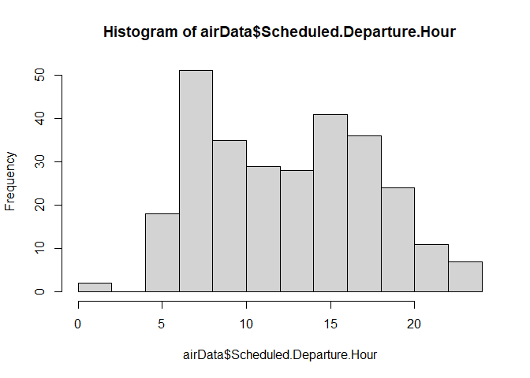

LewisCheng_FinalProject
================
Lewis Cheng
2023-10-22

``` r
library(tidyverse)
```

    ## ── Attaching core tidyverse packages ──────────────────────── tidyverse 2.0.0 ──
    ## ✔ dplyr     1.1.2     ✔ readr     2.1.4
    ## ✔ forcats   1.0.0     ✔ stringr   1.5.0
    ## ✔ ggplot2   3.4.2     ✔ tibble    3.2.1
    ## ✔ lubridate 1.9.2     ✔ tidyr     1.3.0
    ## ✔ purrr     1.0.1     
    ## ── Conflicts ────────────────────────────────────────── tidyverse_conflicts() ──
    ## ✖ dplyr::filter() masks stats::filter()
    ## ✖ dplyr::lag()    masks stats::lag()
    ## ℹ Use the conflicted package (<http://conflicted.r-lib.org/>) to force all conflicts to become errors

``` r
airData <- read_csv("smallSurveyWithComments.csv")
```

    ## Rows: 282 Columns: 32
    ## ── Column specification ────────────────────────────────────────────────────────
    ## Delimiter: ","
    ## chr (13): Destination.City, Origin.City, Airline.Status, Gender, Type.of.Tra...
    ## dbl (19): Age, Price.Sensitivity, Year.of.First.Flight, Flights.Per.Year, Lo...
    ## 
    ## ℹ Use `spec()` to retrieve the full column specification for this data.
    ## ℹ Specify the column types or set `show_col_types = FALSE` to quiet this message.

\#histogram of age, most people traveling around 30s-40s, plus spike at
18 (prob college)

``` r
hist(airData$Age)
```

<!-- -->
\#histogram of price sensitivity, seems to be not too sensitive

``` r
hist(airData$Price.Sensitivity)
```

<!-- -->
\#histogram of year of first flight: seems to be pretty distributed,
except for a spike around 2003

``` r
hist(airData$Year.of.First.Flight)
```

<!-- -->
\#histogram of flights per year: very normal distribution centered
around 1

``` r
hist(airData$Flights.Per.Year)
```

<!-- -->
\#histogram of loyalty: most customers are not that loyal, but those who
do stick with their airline

``` r
hist(airData$Loyalty)
```

<!-- -->
\#histogram of most people either dont have it or have 1

``` r
hist(airData$Total.Freq.Flyer.Accts)
```

<!-- -->
\#histogram of shopping amounts: most people dont spend that much at the
airport, but some are splurgers

``` r
hist(airData$Shopping.Amount.at.Airport)
```

<!-- -->
\#histogram of eating/drinking at airport: most people grab a bite

``` r
hist(airData$Eating.and.Drinking.at.Airport)
```

<!-- -->
\#histogram of day of month: evenly spread out for the most part

``` r
hist(airData$Day.of.Month)
```

<!-- -->

\#histogram of departure hours: people like their morning and afternoon
flights

``` r
hist(airData$Scheduled.Departure.Hour)
```

<!-- -->
\#histogram of departure delay: usually no delay :)

``` r
hist(airData$Departure.Delay.in.Minutes)
```

<!-- -->
\#histogram of flight distance: usually about 2000 miles out, but there
are quite a few short distance flights 0-1000 miles

``` r
hist(airData$Flight.Distance)
```

<!-- -->
\#histogram of likelihood to recommend: people either hated their
airline or loved it

``` r
hist(airData$Likelihood.to.recommend)
```

<!-- -->
\#table shows that most people travel economy, and usually redeem their
mileage tickets there. even ish split between buisness travel and
personal travel in economy, but more people travel buisness for
buissness related travel, and there are more females in eco plus

``` r
table(airData$Gender,airData$Type.of.Travel,airData$Class)
```

    ## , ,  = Business
    ## 
    ##         
    ##          Business travel Mileage tickets Personal Travel
    ##   Female               3               0               4
    ##   Male                11               2               7
    ## 
    ## , ,  = Eco
    ## 
    ##         
    ##          Business travel Mileage tickets Personal Travel
    ##   Female              68               9              58
    ##   Male                60              11              28
    ## 
    ## , ,  = Eco Plus
    ## 
    ##         
    ##          Business travel Mileage tickets Personal Travel
    ##   Female              11               0               7
    ##   Male                 1               0               2

\#boxplots of the likelihood to recommend grouped on gender. females are
more likely to give a lower rating of their flight.

``` r
boxplot(Likelihood.to.recommend ~ Gender,airData)
```

<!-- -->

\#boxplots of the likelihood to recommend grouped on type of travel.
buisness travel usually rates their flight highly. personal travelers
rate their flight very poorly. mileage ticket people also rate their
flight somewhat highly.

``` r
boxplot(Likelihood.to.recommend ~ Type.of.Travel,airData)
```

<!-- -->

\#elim missing data

``` r
airData <- na.omit(airData)
```

\#mapping time

``` r
library(ggplot2)
library(ggmap)
```

    ## The legacy packages maptools, rgdal, and rgeos, underpinning the sp package,
    ## which was just loaded, will retire in October 2023.
    ## Please refer to R-spatial evolution reports for details, especially
    ## https://r-spatial.org/r/2023/05/15/evolution4.html.
    ## It may be desirable to make the sf package available;
    ## package maintainers should consider adding sf to Suggests:.
    ## The sp package is now running under evolution status 2
    ##      (status 2 uses the sf package in place of rgdal)

    ## ℹ Google's Terms of Service: <https://mapsplatform.google.com>
    ## ℹ Please cite ggmap if you use it! Use `citation("ggmap")` for details.

``` r
usmap <- get_stamenmap(bbox=c(left=-167.50, bottom=7.45, right=-50.19, top=71.58), 
                       zoom=3, maptype = "toner")
```

    ## ℹ Map tiles by Stamen Design, under CC BY 3.0. Data by OpenStreetMap, under ODbL.

``` r
ggmap(usmap) + geom_point(data=airData, aes(x=dlong, y=dlat, 
                                                       color=Likelihood.to.recommend))
```

<!-- -->

``` r
dfDetract <- airData[airData$Likelihood.to.recommend < 7,]
dfPromote <- airData[airData$Likelihood.to.recommend >= 7,]
```

``` r
usmap <- get_stamenmap(bbox=c(left=-167.50, bottom=7.45, right=-50.19, top=71.58), 
                       zoom=3, maptype = "toner")
```

    ## ℹ Map tiles by Stamen Design, under CC BY 3.0. Data by OpenStreetMap, under ODbL.

``` r
ggmap(usmap) + geom_point(data=dfDetract, aes(x=dlong, y=dlat, 
                                                       color=Likelihood.to.recommend))
```

<!-- -->
\#both maps seem to include similar cities, though los angeles is
interesting as here it is rated 9-10 and in the above map it is rated
3-4.

``` r
usmap <- get_stamenmap(bbox=c(left=-167.50, bottom=7.45, right=-50.19, top=71.58), 
                       zoom=3, maptype = "toner")
```

    ## ℹ Map tiles by Stamen Design, under CC BY 3.0. Data by OpenStreetMap, under ODbL.

``` r
ggmap(usmap) + geom_point(data=dfPromote, aes(x=dlong, y=dlat, 
                                                       color=Likelihood.to.recommend))
```

<!-- -->

\#southeastsucks

``` r
library(quanteda.textplots)
```

    ## Warning in .recacheSubclasses(def@className, def, env): undefined subclass
    ## "pcorMatrix" of class "replValueSp"; definition not updated

    ## Warning in .recacheSubclasses(def@className, def, env): undefined subclass
    ## "pcorMatrix" of class "xMatrix"; definition not updated

    ## Warning in .recacheSubclasses(def@className, def, env): undefined subclass
    ## "pcorMatrix" of class "mMatrix"; definition not updated

``` r
library(quanteda)
```

    ## Package version: 3.3.1
    ## Unicode version: 13.0
    ## ICU version: 69.1

    ## Parallel computing: 8 of 8 threads used.

    ## See https://quanteda.io for tutorials and examples.

``` r
dfDetractC <- dfDetract$freeText
corpus(dfDetractC)
```

    ## Corpus consisting of 105 documents.
    ## text1 :
    ## "Worst airline company: The worst airline experience ever. Th..."
    ## 
    ## text2 :
    ## "Changed to arrive earlier and landed hours later.: Plans cha..."
    ## 
    ## text3 :
    ## "Don't bother with bereavement fare or Southeast for that mat..."
    ## 
    ## text4 :
    ## "Not Worth The Extra: Wife paid significant costs of upgrade ..."
    ## 
    ## text5 :
    ## "Hour wait for luggage.: Our round trip  included four flight..."
    ## 
    ## text6 :
    ## "General disregard: I had a flight booked with Southeast . So..."
    ## 
    ## [ reached max_ndoc ... 99 more documents ]

``` r
dfDetractC <- dfm(dfDetractC, remove_punct=TRUE,
                                  remove=stopwords("english"), )
```

    ## Warning: 'dfm.character()' is deprecated. Use 'tokens()' first.

    ## Warning: '...' should not be used for tokens() arguments; use 'tokens()' first.

    ## Warning: 'remove' is deprecated; use dfm_remove() instead

``` r
textplot_wordcloud(dfDetractC,)
```

<!-- -->

``` r
dfPromoteC <- dfPromote$freeText
corpus(dfPromoteC)
```

    ## Corpus consisting of 145 documents.
    ## text1 :
    ## "First Class: My son had enough points to fly the 4 of us in ..."
    ## 
    ## text2 :
    ## "A short direct flight: Southeast provided a direct flight wh..."
    ## 
    ## text3 :
    ## "Appears to be a Budget Airline with cheaper flights than oth..."
    ## 
    ## text4 :
    ## "Decent flight at a decent price: Southeast provides decent f..."
    ## 
    ## text5 :
    ## "fantastic team: The one thing all airlines seem to do is pac..."
    ## 
    ## text6 :
    ## "Flight: Flight was fine. I had a window seat. Two largish me..."
    ## 
    ## [ reached max_ndoc ... 139 more documents ]

``` r
dfPromoteC <- dfm(dfPromoteC, remove_punct=TRUE,
                                  remove=stopwords("english"), )
```

    ## Warning: 'dfm.character()' is deprecated. Use 'tokens()' first.

    ## Warning: '...' should not be used for tokens() arguments; use 'tokens()' first.

    ## Warning: 'remove' is deprecated; use dfm_remove() instead

``` r
textplot_wordcloud(dfPromoteC,)
```

<!-- -->
\#it appears that just traveling for personal reasons is a detractor….
and a delay on top of it is of course a detractor.

``` r
library(arules)
```

    ## Loading required package: Matrix

    ## 
    ## Attaching package: 'Matrix'

    ## The following objects are masked from 'package:tidyr':
    ## 
    ##     expand, pack, unpack

    ## 
    ## Attaching package: 'arules'

    ## The following object is masked from 'package:dplyr':
    ## 
    ##     recode

    ## The following objects are masked from 'package:base':
    ## 
    ##     abbreviate, write

``` r
library(arulesViz)
airCat <- data.frame(gender=as.factor(airData$Gender),
                     type=as.factor(airData$Type.of.Travel),
                     old=(airData$Age>median(airData$Age)),
                     delay=(airData$Departure.Delay.in.Minutes>15),
                     detractor=(airData$Likelihood.to.recommend<7))
rules <- apriori(airCat)
```

    ## Apriori
    ## 
    ## Parameter specification:
    ##  confidence minval smax arem  aval originalSupport maxtime support minlen
    ##         0.8    0.1    1 none FALSE            TRUE       5     0.1      1
    ##  maxlen target  ext
    ##      10  rules TRUE
    ## 
    ## Algorithmic control:
    ##  filter tree heap memopt load sort verbose
    ##     0.1 TRUE TRUE  FALSE TRUE    2    TRUE
    ## 
    ## Absolute minimum support count: 25 
    ## 
    ## set item appearances ...[0 item(s)] done [0.00s].
    ## set transactions ...[8 item(s), 250 transaction(s)] done [0.00s].
    ## sorting and recoding items ... [7 item(s)] done [0.00s].
    ## creating transaction tree ... done [0.00s].
    ## checking subsets of size 1 2 3 4 done [0.00s].
    ## writing ... [11 rule(s)] done [0.00s].
    ## creating S4 object  ... done [0.00s].

``` r
inspect(rules)
```

    ##      lhs                        rhs                    support confidence coverage     lift count
    ## [1]  {type=Personal Travel}  => {detractor}              0.300  0.8823529    0.340 2.100840    75
    ## [2]  {type=Personal Travel,                                                                      
    ##       delay}                 => {detractor}              0.148  0.9736842    0.152 2.318296    37
    ## [3]  {delay,                                                                                     
    ##       detractor}             => {type=Personal Travel}   0.148  0.8043478    0.184 2.365729    37
    ## [4]  {gender=Male,                                                                               
    ##       type=Personal Travel}  => {detractor}              0.104  0.8965517    0.116 2.134647    26
    ## [5]  {gender=Female,                                                                             
    ##       type=Personal Travel}  => {detractor}              0.196  0.8750000    0.224 2.083333    49
    ## [6]  {type=Personal Travel,                                                                      
    ##       old}                   => {detractor}              0.208  0.8666667    0.240 2.063492    52
    ## [7]  {old,                                                                                       
    ##       detractor}             => {type=Personal Travel}   0.208  0.8253968    0.252 2.427638    52
    ## [8]  {type=Personal Travel,                                                                      
    ##       old,                                                                                       
    ##       delay}                 => {detractor}              0.100  0.9615385    0.104 2.289377    25
    ## [9]  {old,                                                                                       
    ##       delay,                                                                                     
    ##       detractor}             => {type=Personal Travel}   0.100  0.8928571    0.112 2.626050    25
    ## [10] {gender=Female,                                                                             
    ##       type=Personal Travel,                                                                      
    ##       old}                   => {detractor}              0.132  0.8461538    0.156 2.014652    33
    ## [11] {gender=Female,                                                                             
    ##       old,                                                                                       
    ##       detractor}             => {type=Personal Travel}   0.132  0.8918919    0.148 2.623211    33

# we can see that the reason for which you travel has an extreme effect on your likelihood to recommend. departure delay also has a very high significance value, which makes sense. our r squared value is 0.4. not high, but since we are dealing with humans, it makes sense

``` r
sum(is.na(airData$Gender))
```

    ## [1] 0

``` r
#time to do some data munging
airData$Gender[0]
```

    ## character(0)

``` r
for(i in 1:250){
  if(airData$Gender[i] == "Female"){
    airData$GenderN[i] <- 1  
  }
  if(airData$Gender[i] == "Male"){
    airData$GenderN[i] <- 0
  }
}
```

    ## Warning: Unknown or uninitialised column: `GenderN`.

``` r
i <-1
for(i in 1:250){
  if(airData$Type.of.Travel[i] == "Business travel"){
    airData$Type.of.Travel[i]
    airData$TravelN[i] <- 1  
  }
  if(airData$Type.of.Travel[i] == "Personal Travel"){
    airData$TravelN[i] <- 0
  }
  if(airData$Type.of.Travel[i] == "Mileage tickets"){
    airData$TravelN[i] <- 2
  }
}
```

    ## Warning: Unknown or uninitialised column: `TravelN`.

``` r
lmOut <- lm(Likelihood.to.recommend ~ Age + GenderN + TravelN + Flight.Distance +  Departure.Delay.in.Minutes, airData)
summary(lmOut)
```

    ## 
    ## Call:
    ## lm(formula = Likelihood.to.recommend ~ Age + GenderN + TravelN + 
    ##     Flight.Distance + Departure.Delay.in.Minutes, data = airData)
    ## 
    ## Residuals:
    ##     Min      1Q  Median      3Q     Max 
    ## -6.6263 -1.4169  0.4187  1.2913  4.6102 
    ## 
    ## Coefficients:
    ##                              Estimate Std. Error t value Pr(>|t|)    
    ## (Intercept)                 5.729e+00  5.828e-01   9.830  < 2e-16 ***
    ## Age                        -4.499e-03  7.924e-03  -0.568  0.57066    
    ## GenderN                    -3.395e-01  2.589e-01  -1.312  0.19092    
    ## TravelN                     2.597e+00  2.305e-01  11.269  < 2e-16 ***
    ## Flight.Distance            -7.614e-05  1.510e-04  -0.504  0.61443    
    ## Departure.Delay.in.Minutes -6.827e-03  2.183e-03  -3.127  0.00198 ** 
    ## ---
    ## Signif. codes:  0 '***' 0.001 '**' 0.01 '*' 0.05 '.' 0.1 ' ' 1
    ## 
    ## Residual standard error: 1.999 on 244 degrees of freedom
    ## Multiple R-squared:  0.4175, Adjusted R-squared:  0.4055 
    ## F-statistic: 34.97 on 5 and 244 DF,  p-value: < 2.2e-16

\#Based on the wordcloud graphics, we can clearly see that Southwest
Airlines is a major concern as a major quality issue. It is quite
unpredictable, especially when people expect more out of a major
airline. Some issues include luggage delays, flight delays, and poor
service while on the flight. To alleviate some of these concerns, we
should work on improving departure delay the most, as it has the
greatest effect on our recommendations rate. As we look at our linear
model, departure delay has a significant effect on our likelihood for
recommendations. It’s significance value is 0.00198, which is well below
the 0.05 recommended for statistical significance. Furthermore, we
should place a bigger interest on our personal travelers, as most of
them seem to have a negative experience. As we see in the boxplot split
into groups based on travel reasons, we can tell that the box labeled
Personal Travel has a much lower range of scores than the box marked
Buisness travel. Furthermore, our association rules indicate that simply
traveling for personal reasons is a detractor to their experience.
Clearly, something is wrong.
