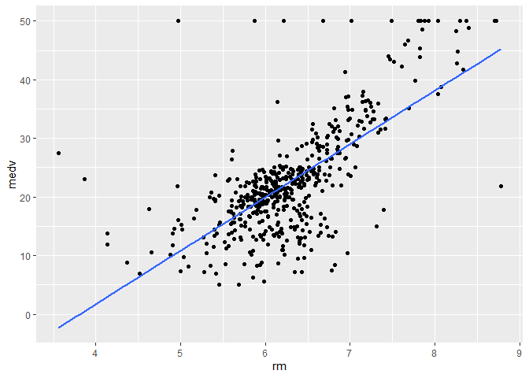
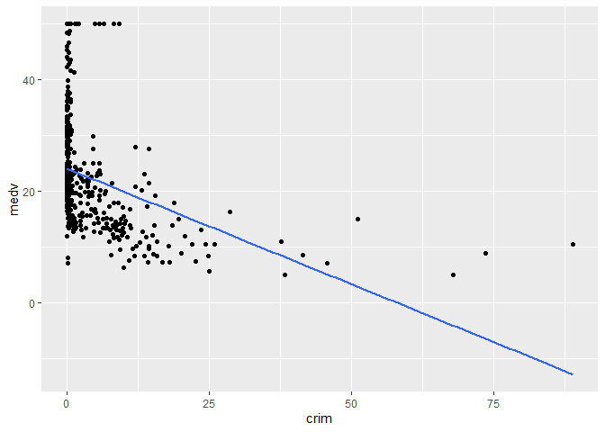
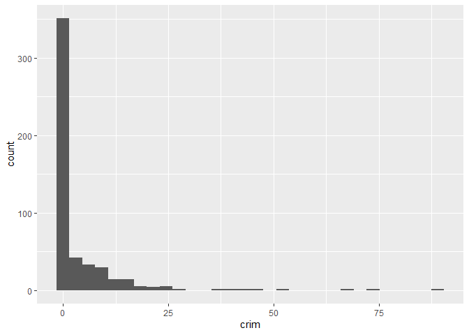

Lab8_LewisCheng
================
Lewis Cheng
2023-10-22

\#Q1

``` r
library("ggplot2") #install/library necessary stuff
library("MASS")
ggplot(data=Boston) + aes(x=rm, y=medv) + geom_point() + 
       geom_smooth(method="lm", se=FALSE) #make some plots
```

    ## `geom_smooth()` using formula = 'y ~ x'

<!-- -->

``` r
ggplot(data=Boston) + aes(x=crim, y=medv) + geom_point() + 
       geom_smooth(method="lm", se=FALSE) #makes another plot
```

    ## `geom_smooth()` using formula = 'y ~ x'

<!-- -->

``` r
ggplot(data=Boston) + aes(x=crim, y=medv) + geom_point() + 
       geom_smooth(method="lm", se=FALSE) #makes another plot
```

    ## `geom_smooth()` using formula = 'y ~ x'

<!-- --> \#Q2

``` r
histo <- ggplot(data=Boston,aes(x=crim)) +geom_histogram()
histo #make a histogram
```

    ## `stat_bin()` using `bins = 30`. Pick better value with `binwidth`.

<!-- -->

``` r
summary(Boston$crim) #summary of crime
```

    ##     Min.  1st Qu.   Median     Mean  3rd Qu.     Max. 
    ##  0.00632  0.08204  0.25651  3.61352  3.67708 88.97620

\#Q3

``` r
lmOut <- lm(medv ~ crim, data = Boston) #do a linear regression
summary(lmOut) #read that linear regression
```

    ## 
    ## Call:
    ## lm(formula = medv ~ crim, data = Boston)
    ## 
    ## Residuals:
    ##     Min      1Q  Median      3Q     Max 
    ## -16.957  -5.449  -2.007   2.512  29.800 
    ## 
    ## Coefficients:
    ##             Estimate Std. Error t value Pr(>|t|)    
    ## (Intercept) 24.03311    0.40914   58.74   <2e-16 ***
    ## crim        -0.41519    0.04389   -9.46   <2e-16 ***
    ## ---
    ## Signif. codes:  0 '***' 0.001 '**' 0.01 '*' 0.05 '.' 0.1 ' ' 1
    ## 
    ## Residual standard error: 8.484 on 504 degrees of freedom
    ## Multiple R-squared:  0.1508, Adjusted R-squared:  0.1491 
    ## F-statistic: 89.49 on 1 and 504 DF,  p-value: < 2.2e-16

\#Q4

``` r
lmOut <- lm(medv ~ crim+rm+dis, data = Boston) #do a multivariate lr
summary(lmOut) #read it
```

    ## 
    ## Call:
    ## lm(formula = medv ~ crim + rm + dis, data = Boston)
    ## 
    ## Residuals:
    ##     Min      1Q  Median      3Q     Max 
    ## -21.247  -2.930  -0.572   2.390  39.072 
    ## 
    ## Coefficients:
    ##              Estimate Std. Error t value Pr(>|t|)    
    ## (Intercept) -29.45838    2.60010 -11.330  < 2e-16 ***
    ## crim         -0.25405    0.03532  -7.193 2.32e-12 ***
    ## rm            8.34257    0.40870  20.413  < 2e-16 ***
    ## dis           0.12627    0.14382   0.878     0.38    
    ## ---
    ## Signif. codes:  0 '***' 0.001 '**' 0.01 '*' 0.05 '.' 0.1 ' ' 1
    ## 
    ## Residual standard error: 6.238 on 502 degrees of freedom
    ## Multiple R-squared:  0.5427, Adjusted R-squared:  0.5399 
    ## F-statistic: 198.6 on 3 and 502 DF,  p-value: < 2.2e-16

\#Q5

``` r
# crim and rm have a significant effect on medv, but dis does not, with p value of 0.38.
```

\#Q6

``` r
predDF <- data.frame(crim = 0.26, dis=3.2, rm=6.2) #stores values to predict
predDF 
```

    ##   crim dis  rm
    ## 1 0.26 3.2 6.2

\#Q7

``` r
predict(lmOut,predDF) #predicts
```

    ##        1 
    ## 22.60355
